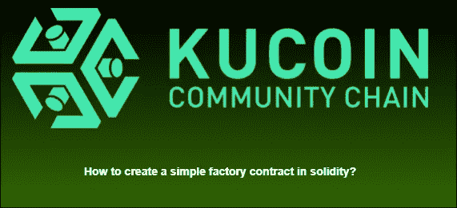
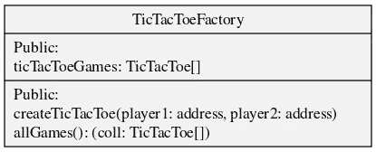
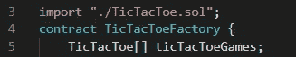
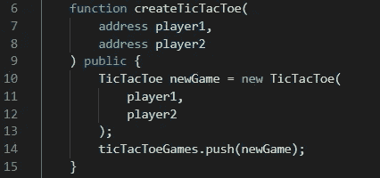
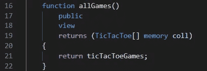

# 如何在 solidity 中创建一个简单的工厂合同？

> 原文：<https://medium.com/coinmonks/how-to-create-a-simple-factory-contract-in-solidity-8313f5f42599?source=collection_archive---------12----------------------->

从我们上一个教程[继续，在 chain](/@kccmeky/how-to-code-a-simple-tictactoe-game-in-solidity-c3580bbc058b) 上编写一个简单的井字游戏。在本教程中，我们将创建一个工厂合同，可以为每个游戏部署新的井字游戏合同。

**什么是工厂合同？**

工厂协定从智能协定类部署新智能协定。这样，它可以直接从区块链部署多个具有不同参数的智能合约。这使得部署智能合约多个实例变得容易，对于 p2e 游戏非常有用。使用工厂合同的缺点是智能合同部署带来的高额油费。

首先我们将看一下 UML 类图:

有 1 个公共属性:

*   **ticTacToeGames-** 已部署 TicTacToe 合同地址的店铺地址

2 公共职能:

**createTicTacToe** —在该方法中，部署新的 TicTacToe 契约。

allGames —返回创建的 TicTacToe 合同地址列表。

现在，我们已经有了大致的了解，我们可以继续实施了。

**实现**:

在本节中，我们将逐一查看每个方法的实现。不要担心代码，因为它将被提供。

**先决条件:**

*   已安装节点和硬件

**属性实现:**

**createTicTacToe 函数实现:**

在这个函数中，我们接受 TicTacToe 契约的参数，并将其部署和存储在 **ticTacToeGames** 变量中。

**allGames 功能实现:**

在这个函数中，我们只需返回变量**tictactoegoms**。

就这样，您成功地编写了一个简单的 TicTacToe 工厂契约！

不要忘记检查 KCC 更多可怕的加密项目。

*KCC 社交网络
不和:*[*https://discord.gg/H5ucJydSyd*](https://discord.gg/H5ucJydSyd) *推特:*[*https://twitter.com/KCCOfficialTW*](https://twitter.com/KCCOfficialTW) *电报:*[*https://t.me/KCCOfficialEnglishCommunity*](https://t.me/KCCOfficialEnglishCommunity) *电报频道:*[*https://t.me/KCCOfficialChannel*](https://t.me/KCCOfficialChannel)

> 加入 Coinmonks [电报频道](https://t.me/coincodecap)和 [Youtube 频道](https://www.youtube.com/c/coinmonks/videos)了解加密交易和投资

# 另外，阅读

*   [火币交易机器人](https://coincodecap.com/huobi-trading-bot) | [如何购买 ADA](https://coincodecap.com/buy-ada-cardano) | [Geco？一次回顾](https://coincodecap.com/geco-one-review)
*   [加密副本交易平台](/coinmonks/top-10-crypto-copy-trading-platforms-for-beginners-d0c37c7d698c) | [五大 BlockFi 替代方案](https://coincodecap.com/blockfi-alternatives)
*   [CoinLoan 审核](https://coincodecap.com/coinloan-review)|[Crypto.com 审核](/coinmonks/crypto-com-review-f143dca1f74c) | [火币保证金交易](/coinmonks/huobi-margin-trading-b3b06cdc1519)
*   [Bybit vs 币安](https://coincodecap.com/bybit-binance-moonxbt)|[stealth x 回顾](/coinmonks/stealthex-review-396c67309988) | [Probit 回顾](https://coincodecap.com/probit-review)
*   [顶级付费加密货币和区块链课程](https://coincodecap.com/blockchain-courses)
*   [CBET 评论](https://coincodecap.com/cbet-casino-review) | [库科恩 vs 比特币基地](https://coincodecap.com/kucoin-vs-coinbase) | [拜比特 vs 比特币基地](https://coincodecap.com/bybit-vs-coinbase)