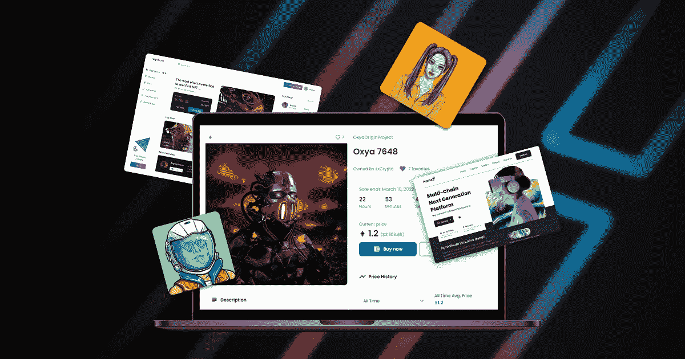
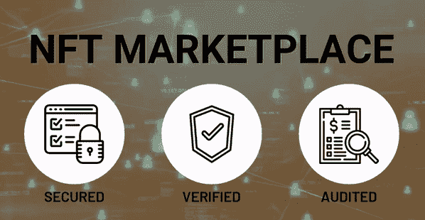
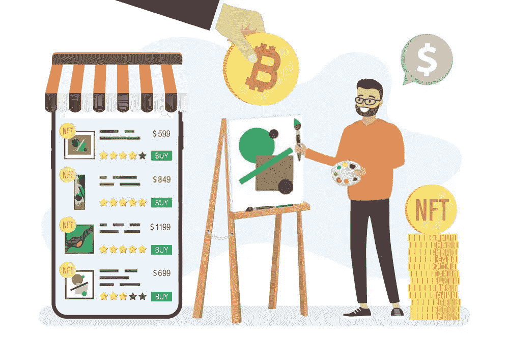

# 如何创建一个白色标签的 NFT 市场？

> 原文：<https://medium.com/coinmonks/how-to-create-a-white-label-nft-marketplace-bed093a2f8d5?source=collection_archive---------23----------------------->

White-label NFT Marketplace

虽然我们通常不会用简单的英语在 JavaScript 上讨论这样的话题，但是软件开发和他们想要创建一个像买卖 NFT 的市场这样的东西之间还是有联系的。因此，我们将让这个进入:)

不可替换的代币是最近的发展，已经让人们疯狂了。NFT 是双向的，因为它对用户和创作者都有利。此外，它们也成为区块链有利可图的投资选择。你能相信毕普的 NFT 卖了 6900 万美元吗？这是很明显的理解人们是如何认真对待 NFT 交易的。

当市场有好的需求时，加强供给侧是显而易见的。对越来越多的独立 NFT 市场有巨大的需求，用户可以参与 NFT 交易。你最终可以利用这个场景进军 NFT 世界。选择一个 [**白色标签的 NFT 市场**](https://www.appdupe.com/whitelabel-nft-marketplace?utm_source=medium&utm_medium=blog9may&utm_campaign=Yasmeen) 怎么样？这个博客将是你的蓝图，指导你发展一个竞争性的 NFT 市场。

# 白色标签 NFT 平台—解释

你应该已经知道什么是 NFT 了。不可替代令牌是为物理或数字资产提供的数字认证。由区块链技术公司开发，它们是不可分割的，因此它们是安全可靠的。这些 NFT 可以被铸造出来，并在人群中进行交易。人们可以买卖非功能性食物的平台被称为市场。

**安** **NFT 市场是一个为用户创造、购买、销售和存储数字收藏品的平台**。买家可以在这些平台上购买或选择拍卖。一些受欢迎的 NFT 市场有 OpenSea、Rarible、Sorare 和 foundation。当你决定推出你的 NFT 市场时，你会想知道从哪里开始？

**一个白色标签的 NFT 市场**是你启动自己的 NFT 市场所需要的。一般来说，白色标签指的是一家公司开发的可以被另一家公司购买的产品。他们会用自己的商业证书来重塑产品品牌。同样，白标 NFT 平台是现成的，具有高度的灵活性。选择预建的 NFT 平台将最大限度地减少从零开始开发 NFT 市场所花费的时间。

## 你为什么应该选择 NFT 白标平台？

## ✔️高度安全平台

从长远来看，安全性是一项业务的关键。如果一个 NFT 平台缺乏安全性，匿名的偷窥者很快就可以窃取用户数据和非功能文件。从头开始构建一个高度安全的 NFT 平台并不是一件容易的事情，因为这将耗费大量的时间。但是白标解决方案是一个具有独特功能的预建平台。有了这个平台，也可以大规模竞争。

## ✔️省时又划算

选择从头开始建立你的 NFT 市场将花费你六个多月的时间。如果你选择一个更先进的平台，它也可能超过一年。与此同时，NFT 平台的开发成本也将难以置信地增加。一个现成的 NFT 市场就像一个带有预建特性和功能的包。这将使您节省从头开发所花费的时间和金钱。

## ✔️可定制

白标解决方案适用于任何级别的定制标准。你可能想知道怎么做？该平台的 UX 和用户界面设计可以根据您的要求和规格进行定制。这是整合您的 NFT 市场与跨链连接的完美选择。

# NFT 如何使用户受益？

当你购买一件独特而稀有的产品时，你会觉得自己很特别，对吗？给人一种完全为自己所有的感觉。这就是 NFTs 提供给用户的。人们可以拥有市场上稀有独特的东西。拥有一件原创艺术品并不轻松。

一旦这些 NFT 的价值达到很高，价格也会提高，最终，他们可以以更高的价格出售他们的作品。另一方面，也有买家将 NFTs 视为一个巨大的投资机会。他们将出售那些有很多利润的 NFT。

# NFT 市场的各种决定因素

如上所述，非功能性交易需要一个交易场所。这个目的地就是我们所说的 NFT 市场。这些平台应该有一个支持良好的后端系统。让我们讨论 NFT 市场的其他各种决定因素，

## ⚪加密钱包

当涉及到 NFTs 时，买家和卖家都需要一个加密钱包。加密钱包不会以文件或文档的形式存储 NFTs。此外，这些钱包将包含区块链上的所有者文件的位置信息。

## ⚪拍卖和销售

市场更像是一个画廊，卖家可以向买家展示他们的产品。在 NFT 的平台上，NFT 以固定的价格出售。你也可以让你的市场对名人的新数字收藏进行定时拍卖。

## ⚪智能合约

为了在买卖双方之间建立沟通，智能合约被引入到 [**NFT 市场开发**](https://www.appdupe.com/nft-marketplace-development?utm_source=medium&utm_medium=blog9may&utm_campaign=Yasmeen) 。这些术语在区块链网络中包含的数字控制中执行。买家可以浏览卖家的条款，一旦交易开始，交易就会自动进行。

## ⚪运营成本

对于平台内发生的每一笔交易，费用都是通过用户收取的。计算 NFT 的成本，包括代理交易和将货币转换为加密货币的能源成本。

# 发展 NFT 市场时要记住的几点

在发展 NFT 市场时，必须考虑以下因素:

**透明**——NFT 平台应该足够透明，让用户了解交易的一切。区块链网络打算为用户提供无差错的支付体验。

安全性——这是 NFT 市场的重要特征之一。内置的安全性将保护交易者免受黑客攻击和其他欺诈活动。

**分散** —这使您能够将所有信息分发到不同的区块链网络。

**货币化模式** —最终确定你可以从你的平台获得收入的方式。但是，你可以收取上市费、产品费等。

**智能合约** —在你的市场中坚持智能合约将使你的平台去中心化。这也将消除第三方干扰你的平台的需要。

# 如何播下建立 NFT 市场的种子？

建立一个 NFT 市场需要一个经验丰富的区块链开发团队，他们拥有在 NFT 开发的实践经验。但是，您可以考虑 NFT 平台开发的以下步骤。

## 选择你的专业

为了开发你的 **NFT 平台**，你应该知道你的利基。基于你的利基概念，NFT 市场可以设计。利基想法必须与 NFT 开发团队分享，他们正处于开发阶段。确定你的目标市场，在此基础上，你可以开发你的 NFT 平台。

## 决定 UX/用户界面设计

市场的 UX/用户界面设计对于吸引更多用户使用平台非常重要。每当用户访问你的平台时，他们应该感到舒适，所以要注意 UI/UX 的设计。

## 雇佣你的 NFT 开发团队

在最终确定你的设计想法后，你可以继续寻找 [**最佳 NFT 开发者团队**](https://www.appdupe.com/whitelabel-nft-marketplace?utm_source=medium&utm_medium=blog9may&utm_campaign=Yasmeen) 来设计你的市场。拥有一个伟大的开发团队将帮助你创造一个神话般的 NFT 市场。

## 使用智能合同令牌生成器

NFT 市场的后端开发不同于其他市场。NFT 市场是一个分散的平台；数据应该在区块链上得到认证。

## 测试和部署

现在，您距离推出您的 NFT 平台只有一步之遥。在将它们投放市场之前，先对平台进行测试。您也可以向 NFT 营销机构寻求 NFT 营销服务的帮助，以推广您的平台。

# 值得注意的 NFT 市场发展特点

## ⚪店面

一个设计复杂的店面增加了 NFT 市场的阶段价值。这是用户首次登陆市场的地方。店面应该包含让用户知道的重要数据。您可以列出关于所有者、投标人、预览和价值历史的信息。

## ⚪高级搜索选项

在发展你的 NFT 市场时，你应该已经决定了你的 NFTs 的重点领域。例如， [NFT 的市场像 OpenSea](https://opensea.io/) 专注于一般的非功能性测试，然而也有一些市场只针对特定的方面。但是，您应该提供一个搜索选项，让用户可以轻松地进行搜索。

## ⚪上市

确保你提升了卖家和买家的体验。市场应该提供关于在平台上列出 NFT 的每一个细节。这也将教育买卖双方。

## ⚪购买和拍卖

该平台应该允许用户购买和拍卖非功能性测试。他们还可以跟踪他们的 NFT 的状态。必须为用户提供多种支付标准来进行支付。

## ⚪ NFT 钱包

NFT 钱包服务于存储、出售和购买 NFT 的目的。这也在加密货币交易中发挥了重要作用。你可以将市场与比特币基地或 Formatic 等现有钱包整合。

## ⚪评论和评级

评级在帮助用户了解 NFT 市场的表现和范围方面发挥着重要作用。用户可以在平台上分享自己的经验，以便在另一边解决。

## 最后的话

不可替代的代币正在成为市场的主要趋势，也是个人的绝佳投资机会。你可以通过建立自己的 NFT 市场来顺应这一趋势。

> 加入 Coinmonks [电报频道](https://t.me/coincodecap)和 [Youtube 频道](https://www.youtube.com/c/coinmonks/videos)了解加密交易和投资

# 另外，阅读

*   [Bookmap 点评](https://coincodecap.com/bookmap-review-2021-best-trading-software) | [美国 5 大最佳加密交易所](https://coincodecap.com/crypto-exchange-usa)
*   最佳加密[硬件钱包](/coinmonks/hardware-wallets-dfa1211730c6) | [Bitbns 评论](/coinmonks/bitbns-review-38256a07e161)
*   [新加坡十大最佳加密交易所](https://coincodecap.com/crypto-exchange-in-singapore) | [购买 AXS](https://coincodecap.com/buy-axs-token)
*   [红狗赌场评论](https://coincodecap.com/red-dog-casino-review) | [Swyftx 评论](https://coincodecap.com/swyftx-review) | [CoinGate 评论](https://coincodecap.com/coingate-review)
*   [投资印度的最佳密码](https://coincodecap.com/best-crypto-to-invest-in-india-in-2021)|[WazirX P2P](https://coincodecap.com/wazirx-p2p)|[Hi Dollar Review](https://coincodecap.com/hi-dollar-review)