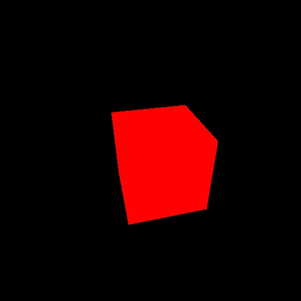
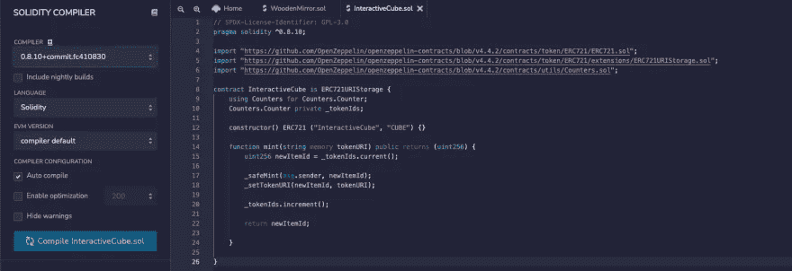
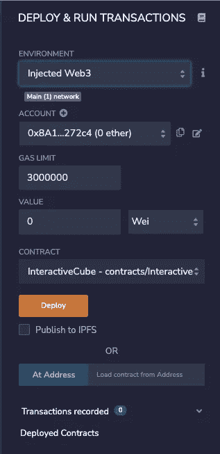
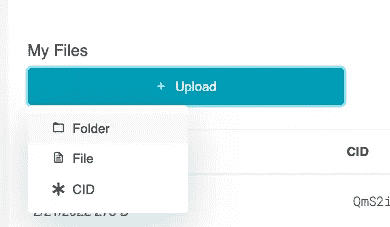
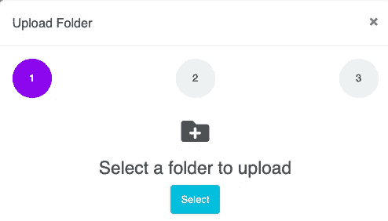
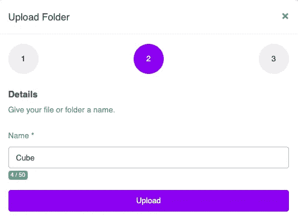
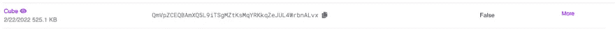
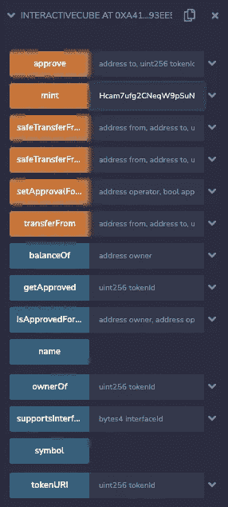
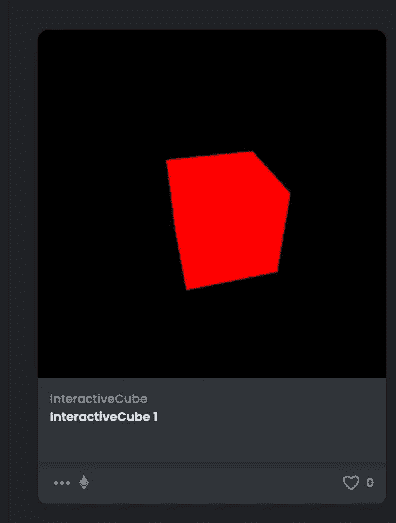

# 如何创建一个交互式的 NFT

> 原文：<https://medium.com/coinmonks/how-to-create-an-interactive-nft-431b35bc9fbf?source=collection_archive---------5----------------------->

在本帖中，我们将尝试创建一个互动的 NFT。
目标是在 Opensea 上看到它。

# 要求

*   元掩码([https://metamask.io/](https://metamask.io/))
*   林克比([https://faucet.rinkeby.io/](https://faucet.rinkeby.io/))身上有些乙醚
*   皮纳塔账户([https://www.pinata.cloud/](https://www.pinata.cloud/))
*   Sketch(任何你想用的 threejs/processing.js/p5.js 等)
*   Opensea 上缩略图的一个图像

# 创建交互式 NFT 的步骤

我们需要以下步骤来创建 NFT。
在本帖中，我不会解释如何安装 Metamask。如果你不熟悉这个，我强烈推荐你在 youtube 上看几个视频。在 Youtube 上搜索`how to use Metamask`就可以了。

**步骤 1。创建草图**
**步骤 2。写一份关于再混合的合同**
**步骤 3。将资产上传到 Pinata**
**步骤 4。为元数据**
**创建一个 JSON 文件 Step5。薄荷安 NFT**
**Step6。在 Opensea 上检查你的 NFT，然后玩玩它**

# 第一步。创建草图

你可以创造任何你想变成 NFT 的东西。然而，有几件事你应该知道。

1.  你不能为你的草图使用网络摄像头，因为 Opensea 不支持它。(我测试过这个)
    [https://test nets . opensea . io/assets/0x3f 882115 af 78075931 AE 9 a 0 ed 2 AC 9b 76 e 4080907/0](https://testnets.opensea.io/assets/0x3f882115af78075931ae9a0ed2ac9b76e4080907/0)
    👆仅显示一个按钮…
2.  你不能在你的草图中使用表情符号。(我也测试过)
    [https://test nets . open sea . io/assets/0x3f 882115 af 78075931 AE 9 a 0 ed 2 AC 9b 76 e 4080907/2](https://testnets.opensea.io/assets/0x3f882115af78075931ae9a0ed2ac9b76e4080907/2)
    寿司表情符号应该在屏幕上但没有😂。
3.  你应该把你所有的 js/css 放到 index.html，因为 Pinata 可能不允许 index.html 有很多到 js/css 文件的连接。实际上，皮纳塔告诉我的。不过，如果你熟悉 webpack 或其他捆绑工具，你的草图就没问题了。(我在这篇文章中使用了 webpack)
4.  js 库可以用 CDN。

在这种情况下，我创建了一个超级简单的 three.js 草图。



# 第二步。写一份关于混音的合同

我们会用 Remix 写合同。Remix([https://remix.ethereum.org/](https://remix.ethereum.org/))是一个以太坊 IDE。

`InteractiveCube.sol`

```
// SPDX-License-Identifier: MIT
pragma solidity ^0.8.10;import "https://github.com/OpenZeppelin/openzeppelin-contracts/blob/v4.4.2/contracts/token/ERC721/ERC721.sol";
import "https://github.com/OpenZeppelin/openzeppelin-contracts/blob/v4.4.2/contracts/token/ERC721/extensions/ERC721URIStorage.sol";
import "https://github.com/OpenZeppelin/openzeppelin-contracts/blob/v4.4.2/contracts/utils/Counters.sol";contract InteractiveCube is ERC721URIStorage {
    using Counters for Counters.Counter;
    Counters.Counter private _tokenIds;constructor() ERC721 ("InteractiveCube", "CUBE") {}function mint(string memory tokenURI) public returns (uint256) {
        uint256 newItemId = _tokenIds.current();_safeMint(msg.sender, newItemId);
        _setTokenURI(newItemId, tokenURI);_tokenIds.increment();return newItemId;}}
```

是时候编译我们的契约并部署到 Rinkeby，以太坊测试网了。

这些都很简单，因为 Remix 提供了简单的用户界面来完成。

**编译契约**
确保使用与代码引用相同的编译器。在本帖中，我们使用`0.8.10`。



**部署**
确保你设置了`Environment` : `Injected Web3`并且你的元掩码在`Rinkeby`上。然后点击`Deploy`。



# 第三步。将资产上传到 Pinata

我们需要上传草图文件夹(在我的例子中，我使用 webpack，所以我需要上传包含`index.html`和`bundle.js`的文件夹)和一个图像文件作为 Opensea 上的缩略图。

以下是关于上传一个文件夹到 Pinata。



在上传图片之前，请检查你的草图是否在 IPFS 上正常工作。

您需要的步骤几乎与文件夹相同。

# 第四步。为元数据创建 JSON 文件

我们需要创建一个 JSON 文件来告诉以太坊我们的草图在哪里。

以下内容将作为描述显示在 Opensea 上。
如果您想添加更多属性，请查看 Opensea 文档。[https://docs.opensea.io/docs/metadata-standards](https://docs.opensea.io/docs/metadata-standards)

cube.json(您可以随意命名)

```
{
  "name": "InteractiveCube 1",
  "description": "Red Cube",
  "image": "https://gateway.pinata.cloud/ipfs/QmaYSb2UuAjoyyfoRWqN7q6mjAn3518idxZwWuxyc4WBkw",
  "animation_url": "https://gateway.pinata.cloud/ipfs/QmVpZCEQBAmXQ5L9iTSgMZtKsMqYRKkqZeJUL4WrbnALvx/"
}
```

# 第五步。铸造 NFT

再次打开 Remix 并点击部署图标。打开自己编的合同，会有如下图这样的`mint`。

您需要在步骤 4 中复制并粘贴 json 'URI，然后单击`mint`。



# 第六步。在 Opensea 上检查您的 NFT，并使用它

最后一步是在 Opensea 上检查你的 NFT。
转到[https://testnets.opensea.io/](https://testnets.opensea.io/)，点击钱包图标旁边的用户图标，然后选择个人资料。
你会看到这样的 NFT。



以下是我的结果。

> *加入 Coinmonks* [*电报频道*](https://t.me/coincodecap) *和* [*Youtube 频道*](https://www.youtube.com/c/coinmonks/videos) *了解加密交易和投资*

# 另外，阅读

*   [3 商业评论](/coinmonks/3commas-review-an-excellent-crypto-trading-bot-2020-1313a58bec92) | [Pionex 评论](https://coincodecap.com/pionex-review-exchange-with-crypto-trading-bot) | [Coinrule 评论](/coinmonks/coinrule-review-2021-a-beginner-friendly-crypto-trading-bot-daf0504848ba)
*   [莱杰 vs Ngrave](/coinmonks/ledger-vs-ngrave-zero-7e40f0c1d694) | [莱杰 nano s vs x](/coinmonks/ledger-nano-s-vs-x-battery-hardware-price-storage-59a6663fe3b0) | [币安评论](/coinmonks/binance-review-ee10d3bf3b6e)
*   [Bybit Exchange 评论](/coinmonks/bybit-exchange-review-dbd570019b71) | [Bityard 评论](https://coincodecap.com/bityard-reivew) | [Jet-Bot 评论](https://coincodecap.com/jet-bot-review)
*   [3 commas vs crypto hopper](/coinmonks/3commas-vs-pionex-vs-cryptohopper-best-crypto-bot-6a98d2baa203)|[赚取加密利息](/coinmonks/earn-crypto-interest-b10b810fdda3)
*   最好的比特币[硬件钱包](/coinmonks/hardware-wallets-dfa1211730c6) | [BitBox02 回顾](/coinmonks/bitbox02-review-your-swiss-bitcoin-hardware-wallet-c36c88fff29)
*   [BlockFi vs 摄氏](/coinmonks/blockfi-vs-celsius-vs-hodlnaut-8a1cc8c26630) | [Hodlnaut 点评](/coinmonks/hodlnaut-review-best-way-to-hodl-is-to-earn-interest-on-your-bitcoin-6658a8c19edf) | [KuCoin 点评](https://coincodecap.com/kucoin-review)