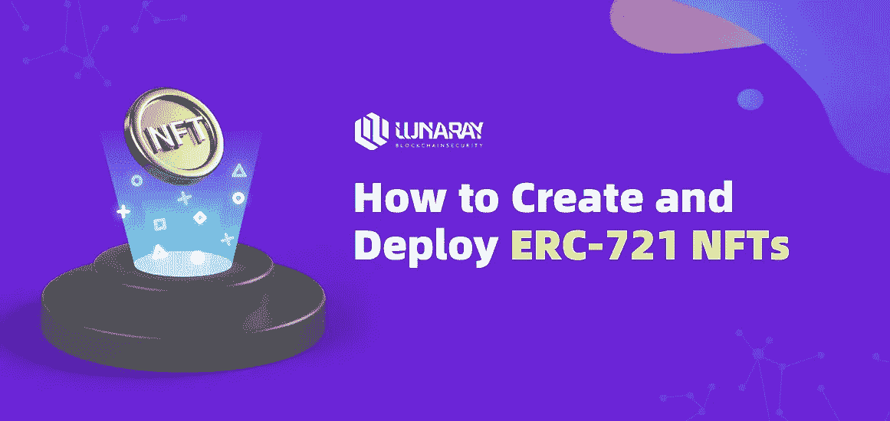
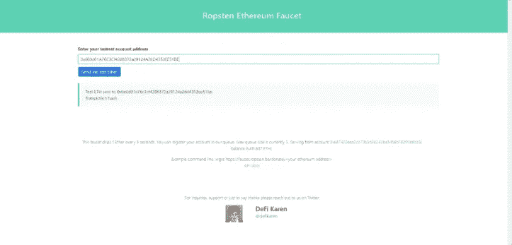
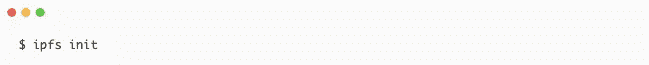
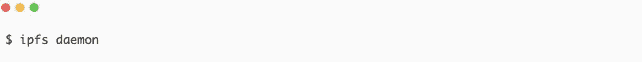
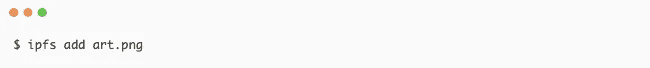
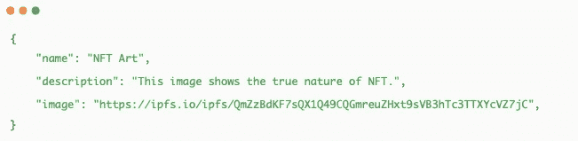
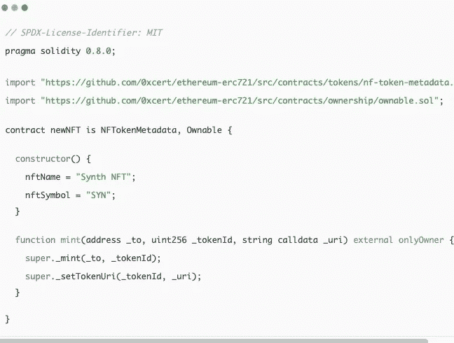
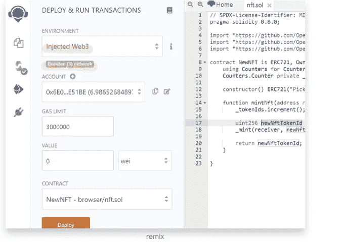
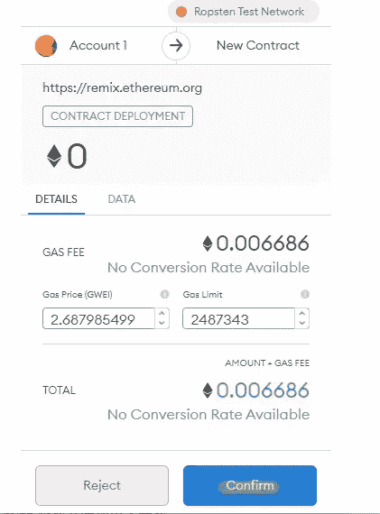
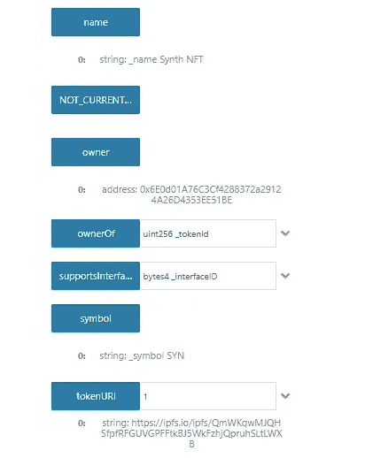

# 如何创建和部署 ERC-721 NFT

> 原文：<https://medium.com/coinmonks/how-to-create-and-deploy-erc-721-nfts-ad3cb710f879?source=collection_archive---------6----------------------->

**0x01 什么是 ERC-721？**

ERC 是以太坊请求评论的缩写，721 是提案识别号。ERC 是以太坊生态系统中的应用程序级标准，它们可以是 ERC-20 等令牌的智能合同标准，ERC 的作者负责与以太坊社区建立共识，一旦社区审查并批准该提案，它就成为标准。创建 ERC-721 是为了提出在智能合同中跟踪和转移非功能性交易的功能。

ERC-721 是一个开放标准，描述了如何在兼容 **EVM** (以太坊虚拟机)的区块链上构建不可替换的令牌；它是不可替换令牌的标准接口；它有一套规则，使得使用 NFTs 很容易。非功能性测试不仅仅是 ERC-721 型；它们也可能是 ERC-1155 token。

以下是 ERC-721 标准中定义的一组功能和事件:

ERC-721 定义了一些符合 ERC-20 的功能。这使得现有的钱包更容易显示简单的令牌信息。

**类似 ERC20 的功能:**

*   **名称:**用于定义令牌的名称，其他合同和应用程序可以识别。
*   **符号:**用于定义 token 的简写名称或符号。
*   **totalSupply:** 该函数用于定义区块链上的代币总数；供应不一定是恒定的。
*   **balanceOf:** 返回一个地址拥有的 NFT 的数量。

**所有权功能**

*   **ownerOf:** 该函数返回令牌所有者的地址。由于每个 ERC-721 令牌都是唯一且不可替换的，因此在区块链上用 ID 来表示。其他用户、合同和应用程序可以使用此 ID 来确定令牌的所有者。
*   **批准:**此功能授予或批准另一个实体代表所有者转让代币的权限。
*   **takeOwnership:** 这是一个可选函数，它的作用类似于取款函数，因为外部方可以调用它从另一个用户的帐户中取出令牌。因此，当用户被批准拥有一定数量的代币并且希望从另一个用户的余额中提取所述代币时，可以使用取得所有权。
*   **传递:**这是另一种类型的传递函数；它允许所有者将令牌转让给另一个用户，就像其他数字令牌/硬币一样。
*   **tokenOfOwnerByIndex:** 这是一个可选但推荐的函数。每个所有者可以同时拥有多个 NFT。其唯一的 ID 标识每个 NFT，最终，跟踪 ID 变得很困难。因此，契约将这些 id 存储在一个数组中，tokenOfOwnerByIndex 函数让我们从数组中检索这些信息。

**元数据功能**

*   **令牌元数据:**这个可选特性是一个接口，让我们发现令牌的元数据或其数据的链接。

**事件**

*   **Transfer:** 当令牌的所有权从一个人变为另一个人时，将触发该事件。它发出关于哪个帐户转移了令牌、哪个帐户接收了令牌以及哪个令牌(通过 ID)被转移的信息。
*   **Approve:** 当一个用户批准另一个用户获得令牌的所有权时，即每当执行 Approve 函数时，都会触发此事件。它发出以下信息:哪个帐户当前拥有令牌，哪个帐户被批准在未来获得令牌的所有权，以及哪个令牌(通过 ID)被批准转移其所有权。

**NFTs 的 0x02 场景**

*   **数字艺术(或物理艺术):**艺术作品是 NFTs 最流行的用例。数字艺术拍卖是 NFTs 的第一个应用，并在继续增长。
*   **游戏:**提供游戏内购买和游戏收藏品。
*   **房地产:**将物业和智能合约令牌化，进行买卖。
*   **金融:**金融工具，如贷款、期货和其他责任。
*   **软件名称:**软件许可，确保反盗版和隐私。
*   **演唱会门票/体育比赛门票:**确保门票销售中不存在欺诈行为，并且粉丝可以有一个单独的地方查看过去的经历。
*   **KYC 合规:**为特定用户的 KYC 创建令牌。

**0x03 获取测试 ETH**

我们将在 **Ropsten testnet** 上部署我们的合同。首先，您将需要 Metamask 浏览器扩展来创建一个 **ETH** 钱包和一些测试 ETH，您可以通过进入 **Ropsten** 水龙头获得它们。您需要在您的**元掩码**钱包上选择 Ropsten 测试网络，并将钱包地址复制粘贴到水龙头的文本字段中，然后点击**发送测试以太网**。

> Ropsten 以太坊(也称为“以太坊测试网”)是一个以太坊测试网络，允许在部署到主以太坊网络 Mainnet 之前进行区块链开发测试。Ropsten 是第一个以太坊测试网 Morden 的继承者。

**0x04 向 IPFS 添加文件**

在写我们的 NFT 合同之前，我们需要为 NFT 托管我们的艺术并创建一个元数据文件；为此，我们将使用 IPFS——一个对等文件存储和共享分布式系统。

**第一步**:创建 IPFS 回购。

通过在终端/cmd 窗口中键入以下内容来启动 IPFS 回购。

**Repo** 是 IPFS 节点的存储库，是 IPFS 节点实际存储数据的子系统。所有 IPFS 对象都存储在一个存储库中(类似于 git)。根据使用的存储介质不同，回购有多种实施方式。最常见的是，IPFS 节点使用 fs-repo(存储在 os 文件系统中)，但也使用 mem-repo 和 s3-repo。

**第二步**:启动 IPFS 守护进程。

启动 IPFS 守护进程，打开一个单独的终端/cmd 窗口，并键入以下内容。

ipfs 守护程序命令用于启动联网的 IPFS 节点

**步骤 3** :给 IPFS 添加图像

转到第一个终端窗口，并将图像添加到 IPFS(art.png 在这里)。

复制从 Qm 开始的散列，并向其添加“[https://ipfs.io/ipfs/](https://ipfs.io/ipfs/)”前缀；它看起来一定像这样

[https://ipfs . io/ipfs/qmqevvljur 1 wln 15s 49 rzdjssp 7 za 9 dxe qpuzwug 4a](https://ipfs.io/ipfs/QmQEVVLJUR1WLN15S49rzDJsSP7za9DxeqpUzWuG4aondg)

> 注:IPFS 网络中存储的每个文件都有一个唯一的哈希地址(即内容地址，也叫 **CID** )，地址就是算法形成的哈希值。这些哈希值是唯一的，用户只要访问相应的哈希值，就可以定位文件和访问数据。每当文件改变时，散列地址(值)也改变。然后你会发现大部分 IPFS 文件的哈希都是以“Qm”开头的。为了表示文件的近似对象的散列，IPFS 使用 Multihash 格式和 Base58 编码。
> 
> Multihash 的格式实际上是一个字符串，由三部分组成:哈希算法编码、哈希值的长度(字节数)和哈希值。Multihash 以一个字节(0x12)开始，表示它是哪种哈希算法。其后是另一个字节的长度(0x20)。目前，IPFS 默认使用 sha2–256 哈希函数算法，哈希摘要的二进制长度为 32 字节。加上哈希值后，字符串的长度非常非常长。此时使用 Base58 编码技术，可以压缩字符串的长度，便于存储和传输。因为目前 IPFS 的 Multihash 值都是以 1220 开头，按照 Base58 编码操作，计算出来的结果都是以“Qm”开头。

**步骤 4** :将 JSON 文件添加到 IPFS

创建一个 JSON 文件 nft.json，并将其保存在与映像相同的目录中。

JSON 文件格式:

现在添加 JSON 文件。

复制从 Qm 开始的散列，并给它加上“【https://ipfs.io/ipfs/】”前缀；看起来一定是这样的[https://ipfs . io/ipfs/qmufbujaifv 9 GW jo 7 uft b5 sccnrnqelhdmafoemzdppng 7](https://ipfs.io/ipfs/QmUFbUjAifv9GwJo7ufTB5sccnrNqELhDMafoEmZdPPng7)
保存这个网址。我们需要这个来铸造我们的 NFT。

0x05 创建自己的令牌。

为了方便和安全，我们将使用 0xcert/ethereum-erc721 契约来创建我们的 NFT。使用 0xcert/ethereum-erc721，我们不需要编写整个 ERC-721 接口。相反，我们可以导入库契约并使用它的函数。

前往**以太坊混音 IDE** 并创建一个新的实体文件，例如——NFT . sol

Remix IDE 是一款在线智能合约编译、测试和部署工具。使用它可以轻松地与智能合同进行交互。

将以下代码粘贴到新的实体脚本中:

指定 **SPDX 许可类型**，这是在 Solidity ^0.6.8.之后增加的每当智能合约的源代码向公众开放时，这些许可证可以帮助解决/避免版权问题。如果您不希望指定任何许可类型，您可以使用一个特殊的值 UNLICENSED 或者简单地跳过整个注释(这不会导致错误，只是一个警告)。

**注入的 Web3** :这是用于浏览器插件(元掩码)的选项。在这里，你告诉 Remix 将区块链集成的所有控制委托给 MetaMask 插件。此时，元掩码控制您连接到哪个网络。

第 2 行:声明 solidity 版本。

第 4–5 行:导入 0xcert/ethereum-erc721 合同。

第 7 行:开始我们名为 newNFT 的契约，并提到它扩展了 NFTokenMetadata 和 Ownable 契约。

第 9–12 行:初始化构造函数并设置名称，这是我们令牌的一个符号。

第 14 行:用三个参数声明函数 mint，address 类型的 variable _to 将存储 NFT 令牌接收者的地址，uint256 类型的 variable _tokenId 将保存令牌 Id，string 类型的 variable _uri 将存储 JSON 文件的 uri。将 mint 声明为外部手段，可以从其他智能合约和 self 范围之外访问它。

第 15 行:使用接收者的地址和令牌 id 生成令牌。

第 16 行:使用 JSON 文件的令牌 id 和 URI 设置令牌 URI。

编译智能合同，并使用*注入的 Web3* 进行部署(确保在编译合同之前选择 Metamask 上的 Ropsten testnet)。从 metamask 批准交易。

如果您在部署前收到错误消息，**“此合同可能是抽象的，**”请确保在“合同”选项卡下选择适当的合同。

现在转到 Remix 中的“已部署契约”部分，展开已部署契约。你会看到一堆函数/方法。扩展 mint 函数并添加以下详细信息:

1.  将您的收件人地址添加到该字段的 _ 中。
2.  在 _tokenid 字段中输入任何大数值(我们建议 1，因为它是第一个)。
3.  在 _uri 字段中添加 JSON 文件的 URI，这是我们在上一节中获得的。

单击 transact 并从 metamask 确认交易。现在您在 Ropsten 链上有了令牌。

您可以通过输入我们前面提到的令牌 id 来检查其他细节，如名称、符号、所有者或令牌 uri。在元掩码中确认交易

**0x05 结论**

太棒了。现在你有了自己的 NFT，继续努力吧！

参考:[https://ipfs.io/#install](https://ipfs.io/#install)——IPFS 文档中的安装指南。

[0x cert/以太坊-ERC 721](https://github.com/0xcert/ethereum-erc721):[https://github.com/nibbstack/erc721](https://github.com/nibbstack/erc721)

[https://remix.ethereum.org/](https://remix.ethereum.org/):**以太坊混音 IDE**

SPDX 许可证列表:[https://spdx.org/licenses/](https://spdx.org/licenses/)

 [## 如何创建和部署 ERC-721 (NFT)

### QuickNode 指南是为初学者设计的。了解有关 Web3 开发的所有信息。

www.quicknode.com](https://www.quicknode.com/guides/solidity/how-to-create-and-deploy-an-erc-721-nft) 

> 加入 Coinmonks [电报频道](https://t.me/coincodecap)和 [Youtube 频道](https://www.youtube.com/c/coinmonks/videos)了解加密交易和投资

# 另外，阅读

*   [3 商业评论](/coinmonks/3commas-review-an-excellent-crypto-trading-bot-2020-1313a58bec92) | [Pionex 评论](https://coincodecap.com/pionex-review-exchange-with-crypto-trading-bot) | [Coinrule 评论](/coinmonks/coinrule-review-2021-a-beginner-friendly-crypto-trading-bot-daf0504848ba)
*   [莱杰 vs n rave](/coinmonks/ledger-vs-ngrave-zero-7e40f0c1d694)|[莱杰 nano s vs x](/coinmonks/ledger-nano-s-vs-x-battery-hardware-price-storage-59a6663fe3b0) | [币安评论](/coinmonks/binance-review-ee10d3bf3b6e)
*   [Bybit Exchange 审查](/coinmonks/bybit-exchange-review-dbd570019b71) | [Bityard 审查](https://coincodecap.com/bityard-reivew) | [Jet-Bot 审查](https://coincodecap.com/jet-bot-review)
*   [3 commas vs crypto hopper](/coinmonks/3commas-vs-pionex-vs-cryptohopper-best-crypto-bot-6a98d2baa203)|[赚取加密利息](/coinmonks/earn-crypto-interest-b10b810fdda3)
*   最好的比特币[硬件钱包](/coinmonks/hardware-wallets-dfa1211730c6) | [BitBox02 回顾](/coinmonks/bitbox02-review-your-swiss-bitcoin-hardware-wallet-c36c88fff29)
*   [BlockFi vs 摄氏度](/coinmonks/blockfi-vs-celsius-vs-hodlnaut-8a1cc8c26630) | [Hodlnaut 审核](/coinmonks/hodlnaut-review-best-way-to-hodl-is-to-earn-interest-on-your-bitcoin-6658a8c19edf) | [KuCoin 审核](https://coincodecap.com/kucoin-review)