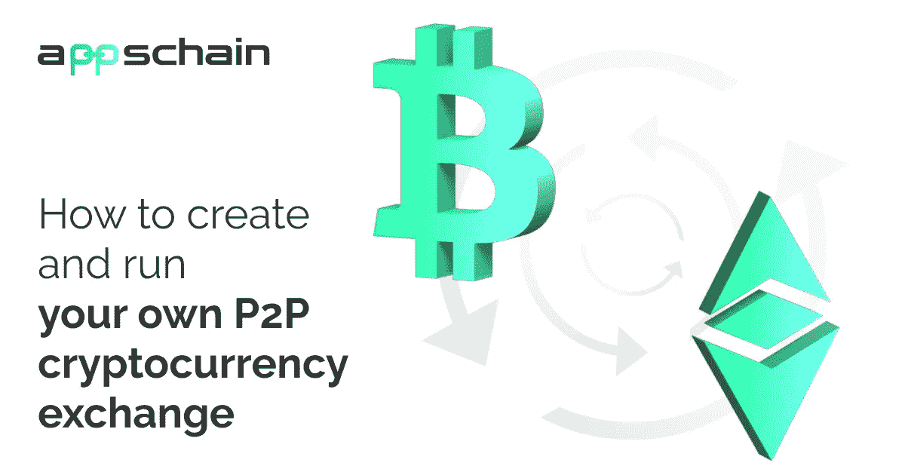

# 如何创建和运营自己的 P2P 加密货币交易所

> 原文：<https://medium.com/coinmonks/how-to-create-and-run-your-own-p2p-cryptocurrency-exchange-a95a7e7268f2?source=collection_archive---------58----------------------->

尽管加密市场呈熊市趋势，但使用加密货币的人数正在稳步增长。对于俄罗斯来说，这个问题尤其重要，因为 Visa 和 Mastercard 支付已经停止工作，人们不得不寻找替代方式向国外的亲戚汇款或与外国人结算服务和商品。俄罗斯总理米哈伊尔·米舒斯汀估计，俄罗斯公民在加密钱包中的资金量为 10 万亿卢布，因此这个想法非常有前途。

然而，创建一个 P2P 加密交换并不是一件容易的事情，需要你采取一系列的步骤，我们将在本文中详细描述。

> 交易新手？试试[加密交易机器人](/coinmonks/crypto-trading-bot-c2ffce8acb2a)或者[复制交易](/coinmonks/top-10-crypto-copy-trading-platforms-for-beginners-d0c37c7d698c)

# 对手分析

首先，你需要研究市场，看看哪些交易所在不同的司法管辖区受欢迎，为什么。你必须向你的顾客提供你的竞争对手没有的东西。这可能是罕见的交易对，低费用，用户友好的界面等。你需要分析市场，了解你的竞争对手还没有能够满足的需求，以及你未来的 P2P 交易所如何能够满足这些需求。如果你精通加密市场，那么你可以尝试自己做，或者你可以向专家寻求建议，以便同时做其他事情。

# 管辖权的选择

一旦你决定了你与竞争对手的主要区别，你就需要决定管辖范围。在不同的国家，关于加密货币的立法差异很大。

如果我们谈论俄罗斯，即使在制裁之前，央行也试图禁止加密货币，但财政部和金融稳定委员会反对。随着制裁时代的到来，对加密货币的需求增长，大多数俄罗斯监管机构对加密货币的态度变得更加忠诚。财政部与经济发展部、内政部、数字发展部等部委一起，开始准备一项监管俄罗斯加密货币流通的法案。总的来说，就连央行也开始在这个问题上逐渐让步。

但不要提前高兴，因为俄罗斯对交易所运营商的要求非常严格:

交易所经营者必须拥有至少 3，000 万卢布的资本；

—您需要将用户信息存储至少 3 年，并在执法机构第一次要求时传输数据。

如果你不害怕与制裁相关的困难，你可以尝试为自己选择另一个管辖区。有趣的选择可能是白俄罗斯、迪拜、波多黎各、开曼群岛、塞浦路斯、毛里求斯、马耳他、瑞士(尤其是楚格)和日本。虽然在许多外国司法管辖区，如果你从当地人中找到一个人担任首席执行官，公司的待遇会好得多。

选择司法管辖区后，您需要收集所有必要的文件，以通过所有必要的 KYC 和反洗钱要求。加密货币领域的立法在所有国家都变化非常快，所以在这里你需要不断地讨论这个主题或聘请专家，他们可以建议在哪个司法管辖区推出你的 P2P 交易所更好。

# 租用或购买网络设备

解决这个问题有两种方法——租赁或购买自己的设备。当然，租用服务器会更便宜，但对于一个金融科技项目来说，将数据托付给第三方是非常危险的，特别是在当前这个时代，作为制裁压力的一部分，断开服务是司空见惯的。此外，对于不在俄罗斯的服务器，支付限制也有困难，因为如果您需要部署以太坊或 BNB 链节点，在俄罗斯和独联体几乎没有服务器“租金”。在俄罗斯，即使是支持网站和轻型软件解决方案的服务器，其成本也要比国外同行高出 2-3 倍。

购买自己的硬件可能要花费几千美元，但对于大型商业应用程序来说，这是一个更安全的选择。你可以先租一个房子，这样就能赶上第一次发布会。

# 开发或购买解决方案

所以，你已经选择了一个管辖区，收集了文件，你有一个服务器部分。现在你需要一个网站，一个 app，一个钱包，一个交易引擎，DDoS 保护，还有更多，包括营销培训，雇佣一个团队。

可以买现成的版本，也可以一切从头开发。在第一种情况下，您将受到所购发动机性能的限制，与使用相同基础的竞争对手没有太大区别。但是一个月后你会收到你的工作交换。

另一方面，要从头开始创建所有必要的软件，你需要一个经验丰富的专家团队。当然，您可以单独寻找专家，但是在团队中寻找和建立业务流程会花费您大量的时间。而在员工的工作过程中，面试和测试期间，又有多少人需要过滤呢？

让我们考虑一个替代方案。雇佣一个经验丰富的专家团队，他们已经建立了所有的工作流程，并有良好的记录。这是进入区块链商界最快最简单的方法。

# 公关、营销、推广

即使有了成品，没有有效的推广也无法变现。现在，市场上争夺用户注意力的竞争非常激烈，你必须付出很大努力，让你的 P2P 交易变得有知名度和受欢迎。与开发团队一样，您也需要一个经验丰富的公关团队在社交网络、电报频道和博客中进行推广，以实现良好的索引，组织与媒体的互动并购买广告空间，在行业网站上发布项目，通过设置有针对性的上下文广告来推出有针对性的流量——所有这些都可以由 AppsChain 团队实施。

# 总结

P2P 加密交易所是一个非常有前途的想法，但它需要一个仔细校准的策略:从竞争对手分析和管辖区选择到应用程序开发和产品推广。你需要一个协调良好的专业团队来将这样的想法付诸实践，并从中赚钱。AppsChain 团队已经准备好处理与 P2P 交易所的创建和推广相关的大部分问题。

**我们的网站:**【https://appschain.ru/ 

【https://appschain.ru/solutions.html】区块链解决方案:

**https://vk.com/appschainVK 社区:**

**俄罗斯博客上的 VC . ru:**[**https://vc.ru/u/1215222-appschain**](https://vc.ru/u/1215222-appschain)

****medium . com 上的英文博客:**[https://medium.com/@AppsChain](/@AppsChain)**

> **加入 Coinmonks [电报频道](https://t.me/coincodecap)和 [Youtube 频道](https://www.youtube.com/c/coinmonks/videos)了解加密交易和投资**

# **另外，阅读**

*   **[AscendEx 保证金交易](https://coincodecap.com/ascendex-margin-trading) | [Bitfinex 赌注](https://coincodecap.com/bitfinex-staking) | [bitFlyer 审核](https://coincodecap.com/bitflyer-review)**
*   **[麻雀交换评论](https://coincodecap.com/sparrow-exchange-review) | [纳什交换评论](https://coincodecap.com/nash-exchange-review)**
*   **[维护卡审核](https://coincodecap.com/uphold-card-review) | [信任钱包 vs MetaMask](https://coincodecap.com/trust-wallet-vs-metamask)**
*   **[TraderWagon 回顾](https://coincodecap.com/traderwagon-review) | [北海巨妖 vs 双子星 vs BitYard](https://coincodecap.com/kraken-vs-gemini-vs-bityard)**
*   **[Exness 评测](https://coincodecap.com/exness-review)|[moon xbt Vs bit get Vs Bingbon](https://coincodecap.com/bingbon-vs-bitget-vs-moonxbt)**
*   **[如何开始通过加密贷款赚取被动收入](https://coincodecap.com/passive-income-crypto-lending)**