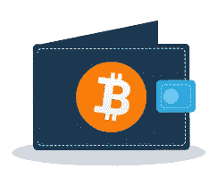

# 如何在加纳创建比特币钱包

> 原文：<https://medium.com/coinmonks/how-to-create-bitcoin-wallet-in-ghana-90524bbe0009?source=collection_archive---------46----------------------->

加密钱包安全地存储您的私钥(加密资产的密码)，并允许您访问您的加密货币，允许您发送和接收比特币和以太坊等加密货币。它们是各种类型的加密钱包，从 Ledger(它看起来像一个 u 盘)这样的硬件钱包到比特币基地钱包这样的移动应用程序，它允许你使用加密货币进行日常交易。

## **加密钱包的类型**

Bitcoin wallets

加密货币钱包大致分为两类；

*   热门钱包或在线钱包；&
*   冷钱包

**热门钱包**是一种始终连接到互联网和加密货币网络的加密货币钱包。热钱包用于进行加密货币交易和投资活动，它们允许您查看您有多少代币可供使用。热门钱包可分为非保管型钱包和托管型钱包。

非保管钱包让你完全控制你的密码。为什么要有不保管的钱包？除了完全控制您的加密的安全性，您还可以访问更复杂的加密选项，如产量农业，赌注，贷款，借款，等等。

另一方面，托管钱包是最受欢迎的，它很容易设置。

有各种各样的热门钱包，其中许多是免费下载的。如果你想做的只是购买、出售、发送和接收加密，托管钱包是最简单的解决方案。

热门钱包的例子有 MetaMask、比特币基地钱包和 Exodus 钱包。Investopedia 将 Exodus 钱包评为 2022 年新手最佳比特币钱包。

**如何设置热门钱包账户**

设置加密货币钱包相对容易，你简单；

*   下载您喜欢的钱包应用程序。
*   创建您的帐户。如果你选择托管钱包，你需要在设置账户时提供一些个人信息，但非托管钱包则不需要，甚至不需要电子邮件地址。
*   请务必记下您的私钥，并将其保存在安全的位置。

**冷钱包**是一种离线钱包，用于存储比特币或其他加密资产。使用冷存储，您的私钥存储在一个没有连接到互联网的平台上，从而保护钱包免受网络黑客攻击和其他与连接到互联网的热钱包相关的漏洞。冷藏的例子是纸钱包和硬件钱包。

硬件钱包是一种物理设备，有些像 USB 驱动器，它离线存储加密货币的私钥。由于安装成本的原因，硬件在加密用户中并不是一个常见的选择——你必须购买设备，而且可能相当昂贵。

## **如何设置硬件钱包:**

*   购买硬件。最知名的两个品牌是 Ledger 和 Trezor。
*   安装软件。每个品牌都有自己的软件，安装钱包时需要用到，并与购买的硬件联系起来。

正如有各种各样的方法来存储金钱(在银行账户里、保险箱里、存钱罐里)一样，也有各种各样的方法来存储密码。您可以使用托管钱包保持简单，使用非保管钱包完全控制您的加密资产，使用硬件钱包采取额外的预防措施，甚至拥有多种类型的钱包。

大多数密码投资者将他们的密码货币投资组合分为非保管钱包和硬件钱包。出于安全考虑，他们的大部分加密资产存储在硬件钱包中，日常交易和投资的加密存储在非保管钱包(在线钱包)中。

**出售比特币**

您可以在 Dart Africa 轻松将比特币兑换成现金出售。他们的服务在尼日利亚和加纳提供，因此，他们在加纳塞迪斯和奈拉付款。Dart Africa 是一个经验丰富的密码货币交易平台，有超过 15000 笔交易被执行，他们可以被信任出售你的比特币和其他密码货币。他们的众多特权之一是将密码货币兑换成奈拉或塞迪斯的汇率，他们提供的汇率对他们的客户有利可图，因此当您在 Dart Africa 交易您的密码货币时，您的密码货币将获得最佳价值。

## **如何在 Dart Africa** 上出售比特币

*   创建帐户或登录(如果您已经有了帐户)。确保您通过验证邮件验证您的帐户。
*   如果您是新用户，请创建您的帐户个人识别码。取款需要您的个人识别码。
*   在*出售比特币*界面选择比特币作为您首选的密码货币，并输入您想要出售的比特币数量。

> 加入 Coinmonks [电报频道](https://t.me/coincodecap)和 [Youtube 频道](https://www.youtube.com/c/coinmonks/videos)了解密码交易和投资

# 此外，请阅读

*   [如何在 Uniswap 上交换密码？](https://coincodecap.com/swap-crypto-on-uniswap) | [A-Ads 审核](https://coincodecap.com/a-ads-review)
*   [WazirX vs coin dcx vs Bitbns](/coinmonks/wazirx-vs-coindcx-vs-bitbns-149f4f19a2f1)|[BlockFi vs coin loan vs Nexo](/coinmonks/blockfi-vs-coinloan-vs-nexo-cb624635230d)
*   [本地比特币回顾](/coinmonks/localbitcoins-review-6cc001c6ed56) | [密码货币储蓄账户](https://coincodecap.com/cryptocurrency-savings-accounts)
*   [什么是融资融券交易](https://coincodecap.com/margin-trading) | [美元成本平均法](https://coincodecap.com/dca)
*   [拥护卡审核](https://coincodecap.com/uphold-card-review) | [信任钱包 vs MetaMask](https://coincodecap.com/trust-wallet-vs-metamask)