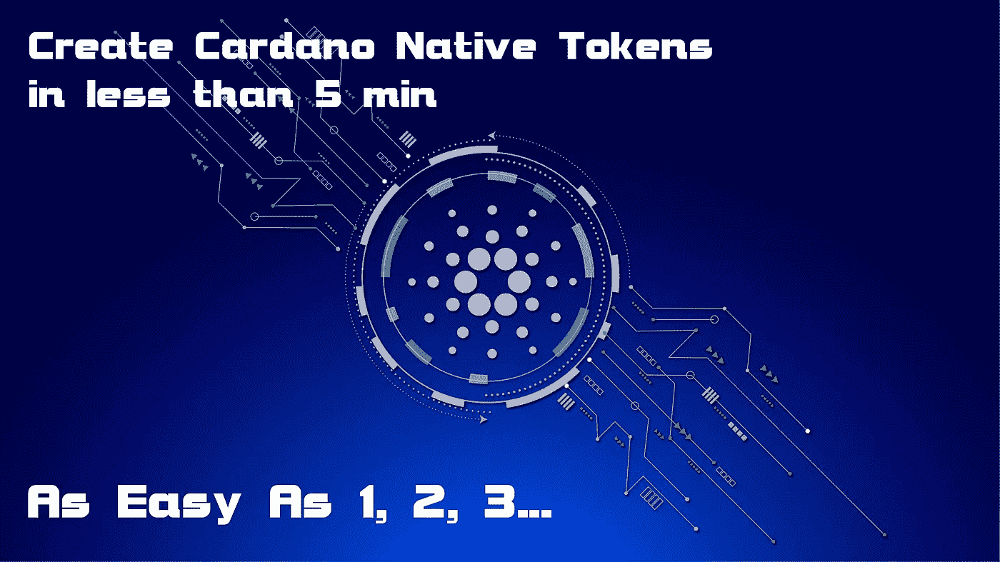

# 如何用 0 编码知识创建 Cardano 原生令牌..

> 原文：<https://medium.com/coinmonks/how-to-create-cardano-native-tokens-with-0-coding-knowledge-2d5e3f772489?source=collection_archive---------7----------------------->

## 区块链·斯奎兹😜

```
Thank you for your interest in this article, if you like the content feel free to [**Subscribe**](https://untilwefall.medium.com/membership), clap and share it.
```



是的，你没看错，你现在可以用 0 编码知识在 Cardano 上创建原生令牌。让我们了解如何🤔