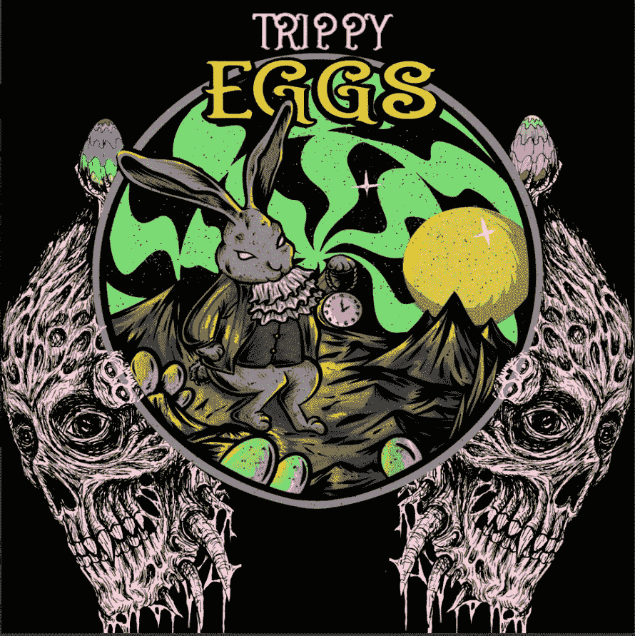

# 如何使用 Python 为 OpenSea 上的 NFT 集合创建元数据

> 原文：<https://medium.com/coinmonks/how-to-create-metadata-for-nft-collections-on-opensea-using-python-cb5ecc419c83?source=collection_archive---------2----------------------->

## 以及在哪里存储数据

[https://trippyeggs.com](https://trippyeggs.com) (image by author)

# 所以你创造了 NFT 艺术品…

当我创作[特里皮格斯 NFT 系列](https://trippyeggs.com)时，我是在[搅拌机](https://www.blender.org/download/)中手动完成的，而不是使用像 [HashLips 艺术引擎](https://www.youtube.com/watch?v=Zhmj4PiJ-GA)这样的工具。艺术引擎被用来创造像[无聊猿游艇俱乐部](https://boredapeyachtclub.com/#/)这样的艺术收藏，通常…