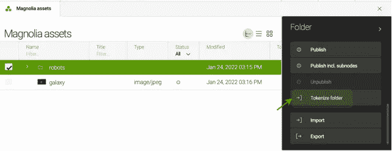

# 如何从网站内容创建 NFT

> 原文：<https://medium.com/coinmonks/how-to-create-nfts-from-contents-of-a-website-2980c4338b65?source=collection_archive---------15----------------------->

Photo by [Le Buzz](https://unsplash.com/@le_buzz?utm_source=unsplash&utm_medium=referral&utm_content=creditCopyText) on [Unsplash](https://unsplash.com/s/photos/website?utm_source=unsplash&utm_medium=referral&utm_content=creditCopyText)

在这篇文章中，我将展示如何为网页和图片形式的网站内容创建 [NFT](https://en.wikipedia.org/wiki/Non-fungible_token) 标记。

为此，我们将为网站使用 [Magnolia CMS](https://www.magnolia-cms.com) ，使用[以太坊](https://ethereum.org)来管理 [NFT](https://en.wikipedia.org/wiki/Non-fungible_token) 令牌的所有权，使用 [IPFS](https://ipfs.io) 来存储已被令牌化的页面和图像。

# 动机

开发一个使用网站内容来创建 [NFT 的](https://en.wikipedia.org/wiki/Non-fungible_token)的解决方案的原因是提供一种方式来奖励他们的文章、设计等创作者。例如，我可以帮助一位作家或记者购买他们博客页面的 NFT。

# 它是如何工作的

## 向网站添加内容

首先要做的是创建一个页面或者上传一张图片到网站上。

由于我们正在为网站使用 [Magnolia CMS](https://www.magnolia-cms.com) ，可以使用应用[页面](https://docs.magnolia-cms.com/product-docs/6.2/Authoring/Managing-pages.html)创建页面，并且可以使用应用[资产](https://docs.magnolia-cms.com/product-docs/6.2/Authoring/Managing-assets.html)上传图像。

Adding a page in Magnolia CMS

Uploading an image in Magnolia CMS

## 为页面创建 NFT

1.  为网站创建一个 NFT 的的集合。这个收藏将存储为网站页面创建的 [NFT 的](https://en.wikipedia.org/wiki/Non-fungible_token)。

可以使用应用程序[站点](https://docs.magnolia-cms.com/product-docs/6.2/Apps/List-of-apps/Site-app.html)中可用的动作*标记化站点*来创建集合

Site tokenization

作为这一行动的结果，一份 [ERC-721](https://eips.ethereum.org/EIPS/eip-721) 合同被部署在[以太坊](https://ethereum.org)用于收集 [NFT 的](https://en.wikipedia.org/wiki/Non-fungible_token)

ERC-721 contract deployed in Rinkeby testnet network

> 上述示例中已部署的智能合约可位于[https://rinkeby . ethers can . io/address/0x d 00 f 776 aa C4 FB 2856434 E6 E8 a 76 df 7 f 08 f 86 e 7 a](https://rinkeby.etherscan.io/address/0xd00f776aa2c4fb2856434e6e8a76df7f08f86e7a)中，资产可从[https://ipfs . io/ipfs/QMS xd 3 smguqkv 3j 97 zbpuskjaaqjusdmgwxh 7g 9 qwgdnyk/NFT-page](https://ipfs.io/ipfs/QmSxd3sMGuQKV3j97zBPuSKJaaQJuSdMGWxh7G9qWGDNyk/nft-page)中获得

2.[造币厂](https://www.coindesk.com/learn/buying-nfts-during-presales-and-public-mints-things-you-should-know/)网页中收藏的 [NFT 的](https://en.wikipedia.org/wiki/Non-fungible_token)。为了制作页面，应用程序[页面](https://docs.magnolia-cms.com/product-docs/6.2/Authoring/Managing-pages.html)提供动作*制作页面。*

Minting a page

由于[制作](https://www.coindesk.com/learn/buying-nfts-during-presales-and-public-mints-things-you-should-know/)，页面被渲染为 [pdf](https://en.wikipedia.org/wiki/PDF) 并上传到 [IPFS](https://ipfs.io) ，在 [IPFS](https://ipfs.io) 存档的 URI 被添加到网站的[NFT](https://en.wikipedia.org/wiki/Non-fungible_token)收藏中。

Minting transaction in [Ethereum](https://ethereum.org) (1). Archive “pdf” uploaded to [IPFS](https://ipfs.io) (2)

## 为资产创建 NFT

1.  为一个资产文件夹创建一个由 [NFT 的](https://en.wikipedia.org/wiki/Non-fungible_token)组成的集合。该集合将存储为文件夹内的资产创建的 [NFT 的](https://en.wikipedia.org/wiki/Non-fungible_token)。

> 与页面不同，NFT 的资产收藏是从文件夹中创建的。

可以使用应用程序[资产](https://docs.magnolia-cms.com/product-docs/6.2/Authoring/Managing-assets.html)中可用的动作*标记化站点*来创建集合

Creating collection of [NFT’s](https://en.wikipedia.org/wiki/Non-fungible_token) for a folder of assets

这次行动的结果是一份 [ERC-721](https://eips.ethereum.org/EIPS/eip-721) 合同被部署在[以太坊](https://ethereum.org)用于收集 [NFT 的](https://en.wikipedia.org/wiki/Non-fungible_token)

2.[造币厂](https://www.coindesk.com/learn/buying-nfts-during-presales-and-public-mints-things-you-should-know/)资产集合 [NFT 的](https://en.wikipedia.org/wiki/Non-fungible_token)。为了创建资产，应用程序[资产](https://docs.magnolia-cms.com/product-docs/6.2/Authoring/Managing-assets.html)提供动作*创建资产。*

> 资产是在它们所在的文件夹的 [NFT 的](https://en.wikipedia.org/wiki/Non-fungible_token)集合中铸造的

Minting an asset

作为[铸造](https://www.coindesk.com/learn/buying-nfts-during-presales-and-public-mints-things-you-should-know/)的结果，图像被上传到 [IPFS](https://ipfs.io) 并且 [IPFS](https://ipfs.io) 的档案的 URI 被添加到图像文件夹的[NFT](https://en.wikipedia.org/wiki/Non-fungible_token)的收藏中。

> 上例部署的智能契约可以位于[https://rinkeby . ethers can . io/address/0xa 162 ca 8 e 36 e 387 EC 234 c 663 ab D6 b 292 c 83 ed 38 a 3](https://rinkeby.etherscan.io/address/0xa162ca8e36e387ec234c663abd6b292c83ed38a3)中，资产位于[https://ipfs . io/ipfs/qmrancfpwscjrwfhnsg 2 jwyfuracncwsmbf 8 iqb 5 zcke 7/robot-1 . jpg](https://ipfs.io/ipfs/QmRAncfPWaSCjRwfHnsG2jwYFuRAcNCWsMbf8iQB5ZcKE7/robot-1.jpg)中

## 在市场上出版 NFT 的作品

[NFT](https://en.wikipedia.org/wiki/Non-fungible_token) 系列的智能合约实现了 [ERC-721](https://eips.ethereum.org/EIPS/eip-721) 接口，因此它们可以在任何支持 [ERC-721](https://eips.ethereum.org/EIPS/eip-721) 的[以太坊](https://ethereum.org)市场出售

对于页面和图像, [NFT](https://en.wikipedia.org/wiki/Non-fungible_token) 的令牌*地址*和 *id* 可以在编辑表单中找到:

# 解决方案的实施

该解决方案已作为 [Magnolia CMS](https://www.magnolia-cms.com) 的定制模块实施。该模块基于 [web3j](https://github.com/web3j/web3j) 与[以太坊](https://ethereum.org)集成，基于 [java-ipfs-http-client](https://github.com/ipfs-shipyard/java-ipfs-http-client) 与 [IPFS](https://ipfs.io) 集成

有关技术细节，请查看 [github](https://github.com/joaquin-alfaro/magnolia-tokenizer-bundle) 上的资源库，或者随时联系我。

 [## GitHub-Joaquin-alfaro/Magnolia-tokenizer-bundle:Magnolia CMS 中内容的标记化

### magnolia-tokenizer-module 是 Magnolia CMS 的一个模块，允许对 NFT 的内容进行标记化。内容可以…

github.com](https://github.com/joaquin-alfaro/magnolia-tokenizer-bundle) 

> *加入 Coinmonks* [*电报频道*](https://t.me/coincodecap) *和* [*Youtube 频道*](https://www.youtube.com/c/coinmonks/videos) *了解加密交易和投资*

# 另外，阅读

*   [3 商业评论](/coinmonks/3commas-review-an-excellent-crypto-trading-bot-2020-1313a58bec92) | [Pionex 评论](https://coincodecap.com/pionex-review-exchange-with-crypto-trading-bot) | [Coinrule 评论](/coinmonks/coinrule-review-2021-a-beginner-friendly-crypto-trading-bot-daf0504848ba)
*   [莱杰 vs Ngrave](/coinmonks/ledger-vs-ngrave-zero-7e40f0c1d694) | [莱杰 nano s vs x](/coinmonks/ledger-nano-s-vs-x-battery-hardware-price-storage-59a6663fe3b0) | [币安评论](/coinmonks/binance-review-ee10d3bf3b6e)
*   [Bybit Exchange 评论](/coinmonks/bybit-exchange-review-dbd570019b71) | [Bityard 评论](https://coincodecap.com/bityard-reivew) | [Jet-Bot 评论](https://coincodecap.com/jet-bot-review)
*   [3 commas vs crypto hopper](/coinmonks/3commas-vs-pionex-vs-cryptohopper-best-crypto-bot-6a98d2baa203)|[赚取加密利息](/coinmonks/earn-crypto-interest-b10b810fdda3)
*   最好的比特币[硬件钱包](/coinmonks/hardware-wallets-dfa1211730c6) | [BitBox02 回顾](/coinmonks/bitbox02-review-your-swiss-bitcoin-hardware-wallet-c36c88fff29)
*   [BlockFi vs 摄氏](/coinmonks/blockfi-vs-celsius-vs-hodlnaut-8a1cc8c26630) | [Hodlnaut 点评](/coinmonks/hodlnaut-review-best-way-to-hodl-is-to-earn-interest-on-your-bitcoin-6658a8c19edf) | [KuCoin 点评](https://coincodecap.com/kucoin-review)