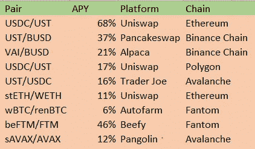
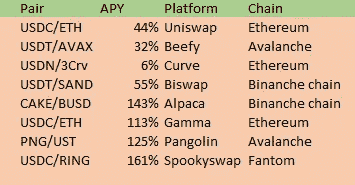
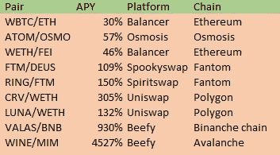
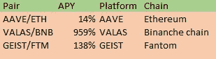
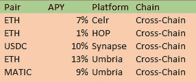

# 如何利用流动性池创造可持续的被动收入！

> 原文：<https://medium.com/coinmonks/how-to-create-passive-income-using-liquidity-pools-e0823b3aea32?source=collection_archive---------1----------------------->

## 流动资金提供方式介绍。

# 介绍

加密空间大而快。如果你闭上眼睛的时间太长，你就会错过获利的机会，或者失去收益。有许多机会，有些比其他人更好，让你的资金和密码为你工作。这种加密会让你变得更加密，如果你给它复利所需的时间，它会开始让你变得越来越被动。可悲的是，很多投资于密码行业的人甚至不知道他们的一些选择，所以这就是我在这里教你的。

> 钱生钱。而赚钱的钱就是赚钱。—本杰明·富兰克林

我怀疑我这里的大多数读者都拥有 crypto，但也有太多的人不知道你可以用你的资金创造什么样的被动收入和利润！在这篇文章中，我将解释什么是流动性提供，最常见的流动性提供(LP)策略是什么，以及它们的优缺点。如果你有一些静态密码，提供流动资金是一个无需太多努力就能产生一些被动收入的好方法！

# 如何从流动性提供(LP)中获利

大多数分散式交易所(Dex)，如 Uniswap、spookyswap 或 Pancakeswap，都使用自动做市商(AMM ),投资者通过智能合约进行资金交易。这个 AMM 有一个流动性池，两边的资产都存在其中。例如，一边是以太坊，另一边是 USDT。交易者可以在池的一边存入 USDT，在另一边取出 ETH。在进行这种交易时，支付一小部分费用来奖励这种流动性的提供者。

这就是我们利润的来源！通过在流动性池中提供我们的静态资产，我们将在每次交易完成时获得一部分费用。这样我们的密码将为我们赢得更多的密码！收益率取决于你在整个流动性池中的份额，以及池中的容量。在容量大的池中占有更大的份额将会给我们带来最大的回报！

## **有什么风险？**

有许多策略，都有其利弊。你得到的回报通常是和风险挂钩的，所以回报越高，风险也就越高！高风险意味着您面临巨大的潜在非永久性损失(IL)和/或价格波动风险。这是当你提供流动性而不是持有资产时的损失。当(某项)资产的价格上涨或下跌时，持有或出售该资产比提供流动性更明智。但是，当价格回到原来的价格时，损失现在已经挽回了；因此术语*非永久性损失*。当价格回到原来的价格时，它不是一个损失，因此是短暂的。阅读来自 yahoo.finance 的[这篇文章，更好地了解 IL。](https://finance.yahoo.com/news/impermanent-loss-crypto-silent-killer-181500277.html?guccounter=1&guce_referrer=aHR0cHM6Ly93d3cuZ29vZ2xlLmNvbS8&guce_referrer_sig=AQAAAFD0UisEvg-aKYJ_jvWzEuenu7tgLlxy8KMItSvm5jmY5NG9scYU2Grm_lwrR90bv4pJUXamwnIlNSZ7RmTLj6I6EZYxYkLtEGMTPV8PV_HctQ2QSC1f_nS4MX6niwDADgDlGDQMxp5hq_-wlm7sAuWh-7jxgCCoizZ7EDyVcHv2)

# 流动性提供策略

为了从这个概述中获取信息，我使用了 Coindix.com[网站](https://coindix.com/)，那里有一个关于所有不同资金池及其回报的惊人概述。该网站提供了大量资产及其选项的概述，因此您应该很容易找到最适合您的池！有更多的 Dapps 提供投资选择，所以我建议你也不要只看这个网站。

## 稳定池

Stablecoin returns on different platforms and chains

**风险水平:低—APY:2–50%。最安全、风险最小的流动性池是由稳定的货币对组成的。你可以考虑两边都有稳定点数的稳定对，比如 USDT/USDC，但也可以考虑两边都有相同点数的稳定对，比如 stETH/rETH。由于双方都在追踪同一个资产，所以你对 IL 的风险敞口是最小的，所以理想情况下，它们永远不会分开。当你刚接触 DeFi 的时候，我建议你投资这些类型的池，因为这是提供流动性所能得到的最安全的方式！**

## 公共资产池

common asset returns on different platforms and chains

**风险水平:中等—APY:20–100%。谈到资金池的风险较高的一边，我们有一边有稳定收入，另一边有资产的资金池。您可以考虑像 USDT/ETH 或戴/MATIC 这样的泳池。好的一面是，几乎所有现存的代币都有这样一个池！如果你有一些密码和马厩，这是一个让你的密码为你工作的完美方式！IL 的风险更高，但由于你已经暴露了，而且(可能)看好这枚硬币，这是一个在 HODL 时赚钱的完美方式。**

## 不稳定资产池

Volatile asset returns on different platforms and chains

风险级别:高—APY:20–2000%。风险最高的资产池是两边都有不稳定资产的资产池。在这些类型的资金池中，非永久性损失的风险最高，因此锁定价值通常较低。这意味着通过提供流动性很容易获得大份额的池，因此回报也更多！但是要小心，因为资产流失的可能性很高，因此它会频繁而快速地发生。我不向大多数人推荐这个选项，如果你对这两种资产都有信任，你应该只投资这些！

## 养殖池

Platform returns on different platforms and chains

**风险等级:高—APY:1–400%。**一些协议在提供所需流动性时会提供自己的本机令牌。像艾斯特金融(FTM)、valas 金融(BSC)或 AAVE 这样的平台提供他们的本地令牌来换取你的 LP 令牌。通过向所需的 DEX 提供流动性，然后将这些 LP 代币存放在他们的平台上，您将获得更高的本地奖励。这些代币中的一些价值暴跌，因为它们也被用于农业，并且由于一些协议在你能够提取奖励之前有一个归属期，所以投资于其他池可能会更好。

## 单面泳池

Bridge returns on different platforms and chains

**风险水平:中等——APY:2–20%。**部分平台提供单边流动性池。这意味着只需提供一项资产。如果你想用你的资产获得一些被动收入，但又不想承受非永久性损失的风险，这些资金池是理想的选择。桥是一种常见的 Dapp 类型，只需要 1 项资产作为流动性，因为这一项资产的流动性随后被用于转移到其他链。

# 结论

我希望这个指南对你的第一个流动资金池有所帮助！我尽力向你展示最好的投资方式，甚至更好的是，向你展示我用你的密码赚钱的方式！有许多不同的投资组合，上面提到的选项将提供一个可能的投资可能性的好主意。我总是建议将你的投资分散到多个渠道，这样你就不会让自己暴露在太多的风险中，也能使你的投资组合多样化。

看看我的其他文章，了解更多关于可持续的被动收入流和投资选择！你可以随时关注我关于投资和使用加密的被动收入的未来文章。如果您有任何问题，请随时评论或回复！

**其他链接**

*   为了让我的故事对每个人都免费，请给我买杯咖啡吧！[https://ko-fi.com/igormd](https://ko-fi.com/igormd)
*   如果你想开始交易，可以考虑用我推荐的库币！[https://www.kucoin.com/r/rf/1de5d](https://www.kucoin.com/r/rf/1de5d)
*   如果你想从每天 1%的活塞比赛开始，考虑使用我的好友链接！[https://piston-token.com/ref/igormd](https://piston-token.com/ref/igormd)
*   想成为页面上的特色吗？给我发邮件！

> 加入 Coinmonks [电报频道](https://t.me/coincodecap)和 [Youtube 频道](https://www.youtube.com/c/coinmonks/videos)了解加密交易和投资

# 另外，阅读

*   [3 商业评论](/coinmonks/3commas-review-an-excellent-crypto-trading-bot-2020-1313a58bec92) | [Pionex 评论](https://coincodecap.com/pionex-review-exchange-with-crypto-trading-bot) | [Coinrule 评论](/coinmonks/coinrule-review-2021-a-beginner-friendly-crypto-trading-bot-daf0504848ba)
*   [莱杰 vs n rave](/coinmonks/ledger-vs-ngrave-zero-7e40f0c1d694)|[莱杰 nano s vs x](/coinmonks/ledger-nano-s-vs-x-battery-hardware-price-storage-59a6663fe3b0) | [币安评论](/coinmonks/binance-review-ee10d3bf3b6e)
*   [Bybit Exchange 审查](/coinmonks/bybit-exchange-review-dbd570019b71) | [Bityard 审查](https://coincodecap.com/bityard-reivew) | [Jet-Bot 审查](https://coincodecap.com/jet-bot-review)
*   [3 commas vs crypto hopper](/coinmonks/3commas-vs-pionex-vs-cryptohopper-best-crypto-bot-6a98d2baa203)|[赚取秘密利息](/coinmonks/earn-crypto-interest-b10b810fdda3)
*   最好的比特币[硬件钱包](/coinmonks/hardware-wallets-dfa1211730c6) | [BitBox02 回顾](/coinmonks/bitbox02-review-your-swiss-bitcoin-hardware-wallet-c36c88fff29)
*   [block fi vs Celsius](/coinmonks/blockfi-vs-celsius-vs-hodlnaut-8a1cc8c26630)|[Hodlnaut 审核](/coinmonks/hodlnaut-review-best-way-to-hodl-is-to-earn-interest-on-your-bitcoin-6658a8c19edf) | [KuCoin 审核](https://coincodecap.com/kucoin-review)