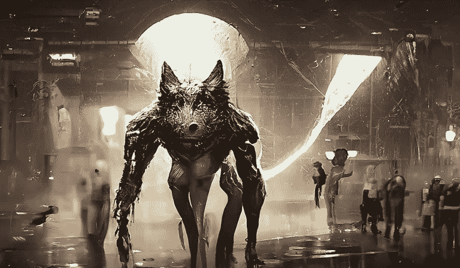
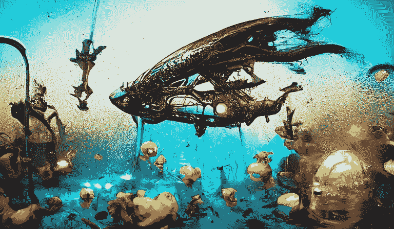

# 如何创建和销售数字创作者，罗斯伯内特 NFT

> 原文：<https://medium.com/coinmonks/how-to-create-sell-nfts-by-digital-creator-rose-burnett-e0da44e91dfc?source=collection_archive---------61----------------------->

## 听到了所有关于 NFTs 的议论，想开始使用 NFTs 吗？

Antipode in Elisium NFT Collection | By Digital Creator, Rose Burnett

## 了解加密货币、加密钱包，然后找到合适的 NFT 市场出售你的非加密货币可能会感觉有点复杂，但实际上并不复杂。

除了基础知识，你不需要了解任何关于加密货币的知识。有创造力当然有帮助！

我和你一样是一个完全的 NFT 菜鸟，所以我当然可以分享一些要注意的陷阱和实际上促进我的 NFT 氏症的事情。

在这篇文章中，我们将看看如何成功地建立你的第一个 NFT 收藏出售。

# 销售 NFT 的 10 大技巧

**# 1——对你想要创建的 NFT 收藏有一个基本的想法**(照片、图像、音乐、视频或音频资产)。然后弄清楚你需要做什么来把它变成一件吸引人的 NFT 艺术品。我发现了几个非常酷的应用程序，它们使用人工智能来帮助我将我原有的艺术作品和摄影作品数字化成可出售的 NFT。

**# 2——创建您的第一个 NFT 样本**准备在区块链上造币。我首先创作了[的一个系列](https://opensea.io/collection/eaglespirit-collection)并上传它们，然后用我的第二个 NFT 系列 [#vixen3d](https://opensea.io/collection/vixen3d) 进行实验，这可能有更广泛的吸引力(这是一个学习曲线)。我现在正在进行我的第三个未来派作品[伊莉西姆·NFT 系列](https://opensea.io/collection/elisium)。

**#3** — **设置兼容的加密钱包**以连接您选择的 NFT 市场。我做了一些调查，发现 Opensea.io 是最受欢迎的 NFT 市场。你可能也想试试稀有的，还有很多。我的建议是选择一个——我会在下面告诉你为什么！如果你已经有一个加密钱包——太好了！有连接不同类型加密钱包的选项。我没有，选择了[信任钱包](https://trustwallet.com/)，因为它可以使用 WalletConnect 轻松连接 OpenSea。

WalletConnect 是一个位于“设置”中的加密钱包内的工具，是一个将你的钱包连接到分散式网络应用程序的接口，如 OpenSea NFT 市场。你需要一个加密钱包**,然后才能在 OpenSea 或任何其他 NFT 市场上设立账户**来购买、出售或查看 NFT。

* *注意——使用信托钱包，您将需要另一个加密钱包***来转移您的 ETH(以太坊)资金到您的银行账户，当您进行 NFT 销售时。如果你在澳洲的话，*[*coin spot*](https://www.coinspot.com.au/)*crypto 钱包很优秀，我就报名了那个。超级容易使用存款到您的加密钱包和出售您的 ETH 和提取资金在澳大利亚元(澳元)回到您的银行帐户。我只花了 5-10 分钟就把我的 ETH 在钱包间转移，卖掉它，兑换成澳元，然后取出并收到我银行账户里的资金。CoinSpot 支持团队会通过实时聊天和电子邮件快速回答您的任何问题。**

*只是要注意，每次你从你的加密钱包(甚至钱包到钱包)中取出 ETH 或加密货币，你都将**在区块链上支付汽油费**，当资金进入你的银行账户时，更多的费用被提取。*

***#4** — **将 400 澳元或等值的以太坊(ETH)美元**存入您的加密钱包。你将需要这个来支付油费，以便在区块链上铸造你的第一个 NFT 收藏。当你第一次建立你的 OpenSea.io 账户时，你会被收取少量的汽油费，当你在区块链上铸造你的第一个 NFT 时，你会被收取汽油费。*

*在这之后，你在同一个 NFT 市场上生产的每一个 NFT 都是不含汽油的(免费)。燃气费的**价格将取决于以太坊**当时的**市场价值。确保在加密钱包的“设置”中设置您的本地货币，以便您了解 ETH 对美元、澳元或其他货币的兑换率。***

***#5 —打开你的 OpenSea.io 账户** **，连接你的加密钱包**。然后建立你的个人资料，用你的 NFT 收藏中的图片和媒体进行标记，并连接你的社交媒体账户。OpenSea 将向你手机上的加密钱包发送批准请求，以授权你的帐户，每次你登录时，铸造一个 NFT，或将其设置为“出售”。因此，在更改您的帐户或 NFT 收藏时，请打开并连接您的加密钱包，以便更快地获得批准。*

**

*Maximus in Elisium NFT Collection | By Digital Creator, Rose Burnett*

***#6 —创建您的第一个收藏集并开始添加您的 NFTs** —在 OpenSea 中创建您的第一个收藏集并添加徽标、特色图像、横幅图像，并为您的收藏集命名(最好简短、醒目)。确保定制您的 URL，添加描述，并为您的 NFTs 选择要在市场中显示的类别。添加您的社交媒体链接，并选择您希望类别项目在前端显示的方式。*

*您的**钱包地址**将会自动填充，您的 NFT 将在此铸造并在区块链出售。接下来设置每次转售 NFT 时你将获得的**版税**(在 OpenSea.io 上高达 10%)。如果你愿意，你可以**添加一个合作者**(第二人)。如果你这样做，他们将分享版税。然后提交您的更改，现在您就可以添加您的 NFTs 了。*

*点击**“创建”**添加您的第一个 NFT，或者点击收藏中的**添加**按钮。要设置您的 NFT **，请添加图像、视频、音频或 3D 模型** *(支持的文件类型有:JPG、PNG、GIF、SVG、MP4、WEBM、MP3、WAV、OGG、GLB、GLTF。最大大小:100 MB)。**

*命名您的 NFT，给它一个描述，添加一个外部链接到您的网站，如果你有一个提供更多信息。**选择您想要添加 NFT 的收藏库**，这会将该收藏库中的 NFT 存入您的加密钱包。在您的加密钱包中，您将有一个令牌和非功能性令牌的标签，在那里您可以看到您所有的非功能性令牌。*

*下一步添加任何独特的属性，和**可解锁的内容**给买家当他们购买它。例如，您可能想让他们通过下载链接访问原始文件。对于我的 NFTs，我设置了 [DropBox](https://www.dropbox.com/) 来为买家提供原始高清图像文件下载和一个独特的链接。这可以为购买你的 NFT 增加更多的买家吸引力。*

*当你点击**创建**时，OpenSea(或者你正在使用的 NFT 市场)将运行**批准步骤，在区块链上铸造你的 NFT** ，因为它连接到你的加密钱包。当批准通知进入您的加密钱包时，请确保点击**确认**。*

*第一次铸造时，您将被收取汽油费，它将显示为 ETH 和您指定货币的价值。一旦你接受，你之后创建的所有 NFT，包括新的集合，都将是无气体的。*

*如果您转换平台，您将需要为您在该平台上创建的任何 NFT 支付另一笔燃气费。如果你在不止一个 NFT 市场平台上推广相同的系列，你将不得不**在这些平台上分割任何未来的版税**。这就是棘手的地方，所以最好坚持一个平台。*

**

*Iluminata Druid Fish in Elisium NFT Collection | By Rose Burnett*

***# 7——建立一个简单的网站来推广你的 NFT 的**——这样买家可以点击你的 NFT 上的链接，获得更多关于你的 NFT、收藏和你作为创作者的信息。此外，它还能让您在搜索引擎结果中推广您的 NFTs，进行免费和付费推广，并将您的网站链接到您的社交媒体渠道。*

***#8** — **设置你的非功能性交易进行销售**——现在你已经准备好将你的非功能性交易在 OpenSea 或你喜欢的市场上进行销售了。确保所有 NFT 的细节是正确的，你的**可解锁的内容**已经被添加(即。下载链接)。*

*然后点击“出售”，您可以选择**固定价格或拍卖**，在 ETH 中设置您的**起始出价**或固定出售价格。你也可以设定一个底价，NFT 必须达到这个底价才能出售。单击提交后，将要求您在连接的加密钱包中批准该操作。*

***关键销售技巧** —注意你设定的起拍价有多高。在我添加了几个 NFT 后，我的第一个收藏为我的收藏设定了一个底价，所以从那以后我不能设定低于底价的起拍价。我只能在拍卖结束后更换它们。*

*如果价格高于底价，您可以在拍卖过程中通过点击 NFT 上的**低价**按钮来降低您的起拍价。我仍在尝试我的 NFT 系列，以找到最好的上市价格。请注意，如果您取消 NFT 上市，您将被收取汽油费。*

***#9** — **准备好推广你的 NFT 的**——推广你的 NFTs 的最佳社交媒体渠道是[抖音](https://www.tiktok.com/)、 [Instagram](https://www.instagram.com/) 、[脸书](https://www.facebook.com/)商业页面和[推特](https://www.twitter.com)。如果你已经有追随者的渠道，使用它们！我对抖音完全陌生，但它有一个庞大的 NFT 粉丝群，而且很快就有了追随者。*

*创建短视频来推广你的 NFTs，我发现在抖音大约 20-24 秒是完美的视频长度。我的第一个视频有大约 550 次浏览。我上传了一个较长的视频，无法获得任何视频浏览量，所以我删除了它，并使它变短，它的工作！另外，你可以直接将你的抖音视频发布到 Instagram，然后从 IG 发布到脸书，这样就不会重复了。*

*Twitter 非常适合推广你的 NFTs，也适合追随 NFT 收藏家、NFT 社区和其他 NFT 艺术家。Twitter 上所有这些群体之间都有很多积极的互动。*

***视频提示**——一款可以用来制作带有动画、特效和免版税音乐的短视频的酷应用是[foto play](https://www.fotoplayapp.com/)(IOS 和 Android 都有)。*

***警告:**如果你想在 **YouTube stories** 上使用它们，将音乐曲目静音，并添加你知道对 YouTube 安全的免版税音乐。我加载的第一个音乐收到了版权警告，所以我立即删除了它。*

*对于具有更多效果的**专业视频**，我使用 [Wondershare Filmora](https://filmora.wondershare.net/) 。您可以为不同的平台创建任意长度和配置文件的视频，如下所示:*

*YouTube 上有很多关于非功能性技术的兴趣，尤其是如何制作视频。我在 YouTube 上有一个很大的频道，所以我还在和我的观众一起试验对 NFT 的兴趣。*

***# 10——在 NFT 日历上列出你的 NFTdrop**——好的新手 NFT drop 指的是你的 NFT 系列发布并上线的时候。另一个要学的时髦词！确保在 [NFT 日历](https://nftcalendar.io/)上免费列出你的 NFTdrop，如果你想跳过排队，也有付费选项。*

*最好先建立自己的网站，因为你可以将它链接到你的 NFT 日历列表中。另外**验证你的列表**需要你在你的网站上添加他们的标志，链接到你的列表 URL。*

*你也可以添加你的[不和谐服务器](https://discord.com/)链接，我很乐意承认我不知道那是什么。所以我问了一个利用不和的女朋友，了解了情况，想明白了。在这个平台上，您可以创建自己的 NFT 社区，分享您的 NFTDrops，并关注已建立的 NFT 社区。*

*可以关注我这里的 [vixen3d Discord 服务器和社区](https://discord.gg/Pune7QN4at)。*

***最后一条建议**…对你的 NFTDrop 来说，一个好主意就是做一个**公关发布。我发现最好的入门工具之一是 [EIN 新闻网](https://www.einnews.com/)，你可以免费获得你的第一份新闻稿。***

**免责声明:我与本文中提到的应用程序、平台、加密钱包或服务提供商没有任何关系，也不赚取任何附属佣金。评论纯粹基于我自己的经历。**

## *关于罗斯·伯内特*

*罗斯·伯内特是[伊莉西姆·NFT 系列](https://opensea.io/collection/elisium)和 [OpenSea](https://opensea.io/vixen3d) 上#vixen3D 和#eaglespirit NFT 系列的数字创作者。罗斯也是一个转型的蔻驰，拥有受欢迎的 38.7K 励志 [YouTube 频道](https://www.youtube.com/channel/UC6Woe4-GX23RW6KvL3_WzlA)，并且是 [Brainz 杂志](https://www.brainzmagazine.com/executive-contributor/Rose-Burnett)和 [2021 年 CREA 全球奖](https://www.brainzmagazine.com/crea-global-awards-2021/)的执行撰稿人，该奖项授予因创新、商业适应性或对可持续发展和精神健康的贡献而受到认可的顶级企业家和有影响力的领导者。*

> **加入 Coinmonks* [*电报频道*](https://t.me/coincodecap) *和* [*Youtube 频道*](https://www.youtube.com/c/coinmonks/videos) *了解加密交易和投资**

# *另外，阅读*

*   *[3 商业评论](/coinmonks/3commas-review-an-excellent-crypto-trading-bot-2020-1313a58bec92) | [Pionex 评论](https://coincodecap.com/pionex-review-exchange-with-crypto-trading-bot) | [Coinrule 评论](/coinmonks/coinrule-review-2021-a-beginner-friendly-crypto-trading-bot-daf0504848ba)*
*   *[莱杰 vs n rave](/coinmonks/ledger-vs-ngrave-zero-7e40f0c1d694)|[莱杰 nano s vs x](/coinmonks/ledger-nano-s-vs-x-battery-hardware-price-storage-59a6663fe3b0) | [币安评论](/coinmonks/binance-review-ee10d3bf3b6e)*
*   *[Bybit Exchange 评论](/coinmonks/bybit-exchange-review-dbd570019b71) | [Bityard 评论](https://coincodecap.com/bityard-reivew) | [Jet-Bot 评论](https://coincodecap.com/jet-bot-review)*
*   *[3 commas vs Cryptohopper](/coinmonks/3commas-vs-pionex-vs-cryptohopper-best-crypto-bot-6a98d2baa203)|[赚取加密利息](/coinmonks/earn-crypto-interest-b10b810fdda3)*
*   *最好的比特币[硬件钱包](/coinmonks/hardware-wallets-dfa1211730c6) | [BitBox02 回顾](/coinmonks/bitbox02-review-your-swiss-bitcoin-hardware-wallet-c36c88fff29)*
*   *[block fi vs Celsius](/coinmonks/blockfi-vs-celsius-vs-hodlnaut-8a1cc8c26630)|[Hodlnaut 审核](/coinmonks/hodlnaut-review-best-way-to-hodl-is-to-earn-interest-on-your-bitcoin-6658a8c19edf) | [KuCoin 审核](https://coincodecap.com/kucoin-review)*
*   *[Bitsgap 审查](/coinmonks/bitsgap-review-a-crypto-trading-bot-that-makes-easy-money-a5d88a336df2) | [Quadency 审查](/coinmonks/quadency-review-a-crypto-trading-automation-platform-3068eaa374e1) | [Bitbns 审查](/coinmonks/bitbns-review-38256a07e161)*
*   *[加密复制交易平台](/coinmonks/top-10-crypto-copy-trading-platforms-for-beginners-d0c37c7d698c) | [Coinmama 评论](/coinmonks/coinmama-review-ace5641bde6e)*
*   *[印度的加密交易所](/coinmonks/bitcoin-exchange-in-india-7f1fe79715c9) | [比特币储蓄账户](/coinmonks/bitcoin-savings-account-e65b13f92451)*