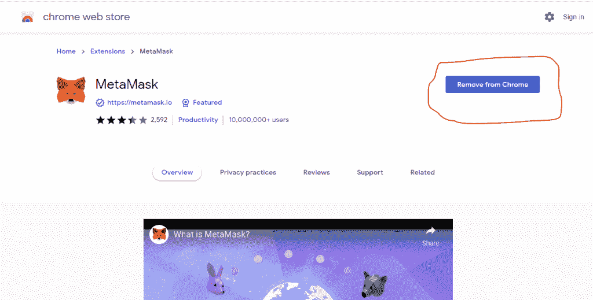

# 如何在 Opensea 免费创建、存储和销售 NFT——梅隆邮报

> 原文：<https://medium.com/coinmonks/how-to-create-store-and-sell-nft-on-opensea-for-free-mellonpost-2ddd4eee4e6f?source=collection_archive---------46----------------------->

(上次更新时间:2022 年 5 月 3 日)

NFT 是不可替代令牌的首字母缩略词，这个术语用来描述已经注册在 Blockchain 上的一件艺术品或其他形式的创意。

这个过程通常是通过区块链以太网上的智能合同技术实现的。

区块链以太网博物馆是一个公共分类账，保存着网络上所有交易的分散记录。

该公共分类账用于证明已记录在网络上的数字资产的所有权。

有了 NFTs 和区块链，每一项独特的数字资产都可以追溯到最初的创作者，并确保创作者获得适当的赞誉。

使用这项技术，创作者可以设定他们想要从他们的作品中获得的版税金额，即使它已经在区块链被多次出售。

有许多可以创作、制作和销售 NFT 的市场，每个平台都有自己的特色和方法来列出不同创作者的作品。

这些平台的示例包括；Opensea，Mintable，稀有，超级稀有，Foundation.app，币安等

然而，为了便于理解，我将基于如何在 Opensea 上创建一个 NFT 来撰写本文

# 如何为 NFT 设置加密钱包

首先，在你可以在任何 NFT 造币平台上做任何事情之前，你必须得到一个加密钱包。

为了使用这个 NFT 平台，有一些钱包可以让这个过程变得简单和无缝，这包括:MetaMask，比特币基地钱包，Trust 钱包等等。

然而，根据我的经验，我喜欢使用元掩码，因为我发现它在不同的设备上很容易使用。

例如，“我的信任”钱包只能在移动设备上运行良好，而在桌面上运行不佳。

所以，要使用元掩码，您需要做的就是在手机上下载应用程序并进行设置。

而对于你的电脑，你只需要下载 chrome 扩展并安装它。

# 如何将元面膜钱包连接到 Opensea

第一步是在你的设备上下载:如果你在移动设备上，只需去应用商店或游戏商店下载。

但是，如果您在电脑上，请前往 [Metamask.io](http://metamask.io) 并下载浏览器扩展。

它将引导您到扩展页面，继续并在您的浏览器上安装扩展

(我已经在浏览器上安装了它)

设置元掩码后，您现在可以继续将您的钱包连接到 Opensea 平台。

# 如何将您的钱包连接到 Opensea

转到 [opensea.io](http://opensea.io) 并点击最右边的钱包图标，然后继续选择你的钱包，在这种情况下是 Metamask(或你选择使用的任何其他钱包)

如果您使用的是移动设备，它会提示您使用钱包选项进行连接，您可以选择已经安装在设备上的元掩码。

使用钱包登录后，您的个人资料将会自动创建，您所要做的就是根据需要填写您的详细信息。

在您的个人资料中，您有更多的空间来谈论自己，还可以添加到您的其他资源的链接，如您的网站和社交句柄。

更重要的是，你可以添加你的钱包地址，在那里你可以接收来自你的 NFT 销售和其他交易的付款。

若要将钱包地址添加到您的个人资料中，请返回您的元掩码帐户并复制您的钱包地址。

确保总是复制粘贴，永远不要试图把它打出来，因为如果你有一个字母错了，你的硬币将永远丢失。

# 如何在 Opensea 上创建 NFT 收藏

创建收藏非常重要，因为它有助于组织您的工作，并且便于人们在一个地方查看您所有相关的项目。

所以，我建议的第一件事，甚至在开始创作任何 NFT 之前，就是设定你的目标，并决定你的项目内容是什么。

在集合页面上，您需要上传一个集合的标志，以及一个特色和横幅图像。

如果您不能为此创建不同的图像，您只需使用相同的图像，然后在以后更改它。

如果您知道您打算创建什么样的内容，那么您可以根据它来命名集合。

例如，你可以决定将你的收藏命名为“聪明狗俱乐部”,然后着手制作 NFT 关于狗的艺术，以聪明聪明的狗为特色。

有社交链接也可以加，没有也没关系。

## NFT 版税收入

创作者的版税收入是一个部分，您可以在这里指定您打算在未来销售您的 NFT 时赚取多少百分比的版税。

大多数人投入 5%,但你可以高达 10%,这是允许的最大提成门槛。

我个人喜欢用 10%来做我的一些非功能性测试，这只是个人偏好。

这意味着，即使你卖掉了 NFT，只要这件作品将来在区块链进行任何交易，你将自动获得任何成交价的 10%。

这种版税制度是让 NFT 对艺术家和创意者来说非常有趣和有益的原因之一。

对于区块链部分，这是你可以选择在什么区块链上铸造你的 NFT。

在 Opensea 平台上，最主要的是以太坊和多边形，尽管在撰写本文时还添加了一些新的平台。

新的是克莱顿和索拉纳。但最受欢迎的是以太坊区块链。

以太坊区块链唯一的阻碍是，你需要在铸造 NFT 之前支付一笔汽油费。

但为了清楚起见，费用只是第一次，金额可以根据一天中的时间而变化。

一些人发现，在网络使用率较高的白天，在晚上或清晨造币比白天要便宜一些。

但是，如果你没有以太坊来支付汽油费，你仍然可以在 Opensea 上免费造币。

# 如何创建你的第一个 NFT

要在 Opensea 上创建一个新项目，点击主页上的“创建”图标，或者转到您新创建的收藏页面，点击“添加项目”

这将打开一个新的页面，你可以上传和命名你的作品。

注意:铸造 NFTs 不仅仅适用于图像，而是涵盖了各种数字项目，如音乐、视频、脚本等等。

在这个页面上，你可以为你的 NFT 设置一个名字，如果你有的话，也可以添加一个外部链接到你的网站。

在*描述*框中，您可以写下对作品的简要描述，以及作品所代表的内容，还有您认为项目未来的发展方向。

在*收藏*中，您可以将物品添加到您已经创建的收藏中。

此外，您继续填写艺术品的其他品质，如果您有任何内容或文件想要与购买 NFT 的人共享，您可以将其添加到*可解锁内容*部分。

继续添加*供给*，一个 NFT 的供给意味着你想要铸造的数量，如果你铸造了一个，这意味着在每个给定的时间内只有一个人可以拥有它。

然而，如果你铸造了一个以上的，那么这将是数量的副本，将可用于购买超过一个人。

# 如何在 Opensea 上免费铸造 NFT

要在 Opensea 上免费铸造你的 NFT，当你想铸造而不是以太坊时，你所要做的就是选择多边形(MATIC)区块链。

这种方法很有效，尽管许多人不喜欢使用它，因为他们认为它不能像以太坊区块链那样给你的作品带来可信度。

但是，从个人经验来看，我真的不认为这有什么问题，因为我已经在多边形区块链上制作了很多 NFT，我真的没有发现任何不同。

在决定了铸造哪个网络后，你现在必须指定你想以哪个令牌出售你的作品。

您可以接受各种可用的代币，您可以决定接受所有可用代币的付款，也可以指定特定的代币。

需要注意的是，有些代币您可能无法直接兑现，所以您稍后必须将其转换为以太坊才能提取。

当你完成所有必要的细节，然后你可以点击“*完成*”和 viola！你铸造了你的第一个 NFT。

# 如何在 Opensea 上出售你的 NFT

铸造完你的 NFT 后，下一步是决定你是否想出售它。

如果你决定你还不想卖掉你的 NFT，那么你可以把它留在平台上，你会很好的。

然而，平台的设计方式是，即使你没有列出你的作品，人们仍然可以看到它们，他们也可以向你出价，就像下面的暮光之城猴子 NFT 一样。

如果你不愿意，你可以不接受这个提议。

然而，如果你决定要立即出售你的 NFT，那么你必须做到以下几点:

按一下你要刊登的物品，然后按一下「出售」按钮。

决定你要用什么物品来刊登物品；以太坊是最受欢迎的，但你可以选择任何人，然后添加一个数量。

要出售你的作品，你要么决定直接出售，设定一个固定的售价，然后你就完成了，要么你可以决定拍卖。

如果你把它变成拍卖，那么你将不得不在它到期之前选择拍卖的持续时间。

继续选择刊登物品的期限；

最后，点击“*完成列表*，你现在已经在全球最大的 NFT 市场上列出了你的商品。

当你完成一笔交易时，Opensea 将扣除 NFT 销售价格 2.5%的交易费。

注意:如果你已经选择在以太坊区块链造币，此时将从你的钱包中扣除汽油费，所以你需要在完成刊登前，在你的帐户中存入一些以太坊。

更重要的是，当销售交易实现时，汽油费也会从你的钱包中扣除，这用于在区块链上注册 NFT 的销售。

注意:每次一个进程被注册到你的钱包，你会被提示签署请求，这是一个正常的过程，没有什么可担心的。

# 如何为你的 Metamask 钱包提供资金

资助您的元掩码钱包就像资助任何其他钱包一样。如果你愿意，你可以用信用卡从 Opensea 市场购买以太坊来支付交易费用。或者

您也可以决定通过将以太坊从另一个钱包转移到您的元面具钱包来为您的元面具提供资金。

要向你的 Metamask 转账，你必须复制出你想要接收资金的钱包地址，并将其粘贴到你想要转账以太坊的应用程序上。

# 如何推广你 NFT

铸造 NFT 很棒，但是如果你想卖出去，你必须在某个时候推广它。

很多时候你的作品可以被平台上的其他人发现，他们可能会购买，但也有很多时候你必须向人们推广它。

推广你作品的一个好方法是通过社交媒体，比如:Twitter，脸书，Instagram，创建一个 subreddit 等等。

然而，与人接触是一个很好的选择，让他们知道你的计划，并寻求反馈，这样你可以进一步提高你的艺术质量。

此外，即使你在 Opensea 上铸造了你的 NFT，你也可以交叉邮寄并在不同的市场上出售，比如币安 NFT 市场。

所以不要被一个市场所限制。虽然在某些时候你可能需要支付一些费用，但如果你做得对，这仍然是值得的。

最后，我希望这篇关于 NFT 的文章对你有所帮助，如果你想尝试一下 NFT 的世界，那就去吧。

此外，我正在制作我的 NFT 作品集，名为“艺术画布 NFT ”,你可以点击[这里](https://opensea.io/collection/ice-canvas-nft)来支持我。

如果你有任何进一步的问题，请在[论坛](https://mellonpost.com/community/#.Ymg2e3bMLIV)上提问，我很乐意尽我所能提供帮助。

祝你好运！

*原载于 2022 年 5 月 3 日 https://mellonpost.com**[*。*](https://mellonpost.com/how-to-create-store-and-sell-nft-on-opensea-for-free/)*

> *加入 Coinmonks [电报频道](https://t.me/coincodecap)和 [Youtube 频道](https://www.youtube.com/c/coinmonks/videos)了解加密交易和投资*

# *另外，阅读*

*   *[从 WazirX 切换到 CoinDCX 的 5 个理由](https://coincodecap.com/reasons-to-switch-from-wazirx-to-coindcx)*
*   *[联合国硬币评论](https://coincodecap.com/unocoin-review) | [最佳加密赌注硬币](https://coincodecap.com/best-crypto-staking-coins)*
*   *如何使用 MetaMask Wallet 获得 KCC 地址？*
*   *[如何获得自己的。XYZ 领域？](https://coincodecap.com/xyz-domain)*
*   *[最佳加密交换平台](https://coincodecap.com/best-crypto-swap-platforms) | [最佳加密交易所](https://coincodecap.com/crypto-exchange)*