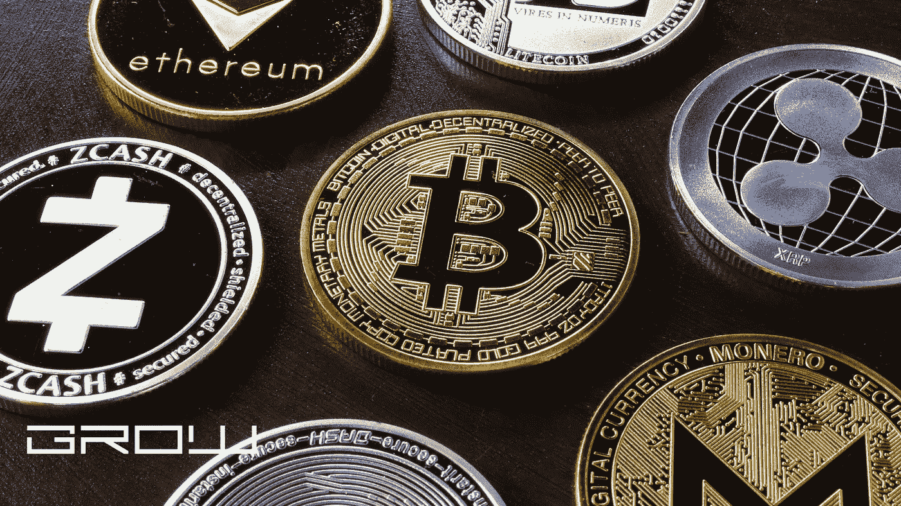

# 如何创造自己的硬币？

> 原文：<https://medium.com/coinmonks/how-to-create-your-own-coins-263d01c03776?source=collection_archive---------40----------------------->

Coins

有些人可能会说“是的，所有的硬币都可以被创造出来”。但是正如您将在本文中看到的，这是不正确的。有不同的方法来创造你的硬币，每一个都有其优缺点。因此，事不宜迟，让我们直接进入如何创建自己的加密货币的最流行方法指南！

第一种方式被称为“跨链叉”。这是指有人复制现有硬币的代码，并通过另一台区块链上的叉子推出其新版本。

这是一个简单的方法，但它不是匿名的、安全的或分散的。另外，这是信任的问题。用户通常不会注意到原始代码和副本之间的差异，因为两个版本在功能上是相同的。

第二种方式被称为“硬分叉”。这是指某人编辑现有的代码库，并通过新的区块链发布新版本。这是迄今为止最强大的方法来创造你的硬币。硬分叉意味着每个拥有比特币的人都将在新区块链上拥有比特币，这意味着你的比特币将能够独立于其母链运行。

但问题是:这也可能让你成为政府监管机构的目标。如果你的硬币与比特币过于相似，它可能会被归类为一种证券。因此，如果你计划使用硬分叉方法发布比特币的替代版本，请确保你的项目具有独特的功能和不同的品牌。

第三种方式被称为“侧链”。这是指有人克隆现有硬币的代码，并通过其自己的区块链推出新版本。侧链本质上允许你从一个区块链中取出一枚硬币，并把它放回到另一个上。这是一个复杂和高度技术性的过程，但它也是安全可靠的。坏处呢？非技术用户可能难以支持或使用侧链。

第四种方式叫做“硬币交换”。那就是有人用现有的硬币创造一个新的。这就像一个内部的交换会议——旧硬币与新硬币交换，有点像放弃你的大众汽车，作为回报收到一辆特斯拉。严格来说，这种方法并不是一种分支，因为在新的区块链上，并不是每个人都能自动获得硬币。

第五种方式叫做“令牌交换”。那就是有人用现有的硬币创造一个新的。这就像一个传统的交换——实际的硬币交换发生在双方之间，但交换的硬币随后在其区块链上推出，从技术上讲，这是一个独立于母链的链。

第六种方式叫做‘烧币’。这是指有人将他们的旧硬币从流通中移除，并在发行时发行更少硬币的新硬币。这种方法类似于代币交换，因为它允许实际的硬币交换，但正如你所想象的，它也有其独特的利弊。

第七种也是最后一种方式叫做“分叉合并”。这是指有人用现有的硬币来验证新硬币。这就像一个硬叉子的反面——不是推出一个全新的区块链，而是使用现有的区块链来创造你的新硬币。但是你不希望这样做太频繁，否则会破坏网络，降低其价值。

所以…你知道了！七种不同的方法来创建您自己的加密货币！从技术上讲，这些都是可行的选择，可以帮助你开始发行你的硬币，并从家里赚钱。如果你刚刚进入加密货币领域，并且正在寻找一种简单的入门方法，那么你应该从跨链分叉方法开始。

但是如果你比较老练，并且已经发行了一些硬币，那么也许是时候试试硬叉子法了？只要确保你的硬币与其母链足够不同，这样它就不会被政府监管机构归类为证券。如果你想要一个健壮的、扩展性好的东西，最好使用侧链方法，尽管这对于一些没有技术背景的用户来说很难做到。

当谈到硬币燃烧的方法，确保你这样做，只有当你的硬币完全发展和完善。因为这又会对网络造成很大的干扰，可能会降低你的硬币的价值。

但是，如果你有技术背景，并且想全力以赴推出你的加密货币，那么也许最终的选择最适合你——分叉合并法。在这种情况下，您可以使用现有的区块链来验证使用与其父链相同的技术的新的。这就是今天的技术带你去月球的地方！

最后一点建议，在制作硬币的时候，确保你选择了最适合你的项目的方法。创造新硬币没有硬性规定，所以做对你的项目最有利的事。

# 比特币基地

一旦你有了你的硬币或代币，你将需要能够交换它。正是在这里，比特币基地进入了画面。在这个平台上，你可以将你的硬币兑换成法定货币和其他硬币，如比特币和以太坊。你也可以把这个平台当作钱包，所以如果你不想把你的硬币存放在交易所，那么比特币基地是你的一个好选择。然而，值得注意的是，比特币基地上唯一可用的硬币是那些他们认为符合监管要求的硬币，这意味着其他任何东西都将不受支持。

# 关于比特币基地的最后一点说明

这个平台以稳定可靠著称，但是费用可能有点高。如果你只想交易少量的加密货币，那么这可能不是你的最佳选择。但是，如果你想储存你的硬币，那么他们真的很好。值得一提的是，在客户支持方面，他们保持着良好的声誉。他们自 2012 年成立以来，在客户支持方面已经建立了良好的声誉。唯一值得一提的是，比特币基地需要一些时间来处理您的请求，有时可能会有延迟。

# 位戳

名单上的下一个是 Bitstamp，它也因其可靠性和安全性而闻名。该平台已经存在多年，是最可靠的交易所之一。不过，它确实有一些高费用，这意味着它可能最好用作存储选项，而不是交换。他们提供了一个非常好的平台，因为他们的安全措施非常好。因此，如果你希望你的硬币被存放在一个安全的地方，你不介意支付他们的费用，那么这就是你应该使用的平台。

# 波洛涅克斯

名单上的下一个是波洛涅克斯。这个平台更专注于较小的加密货币，这意味着它缺乏许多你可能会寻求交易的较大的加密货币。如果你更喜欢较小的替代硬币，那么我们推荐这个平台，因为他们的安全措施很好，而且在客户支持方面有很好的声誉。但同样，我们认为这个平台最适合用来储存你的密码，而不是交易它们，因为它缺乏流动性。

# Bitfinex

我们列表中的下一个平台是 Bitfinex。这个专注于使用大量的加密货币对与不同的顶级比特币对进行交易。它易于使用，其用户界面非常好，所以如果你想要一个易于使用且流动性好的平台，那么这可能就是你想要的。但是你要支付相当高的溢价才能获得大量的对子，这是许多用户不喜欢的。许多用户也觉得 Bitfinex 对他们提供的服务来说太贵了。

# 北海巨妖

北海巨妖可能是最著名的交易所之一，它已经存在了很长时间，但是仍然有很多人不知道它。因此，我们认为他们值得在这篇文章中被提及。该平台成立于 2011 年，如今已经非常出名。他们还在旧金山开展业务，这是一个好迹象，也是他们合法的明确标志。该平台本身易于使用，并且在客户支持方面拥有良好的声誉。

总的来说，北海巨妖做得很好，我们认为大多数用户会很满意。但是它们也有一些值得注意的地方。一些用户说费用有时会很高，当你考虑他们的需求时，你需要记住他们的流动性。总的来说，这是最知名的交流平台之一，你不会很难找到其他用户与之交谈。

# Bitfinex 试验

这是我们认为在我们的列表中值得一提的另一个平台。这个平台成立于 2012 年，在 2016 年被黑客攻击之前，它曾被认为是最大的比特币交易所之一。该平台本身的声誉很好，但其他人对它的评价更高。在费用方面，费用有时会很高，你还需要关注他们的流动性，因为当使用加密货币交易时，流动性对你作为用户来说很重要。

# 比特雷克斯

对于那些正在寻找一个可以用来交易各种代币和硬币的平台的人来说，Bittrex 可能就是适合你的。这个平台非常有名，总体来说也有很好的声誉。它们自 2013 年以来就一直存在，这意味着它们从一开始就存在。他们也有可靠的安全措施，这是一个优势。但是当谈到他们的费用时，他们有时会很高，这取决于你和什么对交易，所以当你把他们当作你的交易平台时，这是你需要记住的。

# 币安

这是另一种更受欢迎的交流方式。当谈到他们的费用时，他们非常低，可以低至 1%甚至 0.2%。最重要的是，这个平台的交易量非常高，因此你可以比其他交易所更容易地参与高流动性交易。另一件让币安脱颖而出的事情是，他们是第一家获得日本监管机构批准的比特币交易所。这对他们来说是一件大事，我们认为他们能做到现在这样是令人钦佩的。

# 最后的想法

这些是一些比较受欢迎的交流方式，如果你以前没有使用过，那么它们绝对值得你花时间。我们确实想指出，这些平台非常年轻，你可能需要考虑它们在市场中的位置。许多人相信他们最终会接管，但目前他们还没有那么强大或受欢迎。这意味着你可能不得不去一些不太知名的网站。但是如果你能找到一个这样的网站，很可能用不了多久，它就会开始成长，并获得足够的人气，让用户从其他平台转向其他平台。

当然，加密交换不仅仅是这两个，但我们认为这两个是值得一提的。还有很多其他网站，但请记住，这是我们唯一推荐的网站，它们的安全记录应该被认真对待。

> *加入 Coinmonks* [*电报频道*](https://t.me/coincodecap) *和* [*Youtube 频道*](https://www.youtube.com/c/coinmonks/videos) *了解加密交易和投资*

# 另外，阅读

*   [Bookmap 评论](https://coincodecap.com/bookmap-review-2021-best-trading-software) | [美国 5 大最佳加密交易所](https://coincodecap.com/crypto-exchange-usa)
*   最佳加密[硬件钱包](/coinmonks/hardware-wallets-dfa1211730c6) | [Bitbns 评论](/coinmonks/bitbns-review-38256a07e161)
*   [新加坡十大最佳加密交易所](https://coincodecap.com/crypto-exchange-in-singapore) | [购买 AXS](https://coincodecap.com/buy-axs-token)
*   [红狗赌场评论](https://coincodecap.com/red-dog-casino-review) | [Swyftx 评论](https://coincodecap.com/swyftx-review) | [CoinGate 评论](https://coincodecap.com/coingate-review)
*   [投资印度的最佳密码](https://coincodecap.com/best-crypto-to-invest-in-india-in-2021)|[WazirX P2P](https://coincodecap.com/wazirx-p2p)|[Hi Dollar Review](https://coincodecap.com/hi-dollar-review)
*   [加拿大最佳加密交易机器人](https://coincodecap.com/5-best-crypto-trading-bots-in-canada) | [库币评论](https://coincodecap.com/kucoin-review)
*   [用于 Huobi 的加密交易信号](https://coincodecap.com/huobi-crypto-trading-signals) | [HitBTC 审查](/coinmonks/hitbtc-review-c5143c5d53c2)