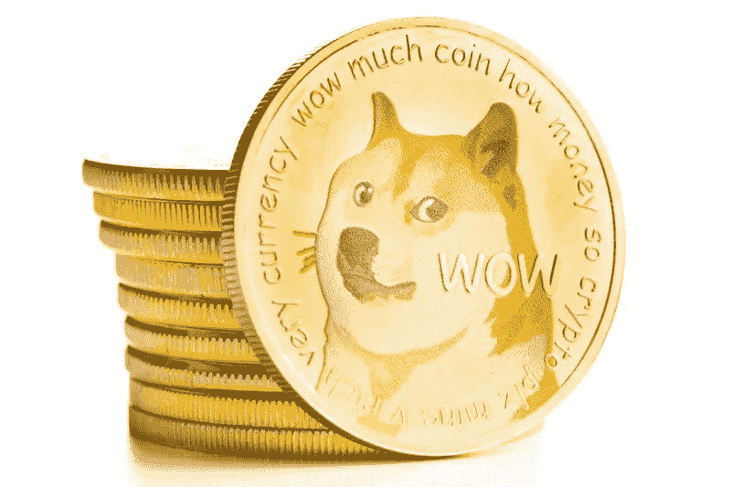
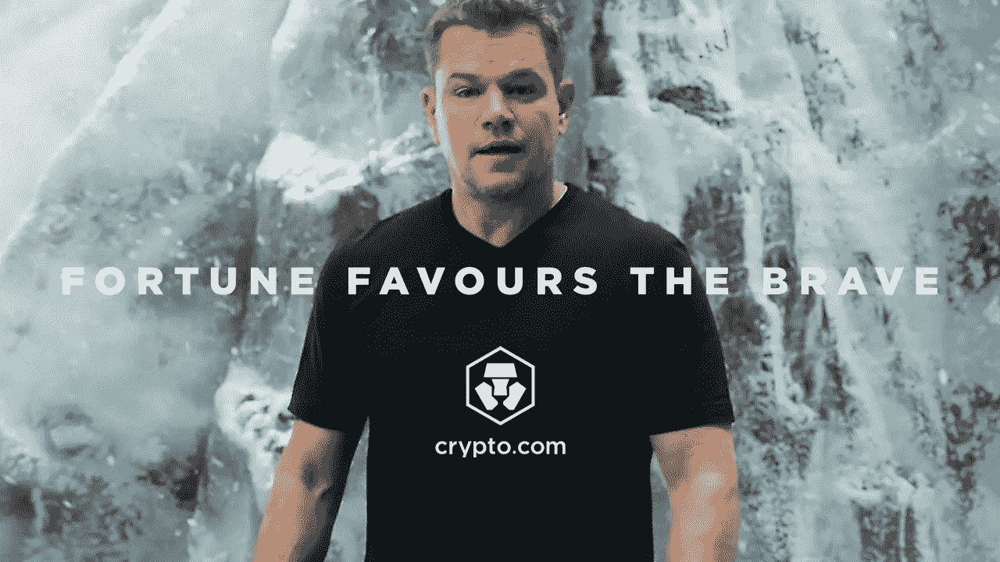
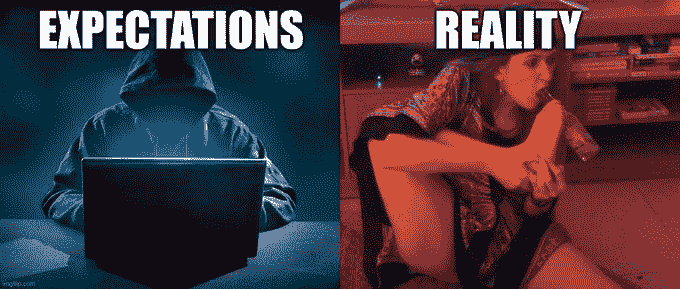
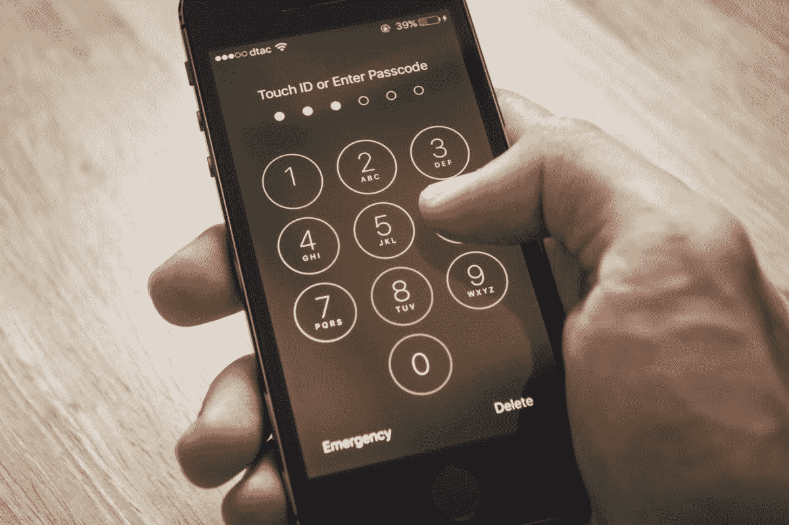
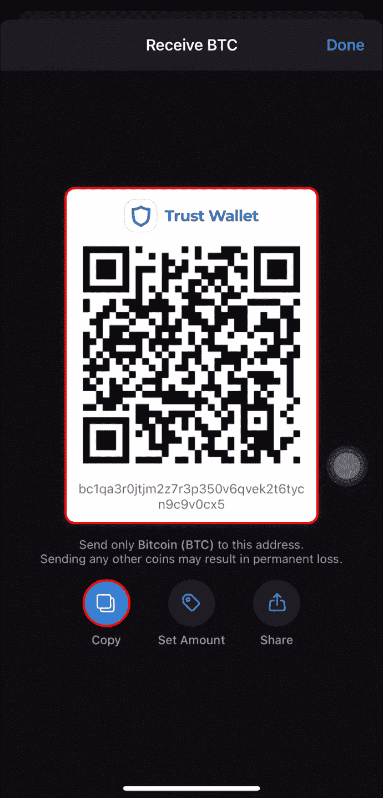

# 如何加密？

> 原文：<https://medium.com/coinmonks/how-to-crypto-7887799d0089?source=collection_archive---------12----------------------->

既然您已经具备了加密的基本风险回报，您可能会想知道:

“爵士，我怎么进去？怎么全进去了？”

在这篇文章中，我将主要谈论如何通过交易所(对于那些熟悉股票的人来说，类似于经纪公司)以及存放硬币的地方进入(将菲亚特(又名美元，新加坡元)转换为密码)以及如何离开。

# **加密交换**

 [## 按交易量排名的顶级加密货币交易所

### 查看我们的加密货币交易所列表✔️按交易量排名✔️✔️币安硬币库专业版✔️霍比✔️北海巨妖✔️比森布…

coinmarketcap.com](https://coinmarketcap.com/rankings/exchanges/) 

在加密领域，根据你的喜好和偏好，有太多的交易所可供选择。Coinmarketcap 提供了一个交换列表和交换分数。就我个人而言，我会用币安或 FTX 来交换菲亚特和 crypto。使用它们的原因是因为费用以及交易所上市的硬币数量，特别是币安。虽然不是最多的硬币，它列出了像柴犬，Dogecoin 或人们所说的替代硬币(altcoins)的硬币。

对我来说，选择交易所时要考虑的一些因素是安全性、费用和加密选择。

**安全**

我将把我之前关于风险回报的文章[链接到这里](/coinmonks/all-in-crypto-1f8c28941de8)，以 Bitfinex 黑客为例。选择交易所时，一定要先查看交易所证券的评论。一些例子可以包括检查他们是否有被黑的历史。如果他们被黑了，他们在黑了之后采取什么程序来进一步增强他们的安全性？除此之外，还有交易所的 24 小时交易量。这是因为大量的卷容易被黑客攻击。我的意思是，谁不想偷走我们 10 亿美元的销量呢？

**费用**

在交易所，当你在密码上交易、提取和利用时，要收取费用。你可能被收取的一些费用是制造商/接受者费用。做市商(通常是限价单)是当你成为做市商时收取的费用。接受者(通常是市场订单)是当你从市场上拿走流动性时收取的费用。更多关于北海巨妖的内容可以阅读

 [## 什么是制造者和接受者费用？

### 如果交易订单没有立即与订单上已有的订单匹配，则交易订单将收取做市商费用…

support.kraken.com](https://support.kraken.com/hc/en-us/articles/360000526126-What-are-Maker-and-Taker-fees-) 

通常在交易所存放菲亚特/crypto 是免费的。当你选择从交易所撤回密码时，通常会收取费用。在[币安](https://www.binance.com/en/fee/cryptoFee)，根据你取款的网络收取可变费用。我稍后将讨论如何在 crypto 中传输。

您看到的金额是以 BTC 为单位的，因此需要转换成美元来确定您以菲亚特支付的费用金额。有一些交易所提供免费提款，如 FTX 的网络，而不是 ERC 20 或 T2 双子座的网络，每月提供 10 次免费提款。如果你不是一个活跃的交易者，双子座将能够满足你的需求，免费提款。

**密码选择**

你可能会听到下一枚狗狗硬币即将推出，想赶着去买，但意识到你的交易所没有列出该硬币供购买。当你的交易所不提供多种多样的硬币可供购买时，这可能是一个问题。

你可以做的是，要么找到一个提供多种选择的交易所，要么创建多个交易所，让你可以灵活地转移资金。

要确定要使用的交易所，您可以在 Coinmarketcap 上筛选#coins。一些热门的交易所可以是 KuCoin，Gate.io。

当然，还有许多其他选项可以考虑，在这里可以找到。

Crypto.com 等一些交易所提供加密借记卡等服务，用你的硬币在线支付购物。

它是否被证明是一个噱头还不得而知。有人发现这是一个很好的方式来获取你的利润加密，其他人发现这是一个很好的方式来赚取现金回报加密。

现在，您已经选择了一个交易所来引入您的密码，例如 Crypto.com，有多种选择可以将菲亚特 AKA USD 引入该交易所。一些方式包括信用卡，电汇。对于新加坡用户，Crypto.com 允许你将新币通过 [StraitsX](https://help.crypto.com/en/articles/3565647-fiat-wallet-straitsx-singapore) 转入菲亚特钱包。其他交易所，如币安和 Kucoin，允许您通过 Peer 2 Peer transfer 转让菲亚特。考虑在坡道上转账的方式类型时要考虑的一些因素:**对美元的汇率是多少**以及**转账到交易所的成本**。

**产量**

除了在密码交易所买卖，你会很高兴地知道，你可以通过出借密码或“下注”从交易所的密码中赚取利息。例如，你可以在 FTX 以可变利率借出你的密码，一年后你的密码可以获得 10%的收益。这比银行为你的存款支付的利息要高得多！

除此之外，像 Crypto.com 这样的地方允许你在他们的平台上“下注”,从你的密码中“赚”到“T1”。你可以从 BTC 或瑞士联邦理工学院获得高达 8.5%的年利率，考虑到你可以从瑞士联邦理工学院的资本增值和 8.5%的收益率中获益，这是一笔不错的交易。就 Crypto.com 而言，你需要在一段时间内将资金锁定在交易所。然而，也有其他地方，如 [FTX 挣](https://help.blockfolio.com/hc/en-us/articles/4407082596891-FTX-Earn)(以前称为 Blockfolio)，他们为你的密码提供 8%的利息，并且随时可以灵活提取。

# **储存**

所以，现在你已经通过加密交易购买了你的第一枚硬币，为了安全起见，把你的硬币转移到钱包里是明智的。我是说，你不会希望有人偷你的钱吧？

有两种钱包，冷钱包和热钱包。

**热门钱包**

基于网络的钱包、移动钱包和桌面钱包都是典型的热门钱包。其中，网络钱包是最不安全的，尽管所有的加密热钱包都容易受到在线攻击。一些例子包括 Metamask、Trustwallet、比特币基地钱包、币安链钱包。可以在这里找到它们的列表:

 [## 十大最佳新手加密热门钱包| CoinMarketCap

### 你刚刚决定投资加密货币吗？沉住气，因为你必须采取必要的安全措施…

coinmarketcap.com](https://coinmarketcap.com/alexandria/article/10-best-crypto-hot-wallets-for-beginners) 

使用热门钱包的原因是因为使用方便。一般来说，热门钱包在网上运营，很容易批准交易。例如，许多人使用移动热钱包用加密货币进行交易或购买。用冰冷的钱包这样做是不方便的。你需要找到一个设备(通常是一台电脑)来插入你的冷钱包，然后将必要数量的加密货币转移到热钱包，然后进行购买。虽然易用性是其独特的卖点，但与冷钱包提供的安全性相比，热钱包显得苍白无力。

**冷钱包**

冷钱包或硬件钱包通常通过物理占有冷钱包并将其插入电脑，以及一个 PIN 来解锁设备，类似于 Apple ID。

一些例子包括 Ledger、Trezor、Safepal。可以在这里找到它们的列表:

 [## 2021 年最佳冷钱包

### 与传统钱包不同，传统钱包大多携带现金、银行卡和其他物品等实物，加密钱包…

coinmarketcap.com](https://coinmarketcap.com/alexandria/article/best-crypto-cold-wallets) 

硬件钱包被设计成对黑客攻击免疫。即使当硬件钱包插入您的计算机或通过蓝牙连接时，根据存储方法，存储在驱动器上的资金也不会被盗。虽然技术上连接到互联网，但交易的签名是在“设备内”完成的，并且仅在随后通过您的计算机的互联网连接广播到网络。这种“签名”允许您将所有权分配给加密货币交易的接收方。但是，因为您的私钥从不离开设备，所以即使您计算机上的恶意软件试图通过恶意“签名”在您的硬件钱包中发起的交易来窃取您的资金，这也不是正确的签名，因此交易不会成功。

那么什么时候用什么呢？就我个人而言，我的大部分资金都放在我的冷钱包里，因为它提供了安全性，我的一些资金在密码交易所买入或卖出，一些放在热钱包里，或者一些人所谓的 [burner](https://www.reddit.com/r/solana/comments/s4n5nt/what_is_a_burner_wallet/) 钱包。就像人们通常所说的，“不是你的钥匙，不是你的硬币，不是你的 T2”。

# **撤军**

要将您的硬币从交易所转出，您需要检查交易所是否支持硬币的原生链或您希望转移到的任何链。以 USDC 为例，Binance.com 允许 USDC 退出 AVAX、BSC、ETH、MATIC、SOL、TRX 网络。因此，您需要确保您要转移到的网络是受支持的。

接下来，您将需要您要转移到的钱包的地址。要找到地址，你可能需要点击钱包中的“接收”或“存款”下面，就会出现一串不可读的字母。请务必将地址复制并粘贴到您的兑换取款页面上。不要把它打出来，因为任何错误的字母都可能是错误的地址。在区块链上，发送/交易的任何内容都不能退款/更正。唯一的退款柜台是自助退款。

一旦你完成了，你所要做的就是等待…钱包接收你的硬币。

总而言之，无论是在加密交换还是存储解决方案中，加密都有广泛的选择，但有一点我想提醒你的是，一定要对你使用的产品进行尽职调查。在加密社区中有许多骗子，如果有些事情好得不像真的，那么它很可能就是真的。所以一定要做研究，尤其是对你正在使用的产品的安全元素，这样它就可以安全使用。如果你的存款因为安全漏洞而在一天之内化为乌有，那可不是什么好事。

也就是说，这篇文章似乎只涵盖了加密的集中方面。如果你担心的是集中实体的使用，下周我将讨论分散的交易所。

与此同时，请记得关注我，了解我最近的帖子，并留下评论，以便我知道如何才能更好地向您提供信息！

免责声明:内容仅供参考，您不应将任何此类信息或其他材料理解为法律、税务、投资、财务或其他建议。

同时，如果你想支持我，请使用我下面的推荐链接:

https://ftx.com/referrals#a=34586046

https://accounts.binance.com/en/register?ref=86634135[币安](https://accounts.binance.com/en/register?ref=86634135)

crypto . com:【https://crypto.com/exch/jz2pxbaezw 

组合证券:[https://link.blockfolio.com/9dzp/e81537cc](https://link.blockfolio.com/9dzp/e81537cc)

> 加入 Coinmonks [电报频道](https://t.me/coincodecap)和 [Youtube 频道](https://www.youtube.com/c/coinmonks/videos)了解加密交易和投资

# 另外，阅读

*   [有哪些交易信号？](https://coincodecap.com/trading-signal) | [比特斯坦普 vs 比特币基地](https://coincodecap.com/bitstamp-coinbase)
*   [10 本关于加密的最佳书籍](https://coincodecap.com/best-crypto-books) | [英国 5 个最佳加密机器人](https://coincodecap.com/uk-trading-bots)
*   [Koinly 回顾](https://coincodecap.com/koinly-review) | [Binaryx 回顾](https://coincodecap.com/binaryx-review) | [Hodlnaut vs CakeDefi](https://coincodecap.com/hodlnaut-vs-cakedefi-vs-celsius)
*   [40 个最佳电报频道](https://coincodecap.com/best-telegram-channels) | [1xBit 回顾](https://coincodecap.com/1xbit-review) | [Keevo 钱包回顾](https://coincodecap.com/keevo-wallet-review)
*   [如何在印度购买以太坊？](https://coincodecap.com/buy-ethereum-in-india) | [如何在币安购买比特币](https://coincodecap.com/buy-bitcoin-binance)