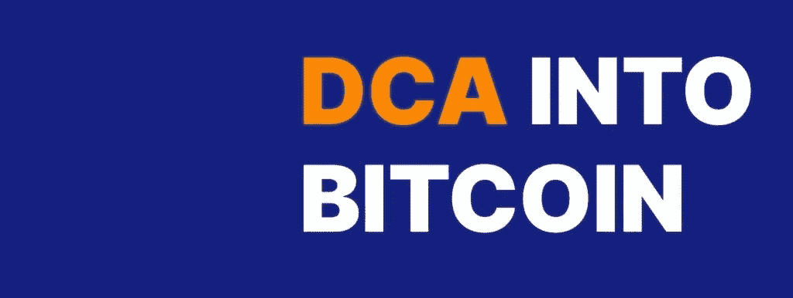

# 如何 DCA 成比特币

> 原文：<https://medium.com/coinmonks/how-to-dca-into-bitcoin-141966a5af61?source=collection_archive---------19----------------------->

比特币是一种稀缺、持久、便携、可分割、可替代和不可改变的数字资产，没有人可以从你那里拿走，它不受任何中央单元的控制，同时提供完全的去中心化。供应量每 4 年减半(减半周期)，比特币总量上限约为 2100 万。没有其他所谓的“加密货币”能够提供比特币的功能。随着时间的推移，它是通过[美元成本平均化(DCA-ing)](https://en.wikipedia.org/wiki/Dollar_cost_averaging) 获得价值的完美单位。现金意味着你每月投入相同数量的资金。这样我们可以降低风险，以平均价格购买。

Source: [relai.app](https://relai.app/)

为了将 **DCA 转化为比特币，我使用了一款名为**[**Relai**](https://relai.app/)**的瑞士应用，这款应用目前仅适用于欧洲(美国的替代产品是[天鹅比特币](https://www.swanbitcoin.com/))。Relai 让购买比特币变得简单易行。硬币保存在你选择的非保管钱包里，这意味着只有你有权限(不是你的钥匙，也不是你的硬币)。你只需要一个银行账户。没有 KYC，你可以从 10€开始购买比特币。如果你愿意的话，接力赛的费用可以从 2.5%降到 1%**

**1)创建大约 100 欧元的重复购买
2)和
3)使用推荐代码(例如 SEPH)。**

**如果你认为我提供的信息是有帮助的，我会很高兴你使用我的推荐 SEPH。*免责声明:我获得了 0.5%的交易费用，否则这些费用将归 Relai 所有。***

**下图比较了可以购买比特币的不同交易所。**

****

**Comparison of different Bitcoin buying apps. Source: [relai.app](https://relai.app/)**

**我也使用过其他服务，比如币安。那里的购买费用非常低。但交易所的硬币经常面临交易对手风险，如果你想把硬币转移到自己的钱包里，你将不得不支付高额交易费。**

**记住，在市场中的时间胜过选择市场时机。这是明智的建议，我们把我们的战略联系起来。我们唯一需要的能力是心态，提醒自己短期波动只是噪音，而比特币会随着时间而上涨。感激每一次市场暴跌或衰退。你将能以便宜的价格购买。通过投资的自动化，你可以把时间花在其他地方。多了解让你兴奋的事情，保持健康的状态。我推荐[多了解一下比特币](https://en.bitcoin.it/wiki/Help:FAQ)。**

**干杯，亚历克斯**

**~在 [twitter 上关注我](https://twitter.com/sephthreek)**

> **加入 Coinmonks [电报集团](https://t.me/joinchat/Trz8jaxd6xEsBI4p)，了解加密交易和投资**