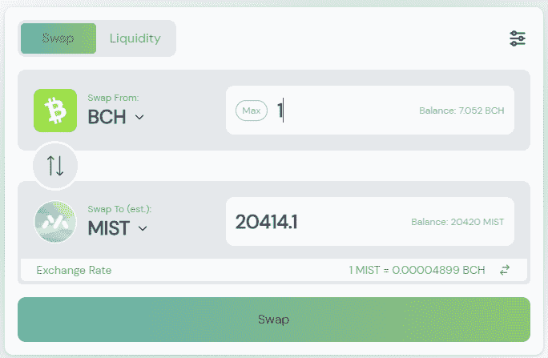
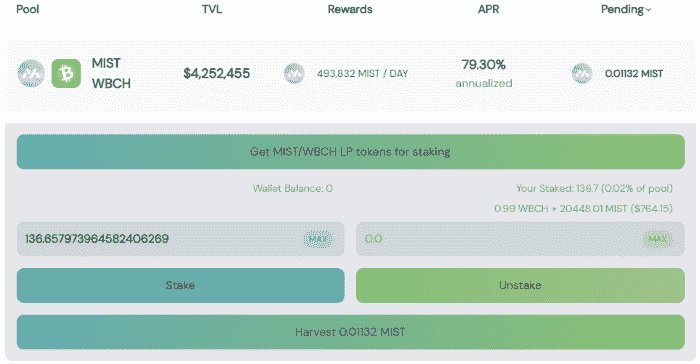

# 如何使用 SmartBCH DEX MistSwap 定义

> 原文：<https://medium.com/coinmonks/how-to-defi-with-smartbch-dex-mistswap-9cc23e9691b9?source=collection_archive---------4----------------------->

SmartBCH 是目前最热门的智能合约网络之一。比特币现金的 EVM 兼容侧链，以经济高效的方式提供以太坊智能合约的功能。

我们预计 smartBCH 在 2022 年将在开发、销量、TVL 和用户群方面大幅增长。

虽然一些风投公司在 Polygon、Avalance、Solana、Terra 等项目上进行了大量投资，但我们目睹了其中一些网络在高容量方面苦苦挣扎，甚至经常离线数小时。

对于智能合同领域的初学者，我建议阅读我以前的一篇文章，以了解 smartBCH 的目的，并了解如何成为这一革命性新网络的一部分:

面向初学者的 SmartBCH:从这里开始！

在完成创建 smartBCH 钱包(使用 Metamask)和通过 BCH 为此钱包提供资金的第一个强制步骤后，我们将通过本指南探索下一步，即如何定义 smartBCH。

我们首先解释高产农业是如何运作的。

# 什么是产量农业？

你可能听说过高产农业是被动收入。我们投资，我们收获回报。

dex(分散式交易所)使用 AMM(自动做市商)程序来调整交易对的流动性。

当需要更多的流动性来匹配货币对时，APR(年化利率)增加。随着流动性的增加，通常 4 月下降。费用中扣除了农业生产的报酬。基本上，通过 LP(流动性提供)，我们在一个自动化的过程中成为做市商，并与 DEX 分享交易费用。

作为一个过程，对用户来说是一种投资。我们向指数提供两种代币来满足流动性需求和期望回报。这是交易所给我们的 APR(年化利率),用于在它提供的各种交易对中提供流动性。

APR 基本上是我们期望从现在起一年后收到的年利率。当我们提供流动性时，我们的代币不会被锁定在合同中(除非我们在有此选项时选择此选项)。我们可以缩短期限，只提供一个月、一周甚至一小时的流动性。

交易所更喜欢交易量大的交易对，因为这是产生交易费最多的地方。然而，随着这些组合中流动性提供者的增加，收益率(APR)通常会从开始时的高度显著下降。这取决于 DEX 的一系列计算，以保持向流动性提供者提供最大 APR，并在此过程中获利。

DEX 的成功依赖于交易量和 TVL(锁定的总交易量)。

[DeFiLlama](https://defillama.com/chain/smartBCH) 跟踪 smartBCH 指数并提供 TVL 的实时数据:

[DeFiLlama](https://defillama.com/chain/smartBCH)

已经有 7 名 dex 活跃在 smartBCH 上，并被 DeFiLlama 跟踪。

*   
*   **
*   **[***TangoSwap***](https://tangoswap.cash/swap)**
*   **[***热带。金融***](https://tropical.finance/)**
*   **[***1 BCH***](https://1bch.com/)**
*   ****
*   *****smart dex*****

# ***五步错换耕作法***

***就 TVL 而言，MistSwap 目前是第二智能指数。BenSwap 以微弱优势排名第一，第三名是 TangoCash。***

*   *****第一步:在错误交换上选择一个场*****

******

***dex 提供具有不同 apr 的多个农场。每个农场都有不同的风险，投资者应该事先计算好。加密货币是不稳定的，一些代币的模型是基于通常不容易找到的基本面。***

***在我的例子中，我使用了本地令牌 MistSwap (MIST)和比特币现金(BCH)。我预计这两项资产今年都不会贬值，反而可能会升值。***

******

***在本例中，我们选择“薄雾/BCH 农场”。***

***WBCH 代表包装的比特币现金，尽管没有必要采取任何行动，因为 DEX 使用我们来自 Metamask 的 BCH，并在我们的钱包外面进行包装。我们不需要把 BCH 换成 WBCH 来持有这个农场的股份。只有我们这边的 BCH。***

***有多个农场可供选择，每个农场都有不同的风险和不同的回报。为被动收入选择农场需要了解价格和年利率变化的风险。***

*   *****第二步:将 1BCH 换成薄雾*****

******

***现在，我们有 20414 个薄雾，大约相当于 1BCH。***

***然而，我们不能只是增加流动性的迷雾。提供流动性的含义是提供两个相同大小的两对。***

*   *****第三步:添加流动性*****

***为了增加流动性，我们还将提供 20414 喷雾和 1BCH。这项投资总额为 20 亿比索。如果有人想只投资 1BCH，那么分成应该是 10207 MIST 和 0.5BCH。***

************

***交易确认后，我们发现我们的交易对 BCH/米斯特增加了流动性。***

******

***我们收到了 LPs 代币，我们可以用它来进行农业生产，这也是我们进行上述步骤的主要原因。***

*   *****第四步:开始耕种(用 LP 代币做赌注)*****

******

***当我们第一次执行任何 DEX 操作(互换、入股等)时，我们会与智能合约进行交互并批准其协议。这个额外的操作只执行一次，并且需要包括费用的交易。***

***SmartBCH 中的费用微不足道，根据合同要求，可能在 0.03 美元到 0.10 美元之间变化，也可能稍高一些。***

***与以太坊不同的是，简单的 Uniswap 交互的费用通常超过 100 美元，smartBCH 的用户不会计算费用，因为这在任何时候都只是几分钱。***

***我们的交易在几秒钟内得到处理，我们的农场现已开始运营，并为我们提供了 MIST 代币奖励:***

******

***仅此而已。我们现在在 DeFi smartBCH 生产农业。***

*****请注意，在我们开始用我们的有限合伙人进行投资后，在 tab 池中，我们的流动性将不再可见。当我们从服务器场中取消 LP 令牌时，它将再次可见。这就是这个过程在所有 dex 中的工作方式，因为我们现在使用我们的流动性来制造迷雾令牌。****

**我们尽了自己的一份力量来设置米斯特/BCH 农场，现在我们有了更多的选择。**

**I)拆垛:这是上述过程的逆过程。任何时候我们决定，我们继续解散我们的有限合伙人，收获我们的薄雾，并继续从池中移除流动性。**

**ii)收获:我们可以在任何我们想要的时候收获我们的薄雾，以 BCH、flexUSD 或其他代币出售，或者**我们可以将薄雾**股份化，并从中获得额外收益。**

*   ****第五步:将收获的代币兑换成 BCH/flexUSD****

**MistSwap 还为我们提供了下注本地令牌并获得额外利息作为奖励的选项。**

****

**[*MIST — xMIST*](https://app.mistswap.fi/stake)**

**薄雾的赌注奖励目前是 1.75%，这也是一个不稳定但未来可能上升或下降的值。**

**可以合理地假设，目前的低年利率来源于投资者的预期，即薄雾价格将随着时间的推移而升值。投资者希望 smartBCH DeFi 未来能吸引更多资金。**

**MistSwap analytics 给出的年平均赌注回报率为 3.74%。**

## **我们应该期待什么**

***i)非永久性损失***

**这是我们在提供流动性时，我们的主要头寸所遭受的损失。这是机会的成本。也就是说，如果我们只持有这两种代币，而不把它们加入 DEX 流动性指数，结果会是怎样。**

**随着价格上涨或下跌，我们的头寸将重新平衡。**

**我们期望农业对的 APR 和在赌注之后的任何种类的红利提供总的利润。**

**随着价格下降，持有代币的损失会大得多，但当我们加上农业的回报时，损失就会减少。**

**当价格上涨时，非永久性损失意味着我们赚得比钱包里的两个代币少。网上有很多解释非永久性损失概念的计算器，我建议在第一次看完这个涵盖基础知识的视频后，使用[这个](https://whiteboardcrypto.com/impermanent-loss-calculator/)。**

***ii)本例中的 79.30%年利率不是固定利率***

**这不是一个稳定的四月，但它是波动的，可能会上升或下降。如上所述，当吸引高流动性时，dex 就成功了。当流动性下降时，APR 以更高的利率重新平衡，以吸引更多的流动性。然而，这些机制也包括交易量，这是 DEX 和 LPs 的利润来源。**

***iii)本地代币价格根据交易量升值(或贬值)。***

**但是，也许我们只关注短期，并没有意识到原生 DEX 标记的巨大潜力。**

**本地代币供应正在膨胀，每天都有新的代币被铸造出来以支付 APR 奖励。**

**然而，与其他网络相比，smartBCH 的当前 TVL 和流量仍然相对较低。赔率表明，smartBCH 将成为投资者圈子的趋势，基金将开始大规模进入。**

**我不认为 MIST 的价格在未来会大幅下降，看 MIST 的图表给了这种资产更多的信心。**

**例如，随着 DEX 上的容量增加，Uniswap 令牌增加了 1000%以上。2021 年，几乎所有 DEX 原生令牌都出现了同样的情况。**

# **最后**

****

**我预计到 2022 年，错换交易量将继续增长，对 smartBCH 指数的其余大部分也有同样的想法。BenSwap 和 TangoSwap 也做得非常出色。**

**本文中的例子旨在解释如何在 smartBCH 和**中获得收益，不应被视为投资建议。****

**当我们撤销有限合伙人时，随着价格的变化，我们可能比那些下注的人有更少的 BCH 和更多的雾(或者相反，更少的雾和更多的 BCH)，但是我们也期望我们从 APR 得到的回报比仅仅持有代币给我们带来更多的利润。**

**以上只是一个例子，并不是我的全部立场或策略。然而，关于薄雾/BCH 对，我选择了一对，我发现提供合理的 APR，我会保持这项投资开放，只要它保持交付。**

**这就是我们如何定义 smartBCH。一些长期投资者期望获得被动收入，而另一些投资者则寻求高年利率和新指数，这可能会带来更高的风险。**

**几乎相同的是其余 smartBCH 指数的 DeFi 方法。MistSwap 还在其 DEX 上开发贷款功能，这将进一步增强我们可用的 DeFi 选项，并可能促进对 smartBCH 的投资。**

****

**Writing at the following websites: ● [ReadCash](https://read.cash/@Pantera) ● [NoiseCash](https://noise.cash/u/Pantera99) ● [Medium](/@panterabch) ● [Hive](https://hive.blog/@pantera1) ● [Steemit](https://steemit.com/@pantera1) ●[Vocal](https://vocal.media/authors/pantera) ● [Minds](https://www.minds.com/pantera99/) ● [Twitter](https://twitter.com/Panterabch) ● [LinkedIn](https://www.linkedin.com/in/panterabch/) ● [Reddit](https://www.reddit.com/user/coinflip1211) ● [email](https://read.cash/@Pantera/localcryptos-p2p-exchange-is-now-offering-bitcoin-cash-trading-06637230#bad-link)**

****相关素材:****

*   **[***smart BCH DEX misswap 分析服务***](https://read.cash/@Pantera/smartbch-dex-mistswap-analytics-service-ef0efde9)**
*   **[***SmartBCH 适合初学者:从这里开始！***](https://read.cash/@Pantera/smartbch-for-beginners-start-here-9f7ec63e)**
*   **[***【smart BCH】开发者的一个顶级选项***](https://read.cash/@Pantera/smartbch-a-top-option-for-developers-e9a24483)**

****不是投资建议。****

> ****免责声明**:本内容发布的所有材料均用于娱乐和教育目的，并符合**合理使用准则**。无意侵犯版权。如果您是或代表本文所用材料的版权所有者，并且对所述材料的使用有疑问，请发送[电子邮件](https://read.cash/@Pantera/cryptouknowns-battlegrounds-the-crypto-battle-royal-part-i-0ca762da#bad-link)。**

**如果你喜欢这篇文章，别忘了订阅并点赞！**

***原发布于*[*https://read . cash*](https://read.cash/@Pantera/how-to-defi-with-smartbch-dex-mistswap-9b77efeb)*。***

****

> **加入 Coinmonks [电报频道](https://t.me/coincodecap)和 [Youtube 频道](https://www.youtube.com/c/coinmonks/videos)了解加密交易和投资**

## **也阅读**

** [## 杠杆代币[多头代币]终极指南

### 杠杆化令牌是具有杠杆化风险敞口的 ERC20 令牌，不考虑保证金、要求、管理…

medium.com](/coinmonks/leveraged-token-3f5257808b22)  [## 最佳加密交易所| 2021 年十大加密货币交易所

### 编辑描述

blog.coincodecap.com](https://blog.coincodecap.com/crypto-exchange)  [## 2022 年最佳加密交换平台| CoinCodeCap

### 编辑描述

blog.coincodecap.com](https://blog.coincodecap.com/best-swap-platforms)  [## 10 大最佳在线赌场|赢得并赢取免费 BTC 2022 | CoinCodeCap

### 编辑描述

blog.coincodecap.com](https://blog.coincodecap.com/best-online-casinos)  [## 2021 年最佳加密借贷平台| 6 大比特币借贷平台

### 获得比特币和其他加密货币的最佳贷款利率

medium.com](/coinmonks/top-5-crypto-lending-platforms-in-2020-that-you-need-to-know-a1b675cec3fa)  [## 2021 年 6 大最佳硬件钱包|顶级加密硬件钱包[更新]

### 最好的加密货币硬件钱包是绝对必要的。我们将在 NGRAVE、Ledger Nano X 和…

medium.com](/coinmonks/the-best-cryptocurrency-hardware-wallets-of-2020-e28b1c124069)  [## 2021 年最佳免费加密交易机器人

### 2021 年币安、比特币基地、库币和其他密码交易所的最佳密码交易机器人。四进制，位间隙…

medium.com](/coinmonks/crypto-trading-bot-c2ffce8acb2a)  [## 最佳 4 个加密交易信号电报通道

### 这是乏味的找到正确的加密交易信号提供商。因此，在本文中，我们将讨论最好的…

medium.com](/coinmonks/best-crypto-signals-telegram-5785cdbc4b2b)**