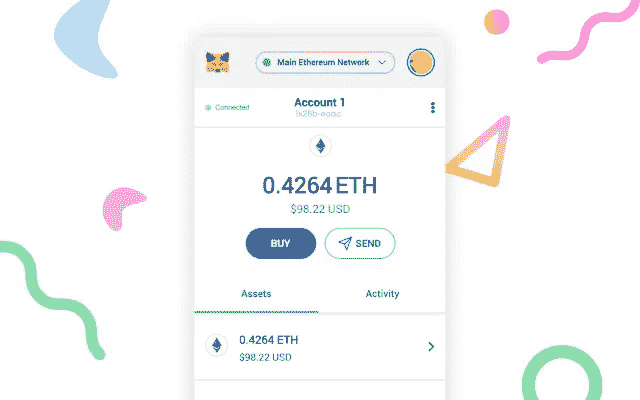

# 如何从元掩码帐户中删除钱包

> 原文：<https://medium.com/coinmonks/how-to-delete-a-wallet-from-metamask-account-61af14bce22e?source=collection_archive---------6----------------------->

不同的加密钱包积累在你的元掩码帐户，如果你想删除一些？你必须知道**不可能删除所有用元掩码**创建的账户。

事实上，非保管应用程序只允许**删除进口钱包**，我们将看到如何做到这一点。但是不要担心，在这个指南的最后还有一个更重的选择。

# 从元掩码帐户中删除钱包

标题称目前**无法删除用 MetaMask** 创建的钱包。该扩展尚未部署完成此删除的功能。然而，可以在 MetaMask 中**删除导入的钱包。**

以下是简单的步骤:

1.使用您的凭据登录元掩码帐户

2.点击位于右上角的彩色圆圈

3.选择包含上述导入内容的钱包

由于旁边有一个灰色小圆点**【Imported】**，因此可以看到已导入 MetaMask 帐户的钱包。

一旦账户被选中，只需点击 3 个小圆点即可进入设置。

有几个选项可供您选择，包括选项**删除账户**。你所要做的就是点击这个按钮。

请注意，您将在元掩码中永久删除一个加密钱包。这意味着，如果您不保存它的私钥，它上面的资金将永久丢失。

如果您想**恢复您的元掩码钱包**，请考虑在删除之前**导出您的私钥**。一旦你清楚了一切，点击删除按钮。

您的钱包现在已经从您的元掩码帐户中删除**。如果您已经备份了您的私钥，您可以将它还原到另一个媒体。**

感谢阅读。不要忘记查看其他文章。

***阅读另:*** [什么是加密哈希，加密挖掘器如何找到目标哈希？](/coinmonks/what-is-a-crypto-hash-and-how-do-crypto-miners-find-the-target-hash-3c28d2ed2f00) || [如何卸载以太坊钱包](https://cryptospix.com/how-to-uninstall-ethereum-wallet/) | *|* [*加密量子飞跃回顾*](/coinmonks/crypto-quantum-leap-review-april-2022-is-it-scam-or-legit-and-worth-buying-966597cae7b2)*|*|[*用加密货币赚钱的 6 种方法*](/coinmonks/6-ways-to-make-money-with-cryptocurrency-2022-a947c6f43f6e)

> 加入 Coinmonks [电报频道](https://t.me/coincodecap)和 [Youtube 频道](https://www.youtube.com/c/coinmonks/videos)了解加密交易和投资

# 另外，阅读

*   [WazirX vs coin dcx vs bit bns](/coinmonks/wazirx-vs-coindcx-vs-bitbns-149f4f19a2f1)|[block fi vs coin loan vs Nexo](/coinmonks/blockfi-vs-coinloan-vs-nexo-cb624635230d)
*   [本地比特币评论](/coinmonks/localbitcoins-review-6cc001c6ed56) | [加密货币储蓄账户](https://coincodecap.com/cryptocurrency-savings-accounts)
*   [什么是融资融券交易](https://coincodecap.com/margin-trading) | [成本平均法](https://coincodecap.com/dca)
*   [支持卡审核](https://coincodecap.com/uphold-card-review) | [信任钱包 vs 元掩码](https://coincodecap.com/trust-wallet-vs-metamask)
*   [Exness 点评](https://coincodecap.com/exness-review)|[moon xbt Vs bit get Vs Bingbon](https://coincodecap.com/bingbon-vs-bitget-vs-moonxbt)
*   [如何开始通过加密贷款赚取被动收入](https://coincodecap.com/passive-income-crypto-lending)
*   [BigONE 交易所评论](/coinmonks/bigone-exchange-review-64705d85a1d4) | [电网交易 Bot](https://coincodecap.com/grid-trading)
*   [删除元掩码帐户](https://coincodecap.com/delete-a-metamask-account) | [删除比特币基地帐户](https://coincodecap.com/delete-a-coinbase-account)