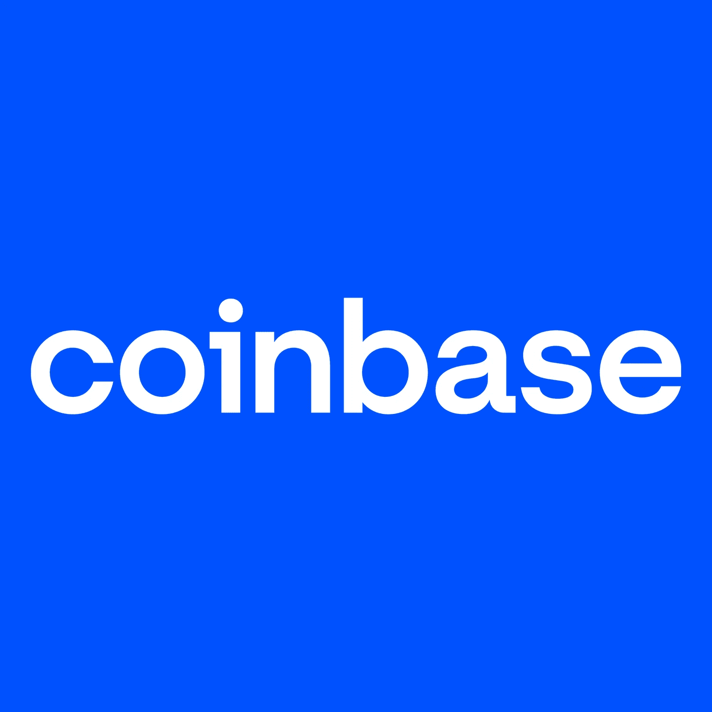

# 如何删除比特币基地账户(2023)

> 原文：<https://medium.com/coinmonks/how-to-delete-coinbase-account-2022-c0ae9a510269?source=collection_archive---------41----------------------->

**如何删除比特币基地账户:**比特币基地是一种数字钱包，允许您购买、出售和存储以下加密货币:比特币(BTC)、比特币现金(BCH)、以太坊(ETH)、莱特币(LTC)。

它是世界上最受欢迎的数字货币交易平台。它的主要优势是平台的易用性。

事实上，**创建一个账户并在几天内通过验证是可能的。此外，购买和销售都非常容易进行和安全。这让你可以非常轻松地管理你的各种数字投资组合。**

比特币基地平台允许你随时取款和删除账户。因此，在对你来说合适的时候，你可以自由地离开这个平台来买卖数字货币。我们将详细说明离开比特币基地的**程序，并删除您所有的私人信息。当然，你的资金会转到你的银行账户。**

以下是删除比特币基地账户的**步骤:**

1.  使用您的登录信息(电子邮件、密码和确认码)登录要关闭的比特币基地帐户。
2.  登录后，点击“设置”，然后点击“安全”。
3.  在页面底部，有一个“关闭账户”链接。点击它进入账户关闭表格。
4.  将出现一个安全警报，通知您此操作无法撤销。输入您的密码以继续。
5.  按照最后的步骤提取您在比特币基地上的可用资金，并永久关闭账户。

感谢阅读！祝你今天过得愉快。

***阅读另:*** [如何从元掩码帐户中删除钱包](/coinmonks/how-to-delete-a-wallet-from-metamask-account-61af14bce22e) | [如何删除加密。com 账号](https://cryptospix.com/delete-crypto-com-account/) *|* [*加密量子飞跃回顾*](/coinmonks/crypto-quantum-leap-review-april-2022-is-it-scam-or-legit-and-worth-buying-966597cae7b2) *|* [*用加密货币赚钱的 6 种方法*](/coinmonks/6-ways-to-make-money-with-cryptocurrency-2022-a947c6f43f6e)

> 加入 Coinmonks [电报频道](https://t.me/coincodecap)和 [Youtube 频道](https://www.youtube.com/c/coinmonks/videos)了解加密交易和投资

# 另外，阅读

*   [3 商业评论](/coinmonks/3commas-review-an-excellent-crypto-trading-bot-2020-1313a58bec92) | [Pionex 评论](https://coincodecap.com/pionex-review-exchange-with-crypto-trading-bot) | [Coinrule 评论](/coinmonks/coinrule-review-2021-a-beginner-friendly-crypto-trading-bot-daf0504848ba)
*   [莱杰 vs n rave](/coinmonks/ledger-vs-ngrave-zero-7e40f0c1d694)|[莱杰 nano s vs x](/coinmonks/ledger-nano-s-vs-x-battery-hardware-price-storage-59a6663fe3b0) | [币安评论](/coinmonks/binance-review-ee10d3bf3b6e)
*   [Bybit Exchange 审查](/coinmonks/bybit-exchange-review-dbd570019b71) | [Bityard 审查](https://coincodecap.com/bityard-reivew) | [Jet-Bot 审查](https://coincodecap.com/jet-bot-review)
*   [3 commas vs crypto hopper](/coinmonks/3commas-vs-pionex-vs-cryptohopper-best-crypto-bot-6a98d2baa203)|[赚取加密利息](/coinmonks/earn-crypto-interest-b10b810fdda3)
*   最好的比特币[硬件钱包](/coinmonks/hardware-wallets-dfa1211730c6) | [BitBox02 回顾](/coinmonks/bitbox02-review-your-swiss-bitcoin-hardware-wallet-c36c88fff29)
*   [BlockFi vs 摄氏度](/coinmonks/blockfi-vs-celsius-vs-hodlnaut-8a1cc8c26630) | [Hodlnaut 审核](/coinmonks/hodlnaut-review-best-way-to-hodl-is-to-earn-interest-on-your-bitcoin-6658a8c19edf) | [KuCoin 审核](https://coincodecap.com/kucoin-review)
*   [删除元掩码帐户](https://coincodecap.com/delete-a-metamask-account) | [删除比特币基地帐户](https://coincodecap.com/delete-a-coinbase-account)