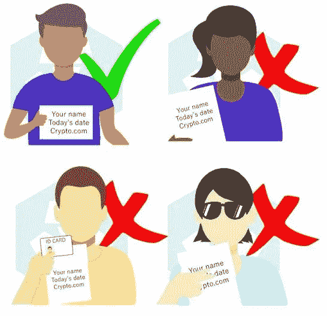

# 如何删除 Crypto.com 账户

> 原文：<https://medium.com/coinmonks/how-to-delete-crypto-com-account-f3624e2ad55e?source=collection_archive---------58----------------------->

**如何删除 Crypto.com 账户:**您是否不再使用 Crypto.com 买卖加密货币？如果是，您可以**请求删除您的账户**。

在删除您的 Crypto.com 之前，您必须提取或用完您所有的余额。否则，您的学分将永久丢失。

Image Credit: Crypto.com

如果您的加密货币余额低于最低取款限额，您需要联系 Crypto.com 支持。你可以打开应用程序，点击聊天图标。

Crypto.com 支持团队将协助您处理提款事宜。本指南将向您展示如何删除您的 Crypto.com 账户。所以[让我们开始吧。](https://cryptospix.com/delete-crypto-com-account/)

> 加入 Coinmonks [电报频道](https://t.me/coincodecap)和 [Youtube 频道](https://www.youtube.com/c/coinmonks/videos)了解加密交易和投资

# 另外，阅读

*   [本地比特币审核](/coinmonks/localbitcoins-review-6cc001c6ed56) | [加密货币储蓄账户](https://coincodecap.com/cryptocurrency-savings-accounts)
*   [什么是保证金交易](https://coincodecap.com/margin-trading) | [美元成本平均法](https://coincodecap.com/dca)
*   [支持卡审核](https://coincodecap.com/uphold-card-review) | [信任钱包 vs 元掩码](https://coincodecap.com/trust-wallet-vs-metamask)
*   [Exness 回顾](https://coincodecap.com/exness-review)|[moon xbt Vs bit get Vs Bingbon](https://coincodecap.com/bingbon-vs-bitget-vs-moonxbt)
*   [如何开始通过加密贷款赚取被动收入](https://coincodecap.com/passive-income-crypto-lending)