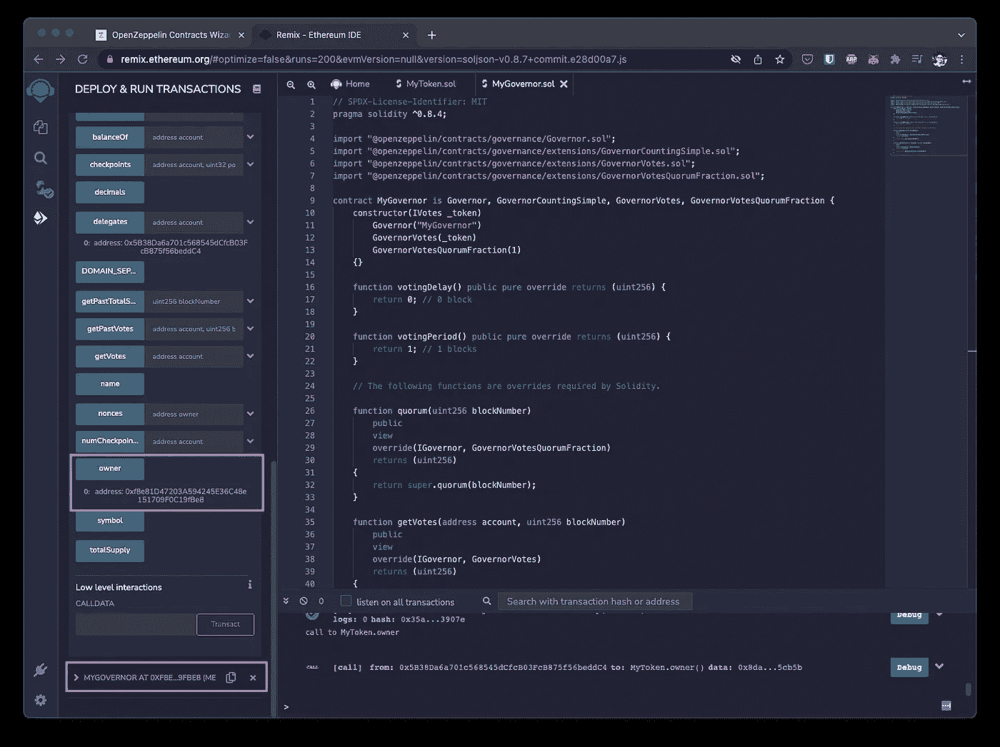

# 如何在 Remix 上部署 DAO

> 原文：<https://medium.com/coinmonks/how-to-deploy-a-dao-on-remix-a49d166556b9?source=collection_archive---------2----------------------->

使用 OpenZepplin 实体合同向导

# 概观

在本例中，我们将

*   部署令牌合同
*   投票代表
*   部署调控器合同
*   将令牌合同所有权转移到调控器合同
*   为 mint 创建一个提案
*   投票
*   执行交易
*   验证执行

# 部署令牌协定

我们将使用 OpenZepplin 的合同向导

 [## 合同向导

### 使用下面的交互式生成器引导您的智能合同，并了解 OpenZeppelin 合同。合同…

wizard.openzeppelin.com](https://wizard.openzeppelin.com/) 

将`Premint`设置为 100，以获得一些代币进行投票。

检查`Mintable`让刀铸造。

检查`Votes`以跟踪投票的历史余额。

该合同将被称为`MyToken`

复制到重新混合和部署。保存合同地址。这个地址将被称为`0xMyToken`

# 投票代表

令牌的所有者必须授权投票。既然你是所有者，你可以将你的投票权委托给你自己或其他人。让我们授权给自己。

呼叫`MyToken.delegate(0xMY_ADDRESS)`

通过调用`MyToken.delgates(0xMY_ADDRESS)`验证委托

# 部署调控器合同

我们将使用 OpenZepplin 的合同向导

 [## 合同向导

### 使用下面的交互式生成器引导您的智能合同，并了解 OpenZeppelin 合同。合同…

wizard.openzeppelin.com](https://wizard.openzeppelin.com/) 

出于测试的目的:

将`Voting Delay`设置为 0。这是从提案创建到投票开始的延迟。

将`Voting Period`设置为 1 块。这是人们可以投票的时间长度。

将`Proposal Threshold`设置为 0。这是一个帐户创建提案必须拥有的最低票数

将`Votes`设置为 ERC20Votes。这将把调控器契约连接到 MyToken 契约(部署在上面)

在部署时，将`0xMyToken`地址复制到构造函数`_TOKEN`。这允许调控器契约管理令牌契约。

部署后，保存合同地址。该地址将被称为`0xMyGovernor`

# 将令牌合同所有权转移到调控器合同

默认情况下，部署`MyToken`合同的人控制铸造。这就是集权！我们想把所有权转让给`MyGovernor`契约(DAO)。

复制`MyGovernor`地址`0xMyGovernor`

在`MyToken.transferOwnership(newOwner)`下粘贴进`0xMyGovernor`

验证`MyToken.owner()`与`0xMyGovernor`匹配。

一切都是委托的，所有权交给州长。是时候提出建议了。

# 为 Mint 创建一个提案

让我们创建一个提议，上面写着:给爱丽丝铸造 5 个代币

打电话给`MyGovernor.propose(targets, values, calldata, description)`

*   `targets` = `0xMyToken`。该建议书将与`MyToken`合同互动
*   `values` = `[0]`是要发送的本机令牌(ETH)的数量。
*   `calldata` = `0x40c1...`就是在`MyToken`契约上叫什么。在这个例子中，数据代表下面的`MyToken.mint(0xAlice, 5)`是一个生成调用数据的工具。

 [## 呼叫数据生成器

### 为一体行动建议调用数据

calldata.netlify.app](https://calldata.netlify.app/) 

abi of MyToken

add [] and “”

一旦提出，就应该有一个`proposalId`:

16895022471016134706132378210223369321765428978649708689638078455237310136989

也可以用`MyGovernance.hashProposal(targets, values, calldata, descriptionHash)`生成命题

`descriptionHash`可以用这个工具生成

 [## 呼叫数据生成器

### 为一体行动建议调用数据

calldata.netlify.app](https://calldata.netlify.app/) 

# 投票

投票前，请检查当前状态

呼叫`MyGovernor.proposalVotes(proposalId)`

no votes 😔

接下来，调用`MyGovernor.castVote(proposalId, support)`

支持选项:

*   0 =反对
*   1 = For
*   2 =弃权

调用`MyGovernor.proposalVotes(proposalId)`状态应该改变。

voted 😇

投票周期被设置为一个块。用`MyGovernor.proposalDeadline(proposalId)`验证。等到截止日期再执行提案。

# 执行交易

执行前，检查`0xAlice`平衡。

调用`MyToken.balanceOf(0xAlice)`应该是 0

打电话给`MyGovernor.execute(targets, values, calldata, descriptionHash)`

# 验证执行

再次检查`0xAlice`平衡。

呼叫`MyToken.balanceOf(0xAlice)`

应该是 5！爱丽丝也可以授权开始投票。

`MyGovernor`又名刀已成功铸造`0xAlice` 5 枚代币！

您已成功部署了一把刀！下一步是定制`MyToken`契约，使其具有除铸造之外的其他功能。

Photo by [Pablo Heimplatz](https://unsplash.com/@pabloheimplatz?utm_source=medium&utm_medium=referral) on [Unsplash](https://unsplash.com?utm_source=medium&utm_medium=referral)

> 加入 Coinmonks [电报频道](https://t.me/coincodecap)和 [Youtube 频道](https://www.youtube.com/c/coinmonks/videos)了解密码交易和投资

# 此外，请阅读

*   [什么是交易信号？](https://coincodecap.com/trading-signal) | [比特币 vs 比特币基地](https://coincodecap.com/bitstamp-coinbase) | [购买索拉纳](https://coincodecap.com/buy-solana)
*   [盈利农民回顾](https://coincodecap.com/profitfarmers-review) | [如何使用康沃尔交易机器人](https://coincodecap.com/cornix-trading-bot)
*   [10 大最佳密码博客](https://coincodecap.com/best-cryptocurrency-blogs) | [您的在线评论](https://coincodecap.com/youhodler-review)
*   [my instance Review](https://coincodecap.com/myconstant-review)|[8 款最佳摇摆交易机器人](https://coincodecap.com/best-swing-trading-bots)
*   [MXC 交易所评论](/coinmonks/mxc-exchange-review-3af0ec1cba8c) | [Pionex vs 币安](https://coincodecap.com/pionex-vs-binance) | [Pionex 套利机器人](https://coincodecap.com/pionex-arbitrage-bot)