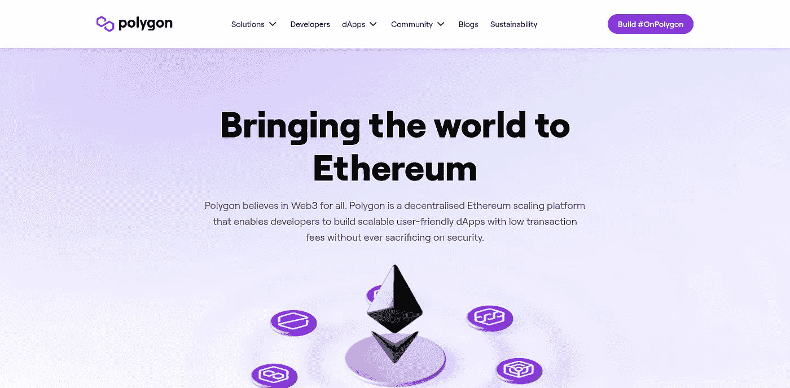
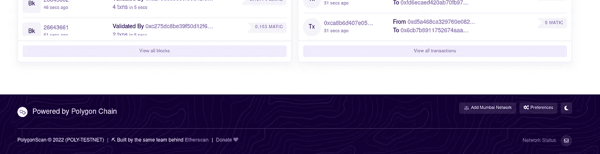
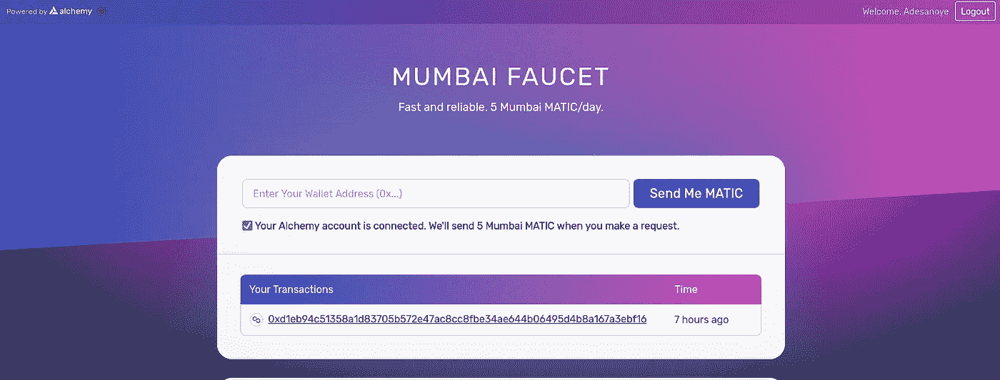
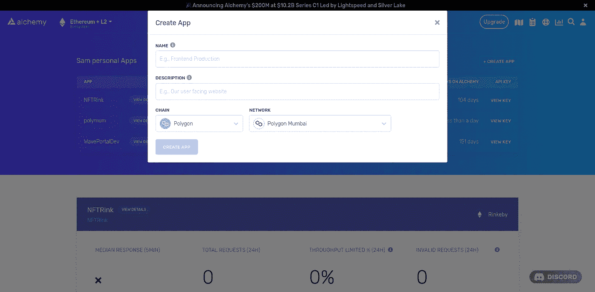
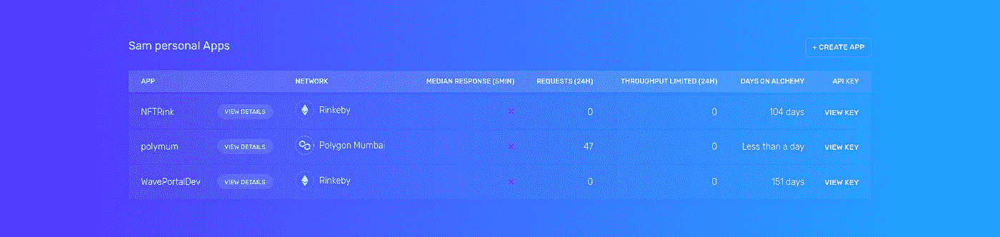

# 如何将智能合约部署到多边形

> 原文：<https://medium.com/coinmonks/how-to-deploy-your-smart-contract-to-polygon-788dcb1fe802?source=collection_archive---------5----------------------->

**什么是多边形？**
Polygon 是一个去中心化的以太坊扩展平台，使开发者能够以较低的交易费用构建可扩展的用户友好的 dApps，而不会牺牲安全性。



[https://polygon.technology/](https://polygon.technology/)

**为什么是多边形？**
-大多数公司都在从 [Instagram](https://about.fb.com/news/2022/05/introducing-digital-collectibles-to-showcase-nfts-instagram/) 、 [Stripe](https://stripe.com/blog/expanding-global-payouts-with-crypto) 、 [Addidas](https://news.adidas.com/originals/adidas-originals-and-prada-announce-a-first-of-its-kind-open-metaverse---user-generated-nft-project/s/30a29dad-6ded-4302-ae40-f9f2338e7298) e.t.c
-更便宜的交易费
-全套以太坊-缩放解决方案
说到这里，让我们进入教程，我相信你已经安装了 **MetaMask** 作为浏览器扩展，并且你正在使用 **hardhat** 进行智能合约开发。

**1。给元蒙版**添加多边形访问[https://mumbai.polygonscan.com/](https://mumbai.polygonscan.com/)点击**添加孟买网络**按钮，弹出元蒙版，按照说明操作。



[https://mumbai.polygonscan.com/](https://mumbai.polygonscan.com/)

**2。获取 Matic 令牌**
Matic 是为多边形网络供电的以太币令牌。
要获取 Matic 令牌，从**元掩码**中复制你的地址，粘贴到[多边形龙头](https://mumbaifaucet.com/)的**钱包地址**字段，点击**发送给我 MATIC** 按钮。水龙头会送你 5 个测试自动令牌。



[https://mumbaifaucet.com/](https://mumbaifaucet.com/)

**3。在炼金术上创建项目**
[炼金术](https://www.alchemy.com/)是一个作为服务平台的节点；请使用[https://www.alchemy.com/](https://www.alchemy.com/)随意注册。
注册后，点击 **+创建应用**按钮。它弹出一个模态:
-填写你的 DApp 的名字
-填写关于你的 dApp 的小描述
-在链选择字段选择多边形。
-在网络中选择 Polygon Mumbai，因为在本教程中，我们将部署到测试网络 Polygon Mumbai。



Create App modal [https://dashboard.alchemyapi.io/](https://dashboard.alchemyapi.io/)

**4。复制项目 HTTP 关键字**
创建项目后，您将重定向回仪表板，在那里您将看到新创建的项目，单击**查看关键字**按钮，并使用复制按钮复制 **HTTP URL** 。



[https://dashboard.alchemyapi.io/](https://dashboard.alchemyapi.io/)

**5。更改 hardhat.config 中的 Hardhat 配置**
您应该创建的最佳实践**。env** 文件，它将用于存储您的私钥，您不应该将您的私钥推送到 Github。我们将使用 [dotenv](https://www.npmjs.com/package/dotenv) npm 包来存储我们的私钥。
创建一个**。env** 文件，如下面的示例，用您的项目 alchemy HTTP 和导出的多边形私钥替换该值。

.env file

接下来，打开您的 **hardhat.config.js** 文件。导入 dotenv 包添加一个新的网络，如下例所示。

hardhat.config.js

我们最终到达那里，部署到多边形网络。在您的终端中运行下面的命令。

```
npx hardhat run scripts/deploy.js --network mumbai
```

恭喜你刚刚部署到多边形网络。**👌**

**来源:**

[](https://docs.polygon.technology/docs/develop/alchemy/) [## 使用炼金术|多边形技术|文档

### 如果您是区块链开发的新手，不知道从哪里开始，或者如果您只想了解如何部署…

文档.多边形.技术](https://docs.polygon.technology/docs/develop/alchemy/) [](https://buildspace.so/p/build-polygon-ens/lessons/LE8b0f2131-79b2-4939-8dd7-126f4e29131a) [## 建筑空间

### 开始建立很酷的 web3 项目，获得 NFTs，在 crypto 中获得秘密工作机会。

buildspace.so](https://buildspace.so/p/build-polygon-ens/lessons/LE8b0f2131-79b2-4939-8dd7-126f4e29131a) 

> 加入 coin monks[Telegram group](https://t.me/joinchat/Trz8jaxd6xEsBI4p)学习加密交易和投资