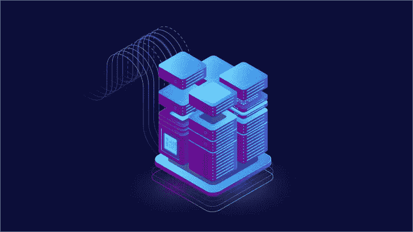

# 如何设计一个区块链应用架构？

> 原文：<https://medium.com/coinmonks/how-to-design-a-blockchain-application-architecture-dc7941ec5fbf?source=collection_archive---------8----------------------->

分散式区块链应用程序在全球各种商业行业中获得了巨大的吸引力。但是在采用这种分散技术时，人们仍然缺乏对 dApp 架构设计及其业务实现的理解。

在企业中实施 dApp 架构之前，需要了解它的各种组件。诸如 API 管理、系统集成、架构能力、转换、连接性、安全性能和 dApps 的弹性之类的变量；做一个区块链 dApp 的建筑设计。

本文是 dApps 架构设计基础的快速指南。

# 分散式应用和集中式应用有什么区别？

保存在集中式应用程序中的数据可以根据控制该特定应用程序的单个组织的方便程度公开或私下披露，从而使它们更加私密。换句话说，消费者对集中式应用程序收集的信息几乎没有控制权。

在处理交易时，集中式应用程序速度更快，因为它们只需与一个系统通信即可完成交易。集中式应用程序的成本更低，因为它们消耗的资源更少。

因为各种利益相关者可能通过他们的节点参与整个网络，并且数据暴露给每个节点或利益相关者，所以分散的应用程序比集中的系统更透明。利益相关者可以根据自己的意愿公开任何信息。各种利益相关者维护分散的应用程序，每个人都对应用程序支持的活动的共识有发言权。

集中式应用程序和分布式应用程序的主要区别在于，集中式应用程序由一个组织来维护。相比之下，自主应用由利益相关者网络管理，所有利益相关者对信息都有同等的访问权限。在这里，数据是经过验证和可靠的。

# 如何用一个样本 dApp 设计一个 dApp 架构？

为了理解 dApp 架构设计的[过程，让我们以下面的情况为例，您想要创建一个飞机维护记录簿应用程序。这个应用程序的动机是，当用户寻找一个航班时，例如从纽约到旧金山，这个应用程序将通过提取飞机维护记录来反映该航班将释放多少碳排放量。](https://www.leewayhertz.com/how-to-design-a-blockchain-app-architecture/)

因此，应用程序将显示不同颜色的信号，如红色、黄色和绿色灯，以展示所有航班的飞机维护状态，从而帮助用户在选择航班时做出决定。

# 第一步

应用程序的第一步是收集所有数据，从制造商的信息开始。例如，飞机制造商可以使用智能合同来交流与其飞机相关的所有数据。航空公司可以使用区块链中结构化的飞机生产数据，收购数据也将记录在区块链上。

# 第二步

在数据被获取和组织之后，接下来的步骤是处理它。下一个架构需求是接口，审计员、客户或代理机构可以通过该接口使用应用程序，并信任数据，因为数据已经在区块链中。

设计和实现 dApp 接口的过程是多方面的。在设计 dApp 的界面时，必须考虑各种方面和特性。

# 如何组装一个 dApp 架构在一起？

区块链上的数据收集是 [dApp 架构开发](https://www.leewayhertz.com/how-to-design-a-blockchain-app-architecture/)的初始阶段。为此，程序员或架构团队必须首先根据应用的用例为应用选择理想的区块链网络。

它可以建立在几个不同的区块链系统上。允许的区块链是一种选择，在这种情况下，只有被允许的利益相关者才能收集数据。

在那之后，有一个公共的区块链网络，如 XDC 或[以太坊](https://www.leewayhertz.com/ethereum-application-development-company/)，在那里所有的公共数据将保持完全透明，最终用户可以看到。然后，对于数据传输，可以在许可和公共区块链之间建立桥梁。

# 决定 dApp 架构设计的各种因素是什么？

决定 dApp 架构设计的一些相关因素如下:

*   区块链协议
*   用户身份
*   授权和角色
*   链外通知
*   业务逻辑
*   数据存储
*   智能合同

开发分散式应用程序架构的第一步是选择它是公共的、私有的、许可的还是混合的。

下一个关键组件是接口，用于实现事件驱动的智能合约触发器。这些接口将数据从链中直接提供给用户的设备。下一个关键步骤是创建一个用于安全数据存储和交付的存储系统。

> 加入 Coinmonks [电报频道](https://t.me/coincodecap)和 [Youtube 频道](https://www.youtube.com/c/coinmonks/videos)了解加密交易和投资

# 另外，阅读

*   [mithBot 评论](https://coincodecap.com/smithbot-review) | [4 款最佳免费开源交易机器人](https://coincodecap.com/free-open-source-trading-bots)
*   [比特币基地僵尸程序](/coinmonks/coinbase-bots-ac6359e897f3) | [AscendEX 审查](/coinmonks/ascendex-review-53e829cf75fa) | [OKEx 交易僵尸程序](/coinmonks/okex-trading-bots-234920f61e60)
*   [如何在印度购买比特币？](/coinmonks/buy-bitcoin-in-india-feb50ddfef94) | [WazirX 审查](/coinmonks/wazirx-review-5c811b074f5b)
*   [CryptoHopper 替代品](/coinmonks/cryptohopper-alternatives-d67287b16d27) | [HitBTC 审查](/coinmonks/hitbtc-review-c5143c5d53c2)
*   [CBET 评论](https://coincodecap.com/cbet-casino-review) | [库科恩 vs 比特币基地](https://coincodecap.com/kucoin-vs-coinbase)
*   [折叠 App 审核](https://coincodecap.com/fold-app-review) | [Kucoin 交易机器人](/coinmonks/kucoin-trading-bot-automate-your-trades-8cf0ca2138e0) | [Probit 审核](https://coincodecap.com/probit-review)