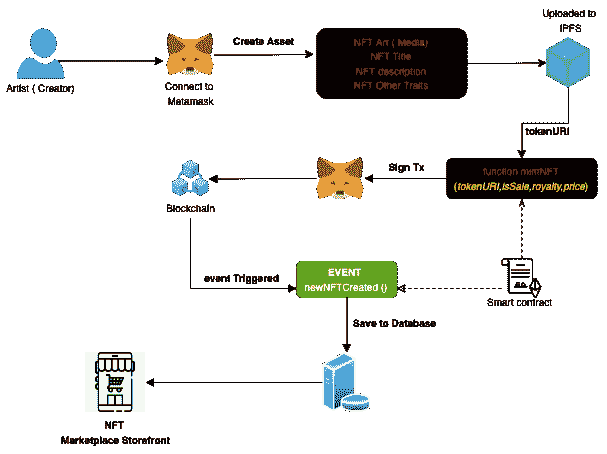

# 如何设计并开发 NFT 市场——了解其背后的架构！

> 原文：<https://medium.com/coinmonks/how-to-design-then-develop-an-nft-marketplace-understanding-the-architecture-behind-it-bdeb8af9fbc2?source=collection_archive---------1----------------------->

合十礼！

这是 Mayank，来自 [**节俭软件**](https://thriftysoft.tech/) ，又有一个关于最近最热门产品的新帖子，即 **NFT 市场**。人们对 NFT 市场非常着迷，他们希望针对不同的使用案例和主题推出自己的产品，如房地产、艺术画廊、游戏等。

但是当涉及到开发时，在他们开始开发之前，他们了解这个市场背后的实际设计和架构是非常必要的。再次像我以前的帖子[开发保管钱包](/coinmonks/how-to-develop-a-custodial-wallet-for-cryptocurrencies-f86fd5a0813a)一样，我不会教如何开发 NFT 市场，但会讨论它背后的一些概念&。

# 什么是不可替换令牌(NFT)？

NFT 代表不可替代的令牌。NFT 将数字文件(*图像、音频、gif、视频、PDF* )转换为数字资产。NFT 令牌被创建并存储在区块链上，作为特定物品的所有权和出处的证明。它的工作原理就像一个数字证书的真实性，可以很容易地验证任何人在世界任何地方的区块链。

> **问题**:NFT 只做艺术品(图片、视频、礼品)吗？
> **回答**:肯定！艺术品没有 NFT 只是 NFT 的一个用例，但可以有几个用例，如票务中的 NFT 等。

# 什么是 NFT 市场？

**NFT 市场**是一个市场，它允许艺术家以数字代币(NFT)的形式展示和列出他们的艺术品，买家/投资者可以购买这些艺术品。这非常类似于在亚马逊这样的电子商务市场上购买&出售产品。艺术家可以选择各种方式出售他们的作品。他们可以选择以**的固定价格**出售，或者可以将艺术品放入**拍卖场**，公开竞价，出价最高者将获得 NFT 的所有权。

# **不同类型的 NFT 市场**

NFT 市场基本上有两种类型，

1.  初级市场:初级 NFT 市场是创作者(艺术家)可以铸造 NFT 代币(以数字代币的形式创作艺术品)，并将其上市销售的地方。
2.  二级市场:二级 NFT 市场是购买了 NFT 的收藏者可以转卖或者重新出售他们的藏品的地方。

> “一级市场”指的是一件艺术品的第一次销售，而“二级市场”则包括该作品随后的所有转售。

在这篇文章中，我将着重于建立一个主要的 NFT 市场。

> 加入 Coinmonks [Telegram group](https://t.me/joinchat/Trz8jaxd6xEsBI4p) 并了解加密交易和投资

# **了解 NFT 市场背后的主要逻辑**

这里有一些功能和演示，通过它们你会对 NFT 市场的运作有一个完整的了解。

**1。认证:** 需要认证，才能在平台中执行动作。虽然浏览功能( ***浏览 NFTs，浏览用户，浏览收藏*** )应该是开放的(**未认证**)，但是有些功能**像创建配置文件，编辑配置文件，像 NFT，创建收藏，和删除收藏，**需要认证来识别用户。

您可以使用普通的**电子邮件/密码**或**基于社交登录**的认证并生成 JWT 令牌，或者如果您不想使用此认证，您也可以使用 **Web3 钱包，如 Metamask、比特币基地等。**这里指的是[的文章](https://www.toptal.com/ethereum/one-click-login-flows-a-metamask-tutorial)。

**2。Profiling :** 我们在 Marketplace 中显示用户资料，与每个 **NFT 卡**、**排行榜**、**收藏**、**投标人列表**等地方相关联。因此，我们需要维护用户的个人资料，其中可能包括**用户的全名，用户名，简历，封面图片，头像&其他用户的公共信息**。这些信息我们可以保存在数据库中

**3。KYC(可选):** 这是完全可选的。如果你需要建立一个受控的 NFT 市场(取决于你所在国家的法律合规性)，你需要了解你的客户(用户)，为此你需要一个 KYC 模块。KYC 你可以用两种方式实现:

1.  **手动 KYC:** 您可以创建您的客户 KYC 模块，从用户那里收集数据，并通过管理面板进行验证
2.  **第三方 API:** 或者你可以使用任何第三方 API，比如[**https://onfido.com/**](https://onfido.com/)，它会为你做收款&验证。

在 KYC 完成之前，您还可以限制用户在平台中进行购买/销售。

**4。创建资产(铸造):**

**NFT Minting Diagram**

在市场上创建一个**数字资产/ NFT 艺术品**意味着**铸造你的数字令牌**。其中用户必须上传关于 NFT(艺术品)的信息，并铸造一个新的令牌。

现在，这些包括三个步骤，即:

1.  **用 Web3 钱包连接你的 DApp:**在区块链上铸造一个 NFT，需要你首先用 web3 钱包连接你的 DApp，比如 **Metamask** 。
2.  **上传元数据到 IPFS:** 你需要上传你的 NFT 的元数据到 IPFS ( **星际文件系统**)，元数据包括 **NFT 的资产(图片、视频、GIf)、标题、描述、属性**。因为我们正在构建一个不可实现的令牌，所以我们需要确保这个元数据永远存在并且是分散的。因此，把它存放在 IPFS 是最好的选择。如果你把这些文件上传到一个集中的数据库，对你的文件的安全是有风险的。将 NFT 的元数据上传到 IPFS 后，您将获得一个元数据 ID ( IPFS 密钥)
3.  **创建您的 NFT** 从 IPFS 获取元数据 ID，将其用作 **tokenURI** ，并签署交易，以创建 NFT。

**5。列出在售的 NFT:**

**Listing NFT for Fixed Price Sale / Auction**

一旦用户铸造了一个 NFT 或者购买了(拥有)一个，他们就可以出售 NFT，

销售可以有不同类型:

1.  **固定价格销售**:这里用户会列出一个固定价格的 NFT，这样其他用户可以直接购买 NFT，支付 NFT 细节中给出的金额。
2.  **拍卖**:用户在这里列出拍卖的 NFT，用户在这里指定拍卖的**最低竞价**和**持续时间**。所以用户可以在 NFT 上竞价。拍卖结束后，没有人能够出价。现在，所有者可以决定接受/拒绝最高出价。在用户选择接受的情况下，该金额将归用户所有，并且 NFT 的所有者将被转让给最高出价者。
3.  **混合动力(拍卖&固定价格):**用户也可以在混合动力车型中列出他们的 NFT，即在**固定价格&拍卖**中列出他们。因此，这里用户必须指定**最低出价金额**、**拍卖持续时间**和**立即购买价格**。现在，用户可以对拍卖出价，但如果用户以**立即购买价格**购买 NFT，NFT 将立即出售给买家，拍卖将被关闭。

**6。投标&购买:**

[https://vimeo.com/717503388](https://vimeo.com/717503388)

用户可以访问 NFT 的详细页面，并可以购买或竞标 NFT，这取决于销售的形式。(**买入=固定价格或混合**，出价=拍卖)。流程几乎是一样的，比如:

**用户选择一个 NFT →连接元掩码→调用 Buytoken 或 BidToken 函数→签名 TX &发送到区块链→事件将被触发，这将改变 DB 中的所有者**

NFT 的任何用户(所有者)都可以决定将其从销售中移除(固定价格/拍卖)。一旦停止销售，就没有人可以购买/出价

**7。集合&将 NFT 添加到集合** 集合用于**将具有相似特征**的 NFT 进行分组，方便用户浏览。NFT 市场应该有一个功能，用户可以**创建/更新一个集合**和**分配他们的 NFT(他们拥有)**到一个集合。集合可以存在于数据库中，以便于用户浏览/搜索。

**8。其他视图:** 虽然您必须将 NFTs 元数据保存在 IPFS 中，但是在您的数据库中保存一份副本也是很好的，这样可以改进 NFT 市场中的查询&搜索功能。用户将会发现通过**搜索标题、按类别、按收藏过滤**等方式浏览 NFT 艺术品非常方便。这些可能是列出 NFT 的不同视图，

1.  *趋势 NFT*
2.  按类别浏览
3.  *按收藏浏览*
4.  *浏览用户资料*
5.  *浏览用户创建/拥有的 NFT*

# **结论:**

看完这篇文章后，你一定对 NFT 市场背后的架构有所了解，并且你一定对建立自己的 NFT 市场感到兴奋。

你应该参考一些教程和内容，对你一定有用:

1.  [https://www.youtube.com/watch?v=GKJBEEXUha0](https://www.youtube.com/watch?v=GKJBEEXUha0)
2.  [https://dev . to/edge-and-node/building-scalable-full-stack-apps-on-ether eum-with-polygon-2cfb](https://dev.to/edge-and-node/building-scalable-full-stack-apps-on-ethereum-with-polygon-2cfb)
3.  [https://github . com/dabi T3/polygon-ether eum-nextjs-market place/](https://github.com/dabit3/polygon-ethereum-nextjs-marketplace/)

如果您正在寻找 NFT 交易市场，请访问[https://thriftysoft.tech/](https://thriftysoft.tech/)或随时通过**admin @ thiftysoft . tech**与我们联系，或通过 [**Skype**](https://join.skype.com/invite/lrSe4UlrOeeh) 与我们联系。如果你只是需要帖子里显示的用户界面，可以在这里购买[https://code canyon . net/item/minto-reactjs-NFT-market-UI-kit/35888391](https://codecanyon.net/item/minto-reactjs-nft-marketplace-ui-kit/35888391)

我们很乐意帮助你😊