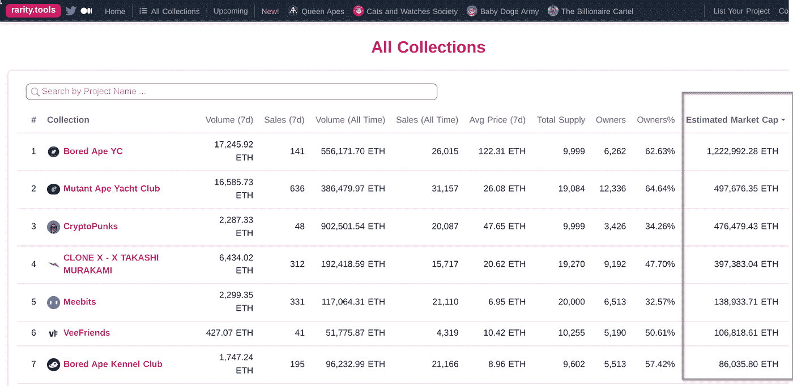

# 如何确定 NFTs 的价值？

> 原文：<https://medium.com/coinmonks/how-to-determine-the-value-of-nfts-4ce6376aa9e2?source=collection_archive---------41----------------------->

在过去的一年里，NFT 空间的增长和成功记录的爆发为无数有趣的新 NFT 项目的诞生铺平了道路。对拥有和交换 NFT 的兴趣与日俱增。因此，掌握一些基本的度量知识来衡量非功能性测试的潜在价值是至关重要的。

**最低价格**

底价，也称为“入门价”，简单地说就是 NFT 系列中最便宜的 NFT 的价格。底价是加入或成为 NFT 项目所有者可以购买或支付的最小金额。

以底价购买 NFT 被认为是一种强有力的进入策略，因为它为 NFT 倡议的新参与者提供了一个负担得起的进入点。底价是评估社区如何接受 NFT 项目的一个显著的统计数字。随着需求的增长，底价也会上涨。这意味着，如果你买了收藏中最便宜的 NFT，希望它会变得更受欢迎，你可以以更高的底价转售 NFT。

为了帮助想象底价的含义，考虑一下涂鸦的 NFT。根据 OpenSea 的说法，NFT 涂鸦有各种颜色、特征和大小，收集了 10，000 件。在撰写本文时，Doodles NFT 的最低价格为 15.48 ETH。10k 涂鸦系列中最实惠的涂鸦 NFT 售价 15.48 瑞士法郎。

**市值**

除了底价，NFT 分析的另一个指标是其隐含的市值。衡量 NFT 隐含市值的一个很好的工具是稀有度

市值的计算方法是将七天平均价格乘以总供应量。NFT 市场通常缺乏流动性，这意味着当你准备出售 NFT 时，你需要找到一个愿意购买的买家。

高隐含市值表明，更多的利益相关者愿意支付更高的价格购买非功能性交易。简而言之，隐含市值高的 NFT 是一个好迹象。要估算市值，请登录 rarity.tools 网站，向下滚动页面，输入你最喜欢的 NFT 项目，查看市值。

**市场分析师仪表盘**

用于确定 NFTs 值的第三个工具是 dune.xyz，这不是一个简单的工具；你需要面对它。这个项目的特点是，你可以使用其他用户收集的现成数据，或者你可以创建自己的查询(但这将不得不学习)

例如，来自用户@cryptuschrist 的顶级 NFT 收藏的仪表板

您也有机会根据可用数据创建您的样本，但您需要学习如何使用该工具。

**交易量**

另一个你可以使用的重要指标是 NFT 收藏交易量。你可以用 OpenSea 查看 NFT 藏品的交易量。

该图显示了对收藏品的总体需求。从交易量可以看出 NFT 收藏的受欢迎程度；交易量越大，越能表明人们愿意买卖。交易量也是评估 NFT 项目目前是否受欢迎的一个指标，交易量越高，就越能显示市场的流动性。

要查看交易量，请访问 OpenSea 排名页面。

**稀有等级**

这个列表中最后也是最重要的指标是稀有度分数，用来量化藏品的潜在价值。你可以使用稀有的工具。

稀有度较高的非功能性测试通常比稀有度较低的非功能性测试更有价值。在稀有度评分的帮助下，NFT 水龙头可以评估一件 NFT 的价值。

每个 NFT 特征被分配一个稀有分数，所有 NFT 特征的稀有分数被组合在一起形成一个总评分。下面是一幅插图:

在购买 NFT 之前，一定要做好调查，检查上面列出的因素。

> 加入 Coinmonks [电报频道](https://t.me/coincodecap)和 [Youtube 频道](https://www.youtube.com/c/coinmonks/videos)了解加密交易和投资

# 另外，阅读

*   [币安交易机器人](/coinmonks/binance-trading-bots-d0d57bb62c4c) | [OKEx 评论](/coinmonks/okex-review-6b369304110f) | [Atani 评论](https://coincodecap.com/atani-review)
*   [最佳加密交易信号电报](/coinmonks/best-crypto-signals-telegram-5785cdbc4b2b) | [MoonXBT 评论](/coinmonks/moonxbt-review-6e4ab26d037)
*   [如何在 Bitbns 上购买柴犬(SHIB)币？](https://coincodecap.com/buy-shiba-bitbns) | [购买弗洛基](https://coincodecap.com/buy-floki-inu-token)
*   [CoinFLEX 评论](https://coincodecap.com/coinflex-review) | [AEX 交易所评论](https://coincodecap.com/aex-exchange-review) | [UPbit 评论](https://coincodecap.com/upbit-review)
*   [十大最佳加密货币博客](https://coincodecap.com/best-cryptocurrency-blogs) | [YouHodler 评论](https://coincodecap.com/youhodler-review)
*   [AscendEx 保证金交易](https://coincodecap.com/ascendex-margin-trading) | [Bitfinex 赌注](https://coincodecap.com/bitfinex-staking)