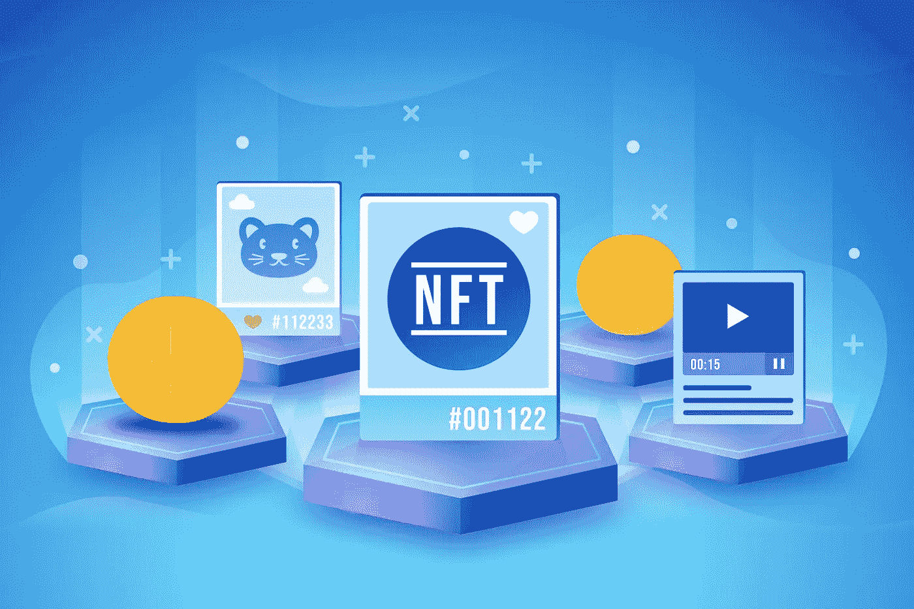
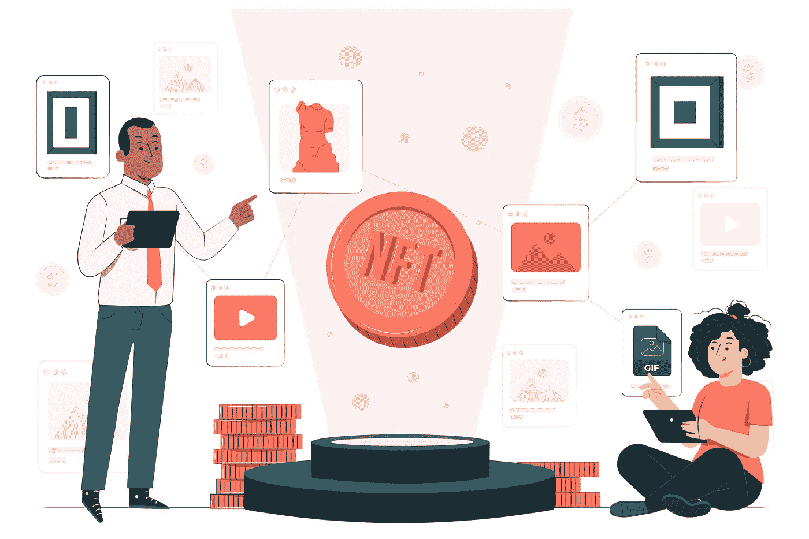
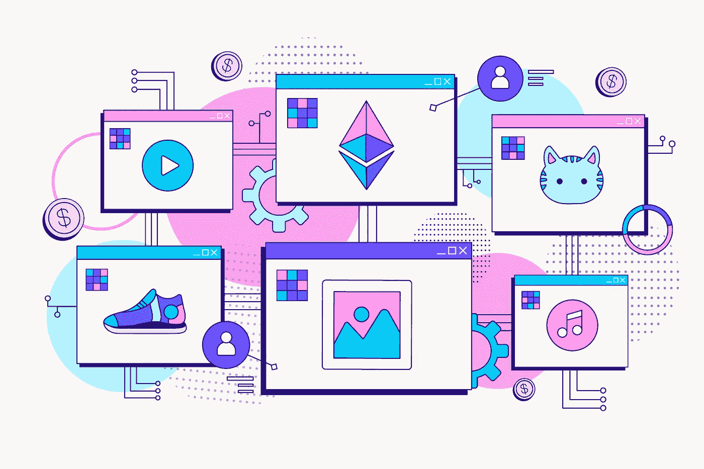

# 如何确定非专利技术的价值

> 原文：<https://medium.com/coinmonks/how-to-determine-the-worth-of-nfts-8224b6841364?source=collection_archive---------77----------------------->

在数字和现实世界之间建立的桥梁 NFT(不可替代的代币)监督了它在金融、游戏、艺术、治理等不同领域的广泛采用。

任何人现在都可以创建 NFT(不可替代的代币)的事实增加了收藏家和交易商在决定购买市场上众多 NFT 中的哪一个时面临的困难。

在本文中，我讨论了在确定 NFTs 的价值时要考虑的三个主要因素。

## 稀有度:

考虑一下 NFT 项目对其行业的影响，以及获得这些资源的稀缺程度和难度。由艺术行业中著名的数字艺术家或知名人士创建的 NFT 是罕见的 NFT 的很好的例子。

游戏行业中使用的 NFT(不可替换的代币)是稀有 NFT 的很好的例子。

第一批 CryptoKitties，daily——bee ple 的前 5000 天是加密行业中罕见的 NFT 的伟大例子。

## 实用工具:

NFTs(不可替代令牌)的效用给了它一个直接的价值，这个价值随着时间的推移而增长，这取决于项目的受欢迎程度，也取决于它在物理和数字世界中的应用。

很好的例子是在游戏中使用的虚拟土地和化身。只要游戏内玩家增加，愿意为独一无二的卡牌付费。

2020 年 NFT 欧锦赛门票、分散式地产或像《巫师世界》Gwent 纸牌游戏中 Rivia 的 Geralt 这样的收藏卡，都是对具有宝贵效用的非金融资产的很好描述。

## 有形性:

如果 NFT(不可替换的令牌)是有形的，并且让它们不可改变的所有者满意，那么它们可以从它们所代表的现实世界的项目中获得价值。

例如，与艺术家的独家活动相关联的 NFT(不可替代的代币)在本质上比那些没有有形现实世界对象的 NFT 更有价值。

价值可观的 NFT(不可替代的代币)最适合短期交易，因为它们有到期日或有限制。

## 结论:

NFT(不可替代的代币)的价值与这三个主要因素密切相关。而且还取决于创作者以及他们在短期和长期转售价值中能保持多大价值。

NFT 揭示了它们不仅仅是收藏品或资产的数字表示，而是可以在现实世界中提供无限的可能性。

我相信你从这篇文章中获得了价值。如果是这样，请关注我这里的 [*推特*](https://twitter.com/bukzofwakanda) *了解更多类似的内容。别忘了给它鼓掌👏。*

*您也可以联系我，为密码相关的主题或品牌撰写工作。欢迎在评论中提问。我愿意提供答案。*

> 加入 Coinmonks [电报频道](https://t.me/coincodecap)和 [Youtube 频道](https://www.youtube.com/c/coinmonks/videos)了解加密交易和投资

# 另外，阅读

*   [法国 4 大最佳密码交易平台](https://coincodecap.com/copy-trading-platforms-france)
*   [从 WazirX 切换到 CoinDCX 的 5 个理由](https://coincodecap.com/reasons-to-switch-from-wazirx-to-coindcx)
*   [Unocoin 评论](https://coincodecap.com/unocoin-review) | [最佳加密赌注硬币](https://coincodecap.com/best-crypto-staking-coins)
*   [如何使用 MetaMask Wallet 获得 KCC 地址？](https://coincodecap.com/kcc-address-metamask)
*   [如何获得自己的。XYZ 领域？](https://coincodecap.com/xyz-domain)
*   [最佳加密交换平台](https://coincodecap.com/best-crypto-swap-platforms) | [最佳加密交易所](https://coincodecap.com/crypto-exchange)
*   [购买比特币印度](/coinmonks/buy-bitcoin-in-india-feb50ddfef94) | [Pionex 评论](/coinmonks/pionex-review-exchange-with-crypto-trading-bot-1e459d0191ea) | [加密交易机器人](/coinmonks/crypto-trading-bot-c2ffce8acb2a)