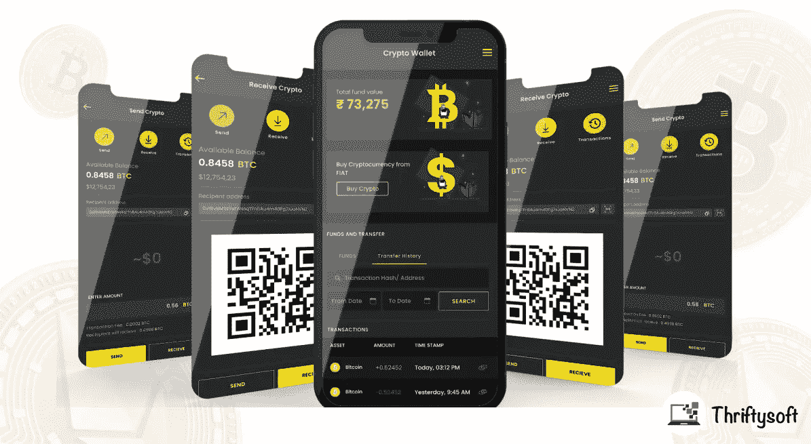
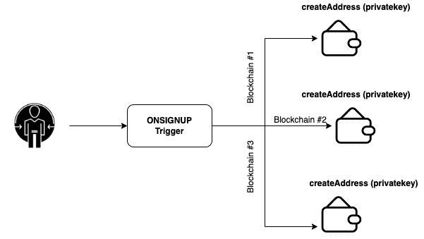
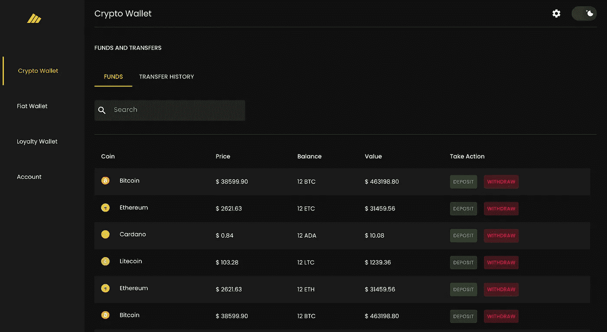
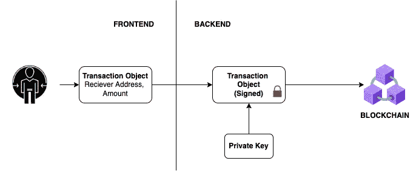

# 如何开发加密货币的保管钱包？

> 原文：<https://medium.com/coinmonks/how-to-develop-a-custodial-wallet-for-cryptocurrencies-f86fd5a0813a?source=collection_archive---------3----------------------->

Custodial Wallet App

随着*区块链*、*加密货币*、 *NFT* & *元宇宙*的日益炒作，现在创业公司正从 web2 走向 web3。从而增加了对加密钱包的需求。尽管如此，人们还是对保管钱包和非保管钱包感到困惑。

在这篇文章中，我不会谈论保管型和非保管型钱包的区别，如果你想知道它们的区别，请阅读这里的。

在这里，我将尝试给你一个保管钱包的**设计概述，**我将帮助你看到它背后的架构，以便你可以使用这些知识来构建你自己的保管钱包。

# **什么是保管钱包？**

> 保管钱包是指由第三方保管私人钥匙的钱包。这意味着第三方可以完全控制你的资金，而你只需要给予发送或接收付款的许可。

# **你为什么应该选择保管钱包？**

如果你正在构建一个移动或网络应用程序，并且你想要钱包功能，以下是你为什么应该选择保管钱包而不是非保管钱包的原因。

1.  **用户体验:**对于一个普通用户来说，使用应用程序连接像 metamask 这样的外部钱包并不总是简单明了的，它会影响用户体验。此外，通过应用程序连接外部钱包并不容易。因此，如果你不希望你的用户将应用/网站与任何外部钱包连接，并且你仍然希望他与加密硬币交互，你应该使用保管钱包。
2.  **教育程度较低的目标客户:**今天，并不是每个人都了解 web3、metamask、trust wallet 和其他 web3 钱包，所以这给他们使用您的应用程序造成了障碍。因此，如果你的应用程序用户在区块链和加密领域没有那么好的教育，而你仍然希望在应用程序中使用加密技术，那么你应该使用保管钱包，钱包将与他们的账户相连。(JWT)
3.  **控制:**通过使用保管钱包，平台的所有者可以控制使用/存款&提现。所以如果你想控制你的用户的钱包，你应该使用保管钱包。

# **如何开发保管钱包？**

这里是概述，关于开发保管钱包，这将最终需要你开发以下功能。

**1。认证—** 应该有一个认证模块。每个用户都应该有自己的电子邮件/密码。他们应该有能力通过电子邮件和密码登录或使用像谷歌，脸书等社会方法。

**2。为每个用户创建地址—** 如果用户首次登录，使用私钥为用户创建一个地址，生成该地址时应考虑安全性。

> 私钥应该包含
> 
> **密匙:**由管理员控制
> 
> **项目 Id:** 对于每个项目都是唯一的
> 
> **UID:** 对每个用户都是唯一的
> 
> **私钥**=【Hash(secret . key)。子串+哈希(项目 id)。减法+哈希(UID)。减法运算]

您需要为正在使用的每个区块链执行此操作。对于不同的区块链，语法可以不同

Onsignup Trigger

**3。KYC(了解你的客户)** —应该有一个用户的 KYC，并且应该在用户开始使用钱包之前得到批准。虽然技术上没有要求，但由于法律合规性，确实 ***有必要。***

您可以创建您的**自定义 KYC 模块**，在那里您从用户那里收集数据并从管理面板中验证它，或者使用任何**第三方 API，如**[**【https://onfido.com/】**](https://onfido.com/)**，它们将为您进行收集和验证。**

****4。多因素认证(MFA)** —用户帐户应该启用 MFA，以保护一些关键操作，如**向任何地址发送加密硬币**、**删除帐户**等。这可以通过以下方式实现:**

1.  ***谷歌认证器***
2.  ***手机号码& OTP***

****5。硬币列表**:应该有一个 API 来获取平台中所有支持的&当前活动的硬币。你必须从管理面板创建这个列表。**

****6。资金平衡**:应该有一个 API，获取用户持有的硬币列表，它们的数量和价格。如果您使用多个区块链，您需要查询来自多个区块链的数据，连接数组并将其发送给用户。要计算法定货币的价格，您可以使用任何加密交换 API，如比特币基地。**

****

****Crypto Fund Balance Screen****

****7。获取存款地址—** 如果有人想将加密货币存入您的钱包，他们需要存款地址或二维码。因此，应该有一个 API 来获取给定网络的用户存款地址。**

> **页（page 的缩写）不同的区块链存款地址会有所不同**

****

****Deposit Address****

****8。查看交易:**应该有一个 API 来获取任意账户(地址)的交易。您还可以添加货币过滤器，以获取特定加密货币的交易。**

****9。发送加密货币—** 现在，是时候创建一个交易对象了，(如果用户想要发送加密货币的话)。应该有一个 API，它将发送事务。交易将在后端使用用户钱包的私钥进行签名。**

****

****Trasaction Flow****

# **结论:**

**看完这篇文章后，你一定对什么是保管钱包有了一个概念，为什么&什么时候你应该使用保管钱包，以及如何建立保管钱包。**

**如果您正在寻找保管或非保管钱包，作为您的业务使用案例，请访问 https://thriftysoft.tech/或通过 [admin@thriftysoft.tech](mailto:admin@thriftysoft.tech) 联系我们，或通过 [Skype](https://join.skype.com/invite/lrSe4UlrOeeh) 联系我们。如果你需要 UI 工具包，在这里购买[https://code canyon . net/item/thrifty wallet-react js-UI-kit-for-crypto-wallet-crypto currency-reward-points-and-fiat-currency/36439790](https://codecanyon.net/item/thriftywallet-reactjs-ui-kit-for-crypto-wallet-cryptocurrency-reward-points-and-fiat-currency/36439790)**

**我们很乐意帮助你😊**

> **加入 Coinmonks [电报频道](https://t.me/coincodecap)和 [Youtube 频道](https://www.youtube.com/c/coinmonks/videos)了解加密交易和投资**

# **另外，阅读**

*   **[3 商业评论](/coinmonks/3commas-review-an-excellent-crypto-trading-bot-2020-1313a58bec92) | [Pionex 评论](https://coincodecap.com/pionex-review-exchange-with-crypto-trading-bot) | [Coinrule 评论](/coinmonks/coinrule-review-2021-a-beginner-friendly-crypto-trading-bot-daf0504848ba)**
*   **[莱杰 vs n rave](/coinmonks/ledger-vs-ngrave-zero-7e40f0c1d694)|[莱杰 nano s vs x](/coinmonks/ledger-nano-s-vs-x-battery-hardware-price-storage-59a6663fe3b0) | [币安评论](/coinmonks/binance-review-ee10d3bf3b6e)**
*   **[Bybit 交易所评论](/coinmonks/bybit-exchange-review-dbd570019b71) | [Bityard 评论](https://coincodecap.com/bityard-reivew) | [Jet-Bot 评论](https://coincodecap.com/jet-bot-review)**
*   **[3 commas vs crypto hopper](/coinmonks/3commas-vs-pionex-vs-cryptohopper-best-crypto-bot-6a98d2baa203)|[赚取加密利息](/coinmonks/earn-crypto-interest-b10b810fdda3)**
*   **最好的比特币[硬件钱包](/coinmonks/hardware-wallets-dfa1211730c6) | [BitBox02 回顾](/coinmonks/bitbox02-review-your-swiss-bitcoin-hardware-wallet-c36c88fff29)**