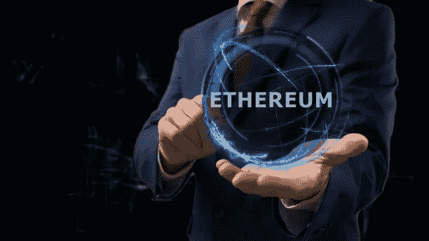

# 如何在多边形上开发一个 dApp？

> 原文：<https://medium.com/coinmonks/how-to-develop-a-dapp-on-polygon-f612cb1c6af2?source=collection_archive---------10----------------------->

以太坊是最流行的区块链协议之一。它具有独特的功能，如内置的编程语言、以太坊虚拟机和 solidity 智能合约。尽管有这些特性，以太坊也有一些缺点，比如低吞吐量、拥塞、昂贵的交易和可伸缩性问题。为了解决以太坊平台上的这些问题，一个由四名专业软件开发人员组成的团队构建了多边形网络。

Polygon 功能符合利益一致原则，由第 2 层扩展解决方案提供支持。该网络使用以太坊的核心技术，并为其增值。通过这样做，Polygon 为以太坊提供了高吞吐量、低成本的交易，并改进了以太坊网络和其他与以太坊兼容的区块链的开发。

现在让我们了解以太坊区块链的局限性，以及 Polygon 如何在下一节中解决这些局限性。

# 以太坊的主要局限是什么？

区块链以太坊已经发展成为各种企业的强大分散网络。但是，它有一些具体的限制，如下所述:

*   以太坊网络的主要挑战之一是其低吞吐量。它每秒只能处理 30 个事务，相对于另一个第二代区块链，它的吞吐量相对较低。
*   以太坊连锁店的平均交易费是 51.45 美元。虽然，准确的费用是通过供应链上矿工的供求机制计算出来的。
*   以太坊不具备互操作性，因此它无权允许兼容以太坊的区块链互相通信。
*   由于没有特定的协议来连接这些区块链，以太坊有很大的发展问题，从而导致生态系统的分裂。

既然我们已经熟悉了以太坊在其生态系统中存在的问题，那么让我们来探索 Polygon 解决这些问题的方法。

# 多边形如何解决以太坊的局限性？

Polygon 的行为就像一个协议和框架，有助于以太坊兼容区块链的开发过程，并将所有这些网络链接到以太坊平台。以下是 Polygon 解决以太坊局限性的方法:

*   Polygon 简化了编码区块链网络的单击部署。
*   它提供了一组不断发展的模块来构建定制网络。
*   借助其互操作性协议，Polygon 允许以太坊和其他区块链网络之间进行交互和共享消息。
*   它借助模块化的“安全即服务”改进了区块链上的安全层，这也是一个选项。
*   Polygon 拥有适配器模块，有助于提高现有区块链网络的互操作性。

Polygon 是最好的 [dApp 开发平台](https://www.leewayhertz.com/decentralized-app-on-polygon/)之一。Polygon 上的开发人员使用 Polygon 的 SDK 和工具来构建特定于业务的 dApps。

现在让我们在下一节展示为什么应该考虑用 Polygon 来开发 dApp。

# 为什么要考虑在 Polygon 平台上进行 dApp 开发？

Polygon 已经成为促进以太坊可扩展解决方案和不同分散基础设施开发的领先平台之一。随着时间的推移，随着各种项目合作伙伴和巧妙工具的出现，该网络不断发展壮大。

Polygon 为其开发人员提供了高级基础设施支持，是全球开发人员的首选扩展解决方案。Polygon 有独特的工具项目，例如它的分散式云存储、RPC 提供程序和其他有吸引力的开发人员包，这些包可以在温柔和意式冰淇淋平台上获得。Polygon 还帮助企业在选择市场上的顶级审计公司时利用安全审计折扣。

现在让我们在下一节了解在 Polygon 上开发 dApp 的过程。

# 多边形上的 dApp 开发

[Polygon](https://www.leewayhertz.com/polygon-blockchain-development-company/) 允许用户用他们的电子邮件地址开发一个钱包，然后连接到应用程序内的各种网络。在下面提到的步骤中，我们将使用 Magic 作为基于密钥的认证系统。

Magic 是一个面向开发人员的 SDK，它可以与您当前的应用程序集成在一起。它允许使用类似于 Medium 和 Slack 的神奇链接进行无密码验证。

## 开发人员快速入门

如果你知道如何在以太坊上进行开发，那么在多边形上工作并不是一件困难的事情。你在以太坊上使用的每个工具都是多边形兼容的，比如 te Remix，Truffle，Webejs 等等。

转移到多边形的 RPC，并开始建立你的 dApp。

## 第一步

借助 Magic.js 连接到 Polygon。每个网络需要两个 Web3 和两个 Magic 实例。该功能允许用户在两个网络之间切换。

对两个 Magic 实例使用相同的 API 键。这将有助于您保持用户的公共地址不变。

## 第二步

借助“选择元素下拉列表”在网络之间切换。一个魔法实例指向多边形，另一个指向以太坊。因此，您可以根据用户的网络选择来更新 dApp 的实例。

## 第三步

然后借助 web3.eth.get balance 查看自己的用户余额。由于 Polygon 的原生令牌是 MATIC，以太坊是 ETH，所以我们会根据我们连接的网络来显示相关的令牌符号。

## 第四步

通过提供发送金额、发送方和接收方地址来发送交易。关于燃气费，如果没有通过，那么整体燃气限额和费用是自动估算的。

## 第五步

最后，在以太坊和 Polygon 上部署单独的智能契约。这将让用户独立地与他们互动。

通过结合以太坊的基本属性和扩展优势，Polygon 提出了一个健壮的解决方案，将您的 dApp 转换为可扩展的快速应用程序。以太坊网络上有各种多边形链，你可以在以太坊平台上探索[多边形的效用。](https://www.leewayhertz.com/decentralized-app-on-polygon/)