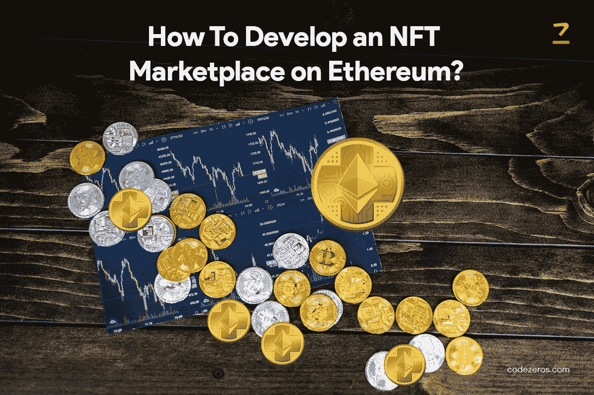

# 如何开发以太坊上的 NFT 市场？

> 原文：<https://medium.com/coinmonks/how-to-develop-an-nft-marketplace-on-ethereum-c2dea9b51eb4?source=collection_archive---------11----------------------->

不可替换令牌是一种数字资产，代表艺术、音乐和视频游戏等实时对象。人们创造、购买和出售数字资产。比特币是可以交易的；然而，NFT 是一张不可交易的牌。如果你把它换成另一张卡，功能会完全不同。

NFTs 在区块链上工作，这是一个记录交易的公共分类账。区块链是一种用于数字货币制作的技术。NFT 市场是一个用于存储、展示、创建和交易 NFT 代币的数字市场。

所以现在，如果你想知道如何在以太坊上发展 NFT 市场，请继续阅读这篇文章。

How To Develop an NFT Marketplace on Ethereum?

**什么是 NFT 市场？**

NFT 市场类似于实体市场；然而，它是用于买卖数字资产的。NFT 市场是一个平台，全球的艺术家在这里列出他们的 NFTs 资产(数字艺术)，然后进行交易。NFT 密码是这些交易中使用的货币。

NFT 市场支持数字资产的拍卖，各种投标人将参与并收购 NFT。因此，当 NFT 出售或拍卖时，会有不同的竞标者参与。

由于此区块链是在区块链系统上创建的，因此其所有者可以跟踪 NFT 的所有权。 [**NFT 市场开发服务**](https://www.codezeros.com/services/nft-development-services) 是密码拥有者赚取巨额利润的主要原因之一。

**以太坊是什么？**

以太坊是一种加密货币，慢慢地比比特币更受欢迎。它是一个区块链平台，帮助开发者构建和组织本地化应用。由于缺乏中央集权，利益相关者拥有全部决策权。

这是一种以少量费用帮助发送加密货币的技术。比特币和以太坊的特征相同；然而，以太坊是可编程的，用于各种数字资产。

**为什么要在以太坊上开发 NFT 市场？**

在以太坊区块链建造 NFT 市场的好处如下。

*   分散式设计有利于更好的数据分发，并能建立信任。
*   更快的分发，因为公司可以通过以太坊平台轻松安装和管理交换、挖掘和存储。
*   该网络可以与多个节点和数百万用户一起工作。
*   交易是保密的，因为信息是加密的，从不广播。需要时交换信息。
*   目前正在构建的协议选项和第二层扩展解决方案有助于提高以太坊的产量。
*   获得许可的网络符合所有监管和安全标准。

如何在以太坊建立 NFT 市场？

一些企业更喜欢有一个像 OpenSea 这样的 NFT 市场，因为它提供各种 NFTs 类型，如视频游戏，艺术，体育用品。

所以，这里是你如何在以太坊 上创建一个 [**NFT 市场。**](https://www.codezeros.com/technology/ethereum)

*   **选择最适合的区块链**

以太坊是最合适的区块链网络，因为它提供了安全性、可靠性和一致的性能。然而，所有企业都应该接受可靠的 [**NFT 市场服务提供商**](https://www.codezeros.com/services/nft-development-services) 的专业帮助，以便做出更好的决策。

*   **为 NFT 市场构建用户界面**

NFT 市场需要一个共享的用户界面来帮助互动。一个用户界面应该包括一个搜索栏，社区空间，仪表板，过滤器和许多其他类别，如管理面板。提供不同的类别列表和搜索栏是为了给用户一个好的体验并减少他们的搜索时间。这可以帮助他们有一个良好的体验。

*   **选择合适的钱包**

跨链兼容性对于加密钱包来说是必不可少的，他们应该能够使用它们来购买或出售钱包中的加密。在以太坊上开发 NFT 市场的过程中，需要为以太坊钱包开发一个元掩码。

*   **前端开发**

前端是为与用户交互而创建的设计。用于 NFT 市场前端开发的技术包括编程语言、架构、SDK 和 IDK 组件的整个框架。这里的最终目标是让平台快速、高效、可靠地工作。

*   **后端开发和智能合约**

一个好的 [**NFT 市场发展公司**](https://www.codezeros.com/services/) 将为开发智能合同提供强大的支持系统。NFT 平台的整个逻辑都在后端。由于分散的系统，智能合约可以管理大量的数据流，并在区块链上验证它们。以太坊使用智能合约来有效地执行 NFT 市场的交易功能。使用的后端编程技术如下。

1.  像 Java、Python 和 PHP 这样的编程语言
2.  像 Symphony，Spring，Flask 这样的框架
3.  数据库 NoSQL 喜欢 Kassandra，MongoDB，DynamoDB

*   **测试产品**

在产品发布之前，测试产品对于检测和解决任何问题至关重要。QA 团队和软件测试确保没有错误，产品符合要求。他们测试产品是否满足项目目标。一个经过测试的软件会产生一个可靠、安全、高性能的产品。

*   **发布和推广**

一旦测试完成，是时候推出你的 NFT 市场了。因为它是软件，所以需要持续维护和更新。NFT 需要遵循所有市场规则并满足用户要求。通过选择 **NFT 发展服务**，你可以很容易地将产品投放到 NFT 市场。

**为什么 NFT 必须建在以太坊上？**

以太坊显示所有权历史，这个平台不下线。因此，代币可以全天候交易。以下是它必不可少的原因。

*   轻松访问令牌的所有权历史和信息
*   点对点交易减少了对许多平台的需求
*   由于事务检查，所有权是安全的，因此不可能通过数据操作窃取所有权。
*   拥有相同的后端使得以太坊产品在 NFT 传输过程中可以轻松地即时连接。以太坊 NFT 市场允许用户在一个产品上购买 NFT，然后卖给另一个产品。还可以获得列出不同产品的 NFTs 的最新信息。
*   包括所有重要的钱包，它们被集中并定义
*   拥有代币的个人可以随时出售代币，因为代币的价值永远不会下跌。
*   以太坊提供拍卖板，允许人们在 NFTs 上投标。它遵循所有的拍卖规则，并保持秘密。它还提供了令牌所需的文档。

**结论**

以太坊上最受欢迎的市场是公海、超级稀有和稀有市场。你可以利用最好的 NFT 市场服务来创建你自己的 NFT 市场。随着元宇宙进入加密行业，推出您的 NFT 市场肯定会是一个福音。

> 加入 Coinmonks [电报频道](https://t.me/coincodecap)和 [Youtube 频道](https://www.youtube.com/c/coinmonks/videos)了解加密交易和投资

# 另外，阅读

*   [3 商业评论](/coinmonks/3commas-review-an-excellent-crypto-trading-bot-2020-1313a58bec92) | [Pionex 评论](https://coincodecap.com/pionex-review-exchange-with-crypto-trading-bot) | [Coinrule 评论](/coinmonks/coinrule-review-2021-a-beginner-friendly-crypto-trading-bot-daf0504848ba)
*   [莱杰 vs Ngrave](/coinmonks/ledger-vs-ngrave-zero-7e40f0c1d694) | [莱杰 nano s vs x](/coinmonks/ledger-nano-s-vs-x-battery-hardware-price-storage-59a6663fe3b0) | [币安评论](/coinmonks/binance-review-ee10d3bf3b6e)
*   [Bybit Exchange 评论](/coinmonks/bybit-exchange-review-dbd570019b71) | [Bityard 评论](https://coincodecap.com/bityard-reivew) | [Jet-Bot 评论](https://coincodecap.com/jet-bot-review)
*   [3 commas vs crypto hopper](/coinmonks/3commas-vs-pionex-vs-cryptohopper-best-crypto-bot-6a98d2baa203)|[赚取加密利息](/coinmonks/earn-crypto-interest-b10b810fdda3)
*   最好的比特币[硬件钱包](/coinmonks/hardware-wallets-dfa1211730c6) | [BitBox02 回顾](/coinmonks/bitbox02-review-your-swiss-bitcoin-hardware-wallet-c36c88fff29)