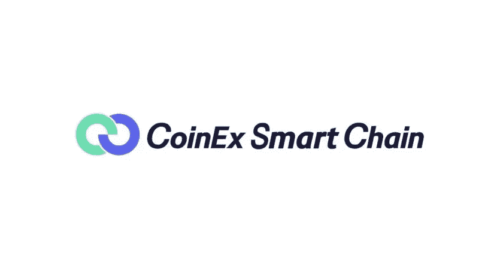

# 如何在 CSC 上开发您的 DAPP

> 原文：<https://medium.com/coinmonks/how-to-develop-your-dapp-on-csc-9e149766d164?source=collection_archive---------41----------------------->

分散式应用程序类似于您使用的移动应用程序。唯一的区别是应用程序是集中的，而 DApp 是分散的。如果你想下放权力，它必须建立在区块链(CSC)的基础上。

DApps 的功能就像桌面或手机上的普通应用程序一样。它们也可以作为网页。唯一的区别是，它不像其他应用程序和网页一样托管在任何本地或云服务器上。DApps 在公共区块链上工作，如 CoinEx 智能链，它只不过是一个节点网络。

***DAPP 的一些特性有***

-在公共区块链上运行。DApps 在公共区块链上运行，这意味着任何人都可以加入这样的网络并参与其中。公共区块链的一个例子是我们的 CoinEx 智能链，在这里您可以建立任何类型的 DApp，无论是金融、收藏、游戏还是其他。

-开源。DApps 是开源的，这意味着任何人都可以在这样的网络中看到源代码。它防止 DApp 源代码被更改和修改，使其安全。

-它使用代币。DApps 使用令牌进行操作。令牌是分散的资产或智能合约，如构建在 CoinEx 智能链上的 CoinEX 令牌(CET)。令牌是在加密算法的帮助下生成的。加密算法是为 DApp 开发编译的程序。

***从你的 DAPP 中赚钱的一些方法***

1.令牌启动

从 DApp 中获得收入的一个基本属性是用一个令牌支持它，并将其推向大众销售，一个很好的例子是在 CSC 上运行的 CET。

2.收取交易费

收取一定的交易费有助于 DApps 货币化。这种方法已被证明是有利可图的 DApps，如 CoinEx 交易所运行在 CSC，CSC 提供了一个非常低的交易费用相比，其他区块链网络。

3.会员/订阅

在你的合同中加入会员计划或订阅将有助于你的 DApp 货币化。

4.广告

***发展 DAPP 之路***

1.认识到问题——DApp 开发就是要识别问题并弄清楚这个应用程序是否能够解决它们。

2.概念验证—在概念验证中，您测试并分析您的 DApp 模型的潜力。这是 DApp 发展的一个重要过程。

3.选择一个区块链——一旦概念验证(POC)成功，就去为您的 DApp 开发寻找完美的分布式账本，这是 CoinEx 智能链的用武之地，CSC 是开始开发您的 DApp 的完美区块链，因为它具有许多增值优势，这是您执行计划的下一步

***为什么选择 CSC***

*   完全 EVM 兼容性—以太坊上的 DApps 可以直接迁移到 CSC
*   无需许可且更加分散—基于 staked CET 的排名，支持多达 101 个节点
*   低费用高性能—其次，以极低的交易费用阻止生成时间

4.启动您的应用程序-测试后，您就可以启动您的 DApp 了。然而，如果你在 DApp 开发阶段仓促行事之前小心谨慎，那将是最好的。

CSC 致力于为区块链构建一个基础设施，并遵循去中心化和无权限块生成的原则，使您可以轻松构建自己的去中心化应用程序，为高性能事务提供支持。

CoinEx 智能链是去中心化和节能的。CSC 为诸如低吞吐量、少量交易和高交易费用的现代问题提供了解决方案。总的来说是“高成本低效率”

在 Coinex Smart Chain 上开发 DAPP 非常有效、直接

1.  你的第一步是连接到我们的测试网络[https://testnet.coinex.net/](https://testnet.coinex.net/)

2.编译和运行——连接到我们的测试网后，你开始你的 DApp 编译，你编译和运行，并确保一切运行良好。

3.调试并发布 DApp —您检查错误。慢慢来，因为它在进入生产服务器后是不可改变的。

探索我们的开发者文档【https://docs.coinex.org/#/en-us/introduction 

您可以通过设置您的帐户和探索更多功能，在 3 个步骤中参加任何 DeFi 项目。

1.  拿你的钱包

2.存款

3.探索 CSC 项目

***DAPP 发展的好处***

*   **零停机时间** —一旦智能合同部署在区块链上，整个网络将始终能够为希望与合同互动的客户提供服务。因此，恶意行为者不能发起针对单个 dapps 的拒绝服务攻击。
*   **隐私** —您不需要提供真实世界的身份来部署 dapp 或与之交互。
*   **抵制审查** —网络上没有任何一个实体能够阻止用户提交交易、部署 dapps 或从区块链读取数据。
*   **完整的数据完整性** —由于加密原语，存储在区块链上的数据是不可变的、无可争议的。恶意行为者无法伪造已经公开的交易或其他数据。
*   **不可信计算/可验证行为** —智能合同可以被分析，并保证以可预测的方式执行，而无需信任中央机构。这在传统模型中是不成立的；例如，当我们使用网上银行系统时，我们必须相信金融机构不会滥用我们的金融数据、篡改记录或遭到黑客攻击。

> 加入 Coinmonks [电报频道](https://t.me/coincodecap)和 [Youtube 频道](https://www.youtube.com/c/coinmonks/videos)了解加密交易和投资

# 另外，阅读

*   [WazirX vs coin dcx vs bit bns](/coinmonks/wazirx-vs-coindcx-vs-bitbns-149f4f19a2f1)|[block fi vs coin loan vs Nexo](/coinmonks/blockfi-vs-coinloan-vs-nexo-cb624635230d)
*   [本地比特币评论](/coinmonks/localbitcoins-review-6cc001c6ed56) | [加密货币储蓄账户](https://coincodecap.com/cryptocurrency-savings-accounts)
*   [什么是融资融券交易](https://coincodecap.com/margin-trading) | [成本平均法](https://coincodecap.com/dca)
*   [支持卡审核](https://coincodecap.com/uphold-card-review) | [信任钱包 vs 元掩码](https://coincodecap.com/trust-wallet-vs-metamask)
*   [Exness 点评](https://coincodecap.com/exness-review)|[moon xbt Vs bit get Vs Bingbon](https://coincodecap.com/bingbon-vs-bitget-vs-moonxbt)