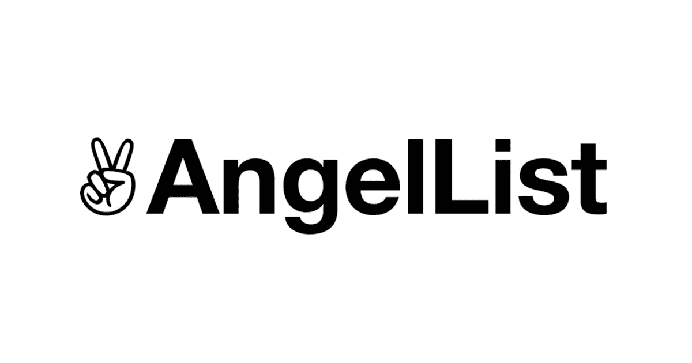

# 如何勤奋一个 Web3 天使投资？

> 原文：<https://medium.com/coinmonks/how-to-diligence-a-web3-angel-investing-9e5444f0082b?source=collection_archive---------33----------------------->

# **为什么要天使投资？**

在过去的几年里，我们看到了技术的指数级进步，这主要是由远程工作和全球化的飞速发展推动的。区块链技术已经开始在这些过程中出现，并帮助了全球化和进一步的进步。

整个过程已经开始形成一个数字功能的生态系统，在正常范围之外获得人才，并通过不同的分布式渠道帮助接触更多的受众。

整个生态系统创造了一个机会渠道，通过这个渠道，个人和/或实体可以发现新的、创新的和基于公用事业的企业，通过天使投资参与进来，寻求理想的投资回报，并帮助向 Web3 发展。

# **如何加入 AngelList 辛迪加？**

通常风险投资(VP)更专注于特定的行业和商业模式。许多人没有所需的时间来了解整个过程，他们只需要他们的回报。他们可以是投资者和项目方的集合者。他们在与其他人同等的水平上提供高流动性。

要加入 AngelList 辛迪加，你需要去 [AngelList](https://www.angellist.com/) 申请成为投资者。这个过程需要你目前的财务状况，以及你对创业的期望。在 AngelList 的团队审查你的申请后，你将能够研究和了解进入 Web3 领域的公司，并据此进行投资。

# **一个 Web3 天使投资的尽职标准**

*   **团队和项目探索**

Web3 领域最重要的标准是团队。团队成员可信吗？他们是否具备支持其主张所需的经验？尝试安排与创始人或团队成员的会议来验证这些细节。探索高增长率领域中的项目。

*   **估值和规模**

Web3 领域的项目经历了快速的发展，并导致了高度的饱和。需要进行计算，以了解当前成本是否合适。市值、通过原生代币获得的股息以及履约水平有助于确定估值，并揭示与同一市场空间中的竞争对手相比，该项目是否可投资。

*   **指标和风险因素**

在 Web3 空间中，关于项目的数据是高度透明的。使用基于指标的平台，可以分析每月的增长百分比，这可以表明项目的盈利能力，也可以显示内部增长的空间。考虑风险因素也很重要，因为我们必须权衡每一个风险因素。

*   **评估什么和如何评估**

我们要问一些问题来提高我们的投资判断。这个项目解决了什么重要的问题？项目的效用是什么？项目的效用对利益相关者有多大吸引力？团队将如何检查截止日期？

*   **基于经验和审查的决策**

合乎逻辑的想法是，在某个时候，尝试了类似的项目，但并不是所有的项目都获得了成功。这将真正有助于根据失败的临界点做出决策并与之匹配。通过 twitter 和 discord 来自社区的评论确实有助于理解人们对项目的质量和情绪。

# **上述标准的前 3 个问题**

*   **项目盈利能力**

基于以上几点，项目是否盈利？项目有增长的可能性吗？

对项目的深入分析和市场空间中不可轻易复制和/或击败的独特性创造了优势并提高了盈利能力。

*   **投资回报**

一个人期望的回报是多少？项目产生的广义回报是什么？

这个问题高度依赖于市场竞争和定位。通过调查获得的数据和进度将决定回报。

*   **定位**

你想如何定位你的投资？你想实施什么战略？

会是高风险高回报还是低风险低回报？

投资定位有助于将风险降至最低。

# **结论**

上述标准可以以一种明智的方式实施，以最小化新项目投资中的风险。有了时间和经验，人们可以很容易地分析一个项目，并根据他们的经验做出合理的决策。强大且快速增长的 Web3 系统可以揭示潜在的机会。

> 加入 Coinmonks [电报频道](https://t.me/coincodecap)和 [Youtube 频道](https://www.youtube.com/c/coinmonks/videos)了解加密交易和投资

# 另外，阅读

*   [5 款最佳加密交易终端](https://coincodecap.com/crypto-trading-terminals) | [最佳 DeFi 应用](https://coincodecap.com/best-defi-apps)
*   [在美国如何使用 BitMEX？](https://coincodecap.com/use-bitmex-in-usa) | [BitMEX 评论](https://coincodecap.com/bitmex-review)
*   [最佳期货交易信号](https://coincodecap.com/futures-trading-signals) | [期交所评论](https://coincodecap.com/liquid-exchange-review)
*   [南非的加密交易所](https://coincodecap.com/crypto-exchanges-in-south-africa) | [BitMEX 加密信号](https://coincodecap.com/bitmex-crypto-signals)
*   [MoonXBT 副本交易](https://coincodecap.com/moonxbt-copy-trading) | [阿联酋的加密钱包](https://coincodecap.com/crypto-wallets-in-uae)
*   [Remitano 审查](https://coincodecap.com/remitano-review)|[1 英寸协议指南](https://coincodecap.com/1inch) | [购买 Floki](https://coincodecap.com/buy-floki-inu-token)
*   [MoonXBT vs Bybit vs 币安](https://coincodecap.com/bybit-binance-moonxbt) | [Arbitrum:第二层解决方案](https://coincodecap.com/arbitrum)