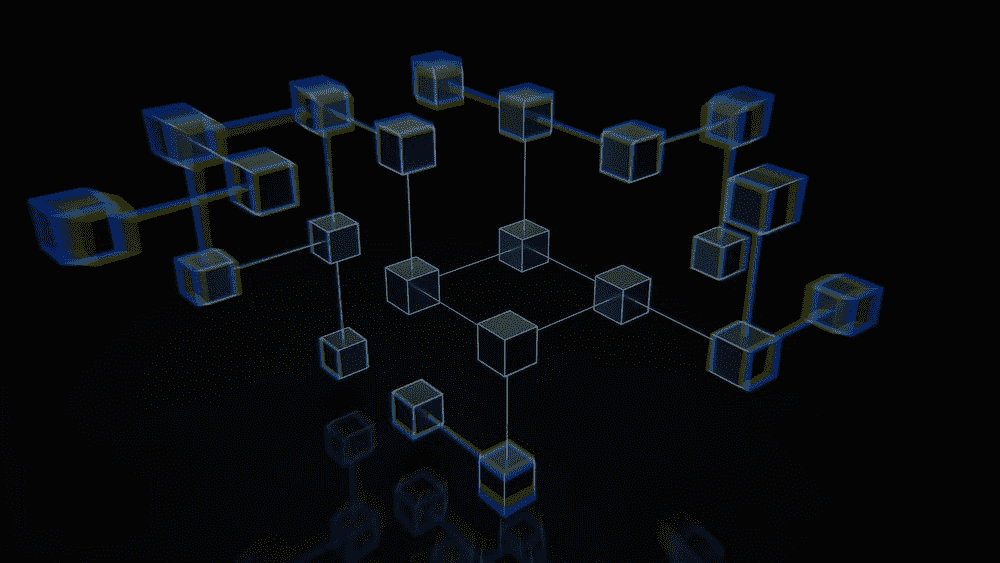

# 如何做一个关于加密项目的研究(DYOR)

> 原文：<https://medium.com/coinmonks/how-to-do-a-research-about-crypto-projects-dyor-ffafed904485?source=collection_archive---------20----------------------->

## 或者如何停止听取关于密码市场的意见

我认为许多人在投资时都面临着一些疑问。你问自己，我现在应该投资吗？现在是投资的好时机吗？我能肯定这个项目不是一场骗局吗？我们中的大多数人无法通过具体的研究来获得这些问题的答案，所以我们去了 youtube，看了一些博客作者关于这个项目的宣传片，认为这个项目真的很好，因为他们谈论得非常好。然后你失去了所有的钱，因为你没有用自己的头脑思考，而是依靠别人的意见。

在这篇文章中，我会试着给你一些步骤，这样你就能对你未来的投资进行自己的研究。还有，我会在本文最后给你留“作业”。\

# DYOR

评估潜在的加密投资时，要考虑的关键因素有:

*   实用工具和使用案例
*   社区
*   团队(开发人员、顾问、合作伙伴)
*   市值
*   网站和白皮书
*   竞争
*   路线图和愿景
*   交易量和流动性
*   循环供应量与总供应量

## 实用工具和使用案例

第一项事务。扪心自问:这种加密货币的目的是什么？它是否解决了一个真正的问题或极大地改进了现有的技术？如果答案不是一个响亮的“是”，那就别费心了。每个加密资产和项目都需要有一个目的。

我们以比特币为例。比特币成为第一种不需要银行的数字货币。它让人们能够完全自主地存储和发送资金，而不必通过金融机构。这直接表明了人们希望减少对金融机构依赖的愿望。比特币解决了真实的需求，这就是为什么尽管短期波动，比特币的价格却逐年攀升。

## 社区

留意拥有强大、**活跃社区**的加密货币，因为这是对加密货币有真正兴趣和信任的好迹象。Reddit 是一个开始研究社区和围绕硬币讨论的好地方，但 Twitter、脸书或 Telegram 上的粉丝群也很有帮助。一群坚定的铁杆支持者(他们知道自己在说什么)是一个非常有希望的迹象。

## 团队(开发人员、顾问、合作伙伴)

并非所有的加密项目都是在一个公平的竞争环境中开始的。如果你当地的咖啡师明天要推出一种加密货币，而谷歌也在同一天推出了一种，那么谷歌的很有可能会获得更多的关注，变得更加……强大。在投资之前，寻找一个项目，该项目的团队声誉良好，有过去的成功经验和在行业中的真实记录。

## 市值

市值是一种加密货币的**稳定性**和**增长潜力**的一个非常有用的指标。它的计算方法是将一枚硬币的现价乘以流通中的硬币总数。一般来说，市值越高(与其他硬币相比)，投资就越安全。

## 竞争

如果有另一个更好或更成熟的类似项目，你的预期加密货币成功的空间很小。虽然几个项目都可以取得成功，即使它们都提供类似的功能，但在生态系统中，对于任何给定的公用事业、解决方案或部门，通常都会有少数行业领导者。例如，Aave 在[DeFi](https://digitalsurge.com.au/education/what-is-defi-decentralised-finance)/借款&借贷服务方面领先，而 Filecoin 则是云存储领域的老大。

虽然有许多项目都有很好的技术，但率先上市是一个很大的优势，你应该考虑一个加密团队，跟踪记录和历史，因为许多人都在谈论一个没有实际产品的大游戏。当投资一个项目时，评估它给生态系统带来的效用，看看是否真的需要它，它是否有能力取代它的竞争对手。

> 加入 Coinmonks [电报频道](https://t.me/coincodecap)和 [Youtube 频道](https://www.youtube.com/c/coinmonks/videos)了解加密交易和投资

# 另外，阅读

*   [在美国如何使用 BitMEX？](https://coincodecap.com/use-bitmex-in-usa) | [BitMEX 审查](https://coincodecap.com/bitmex-review)
*   [最佳期货交易信号](https://coincodecap.com/futures-trading-signals) | [流动性交易所评论](https://coincodecap.com/liquid-exchange-review)
*   [南非的加密交易所](https://coincodecap.com/crypto-exchanges-in-south-africa) | [BitMEX 加密信号](https://coincodecap.com/bitmex-crypto-signals)
*   [MoonXBT 副本交易](https://coincodecap.com/moonxbt-copy-trading) | [阿联酋的加密钱包](https://coincodecap.com/crypto-wallets-in-uae)
*   [雷米塔诺评论](https://coincodecap.com/remitano-review)|[1 inch 协议指南](https://coincodecap.com/1inch) | [购买 Floki](https://coincodecap.com/buy-floki-inu-token)
*   [MoonXBT vs Bybit vs 币安](https://coincodecap.com/bybit-binance-moonxbt) | [Arbitrum:第二层解决方案](https://coincodecap.com/arbitrum)