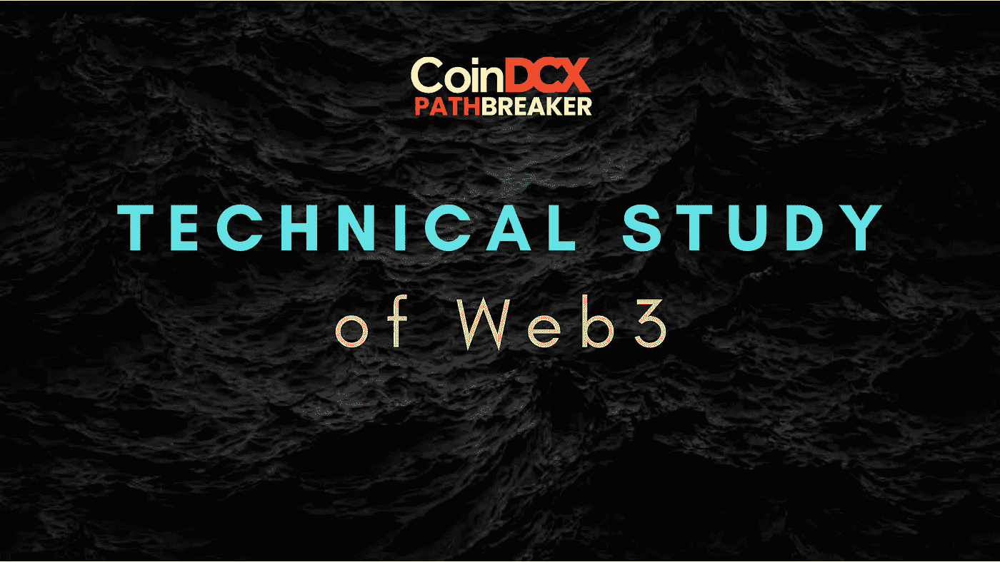
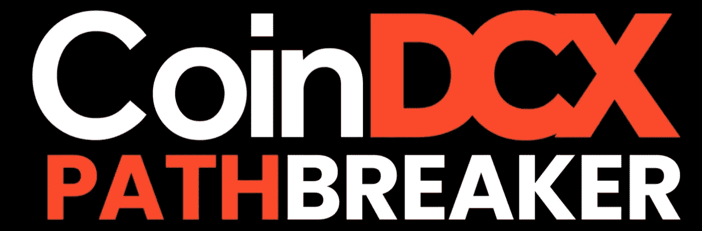

# 如何做好 Web3 项目的技术研究

> 原文：<https://medium.com/coinmonks/how-to-do-a-technical-study-of-web3-project-cfae96b5c79f?source=collection_archive---------29----------------------->

# CoinDCXpathbreaker

在您的项目研究中，有多个潜在的功能也可以发挥作用，如与其他现有项目相同的 USPs，如**流动性池、本地市场、HODLing 福利(空投、独家访问……)、项目机制如何使硬币具有通货紧缩或通货膨胀的性质**。

除此之外，我还会检查危险信号🚩这个项目。作为一个好的研究，你也应该把注意力放在拼图中缺失的部分。在我的书中，排除项目白皮书是绝对的大忌，也是令人担忧的主要原因。如果项目包含了模糊的路线图，我还会记下并特别强调，因为有些项目实际上包含了路线图，只是为了让普通人相信它。❌

最后，我还会记下项目是否有很少或没有 USPs。那么问题来了——项目存在的目的是什么？它的目标是通过它的产品来弥补现有的差距，如果它真的带来了什么，它到底带来了什么样的现实世界的效用？**没有效用的项目总是以失败告终，所以要小心。**

**审计报告**

这是定义项目及其合同安全性的最重要的一层。一份成功发布的审计报告应可供公众审查，并应包括任何风险因素领域。

在这个研究领域中，你应该重视的是项目的集中程度。将项目资金的大部分集中在一个团队成员的控制之下是一个巨大的危险信号🚩对我来说。这样的项目总会有漏洞，黑客可以利用。项目越分散，协议的平稳运行就越好。

**集中风险包括但不限于:**

*   智能合约有多容易被黑客攻击？
*   黑客修改代码有多容易？
*   任何漏洞都会暴露出对流动性的威胁吗？

像 Hacken 这样的优秀审计公司总是强调风险以及风险可能带来的潜在漏洞。他们还会提出最合适的建议来降低这些风险，并建议是否可以通过**多签名钱包、多级因素授权**等来降低风险

在研究一个项目的时候，一定要看一下审计报告，并关注你的报告中潜在的风险领域。这对你自己的学习和研究也将是一个超级强大的教育工具，帮助你以一种好得多的方式理解项目的整个工作机制。

**团队&顾问**

想象一下，有一个非常闪亮的项目在你面前进行营销，部署最好的营销工具，并成为加密领域的下一个大事件…但是有一个陷阱！这个团队是由一些没有任何公众知名度的动漫角色名字组成的。你有兴趣在这上面投资吗？我猜不会。

大多数 DeFi 项目通常保持团队成员匿名。这可能是出于选择或其他专业原因，但很多时候，这种匿名是为了吓唬投资者。那么如何维护自己呢？

随着加密空间的发展，有一个 KYC 审计框架，适用于希望保持匿名的团队成员。审计小组核实项目小组成员的身份，并提交 NFT 作为 KYC 审计完成的证明。这个过程使团队的身份保密，但您可以放心，当内部团队成员利用漏洞并通过恶意手段吸走用户资金时，实际团队是合法的，并且可以在事件发生时承担责任。

另一个选择是让项目团队**完全摆脱束缚**。这是团队信息公开的地方，有可靠来源的链接，如他们公开的 **LinkedIn 个人资料**，并将提供所述团队成员的完整历史和资格。

遗憾的是，以上两个过程都不能保证一个完全安全的项目和/或团队具有 100%的完整性，但是至少有一点可以放心，那就是信息是共享的和部分公开的。任何 100%匿名的团队都是一个巨大的危险信号🚩对我来说，我绝对会避开这样的项目，不管我可能会错过的收益。

**合伙人&/或风险投资人**

在研究一个项目时，这将是我的第二要务。有大牌合伙人支持和/或风险投资者表明项目和团队是值得的。

正如像**以太坊-推送-通知-服务(EPNS)** 这样的 Web3 项目得到了 **CoinDCX** 的支持一样——你可以完全放心，在资金注入之前，投资团队已经做了尽职调查。任何**第一层**或**第二层**项目都应该有合作伙伴的支持，缺少合作伙伴是一个巨大的危险信号🚩在你的书里。

非常感谢 CoinDCX 给我这个机会来撰写如此详细的报告，并成为# CoinDCXpathbreaker 计划的一部分，使我能够与加密领域的每个人分享这些知识。

> 加入 Coinmonks [电报频道](https://t.me/coincodecap)和 [Youtube 频道](https://www.youtube.com/c/coinmonks/videos)了解加密交易和投资

# 另外，阅读

*   [5 款最佳加密交易终端](https://coincodecap.com/crypto-trading-terminals) | [最佳 DeFi 应用](https://coincodecap.com/best-defi-apps)
*   [比特币基地 vs 瓦济克斯](https://coincodecap.com/coinbase-vs-wazirx) | [比特鲁点评](https://coincodecap.com/bitrue-review) | [波洛涅克斯 vs 比特鲁](https://coincodecap.com/poloniex-vs-bittrex)
*   [德国最佳加密交易所](https://coincodecap.com/crypto-exchanges-in-germany) | [Arbitrum:第二层解决方案](https://coincodecap.com/arbitrum)
*   [币安交易机器人](/coinmonks/binance-trading-bots-d0d57bb62c4c) | [OKEx 评论](/coinmonks/okex-review-6b369304110f) | [阿塔尼评论](https://coincodecap.com/atani-review)
*   [最佳加密交易信号电报](/coinmonks/best-crypto-signals-telegram-5785cdbc4b2b) | [MoonXBT 评论](/coinmonks/moonxbt-review-6e4ab26d037)
*   如何在 Bitbns 上购买柴犬(SHIB)币？ | [买弗洛基](https://coincodecap.com/buy-floki-inu-token)
*   [CoinFLEX 评论](https://coincodecap.com/coinflex-review) | [AEX 交易所评论](https://coincodecap.com/aex-exchange-review) | [UPbit 评论](https://coincodecap.com/upbit-review)