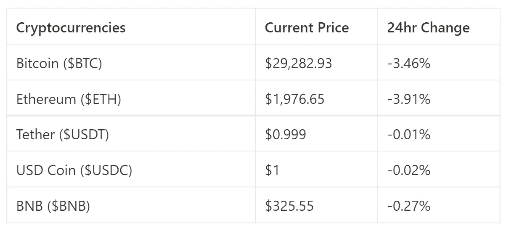
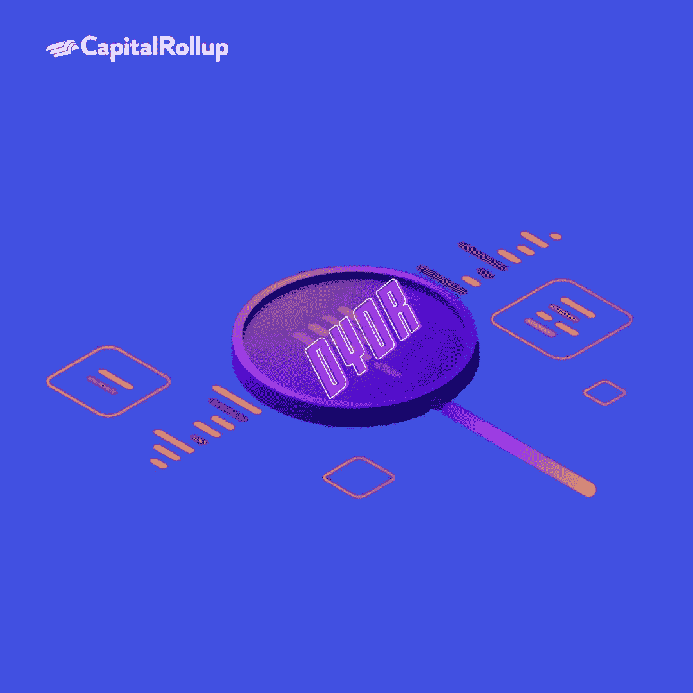
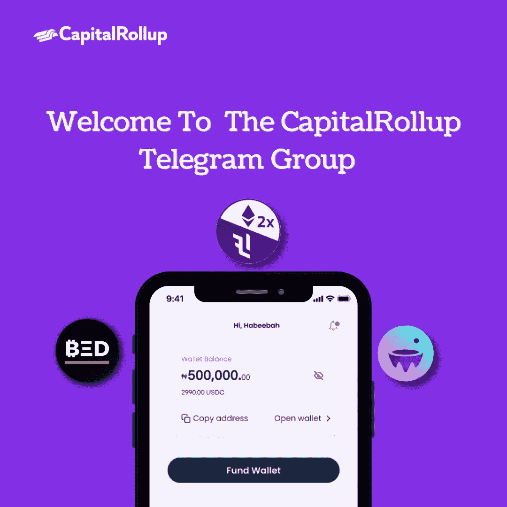

# 如何去 DYOR

> 原文：<https://medium.com/coinmonks/how-to-dyor-55b0c0305cc6?source=collection_archive---------67----------------------->

欢迎来到最新一期的 CapitalRollup Digest！今天的《文摘》是 5 月 24 日的，所以你大概需要 5 分钟。我们马上开始。

*   今天的市场看起来怎么样？(前 5/10 大流行加密货币)

# 如何做密码研究:一步一步的指南

加密市场的发展速度快得你可以眨眼。利用这些市场需要你非常小心。你必须知道如何进行密码研究，成为一个成功的密码交易者。幸运的是，本文解释了如何做到这一点。您将了解如何充分利用这些方法以及密码研究的注意事项。

*让我们一起用正确的方式赚钱*

因此，以下是准确研究密码的最佳方法:

# 加入加密社区

我们现在在社交媒体上有许多致力于提供加密货币更新的社区，因为加密技术已经发展得非常大了。通过加入诸如 Capitalrollup 这样的社区，可以获得正确的信息来使用 crypto 进行评分。

在脸书、WhatsApp 和 Telegram 等平台上有很多群组，你可以在那里了解与密码相关的一切。

[CapitalRollup Telegram Group](https://t.me/+puY5PghyG2oxNzU0)

以下是在学习如何通过任何加密社区进行加密研究时需要考虑的一些事情:

*   **他们活跃多久了？实际上，它们存在的时间越长，就越有可能是合法的。**
*   这个社区有多少活跃成员？一些社区使用多种欺诈方法来增加其成员数量，如付费账户和机器人。区分真假的最好方法是注意有多少活跃成员(发表评论、参加活动、回复消息等的人。).
*   **团队的组织程度如何？一般来说，有专门管理员、更新和事件的组是合法的。当您看到频繁的更新和活动时，您可以知道该群是活跃的。**
*   **社区寻找资料的方法是什么？**他们的预测来自哪里？在选择加密社区时，这是要考虑的最重要的因素之一。

# 参加免费课程

在很多情况下，参加课程会让你对密码学有很好的理解。当你以后做进一步的研究时，你会更好地理解发生了什么，因为你已经有了一个很好的研究框架。一门真正好的加密课程的费用从 15 美元到数千美元不等，而且通常很长。

在 Twitter 上搜索

Twitter 上有很多关于 crypto 的信息。使用 bird 应用程序可以让您了解最新消息。您可以关注许多加密影响者帐户，以获得加密空间的更新。在跟踪他们之前，一定要检查他们的来源。

获取 Twitter 更新的一个好方法是跟踪趋势。这些趋势向你展示了在某个特定的地方人们在谈论什么。你可以找出一个硬币趋势的原因，如果是这样，就据此交易。

# 寻找加密子记录

Subreddits 就像 Reddit 上的社区，人们在那里进行对话。这类似于一个在线论坛。

请随意在子栏目上提问，但不要把每个答案都当成事实。

subreddits 的伟大之处在于，它能帮助你更好地理解硬币。利用不同人的观点来形成你自己的观点是可能的。你可以询问整个社区，而不是依靠某一个人的意见！

通过使用 Reddit 网站或应用程序上的搜索图标并输入子编辑的名称，可以访问子编辑。只需搜索“crypto”——有许多建议可供你探索。

# **·检查加密博客**

有一百多个网站和博客报道加密市场。拜访他们，了解市场趋势。

关于加密博客最好的事情是，他们也有社交媒体账户。当引用他们的来源时，加密影响者经常提到这些博客的社交媒体账户。最大的加密博客活跃在社交媒体上，所以你可以很容易地跟随他们获得最热门的市场独家新闻！最大的加密博客活跃在社交媒体上，所以你可以很容易地跟随他们获得最热门的市场独家新闻！

为了正确地进行加密研究，使用这些工具的最佳方式是将它们结合起来。利用你在这些资源中找到的信息。避免被你的研究弄得不知所措。一旦你掌握了基础知识，是时候加入交流了。选择一个好的交易所对你的秘密之旅的成功至关重要

# 琐事🤔

**比特币被认为是最成熟的加密货币，因为其价格非常稳定。**

A.真实的

B.错误的

在下一期的 CapitalRollup Digest 中找到答案😉

**最后一个小问题的答案是 b .)法定货币**

# 每日一词！

💡**DYOR——自己做调查**

密码学中最重要的概念之一。不要只听别人说的。花时间自己验证一下。

**用在句子中的术语:**
*——“显然这个 NFT 项目是个骗局！它被拉成了地毯。我应该做我自己的* ***DYOR。***

*   ***社区更新📢***

*我们将很快与 5 个行业领导者组织一个 Twitter 空间会议，在那里我们将讨论加密市场和 web3 上的一切。你可以期待它😎*

# *我们今天在读什么📰*

*2022 年 Reddit 上最值得购买的加密软件。 [***阅读更多***](https://www.business2community.com/cryptocurrency/best-crypto-to-buy-reddit)*

***你的密码研究 7 点清单。** [***阅读更多***](https://www.fool.com/the-ascent/cryptocurrency/articles/your-7-point-checklist-to-crypto-research/)*

***与朋友一起学习和投资加密💰***

*当您邀请您的朋友开始使用 CapitalRollup 进行有利可图的投资时，您将获得独特的奖励。*

*💬对 CapitalRollup Digest 有什么反馈吗？ [**告诉我们！**](mailto:hi@capitalrollup.com)*

> *加入 Coinmonks [电报频道](https://t.me/coincodecap)和 [Youtube 频道](https://www.youtube.com/c/coinmonks/videos)了解加密交易和投资*

# *另外，阅读*

*   *[氹欞侊贸易评论](https://coincodecap.com/anny-trade-review) | [霍比保证金交易](/coinmonks/huobi-margin-trading-b3b06cdc1519)*
*   *[分散交易所](https://coincodecap.com/what-are-decentralized-exchanges) | [比特 FIP](https://coincodecap.com/bitbns-fip) | [Pionex 审查](https://coincodecap.com/pionex-review-exchange-with-crypto-trading-bot)*
*   *[用信用卡购买密码的 10 个最佳地点](https://coincodecap.com/buy-crypto-with-credit-card)*
*   *[最好的卡达诺钱包](https://coincodecap.com/best-cardano-wallets) | [Bingbon 副本交易](https://coincodecap.com/bingbon-copy-trading)*
*   *[印度最佳 P2P 加密交易所](https://coincodecap.com/p2p-crypto-exchanges-in-india) | [柴犬钱包](https://coincodecap.com/baby-shiba-inu-wallets)*
*   *[8 大加密附属程序](https://coincodecap.com/crypto-affiliate-programs) | [eToro vs 比特币基地](https://coincodecap.com/etoro-vs-coinbase)*