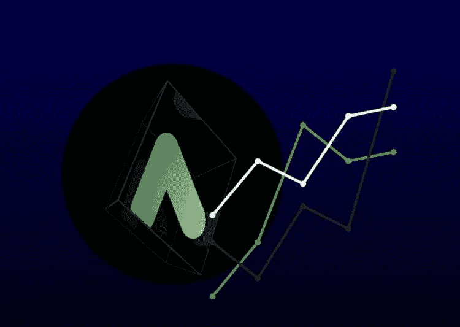

# 如何用锚定借贷协议赚取 19%的 APY？

> 原文：<https://medium.com/coinmonks/how-to-earn-19-apy-with-anchor-lending-protocol-7026c3db7998?source=collection_archive---------35----------------------->

[https://www.instagram.com/p/CbudRzNIuFB/?igshid=YmMyMTA2M2Y=](https://www.instagram.com/p/CbudRzNIuFB/?igshid=YmMyMTA2M2Y=)

去年 2 月，Terra 宣布他们将向 Anchor 协议注入 4 . 5 亿美元。这个贷款协议是如何工作的？为什么这对 Terra 如此重要？

该协议在借贷双方之间建立了一个市场，但是这个市场的 APY 不是由供求波动决定的，而是由多个 PoS 区块链协调报酬，使得…