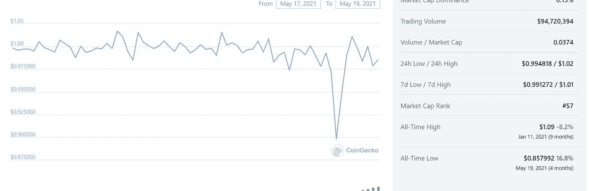
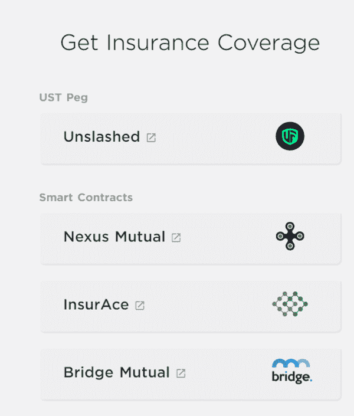
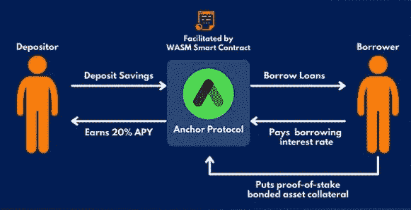
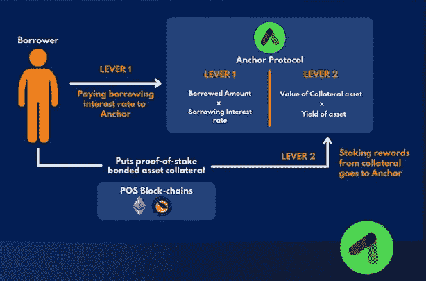

# 如何在稳定的收入上赚取 20%的 APY

> 原文：<https://medium.com/coinmonks/how-to-earn-20-apy-on-stablecoins-d2b2fbde4f4c?source=collection_archive---------27----------------------->

这篇文章的任何部分都不是财务建议。永远做你自己的研究。

如果我告诉你，你持有的现金每年可以获得 20%的利息，你会怎么想？在这个世界上，传统银行储蓄账户给你提供的利率只是这个利率的一小部分，你会感到惊讶，对吗？有了 Defi 的魔力，它包括移除第三方切割接受者，这已经成为可能。在这篇文章中，我将谈论 Terra 生态系统和 LUNA 正在努力实现的目标，以及你如何从中获利，并讨论相关的风险。

# **露娜、UST 和主播协议**

因此，为了使这篇文章尽可能简洁，我将尝试简要地回顾一下这个过程的每个方面。

在撰写本文时，LUNA 是一种加密货币，目前交易价格为 90 美元，市值为 320 亿美元。这是一个类似以太坊的第一层智能合约平台。LUNA 的全部目标是创建算法分散的稳定的 coins，在这种情况下，UST。这解决了密码世界中的一个主要问题，因为大众对集中的稳定密码有不确定性和怀疑，例如像 USDT。人们对此有负面感觉，因为他们担心 USDT 背后的 Tether 公司没有足够的外汇储备来维持人民币盯住美元的汇率制度。有传言称，他们不断制造更多的 USDT，同时将资金投资于股票和债券等其他资产类别。如果发生灾难性事件，这可能导致 USDT 价格暴跌，失去盯住美元的机制。

这就是 UST 的用武之地，如前所述，它是 Terra 生态系统中分散的稳定核心。无需深入研究，UST 可以保留其与美元的挂钩，因为任何时候铸造更多的 UST，都会烧掉等量的卢纳。这也让 LUNA 超通缩。UST 股市最近证明了自己的实力，与 LUNA 一道暴跌 40%。当然，这并不是说它没有任何风险。
事实上，在 2021 年 5 月 19 日，我们看到 UST 跌至 0.85 美元(见下图)。

那么，为什么 UST 会失去联系汇率制呢？
5 月 19 日是市场绝对看跌的一天。害怕的人把普通硬币和稳定硬币都换成了美元或欧元，他们中的许多人再也不会回到 crypto 了。
5 月 20 日至 5 月 24 日，UST 在 0.96 美元至 0.99 美元之间徘徊，5 月 25 日回升至 1.25 美元。相比之下，USDC 稳定币在整个时期都在 0.99 美元和 1 美元之间波动。
尽管类似的事情可能会再次发生，但自那以后，Terra 团队已经提高了 peg 算法的稳定性(如增加支持 UST 的 BTC 储备)，为新的熊市做准备。这只能证明 Defi 中的任何东西都不是没有风险的。

此外，在 9 月份的崩盘中，UST 是最稳定的货币。

为了结束这一点，你可以在 Anchor 协议上购买智能合约风险和钉住风险的保险(见下图)。据我所知，这将花费你每年 2.5%的 APY，将你的收益率从 19.5%降至可接受的 17%。

# **锚协议**

这就是**主播协议**的用武之地。

锚协议是建立在区块链土地上的分散金融(DeFi)货币市场储蓄和借贷平台。
它是由 Terraform Labs 建造的，该公司也是 Terra 平台及其相关产品如 LUNA、UST 和 Mirror Protocol 的核心开发人员。

**锚协议是如何工作的？**

Anchor 协议的工作方式类似于银行，可以促进存款和贷款，只是银行被自动智能合同所取代。该协议的智能合同自动处理存款和贷款。

Anchor 以其诱人的 19.5%的收益率激励贷款人将其 UST 存入协议。然而，借款人没有锁定期，因此他们可以随时还清贷款。但是，Anchor 确实需要 21 天的解除绑定期才能访问您的担保品。

**主播如何能够提供 19.5%的收益率？**

Anchor 支付给储户的 19.5%的固定收益收益主要来自两个杠杆:
借款人支付的借款利息
通过借款人抵押品获得的赌注回报

**现在让我们进入有趣的部分，**这是你阅读本文的目的。像你我这样的人怎么能靠他们的菲亚特赚到 19.5%的 APY。

要使用锚协议，你必须先把 ust 放在你的 [Terra Station 钱包里](https://chrome.google.com/webstore/detail/terra-station-wallet/aiifbnbfobpmeekipheeijimdpnlpgpp)。
你可以购买 UST:
你可以购买 UST:
-通过 Transak
直接在 Anchor Protocol 上-直接在 Kucoin、比特币基地、Uniswap 或 Terra swap
-通过在大多数交易所购买 LUNA->发送到 Terra Wallet->将 LUNA 转换为 UST
一旦你的 Terra Station wallet 中有了 UST，你就可以直接前往 [Anchor Protocol web app](https://app.anchorprotocol.com/) ，在那里会提示你连接 Terra Station wallet。

**在 WEB APP** 中要遵循的步骤导航至“赚取”选项卡，然后点击“存款”将您的 UST 存入锚定协议。
交易完成后，你的资金应该会在你的 Terra wallet 中显示为 aUST(与 UST 挂钩，因此 1 aUST= 1 UST)，你应该会在“总存款”中看到你的预期存款
。就这样，你的 UST 现在通过 Anchor 协议每天都可以获得利息。

> 加入 Coinmonks [电报频道](https://t.me/coincodecap)和 [Youtube 频道](https://www.youtube.com/c/coinmonks/videos)了解加密交易和投资

# 另外，阅读

*   [BlockFi 信用卡](https://coincodecap.com/blockfi-credit-card) | [如何在币安购买比特币](https://coincodecap.com/buy-bitcoin-binance)
*   [火币交易机器人](https://coincodecap.com/huobi-trading-bot) | [如何购买 ADA](https://coincodecap.com/buy-ada-cardano) | [Geco。一次审查](https://coincodecap.com/geco-one-review)
*   [加密副本交易平台](/coinmonks/top-10-crypto-copy-trading-platforms-for-beginners-d0c37c7d698c) | [五大 BlockFi 替代方案](https://coincodecap.com/blockfi-alternatives)
*   [CoinLoan 点评](https://coincodecap.com/coinloan-review)|[Crypto.com 点评](/coinmonks/crypto-com-review-f143dca1f74c) | [火币保证金交易](/coinmonks/huobi-margin-trading-b3b06cdc1519)
*   [Bybit vs 币安](https://coincodecap.com/bybit-binance-moonxbt)|[stealth x 回顾](/coinmonks/stealthex-review-396c67309988) | [Probit 回顾](https://coincodecap.com/probit-review)