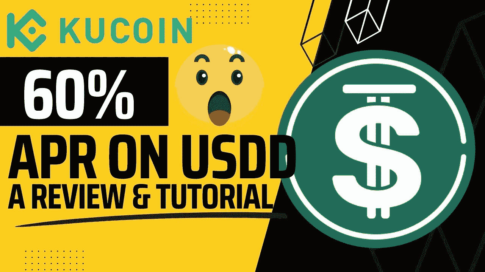
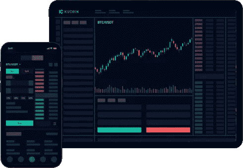
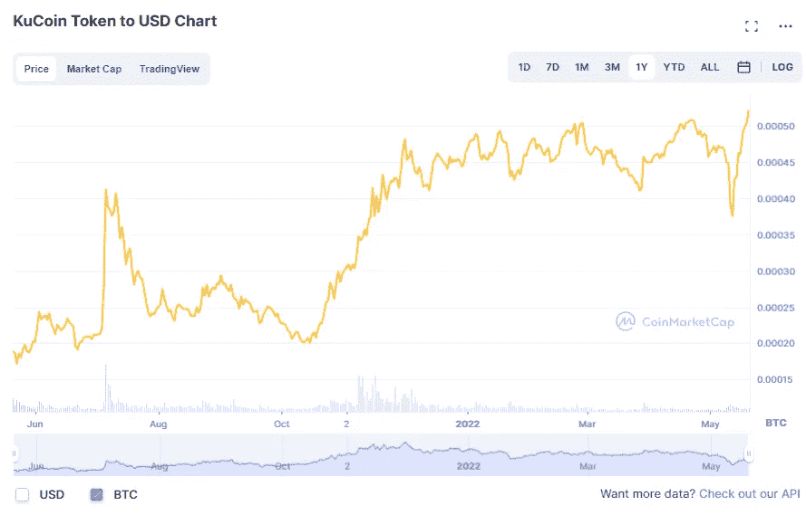
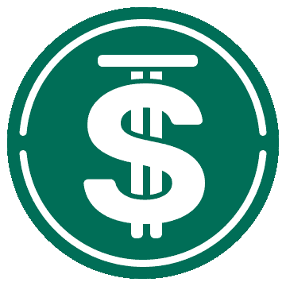
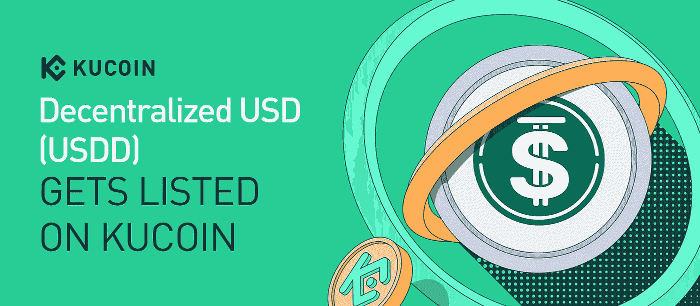
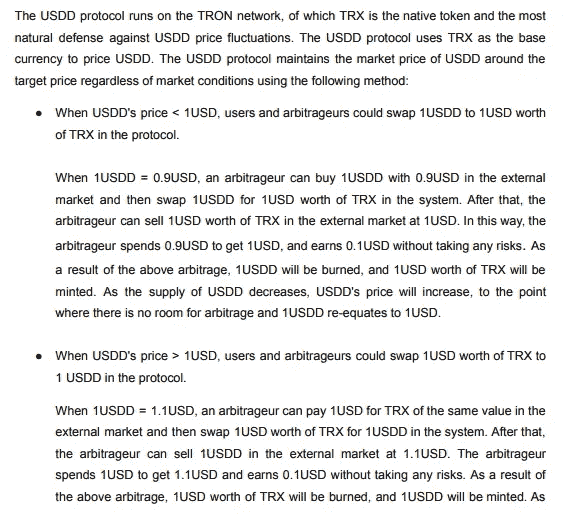
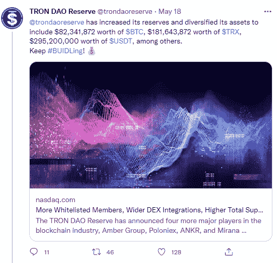
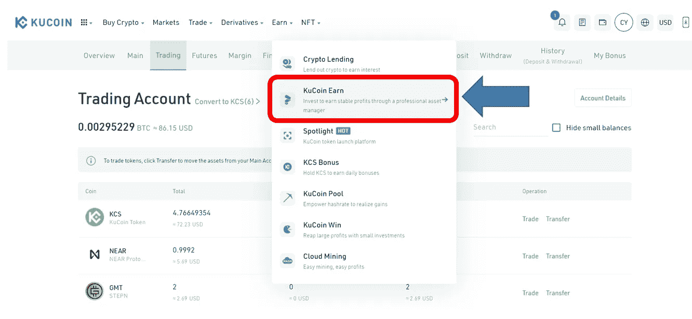
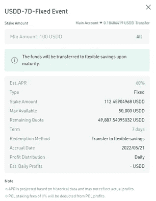

# 如何在库币网上赚取 60%的 USDD 稳定币年利率:回顾与教程

> 原文：<https://medium.com/coinmonks/how-to-earn-60-apr-on-usdd-stablecoin-with-kucoin-a-review-tutorial-ced909409f2c?source=collection_archive---------4----------------------->

# 库币概述

L 于 2017 年成立， [Kucoin](https://www.kucoin.com/r/af/rJH29LZ) 是**每日现货交易量最大的加密货币交易所**之一，在 200 个国家和地区拥有超过 1800 万用户。作为隐藏的宝石之乡，Kucoin 最近受欢迎程度的上升可归因于其热衷于上市中小市值的高质量潜在项目，以迎合具有不同投资偏好的各种投资者——因此被恰当地称为“**人民交易所**”。事实上，Kucoin 自称是排名前 1 的 Altcoin 交易所，拥有 600+(还在统计中)的上市硬币和 8000 亿美元的累计交易量。难怪它的代币 KCS 在最近几年迅速升值，甚至在大部分时间里跑赢了比特币。

KCS vs BTC. Image taken from coinmarketcap.

# 什么是 USDD？

I 由创道储备、****发行，是一种去中心化、算法稳定的盯住美元的货币**以建立一个稳定、去中心化、防篡改的美元体系。它将有一个内置的激励机制和反应灵敏的货币政策，这将使 USDD 能够自我稳定，抵御任何价格波动，并有助于巩固 USDD 作为真正结算货币的价值。USDD 最近于 2022 年 5 月 16 日在库币交易所上市。**

****

# **像 UST 吗？**

**随着最近卢娜和 UST 的惨败席卷全球，算法稳定这个术语无疑会让加密货币投资者不寒而栗。事实上，如下图所示，快速浏览一下 USDD [白皮书](https://usdd.io/USDD-en.pdf)就会发现，通过与它的姊妹货币卢纳的相互关系，它与 UST 保持盯住美元的算法机制有着惊人的相似之处。**

****

**Image taken from the USDD whitepaper.**

**然而，TRON 区块链的创始人贾斯汀·孙(Justin Sun)在《露娜》/《UST 揭秘》之后最近接受 Coindesk 的[采访](https://www.coindesk.com/markets/2022/05/14/justin-sun-talks-usdd-stablecoin-in-wake-of-lunaust-unravel/)时，谈到了算法稳定的和之间的几个关键差异**，总结如下:****

*   **UST 的垮台归因于其过高的杠杆率，甚至连卢纳基金会卫队(LFG)都无法防范，事实上，这导致了一系列事件的迅速发展，现在被称为“死亡螺旋”，即大规模出售其 BTC 储备。**
*   **另一方面，USDD 将得到 100 亿美元国债的支持，其中一半主要是 USDC 和 USDT，其余的在 BTC 和 TRX。稳定的核心是第一道防线；如果需要，其他资产可以清算。这个双层安全网给财政部带来了更大的稳定性。**

****

# **如何利用美味的 USDD 60%的年利率？**

**U SDD 可以进入 [USDD 站点](https://usdd.io/#/)的众多流动资金池，获得 30%的 APR，或者只需在[Kucoin](https://www.kucoin.com/r/af/rJH29LZ)**下注，即可获得 7 天 60%的限时促销！****

*   ******在这里注册** **为 Kucoin** [，如果你还没有账户的话！](https://www.kucoin.com/r/af/rJH29LZ)****
*   ****和 USDT 或 USDC 一起买 USDD。****
*   ****去库科恩镇。****

********

*   ****选择 USDD-7D 定位池。****

********

*   ****指出你想下注的 USDD 金额。最低赌注金额为 100 USDD。****

********

*   ****你完了！享受 7 天 60%的 APR 优惠，同时保留下注额度。促销期结束后，赌注恢复到 30%的年利率，这对于稳定的币来说仍然是一个相当慷慨的报价。****

# ****最后的想法****

****对于稳定的货币，脱钩的风险是真实存在的——UST 已经尽力证明了这一点。USDD 是这个领域的新玩家——尽管看起来很有前途，但它作为算法稳定币的成功还有待观察。因此，永远做你自己的研究，不要投资任何你不能失去的钱。我个人最喜欢的稳定币是 USDC 币(在某种程度上还有 USDT 币)，我把它们藏在高收益加密货币账户里，产生被动收入。****

****你对 USDD 有什么看法？欢迎在下面留下你的评论！投资愉快。****

********

****一如既往，这不是财务建议！而只是我投资过的，觉得值得分享的投资平台。在投资前做好自己的研究，不要存你输不起的钱。下面有什么问题可以随时问我。****

*****如果您喜欢这篇文章，* [*关注&订阅*](/@cybery) *！*****

*****查看以下值得信赖的平台！*****

*****🎁*[*honey gain*](https://r.honeygain.me/CYBER577DD)*一款被动收入 app，从你未使用的互联网带宽中赚钱。* [*免费获得 5 美元*](https://r.honeygain.me/CYBER577DD) *，无需投资。*****

*****🎁* [*蛋糕 Defi*](https://cakedefi.com/?ref=677920) *一站式投资平台，以高达 100%的年利率烘焙被动现金流！* [*在 DFI 用 50 美元存款获得 50 美元奖金*](https://cakedefi.com/?ref=677920) *。*****

*****🎁*[*Nexo*](https://nexo.io/ref/hce5cfdt5o?src=web-link)*一家先进的受监管数字资产机构，提供即时加密贷款，资产年利率高达 36%，是一家交易所，在 200 多个司法管辖区提供 40 多种法定货币的服务。* [*用 100 美元存款获得 25 美元*](https://nexo.io/ref/hce5cfdt5o?src=web-link) 奖金*。*****

*****🎁*[*Hodlnaut*](https://www.hodlnaut.com/join/RTbHxuJMX)*一个强大的加密借贷平台，从您闲置的加密货币中产生被动现金流，年利率高达 9.4%。***在 USDC 存款 1000 美元可获得 30 美元奖金，存款 1500 美元可获得 50 美元奖金。******

******🎁*[*Kucoin*](https://www.kucoin.com/r/af/rJH29LZ)*一个庞大的加密货币交易所，提供有趣的产品，如赌注、免费交易机器人和比特币云挖掘服务。******

******🎁* [*火币*](https://www.huobi.com/en-us/topic/double-invite/register/?invite_code=5t5jb) *一家提供多样化产品、免费空投和交易机器人的加密货币交易所。******

******🎁* [*MEXC*](https://www.mexc.com/en-US/register?inviteCode=mexc-1NAJC) *一种加密货币交易所，拥有有趣的列表和频繁空投的 MX 令牌。******

******🎁*[*Crypto.com*](https://read.cash/@TraderFX/10-tips-to-maximize-earnings-on-honeygain-an-effortless-free-passive-income-app-68535728#bad-link)*一家位于新加坡的加密货币交易所。* [*获得 25 美元*](https://crypto.com/app/fcbsjmf5pb) *在 CRO 赌赢一张红宝石牌。******

******🎁*[*Pionex*](https://www.pionex.com/en-US/sign/ref/mWhH4v29)*一个免费的多功能套利交易机器人，自动化低买高卖的过程，24/7。******

********针对马来西亚投资者********

******🎁*[*Luno*](https://www.luno.com/invite/EDXG2X)*在 BTC 用 100 令吉购买 BTC 获得 25 令吉奖金！******

******🎁*[*Stashaway*](https://www.stashaway.my/referrals/kenleel9jx)*免费投资 6 个月！******

******🎁Wahed code 'KENLIE1' RM10 注册奖金******

******🎁Capbay P2P 代码' 8879c6' RM100 注册奖金******

******🎁* [*亦然*](https://download.versa.com.my/1bAf/referral?deep_link_value=QF218MMB) *用 100 令吉存款获得 10 令吉奖金！******

******🎁*[*KDI*](https://app.digitalinvesting.com.my/registration/signup?referral_code=103433)*用 250 令吉存款获得 10 令吉奖金！******

********接我*** [***中***](https://cybery.medium.com/)***|***[***read . cash***](https://read.cash/r/TraderFX)***|***[***Youtube***](https://www.youtube.com/c/SmartInvestingChannel)***|***[***推特***](https://twitter.com/cybertraderfx)*****

> *****加入 Coinmonks [电报频道](https://t.me/coincodecap)和 [Youtube 频道](https://www.youtube.com/c/coinmonks/videos)了解加密交易和投资*****

# *****另外，阅读*****

*   *****[最佳以太坊钱包](https://coincodecap.com/best-ethereum-wallets) | [电报上的加密货币机器人](https://coincodecap.com/telegram-crypto-bots)*****
*   *****[交易杠杆代币的最佳交易所](https://coincodecap.com/leveraged-token-exchanges)*****
*   *****[最佳加密分析或链上数据](https://coincodecap.com/blockchain-analytics) | [库币评论](/coinmonks/kucoin-review-bb5e3071f0e)*****
*   *****[NFT 十大市场造币集锦](https://coincodecap.com/nft-marketplaces)*****
*   *****[AscendEx Staking](https://coincodecap.com/ascendex-staking)|[Bot Ocean Review](https://coincodecap.com/bot-ocean-review)|[最佳比特币钱包](https://coincodecap.com/bitcoin-wallets-india)*****
*   *****[Bitget 回顾](https://coincodecap.com/bitget-review) | [双子 vs 区块链](https://coincodecap.com/gemini-vs-blockfi) | [OKEx 期货交易](https://coincodecap.com/okex-futures-trading)*****
*   *****[美国最佳加密交易机器人](https://coincodecap.com/crypto-trading-bots-in-the-us) | [经常性回顾](https://coincodecap.com/changelly-review)*****