# 如何在稳定的硬币上赚取 672%的 APY:大象货币介绍

> 原文：<https://medium.com/coinmonks/how-to-earn-672-apy-on-a-stablecoin-an-introduction-to-elephant-money-d2c55bc379c5?source=collection_archive---------2----------------------->

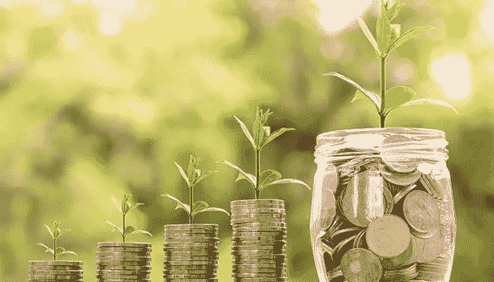

Image taken from SpyreStudios

尽管我对白天的工作充满热情，但我也寻求拓展被动收入的渠道，希望或许能早点退休？虽然加密货币提供了传统金融领域很少出现的利润丰厚的赚钱机会，但它也充满了陷阱和骗局。最近有很多关于大象金钱的炒作，产生了 672%的 APY 回报率，对此我持怀疑态度。这仅仅是另一个没有内在价值的被炒作的、名字奇特的项目吗？然而，在通过谷歌深入研究进行细致的研究后，我很快发现自己加入了这股潮流；毕竟，除了成为生态系统的一部分，还有什么更好的方式来了解生态系统呢？

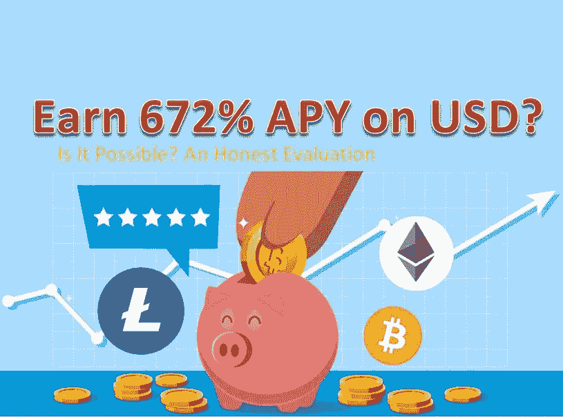

# 一个介绍:大象钱的聪是谁？

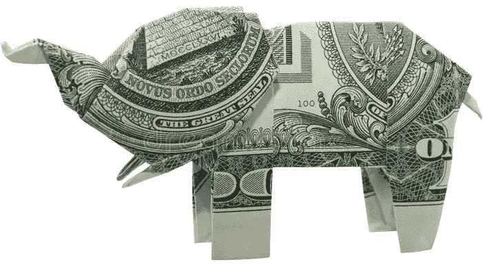

大象金钱是托尼·帕金斯(Tony Perkins)在 2021 年 5 月开发的一个项目，他也被称为 BankTeller。Tony 拥有麻省理工学院的计算机科学学士学位和波士顿大学的 MSAS 学位，并且在区块链开发方面有着坚实的背景。他创造了大象货币，目的是通过将 BSC 产生的利润复利化，提供高收益和资本增值，而不管市场卖方是谁。你可以在社交媒体上关注他，官方的大象金钱电报集团，也可以在博客上关注他，比如 T2 媒体，在那里他会定期发布项目的最新消息。

我欣赏大象金钱背后团队的透明度，因为这给项目带来了安全感和真实性；相比之下，比如说，一个由匿名实体创造的创造性命名的令牌，它在经典的“shitcoins”场景中泵送和转储，这在当今已经变得太普遍了。

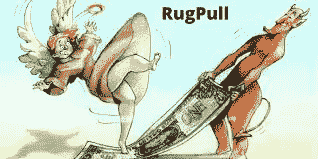

Image taken from MyCryptoFitness

# 安全审计

大象金钱有 [Certik](https://www.certik.com/projects/elephant) 和 [Solidity Finance](https://solidity.finance/audits/ElephantMoney/) 两次安全审计。

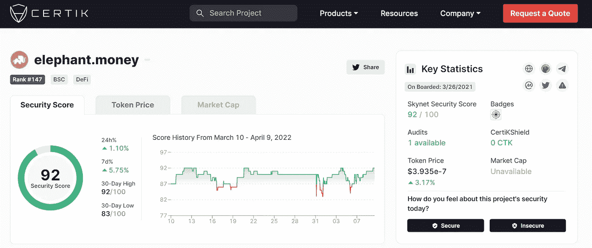

Image taken from Certik

根据下面列出的一些参数，它在 Certik 上得到 92 分(满分 100 分)。

虽然不完美，但这是一个令人印象深刻的分数。但当然，与所有加密货币产品一样，没有绝对的保证——所以一定要有所保留，只投资你觉得合适的一部分资金。

 [## 最佳加密税务软件——评论和比较

### 不管你是刚接触加密还是已经在这个领域呆了一段时间，你都需要交税。

medium.com](/coinmonks/best-crypto-tax-tool-for-my-money-72d4b430816b) 

# 大象生态系统的硬币

有 2 个这样的代币，即大象钱和大象钱稳定，厚脸皮地创造了鼻子。

# 大象的钱

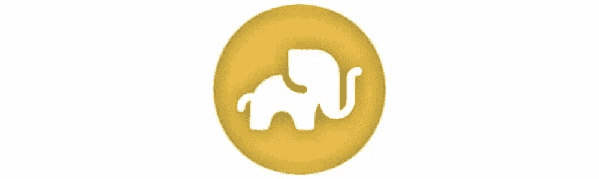

大象硬币是生态系统的原生令牌，基于币安智能链，目前交易价格为 0.0000003916 美元，这表明其价格比近一年前上涨了 5300%。

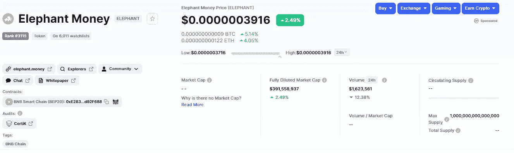

Image taken from coinmarketcap

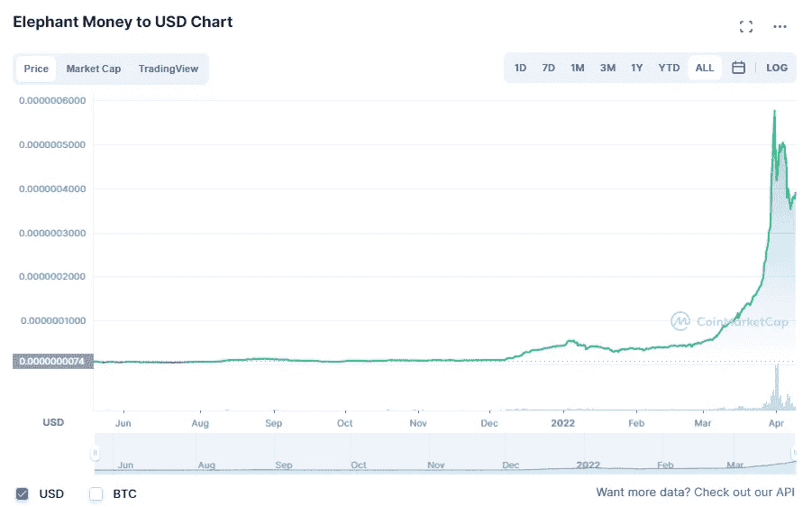

Image taken from coinmarketcap

令牌地址:0 xe 283d 0 E3 b 8 c 102 badf 5 e 8166 b 73 e 02d 96d 92 f 688

大象的钱有很好的象征经济学。一开始，有 1000 万个大象代币的初始供应；其中 49%被送进了墓地，被烧掉以限制供应。1%用于开发和营销，25%用于锁定流动性(Pancake LP)，其余 25%通过流动性驱动用于社区。墓地本质上是一个燃烧地址，具有自动平衡燃烧机制，在需要时将供应的所有权重新平衡到 50%，防止持有者随着时间的推移被稀释，从而确保奖励系统的可持续性。

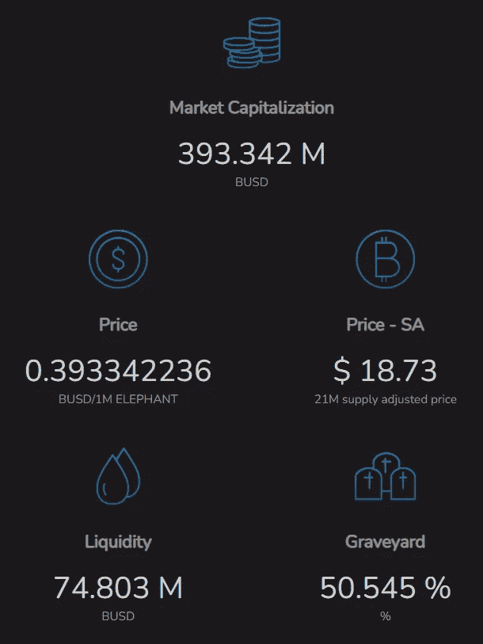

Elephant Money

> 大象。金钱是一种经得起未来考验的方式，可以使 BSC 的利润复利。大象是我们在币安智能链上的价值商店。大象令牌的所有转让都收取 10%的交易费，以建立永久的社区信任。这些费用在支付给现有持有者和锁定流动性之间平均分配。

大象硬币是一种反射硬币——只要拿着这个硬币，你就能看到你钱包里的硬币随着时间毫不费力地增加。发生这种情况是因为大象金钱每笔交易的 10%流向了现有代币持有者和锁定的流动性，在他们之间平均分配。因此，只需将代币放在钱包里——随着交易在区块链上进行，您投资组合中的大象硬币数量会随着时间的推移而自动增加。

根据我自己的经验，在 24 小时内，我投资组合中的大象代币数量从 181，890，053 增加到 181，904，508。这相当于增加了 14，455 枚硬币，在一天的时间里，我的持有量增加了 0.008%。事实上，这并不是一个值得夸耀的令人印象深刻的数字——然而，随着时间的推移，以及大象货币本身价格的增长，每天的小增量确实会累积成一个相当大的数额。

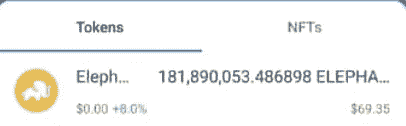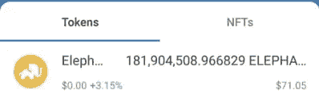

因此，钱包中不断增加的硬币数量产生了被动现金流，抵消了任何可能随着大象令牌价格下降而发生的价格贬值，并且如果大象硬币价格上涨，可能会提供更高的回报，这种增长是由大象生态系统的内在设计推动的，这将引导我们进入下一个问题。

# 大象钱柜(行李箱)

大象货币稳定(TRUNK)是一种稳定的货币，75%由 BUSD 担保，其余 25%由大象货币担保；这两者都被安全地存放在美国国债中。本质上，这意味着 1 个行李箱= 1 个 BUSD = 1 美元。

> 大象。货币稳定是一种经得起未来考验的方式，可以让你的投资组合获得复合利润。锁定你的收益。使用储备铸币大象钱稳定(躯干)。铸造和赎回行李箱只收取 1%的手续费。主干部分抵押为固定的 75% BUSD 和 25%大象，供应比例浮动。这两种抵押资产都安全地存放在美国国债中。其余的象鼻供应可以赎回不断增长的大象国库和象鼻/BUSD 有限责任公司。1%的铸币加工费也用于 100%的 BUSD 薄烤饼。
> 
> 奖励积分在铸造和赎回时产生，分别为铸造/赎回量的 11%和 4%。这些信用被分配给中继赌注池(10%新/ 2%兑换)和性能池(1%新/兑换)。所有资金池每天以其贷方余额的 1%释放资金。
> 
> 大象金库和围绕它构建的用例充当了一个大的/活跃的市场参与者。这与被动的大象墓地不同，后者也保护了大象的价格。大象金库还获得被动反射奖励，确保抵押率高于 1，这是以 25%的面值和 75%的 BUSD 全额赎回大象所必需的。

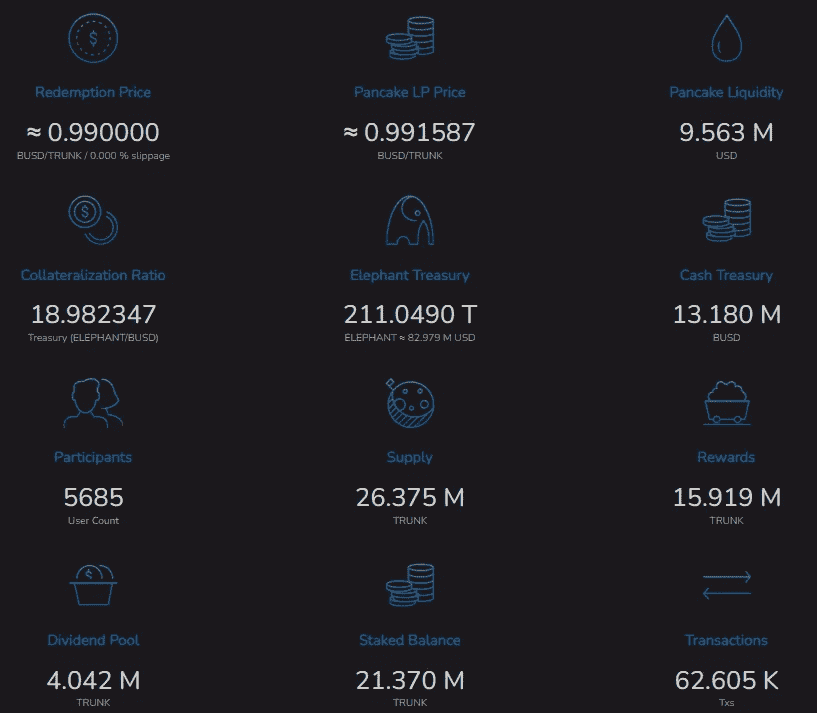

它与流通中的其他稳定货币的区别在于它能够产生丰厚的复利。TRUNK 有两种盈利方式:你可以把它存入年利率为 205%或 672% APY 的 Stampede 永久债券，或者你可以把它存入 trunk native staking，这样你会得到一个波动的年利率

## 后备箱？踩踏事件。滚？术语解释

我曾经被大象金钱生态系统中使用的许多外来术语弄得不知所措，为了更好地理解，我将试图在这里简明地解释它们。

*   大象金钱:大象金钱生态系统的本地奖励令牌，它可以简单地放在钱包中，并随着在大象金钱生态系统中发生的交易产生的利润而增长。
*   象鼻:象钱生态系统的稳定货币，75%由 BUSD 整理，25%由象钱整理。

> 1 个干线= 1 个 BUSD

*   墓地:一个聪明的合同系统，燃烧大象的钱，重新平衡供应的所有权，达到每天 50%(否则持有的越来越多的代币只会由于通货膨胀而贬值)。
*   铸币厂:可以通过提供 BUSD 来铸造树干，或者简单地用铸币交换，这是我的首选。
*   赌注:主干可以在可变的年利率(平均 70%)下赌注——资金可以随时提取
*   踩踏:大象货币的收益生成系统。一旦 TRUNK 被绑定到 Stampede 永久债券，它将被永久锁定(不能赎回)，但会产生 205% APR/ 672% APY 的高利率。
*   Herd:大象金钱的推荐系统，推荐人和被推荐人将从存款和名单中平分 1%的奖金。
*   滚动:从踩踏永续债券中赚取的复利，以进一步产生更多的复利。
*   认领:认领从 Stampede 永久债券中赚来的钱，到你的钱包里。

# 踩踏和债券

> 踩踏是大象金钱生态系统的原生结合系统。债券持有人赚取固定的低风险收益，以换取强化大象国库系统。当主干被绑定(烧毁)时，价值在大象国库和大象/BUSD 流动性池之间对半分割。债券干线确保系统作为一个整体，在任何市场条件下，长期盈利。
> 
> 踩踏债券绑在你的钱包里，可以随时添加。您将始终获得总存款额的 2.05 倍。这是平均每天支付你存款总额的 0.56%；这是 205%的年利率和 672%的 APY。通过空投，你第一次可以轻松地搭载某人进行加密，并为他们提供稳定的收入。
> 
> 最后，随着 TVL 踩踏事件的增加，树干钉桩的 APR 也增加了。这意味着每个持有大象或象鼻的人都应该铸造债券。加入踩踏今天，并帮助启动大象钱！！！

踩踏永续债券从你锁定的主干资产中提供丰厚的回报，在稳定的货币上获得高达 205%的年利率或 672%的 APY。但是，请记住，这些资产是无限期锁定的；作为回报，你可以从复利中获得理论上的终身每日回报，或每天你资本的 0.56%。

# 牛群，一个合作伙伴网络

与许多主要让推荐人受益的推荐系统不同，从众奖励双方的参与者——推荐人和被推荐人都从存款和名单中获得 1%的奖励，平分。然而，这个奖励系统有几个要求。

*   目前仅适用于踩踏。
*   帐户必须绑定超过 100 个 TRUNK 才有资格获得奖励。
*   在分销开始之前，合作伙伴双方必须满足最低帐户要求。

# 如何开始在 TRUNK 上赚取 672%的 APY？

首先，在你的钱包里放一些行李箱。

*   将 BUSD 存入您选择的兼容 BSC 的钱包，如 MetaMask 或 Trust Wallet。或者，你可以通过交换货币获得 BUSD。确保你有一些 BNB(大概 5 美元左右),以轻松支付沿途可能发生的所有油费。
*   前往 [elephant.money](http://elephant.money)

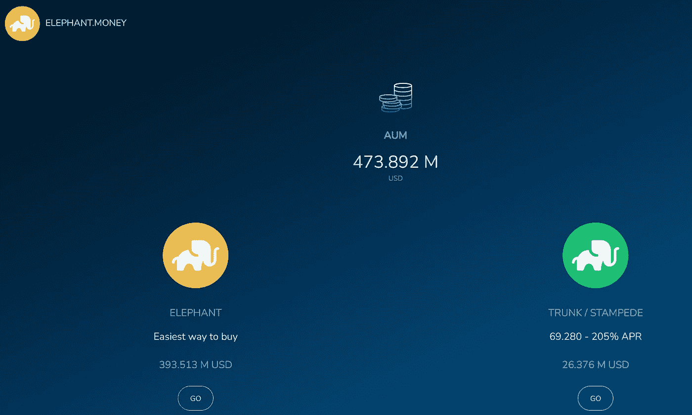

*   选择行李箱/踩踏
*   连接您的钱包

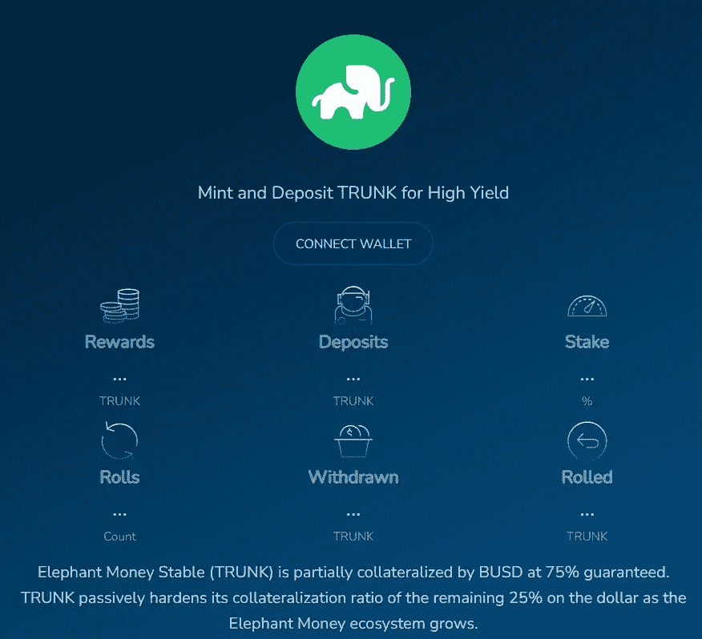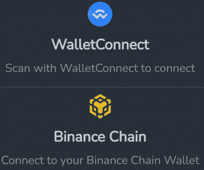

*   在“储备”部分，前往薄荷，并启用 BUSD。收取少量汽油费。

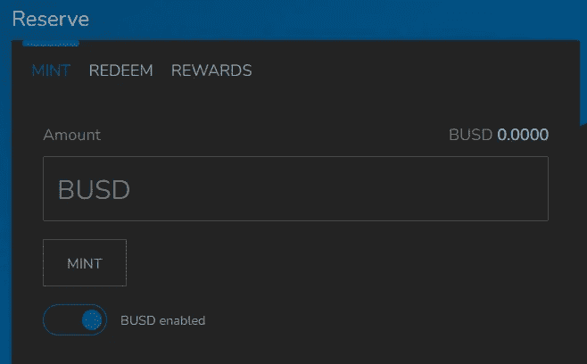

*   输入你想要的 BUSD 量，然后开始铸造。收取 1%的销售费用。
*   或者，前往 [PancakeSwap](https://pancakeswap.finance/info/pool/0xf15a72b15fc4caed6fadb1ba7347f6ccd1e0aede) ，连接你的钱包，用 BUSD 换行李箱。如果看不到中继令牌，将它导入到 PancakeSwap 中，合同地址为 0x DD 325 c38 b 12903 b 727d 16961 e 61333 f 4871 a 70 e 0

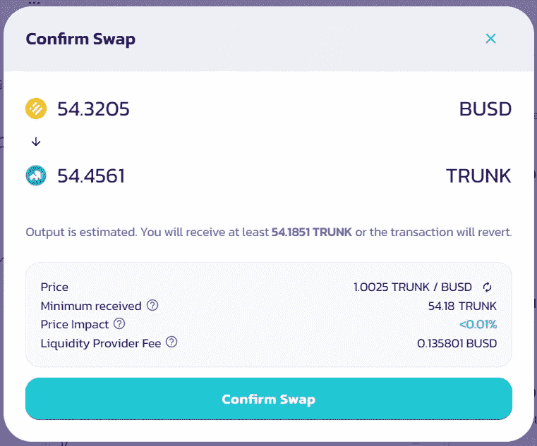

获得你的份额后，进入赌注或踩踏永久债券。

# 木桩树干

**TRUNK 红利池每天向 TRUNK** 的赌注者支付其价值的 1%。该值将根据资金池的大小和投资资本的价值而变化，因此 APR 可能会有所不同，但平均在 60–70%左右。

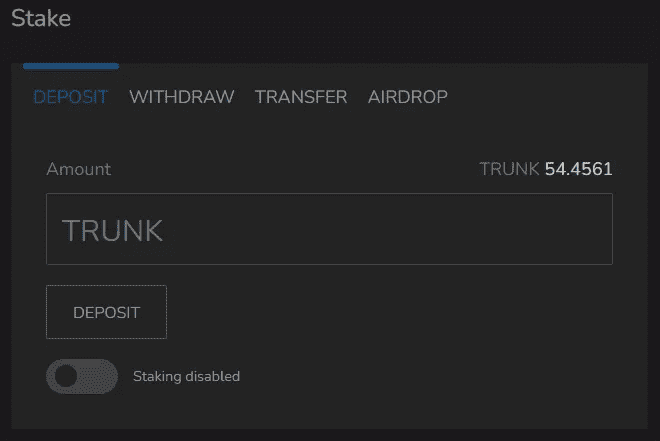

首先，启用赌注，然后选择您想要赌注的行李箱数量，并单击“存款”。要取消堆叠，只需点击“撤销”。增加和减少投资不会产生任何费用；只有汽油费适用。

# 蜂拥购买永久债券

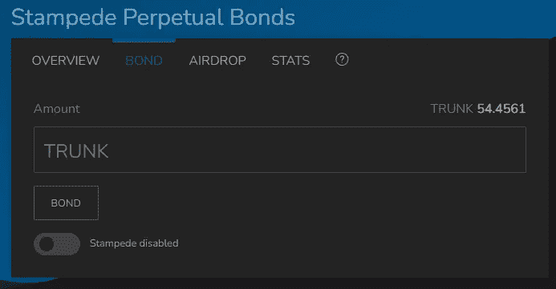

启用 stampede，授权交易，并继续绑定所需数量的行李箱硬币。

# 从众获益:合作伙伴网络

通过建立合作伙伴获得 0.5%的存款和奖金奖励。这完全是可有可无的，但是有一个合作伙伴会给你带来额外的好处，你可以从每次存款和掷骰子中赢得团队空投，由你和你的合作伙伴平分。因此，你们每个人将获得 0.5%的存款奖励和 0.5%的存款奖励。

要加入这个群体，只需进入该部分，然后点击“合作伙伴”,您就可以输入合作伙伴的钱包地址。如果您能通过在合作伙伴部分键入我的钱包地址“0x2c 585 a 27078318 E3 c 71 cf 1b 717 a 7808 EDC 7d 4486”来添加我为合作伙伴，我将非常感激。这笔交易需要支付一小笔汽油费，这笔费用可以被随之而来的奖金抵消。

0x2c 585 a 27078318 E3 c 71 cf 1b 717 a 7808 EDC 7d 4486

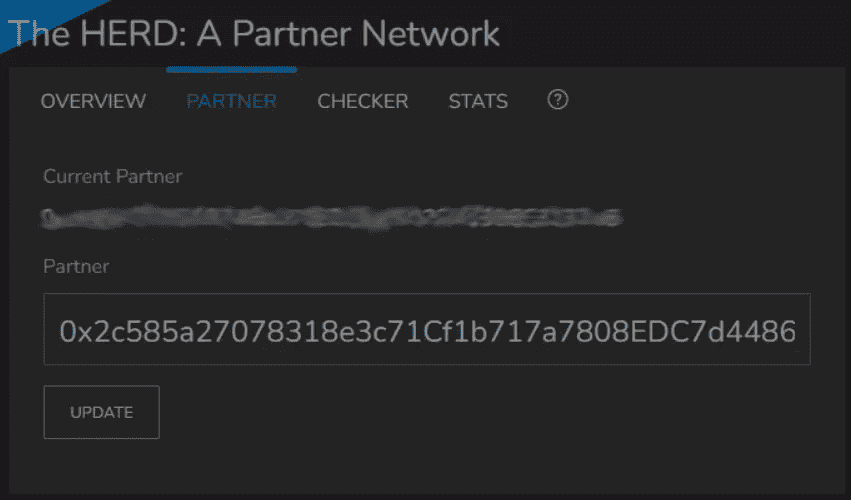

# 我的策略

我在大象生态系统中持有 25%的资产，以相对更不稳定的大象资金的形式持有，这种资金有进一步增长的潜力。由于具有流动性，大象币是一种宝贵的资产，可以随时兑换成其他加密货币。我将剩余的 75%投资到 TRUNK，绑定到 Stampede 永久债券，以产生长期稳定的被动现金流。我计划将我产生的兴趣的一半(复利)投入到踩踏事件中，并把剩下的部分押上，这样它们就可以在以后需要的时候被调动和撤回。

# 最后的想法

我希望我能早点跟上潮流——这是一个强大的 DeFi 项目，具有巨大的潜力，还没有看到大规模采用。BNB 或 BUSD 可以用来购买大象的钱，可以简单地持有，以被动地在数量上升值；或者用来铸造象币，象币的稳定货币，然后可以押在可变的年利率(目前为 70%)上，或者锁定在踩踏债券中，以产生 205%年利率/ 672% APY 的更高回报。大象货币是一种有很大增长空间的反射令牌，随着大象生态系统的进一步发展，它会从资本增值中产生被动现金流。TRUNK 是一种稳定的货币，可以用来产生比其他稳定货币高得多的 APY，或者绑定到踩踏永久合同，以锁定主要资产的价格产生 672% APY 的疯狂长期回报。你对此有什么想法？欢迎在下面留下评论！请继续关注我的进一步投资和在大象生态系统中的航行，因为我将在这方面发布进一步的更新和评论。

2022 年 4 月 24 日更新:2022 年 4 月 13 日，大象金库遭到协同攻击，价值约 1120 万美元的资金被利用闪贷的黑客吸走。你的基金是 SAFU；大象金钱的开发者正在采取及时的补救措施来解决这个问题，可以在[这里](/elephant-money/reserve-exploit-52fd36ccc7e8)找到它的实时更新。大象货币的抛售导致了代币价格的大幅下跌，这可能是一个有吸引力的买入机会。像往常一样，只投资你觉得合适的金额，并且总是做你的研究！

*一如既往，这不是财务建议！而只是我投资过的，觉得值得分享的投资平台。在投资前做好自己的研究，不要存你输不起的钱。下面有什么问题可以随时问我。*

*如果喜欢这篇文章，* [*跟着&订阅*](/@cybery) *！*

*查看以下值得信赖的平台！*

*🎁*[*honey gain*](https://r.honeygain.me/CYBER577DD)*一款被动收入 app，从你未使用的互联网带宽中赚钱。* [*免费获得 5 美元*](https://r.honeygain.me/CYBER577DD) *，无需投资。*

*🎁* [*蛋糕 Defi*](https://cakedefi.com/?ref=677920) *一站式投资平台，以高达 200%的 APYs 烘焙被动现金流！* [*在 DFI 用 50 美元存款获得 30 美元*](https://cakedefi.com/?ref=677920) *。*

*🎁*[*Nexo*](https://nexo.io/ref/hce5cfdt5o?src=web-link)*全球最先进、受监管的数字资产机构，在 200 多个司法管辖区提供 40 多种法定货币的即时加密贷款、每日资产收益、交换和服务。* [*用 100 美元存款得到 25 美元*](https://nexo.io/ref/hce5cfdt5o?src=web-link) *。*

*🎁* [*摄氏度*](https://celsiusnetwork.app.link/174094633e) *一个金融科技平台，提供带息储蓄账户、借贷以及用数字和法定资产进行支付。* [*在 BTC 拿 50 美元*](https://celsiusnetwork.app.link/174094633e) *拿 400 美元存款。*

*🎁*[*Hodlnaut*](https://www.hodlnaut.com/join/RTbHxuJMX)*一个稳健的新加坡加密借贷平台，成立于 2019 年，从你闲置的加密货币中产生被动现金流。* [*拿 30 美元*](https://www.hodlnaut.com/join/RTbHxuJMX) *在 USDC 存 1000 美元。*

*🎁*[*BlockFi*](https://blockfi.com/?ref=a16e37fd)*一种加密货币交易所和钱包。* [*用 100 美元存款得到 10 美元*](https://blockfi.com/?ref=a16e37fd) *。*

*🎁* [*库币*](https://www.kucoin.com/land/register/r/rJH29LZ) *最大的加密货币交易所之一。*

*🎁***最大的加密货币交易所之一。**

**🎁* [*MEXC*](https://m.mexc.com/auth/signup?inviteCode=1NAJC) *最大的加密货币交易所之一。**

**🎁*[*Crypto.com*](https://read.cash/@TraderFX/10-tips-to-maximize-earnings-on-honeygain-an-effortless-free-passive-income-app-68535728#bad-link)*一款基于新加坡的加密货币兑换 app。* [*获得 25 美元*](https://crypto.com/app/fcbsjmf5pb) *在 CRO 赌赢一张红宝石牌。**

**针对马来西亚投资者**

**🎁*[*Stashaway*](https://www.stashaway.my/referrals/kenleel9jx)*免费投资 6 个月！**

**🎁Wahed code 'KENLIE1' RM10 注册奖金**

**🎁Capbay P2P 代码' 8879c6' RM100 注册奖金**

**接我* [*中*](https://cybery.medium.com/)*|*[*read . cash*](https://read.cash/r/TraderFX)*|*[*Youtube*](https://www.youtube.com/c/SmartInvestingChannel)|[*电报*](https://t.me/kkkk289)|*|*[*推特*](https://twitter.com/cybertraderfx)*|**

> ***加入 Coinmonks* [*电报频道*](https://t.me/coincodecap) *和* [*Youtube 频道*](https://www.youtube.com/c/coinmonks/videos) *了解加密交易和投资***

# **另外，阅读**

*   **[Bookmap 评论](https://coincodecap.com/bookmap-review-2021-best-trading-software) | [美国 5 大最佳加密交易所](https://coincodecap.com/crypto-exchange-usa)**
*   **最佳加密[硬件钱包](/coinmonks/hardware-wallets-dfa1211730c6) | [Bitbns 评论](/coinmonks/bitbns-review-38256a07e161)**
*   **[新加坡十大最佳加密交易所](https://coincodecap.com/crypto-exchange-in-singapore) | [收购 AXS](https://coincodecap.com/buy-axs-token)**
*   **[红狗赌场评论](https://coincodecap.com/red-dog-casino-review) | [Swyftx 评论](https://coincodecap.com/swyftx-review) | [CoinGate 评论](https://coincodecap.com/coingate-review)**
*   **[投资印度的最佳加密软件](https://coincodecap.com/best-crypto-to-invest-in-india-in-2021)|[WazirX P2P](https://coincodecap.com/wazirx-p2p)|[Hi Dollar Review](https://coincodecap.com/hi-dollar-review)**
*   **[加拿大最佳加密交易机器人](https://coincodecap.com/5-best-crypto-trading-bots-in-canada) | [库币评论](https://coincodecap.com/kucoin-review)**