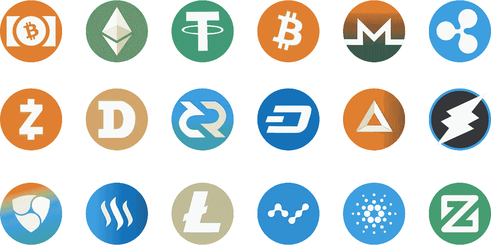
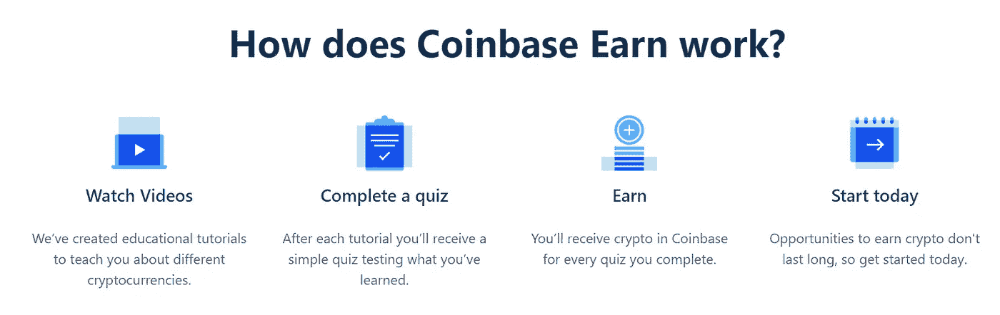
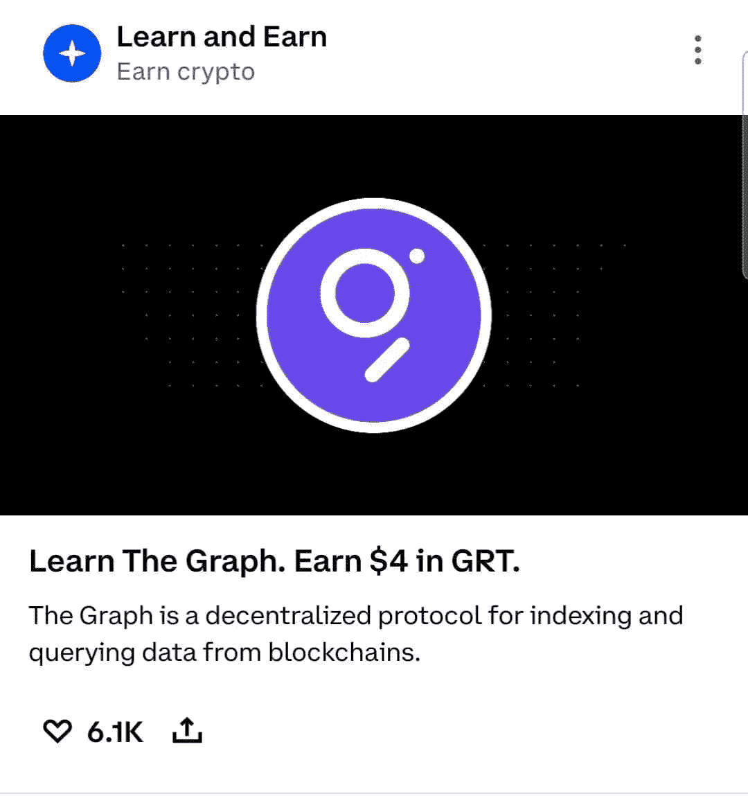
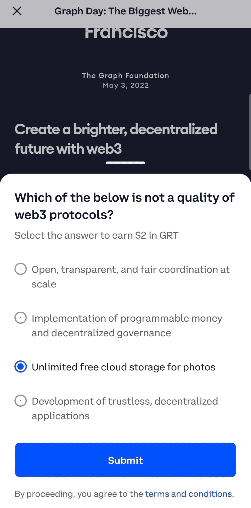
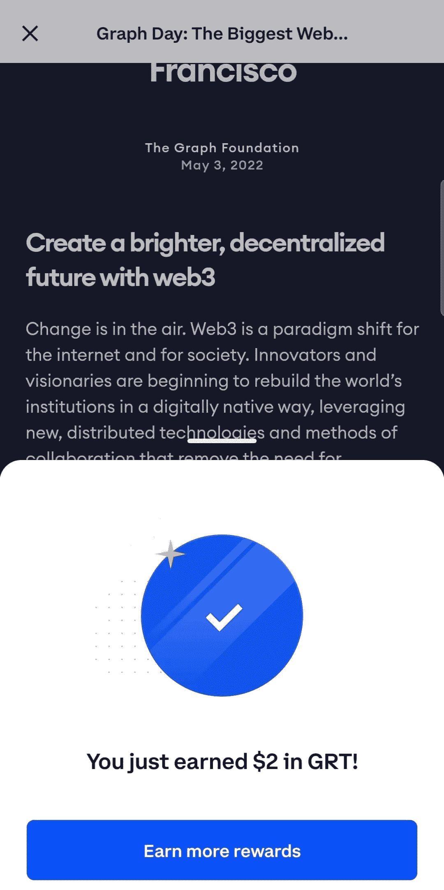

# 如何在学习加密的同时免费获得加密(非常适合初学者)

> 原文：<https://medium.com/coinmonks/how-to-earn-crypto-for-free-whilst-learning-about-crypto-perfect-for-beginners-e69df54c35d9?source=collection_archive---------8----------------------->

## 不熟悉加密？好景不长——探索特定加密货币的工作原理，并在此过程中获得免费加密！



啊，可怕的词——加密货币。如果你和我一样，当这个问题出现在讨论中时，通常有两个原因:

(1)一些人试图向你推销他们如何通过投资 x 金额到 y 硬币而赚了数百万美元，甚至更好——你可以做同样的事情，但你所要做的就是付钱给他们，他们会为你做所有的艰苦工作…(将手掌放在额头上)。

(2)一个人或一群人表达他们对这个想法的不信任和厌恶——加密货币完全是一个骗局，你甚至想都想不到它。

关于加密的辩论是两极化的，在“支持”和“反对”这项技术的人之间存在非常明显的分歧，或者我喜欢称之为 ***和*** 之间的争论。因此，如果你因为想到这个想法就被贴上极端主义者的标签，那你就不敢花时间研究这项技术了。

但最终，随着超过一万亿美元的“市值”和主流兴趣不可避免的增加，是时候抛开任何预先存在的偏见，至少多了解一点背后的技术了吗？不管你鄙视不鄙视？

这就是这篇文章的全部内容——让你意识到加密货币，这样你就可以做出明智的决定，在你的投资之旅中是否要考虑加密货币。这当然不是试图说服你，密码是自切片面包以来最好的东西。

# 比特币基地交易所

如果你在加密世界呆过一段时间，事实上，除非你一直生活在岩石下——你会从所有的体育广告和主流媒体中知道，有数百个加密交易所，使你能够购买、交换和出售数百种不同类型的加密货币硬币。由于不断有垃圾信息流出，在这个空间开始会让人不知所措——*“我到底从哪里开始呢？”*，这就是为什么我们今天只关注一个平台的原因，[比特币基地](https://coinbase.com/join/drummo_85?src=android-link)。

## 那么为什么是比特币基地呢？

比特币基地是一个安全的在线平台，用于购买、出售、转移和存储数字货币。该平台旨在为世界创建一个开放的金融系统，并成为帮助人们将数字货币转换为当地货币的领先全球品牌。

使用这个平台有许多优点和缺点，但本文的重点不是比较所有的平台选项，并确定哪个为您的交易需求提供最低的费用，这超出了本文的范围。相反，我选择谈论比特币基地的原因可以归结为一个原因——它能够教育初学者了解密码世界，同时为继续学习提供一些非常好的激励。

比特币基地有自己的 [**加密基础知识**](https://www.coinbase.com/learn/crypto-basics) 页面，致力于向用户教授加密货币的基础知识。在这里，您可以找到解释各种不同类型加密(如比特币和 Etherium)的指南和视频，以及关于加密货币(区块链)技术的信息等等！

但是这篇文章的全部观点，以及为什么我喜欢比特币基地提供给用户的东西，归结到他们的[比特币基地挣](https://www.coinbase.com/earn/)计划。比特币基地挣是一个简单的教育计划，只需观看几个关于加密的视频并完成一个小测验，客户就可以获得他们所了解的特定加密的一些令牌/硬币！



The simple steps in the Coinbase Earn program (source: [https://www.coinbase.com/earn/](https://www.coinbase.com/earn/))

如果我自己没有测试和使用过这个平台，我就不会写这篇文章。因此，在过去的几个月里，我参加了一些涵盖一系列加密货币的比特币基地收入教程。从所有这些，我已经积累了高达 18.15 美元(改变生活的钱，嗯？).正如你所知，通过这种方法，你不会一夜之间成为百万富翁，但你会接受一些有价值的教育，加上在这个过程中获得免费奖励的奖金，你可以自由兑换成其他加密货币，你可以尝试一下。通过使用比特币基地的应用程序，完成这些教程并获得奖励的过程变得异常简单。我在下面附上了一些我在不到一分钟的时间里赚了 2 美元 GRT 的快照，所有这些都是在我舒适的手机上完成的，所以你可以自己看到需要付出的努力(或缺乏的努力)。

**导航到比特币基地应用的主屏幕，向下滚动以了解任何参与的加密货币**



**点击“学习和获得”,开始阅读完成测验所需的信息**



**当您通读信息并了解加密货币后，选择一个测验答案并点击提交(如果您答错了，不要担心，您可以选择另一个选项，直到您答对为止！)**



**您现在已经赢得了一些免费代币！你现在可以自由地将这些货币兑换成比特币基地市场上数百种加密货币中的任何一种。**

最终，那些已经熟悉加密交换的人可能不会从这篇文章中受益太多，相反，他们可能会选择完全忽略它。然而，事实是——如果你是一个初学者，对学习更多有一点兴趣，那么比特币基地会给你进一步调查你的兴趣的选择——而不会拿你的血汗钱冒险。既然没什么可失去的，为什么不试一试呢？

# **如何入门比特币基地赚**

比特币基地赚的入门步骤非常简单，只需要你在比特币基地开设一个 [**账户**](https://www.coinbase.com/join/drummo_85) 并完成相关验证流程即可。你可能有的所有常见问题都可以在这里找到:[比特币基地收入常见问题](https://help.coinbase.com/en/coinbase/getting-started/getting-started-with-coinbase/coinbase-earn-faq-and-terms)

## 注册获取未来奖金

如果你决定你想尝试比特币基地，那么一定要注册使用我的推荐链接: [**比特币基地推荐链接注册**](https://www.coinbase.com/join/drummo_85) **。**

这将给我们双方 10 美元(如果在将来)你决定在比特币基地平台上购买或出售价值 100 美元的密码。但是如果你喜欢通过坚持 Earn 计划来测试绳索，那就完全没问题——只要最符合你的需求。

在我们结束之前，请注意，根据特定的加密硬币，您可能不符合参加特定 Earn 测验的所有资格标准，因为有些硬币只能支付给居住在特定国家的个人。所有受支持的国家都列在 FAQ 页面上，正如我们所说，比特币基地正在不断尝试添加更多。

# 结论

你觉得这听起来有趣吗？让我知道你是否会尝试这一点，或者你是否有另一个平台可以真正帮助你了解加密货币！

祝你愉快！

干杯，

南森(男子名)

## 给澳大利亚同胞的补充说明

如果你是一个澳大利亚人，正在寻找一种方法来为你的澳元储蓄赚取高利息(或者至少比传统金融机构目前为他们的储蓄账户提供的低得可怜的利率更高)，看看我以前写的这篇文章，这篇文章描述了你如何在不承担高风险的情况下获得 5%的利息！

点击此处查看文章: [**这是从你的澳元储蓄中赚取高利息的最佳(无风险)方式吗？**](/@neightdr/is-this-the-best-risk-free-way-to-earn-high-interest-on-your-aud-savings-be0c98af93ce)

# ***有用链接***

*如果你喜欢这篇文章，如果你能给我一个*[](/@natedrummond)**，或者别忘了* [*订阅*](/subscribe/@natedrummond) *如果你想了解我的最新帖子，我将不胜感激！**

**一定要看看下面这些我日常使用的* [*值得信赖的平台*](https://linktr.ee/natedrummond) *。你不仅会因为使用我的推荐邀请注册而获得免费的奖金，而且你还将帮助支持和发展我的渠道:)**

**在下面我的链接树上查看它们:**

*[](https://trajectorytowealth.com/linktree) [## 感谢您的支持！|链接树

### 关注我所有的最新帖子，和我一起踏上我的财富之路吧！:)

trajectorytowealth.com](https://trajectorytowealth.com/linktree)* 

```
***Disclaimer:** *Investing always involves a level of risk. You aren’t guaranteed to make money, and it is possible to lose the money you start with. The author is not a financial advisor, so neither the author nor the publication takes any responsibility or liability for any investments, profits or losses you may incur as a result of this information. This content is intended for general informational and educational purposes only and may contain affiliate links. You should consider seeking independent legal, financial, taxation or other advice when considering whether an investment is appropriate for your objectives, financial situation or needs.**
```

> **加入 Coinmonks* [*电报频道*](https://t.me/coincodecap) *和* [*Youtube 频道*](https://www.youtube.com/c/coinmonks/videos) *了解加密交易和投资**

# *另外，阅读*

*   *[3 商业评论](/coinmonks/3commas-review-an-excellent-crypto-trading-bot-2020-1313a58bec92) | [Pionex 评论](https://coincodecap.com/pionex-review-exchange-with-crypto-trading-bot) | [Coinrule 评论](/coinmonks/coinrule-review-2021-a-beginner-friendly-crypto-trading-bot-daf0504848ba)*
*   *[莱杰 vs n rave](/coinmonks/ledger-vs-ngrave-zero-7e40f0c1d694)|[莱杰 nano s vs x](/coinmonks/ledger-nano-s-vs-x-battery-hardware-price-storage-59a6663fe3b0) | [币安评论](/coinmonks/binance-review-ee10d3bf3b6e)*
*   *[Bybit Exchange 审查](/coinmonks/bybit-exchange-review-dbd570019b71) | [Bityard 审查](https://coincodecap.com/bityard-reivew) | [Jet-Bot 审查](https://coincodecap.com/jet-bot-review)*
*   *[3 commas vs crypto hopper](/coinmonks/3commas-vs-pionex-vs-cryptohopper-best-crypto-bot-6a98d2baa203)|[赚取加密利息](/coinmonks/earn-crypto-interest-b10b810fdda3)*
*   *最好的比特币[硬件钱包](/coinmonks/hardware-wallets-dfa1211730c6) | [BitBox02 回顾](/coinmonks/bitbox02-review-your-swiss-bitcoin-hardware-wallet-c36c88fff29)*