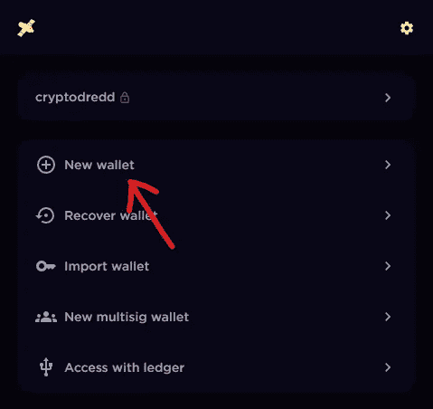
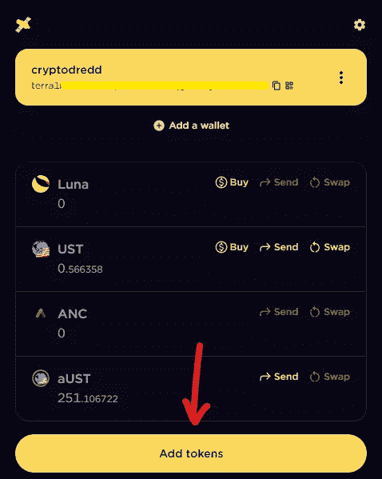
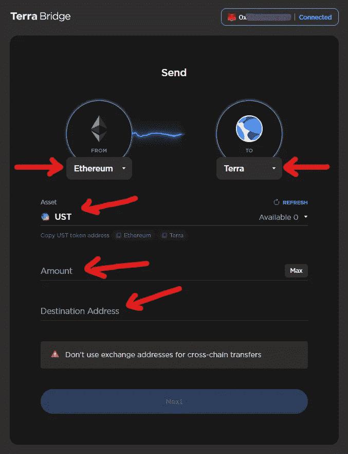

# 如何利用比特币基地在锚协议中获利(锚协议教程)——第 1 部分

> 原文：<https://medium.com/coinmonks/how-to-earn-in-anchor-protocol-using-coinbase-anchor-protocol-tutorial-part-1-c3ee003ecf63?source=collection_archive---------24----------------------->

Part 1 of my How to Invest in Anchor Protocol Tutorial

在这篇文章中，我将告诉你如何开始在锚协议中赚取 19-20%的 APY。

我将把它分成三个部分，所以每个选项的教程都不会很长。在系列的这一部分，我们将回顾如何创建你自己的 Terra 钱包，以及如何使用比特币基地投资锚协议。

如果您不想使用比特币基地，可以使用下面的链接跳转到其他平台的教程:

*   [**第二部分:库币**](/@dailydredd/how-to-earn-in-anchor-protocol-using-kucoin-anchor-protocol-tutorial-part-2-a52ca4c598d9)
*   [**第三部:卡多钱**](/@dailydredd/how-to-earn-in-anchor-protocol-using-kado-money-anchor-protocol-tutorial-part-3-6af2d7915964)

# 创造一个土地钱包

要访问任何 Terra 平台，你需要一个 Terra 钱包。

*   下载 [Terra Station 浏览器扩展](https://chrome.google.com/webstore/detail/terra-station-wallet/aiifbnbfobpmeekipheeijimdpnlpgpp)。安装完成后，单击浏览器扩展列表中的卫星图标。
*   创建一个钱包名称，一个密码，并写下助记符或秘密短语。千万不要让任何人看到这是什么。

*   创建 Terra 钱包后，打开扩展查看钱包信息。
*   点击“添加代币”并搜索露娜和 UST。然后，点击右侧的“+”图标，将它们添加到您的钱包中。

*   您的 Terra Wallet 地址将显示在顶部，以“terra1”开头。我们稍后会用到它。

# 比特币基地选项

**比特币基地→元面具→特拉桥→特拉钱包**

**在比特币基地:**

1.  登录您的比特币基地帐户。
2.  搜索比特币基地的 UST 代币。
3.  购买你想要的 UST。
4.  在您的元掩码钱包中，确保选择以太坊主网作为您的网络，并复制您的元掩码钱包地址。
5.  回到比特币基地，粘贴地址，选择您的 UST 金额，并在比特币基地购买屏幕上添加备忘录。
6.  你必须支付费用将你的 UST 移出比特币基地。

**在特拉桥:**

*   前往[https://bridge.terra.money/](https://bridge.terra.money/)并连接您的 Metamask 钱包。
*   在左侧栏中，选择以太坊网络。在右列中，选择 Terra 网络。
*   输入你希望用来交换 Terra 网络 UST 的 UST 数量。
*   添加您的 Terra wallet 地址，并确认交易。

**在锚协议中:**

*   去 https://app.anchorprotocol.com/
*   转到“赚取”选项卡。
*   连接右上方的 Terra Station 钱包。

*   连接钱包后，点击“存款总额”部分下方的“存款”按钮。
*   将出现一个弹出窗口，您可以在其中存入您希望在 Anchor 中使用的金额。确保留下 0.25 UST 支付交易费。
*   查看您的存款后，单击“继续”完成交易。
*   一切都准备好了！

# 为什么使用比特币基地选项？

*   比特币基地是初学者友好的，并提供给大多数美国用户。

# 为什么不使用比特币基地选项？

*   在比特币基地购买后，这个过程变得更长，对初学者也不太友好。
*   从一个网络转移到另一个网络(外链)更昂贵。比特币基地出售一台 ERC-20 TerraUSD，因此需要将资产换成 Terra network 版本的 TerraUSD。

# 最后的想法

使用比特币基地是我投资 Anchor 的第一个方法。这是当时我唯一可用的方法。但是几个月过去了，更便宜更快的更好的方法出现了，这告诉我们空间正在迅速改善。

查看 [**第 2 部分我们用 KuCoin**](/@dailydredd/how-to-earn-in-anchor-protocol-using-kucoin-anchor-protocol-tutorial-part-2-a52ca4c598d9) 和 [**第 3 部分我们用 Kado Money**](/@dailydredd/how-to-earn-in-anchor-protocol-using-kado-money-anchor-protocol-tutorial-part-3-6af2d7915964) 投资主播！

> 加入 Coinmonks [电报频道](https://t.me/coincodecap)和 [Youtube 频道](https://www.youtube.com/c/coinmonks/videos)了解加密交易和投资

# 另外，阅读

*   [Bookmap 评论](https://coincodecap.com/bookmap-review-2021-best-trading-software) | [美国 5 大最佳加密交易所](https://coincodecap.com/crypto-exchange-usa)
*   [如何在 FTX 交易所交易期货](https://coincodecap.com/ftx-futures-trading) | [库币点评](https://coincodecap.com/kucoin-review)
*   [CoinLoan 评论](https://coincodecap.com/coinloan-review) | [YouHodler 评论](/coinmonks/youhodler-4-easy-ways-to-make-money-98969b9689f2) | [BlockFi 评论](https://coincodecap.com/blockfi-review)
*   [XT.COM 评论](https://coincodecap.com/profittradingapp-for-binance)币安评论 |
*   [SmithBot 评论](https://coincodecap.com/smithbot-review) | [4 款最佳免费开源交易机器人](https://coincodecap.com/free-open-source-trading-bots)