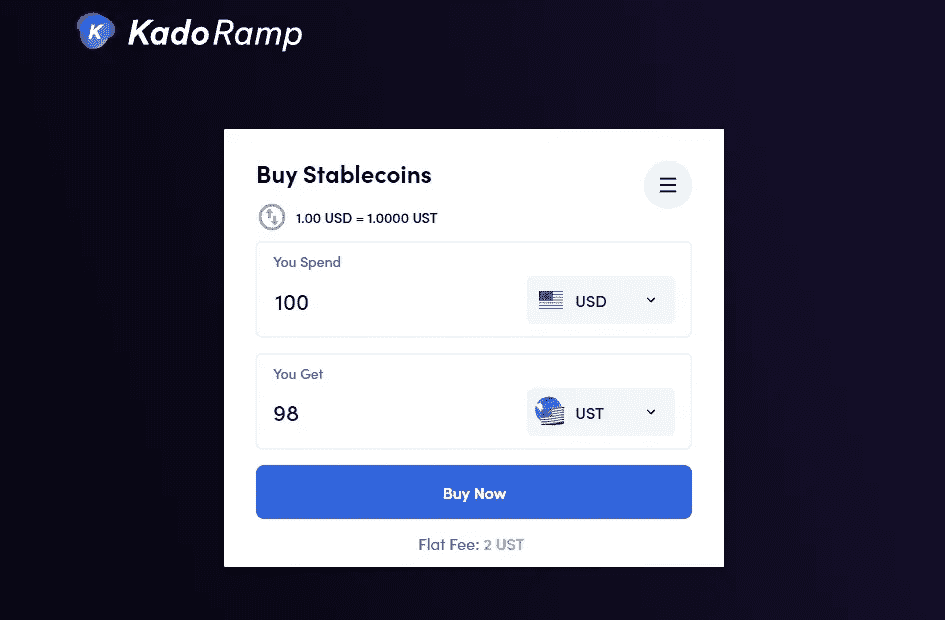
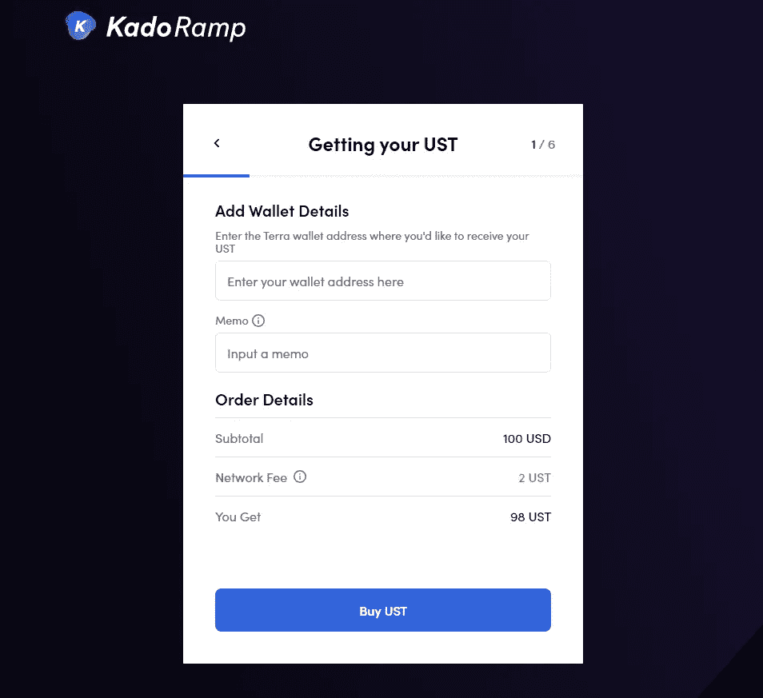
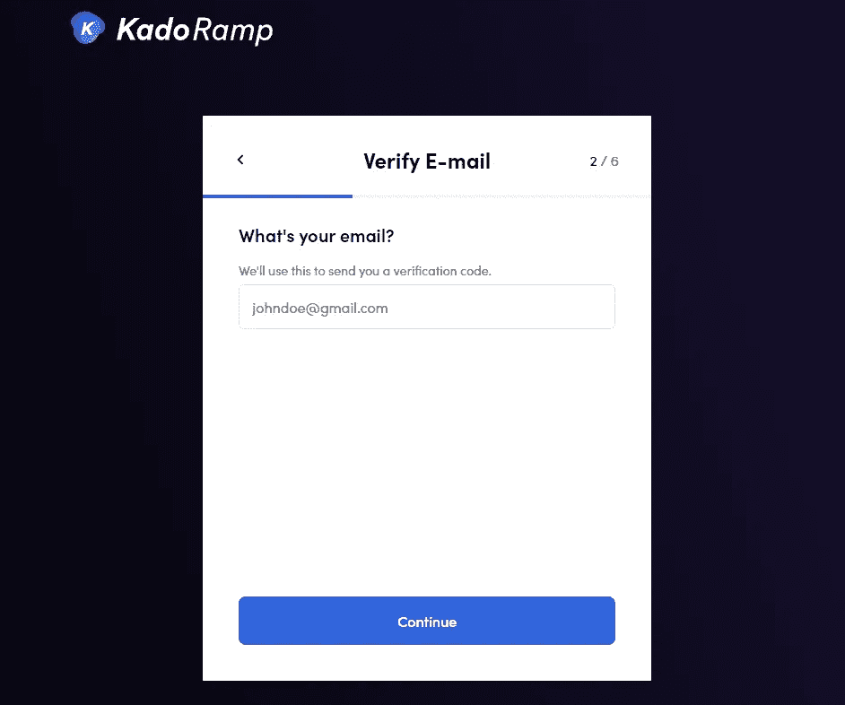
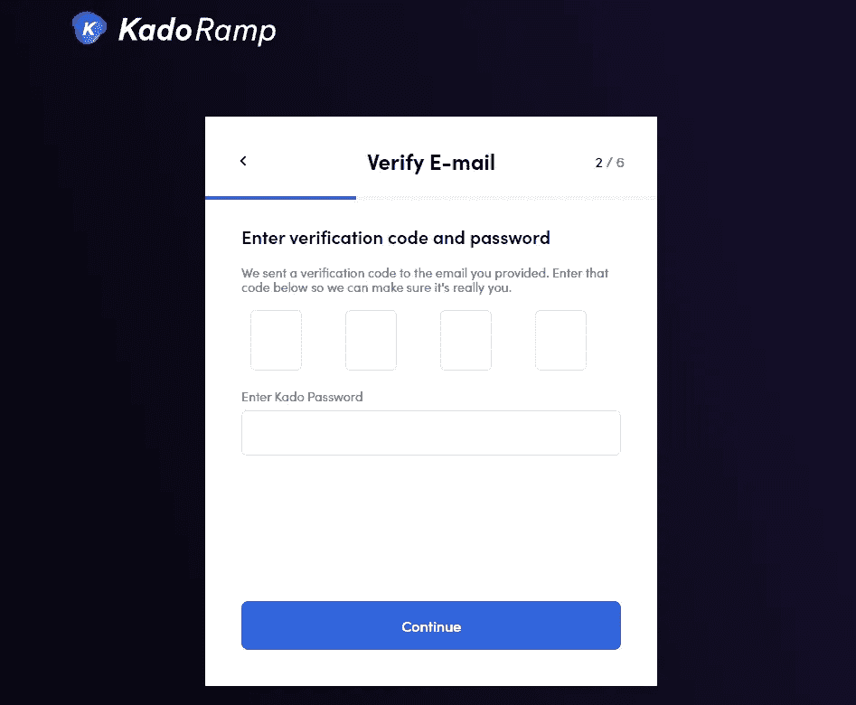

# 如何在锚协议中使用 Kado 赚钱(锚协议教程)——第 3 部分

> 原文：<https://medium.com/coinmonks/how-to-earn-in-anchor-protocol-using-kado-money-anchor-protocol-tutorial-part-3-6af2d7915964?source=collection_archive---------27----------------------->

这是我如何在主播教程系列中赚钱的第三部分。在这里，你将学习如何使用 Kado 资金投资 Anchor 协议。

**快速链接:**

*   [**第一部:比特币基地&特拉钱包**](/@dailydredd/how-to-earn-in-anchor-protocol-using-coinbase-anchor-protocol-tutorial-part-1-c3ee003ecf63)
*   [**第二部分:库币**](/@dailydredd/how-to-earn-in-anchor-protocol-using-kucoin-anchor-protocol-tutorial-part-2-a52ca4c598d9)

# 卡多货币期权

**Kado 钱→主播协议**

**在卡多钱:**

*   转到[https://ramp.kado.money/](https://ramp.kado.money/)
*   在“购买稳定货币”屏幕中，输入您想在 UST 购买多少，以及您希望使用的相应法定货币。

*   完成后点击“立即购买”。2 UST 的固定费用将自动从您的购物消费中扣除。
*   在下一个屏幕中，添加您的 Terra wallet 详细信息并添加备忘录。

*   在下一个屏幕中，Kado 将要求验证您的电子邮件。这种情况会发生在每个人身上，即使你已经有了一个 Kado 帐户，因为他们会向你发送一个验证码。

*   提供发送到您电子邮件的验证码，并创建或输入您的 Kado 帐户密码。

*   在“支付选项”屏幕中，您有两种选择来购买 UST:用借记卡/信用卡支付或银行转账(仅限美国)。
*   我建议现在用你的借记卡/信用卡支付，因为你更有可能在使用银行转账时遇到错误*(就像我一样)。*
*   添加付款方式后，您将进入订单确认屏幕。填写其他必填信息，然后单击“提交”按钮。
*   交易通常在不到 5 分钟的时间内完成。你的 UST 应该在你的 Terra Station 钱包里。

**在锚协议中:**

*   去 https://app.anchorprotocol.com/
*   转到“赚取”选项卡。
*   连接右上方的 Terra Station 钱包。

*   连接钱包后，点击“存款总额”部分下方的“存款”按钮。
*   将出现一个弹出窗口，您可以在其中存入您希望在 Anchor 中使用的金额。确保留下 0.25 UST 支付交易费。
*   查看您的存款后，单击“继续”完成交易。
*   一切都准备好了！

# 为什么使用 Kado Money 选项？

*   使用方便
*   交易速度快
*   2 UST 的固定费用

# 为什么不使用 Kado Money 选项？

*   没有人

# 最后的想法

第一次用 Kado Money 的时候很惊艳。虽然在设置我的支付方式时出现了一些问题，但这并不重要，因为修复也很容易。从现在开始，每当我决定在我的锚定存款中增加更多资金时，我都会使用这种方法。

检查 [**第 1 部分我们用比特币基地**](/@dailydredd/how-to-earn-in-anchor-protocol-using-coinbase-anchor-protocol-tutorial-part-1-c3ee003ecf63) ，和 [**第 2 部分我们用 KuCoin**](/@dailydredd/how-to-earn-in-anchor-protocol-using-kucoin-anchor-protocol-tutorial-part-2-a52ca4c598d9) 投资主播！

> 加入 Coinmonks [电报频道](https://t.me/coincodecap)和 [Youtube 频道](https://www.youtube.com/c/coinmonks/videos)了解加密交易和投资

# 另外，阅读

*   [CryptoHopper 替代品](/coinmonks/cryptohopper-alternatives-d67287b16d27) | [HitBTC 审查](/coinmonks/hitbtc-review-c5143c5d53c2)
*   [CBET 评论](https://coincodecap.com/cbet-casino-review) | [库科恩 vs 比特币基地](https://coincodecap.com/kucoin-vs-coinbase)
*   [折叠 App 审核](https://coincodecap.com/fold-app-review) | [Kucoin 交易机器人](/coinmonks/kucoin-trading-bot-automate-your-trades-8cf0ca2138e0) | [Probit 审核](https://coincodecap.com/probit-review)
*   [如何匿名购买比特币](https://coincodecap.com/buy-bitcoin-anonymously) | [比特币现金钱包](https://coincodecap.com/bitcoin-cash-wallets)
*   [币安 vs FTX](https://coincodecap.com/binance-vs-ftx) | [最佳(SOL)索拉纳钱包](https://coincodecap.com/solana-wallets)
*   [比诺莫评论](https://coincodecap.com/binomo-review) | [斯多葛派 vs 3Commas vs TradeSanta](https://coincodecap.com/stoic-vs-3commas-vs-tradesanta)
*   [Capital.com 评论](https://coincodecap.com/capital-com-review) | [香港的加密借贷平台](https://coincodecap.com/crypto-lending-hong-kong)
*   如何在 Uniswap 上交换加密？ | [A-Ads 审查](https://coincodecap.com/a-ads-review)