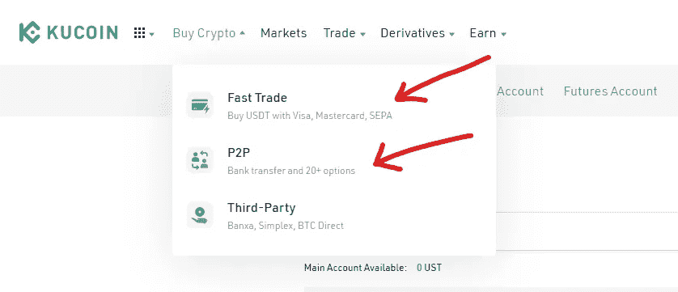
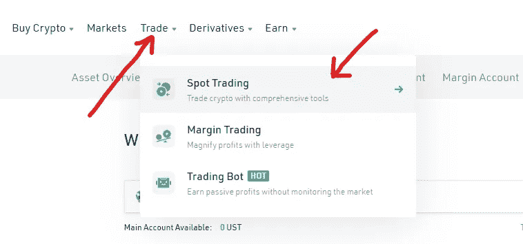
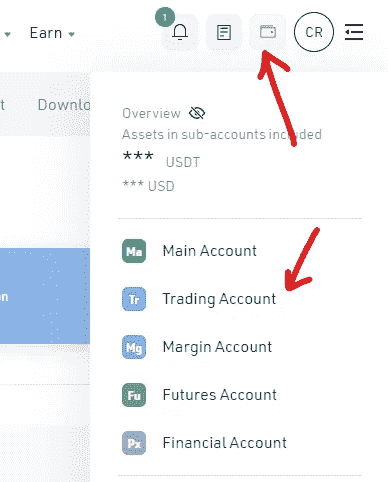
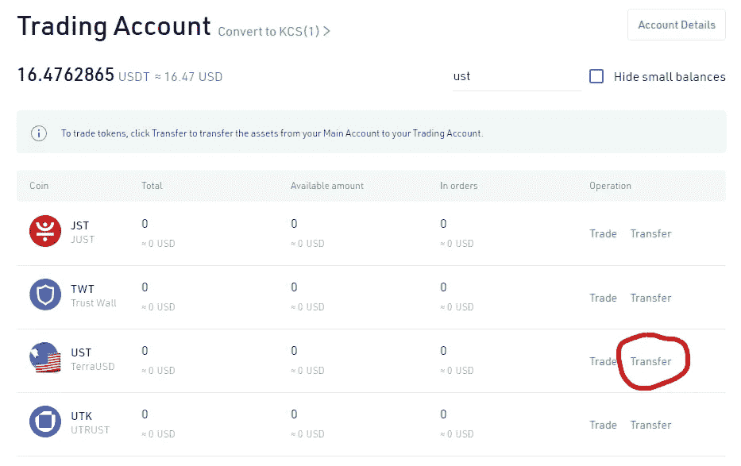
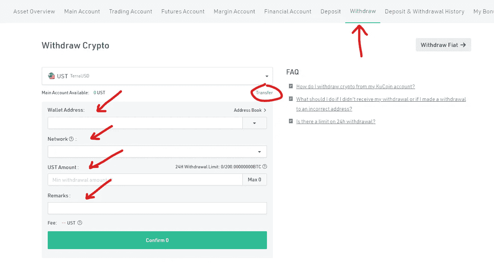
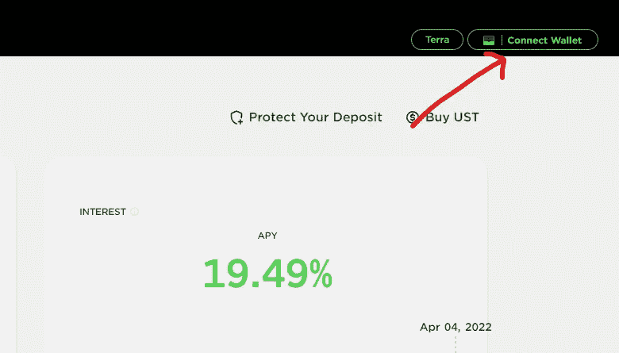

# 如何使用 KuCoin 在 Anchor 协议中获利(Anchor 协议教程)——第 2 部分

> 原文：<https://medium.com/coinmonks/how-to-earn-in-anchor-protocol-using-kucoin-anchor-protocol-tutorial-part-2-a52ca4c598d9?source=collection_archive---------19----------------------->

Part 2 of my How to Invest in Anchor Protocol Tutorial

这是我如何在主播教程系列中赚钱的第二部分。在这里，您将学习如何使用 KuCoin 投资 Anchor 协议。

**快速链接:**

*   [**第一部:比特币基地&特拉钱包**](/@dailydredd/how-to-earn-in-anchor-protocol-using-coinbase-anchor-protocol-tutorial-part-1-c3ee003ecf63)
*   [**第三部分:卡多钱**](/@dailydredd/how-to-earn-in-anchor-protocol-using-kado-money-anchor-protocol-tutorial-part-3-6af2d7915964)

# 库币期权

**库币→特拉钱包**

**在库币:**

*   登录你的库币账户，通过交易 USDT/UST 组合获得 UST。
*   如果您的帐户中没有 USDT，请使用法定货币进入“购买加密”选项卡购买 USDT。可以选择“快贸”或者“P2P”。

Buy Crypto tab to buy USDT using fiat

*   一旦你有了 USDT，进入“交易”标签，选择“现货交易”。查找美元/UST 配对，用 USDT 购买 UST。

*   一旦你有了 UST，悬停在右上角的“资产概览”(钱包图标)并点击“交易账户”

*   输入“UST ”,然后选择 UST 令牌旁边的“转账”。

*   确认你要转移资金的方向是“主账户”，并选择你要转移的余额。完成后按“确认”。
*   转到“撤回”标签，在搜索框中输入 UST，并在下拉列表中选择“UST TerraUSD”。
*   在新屏幕中，粘贴您的 Terra wallet 地址，选择 LUNA 作为您的网络，输入您希望转账的金额，并在交易中添加备注以供您自己记录。

*   查看您的交易后，请按“确认”按钮。
*   将出现一个确认弹出窗口，您可以在其中再次查看交易。再次确认。
*   将出现一个验证屏幕，您可以在其中输入验证码、交易密码和 2FA 代码。完成后确认。

**在锚协议中:**

*   转到[https://app.anchorprotocol.com/](https://app.anchorprotocol.com/)
*   转到“赚取”选项卡。
*   连接右上方的 Terra Station 钱包。

*   连接钱包后，点击“存款总额”部分下方的“存款”按钮。
*   将出现一个弹出窗口，您可以在其中存入您希望在 Anchor 中使用的金额。确保留下 0.25 UST 支付交易费。
*   查看您的存款后，单击“继续”完成交易。
*   一切都准备好了！

# 为什么使用 KuCoin 选项？

*   KuCoin 面向全球大多数用户。
*   涉及的大多数步骤都在一个平台中
*   少收费。

# 为什么不使用 KuCoin 选项？

*   没有人

# 最后的想法

在我第一次使用比特币基地之后，我开始使用 KuCoin 进行大部分加密交易。对于那些想在抛锚前集中查看所有资产的人来说，KuCoin 是一个不错的选择。

检查 [**第 1 部分我们用比特币基地**](/@dailydredd/how-to-earn-in-anchor-protocol-using-coinbase-anchor-protocol-tutorial-part-1-c3ee003ecf63) ，和 [**第 2 部分我们用 KuCoin**](/@dailydredd/how-to-earn-in-anchor-protocol-using-kucoin-anchor-protocol-tutorial-part-2-a52ca4c598d9) 投资主播！

> 加入 Coinmonks [电报频道](https://t.me/coincodecap)和 [Youtube 频道](https://www.youtube.com/c/coinmonks/videos)了解加密交易和投资

# 另外，阅读

*   [3 商业评论](/coinmonks/3commas-review-an-excellent-crypto-trading-bot-2020-1313a58bec92) | [Pionex 评论](https://coincodecap.com/pionex-review-exchange-with-crypto-trading-bot) | [Coinrule 评论](/coinmonks/coinrule-review-2021-a-beginner-friendly-crypto-trading-bot-daf0504848ba)
*   [莱杰 vs Ngrave](/coinmonks/ledger-vs-ngrave-zero-7e40f0c1d694) | [莱杰 nano s vs x](/coinmonks/ledger-nano-s-vs-x-battery-hardware-price-storage-59a6663fe3b0) | [币安评论](/coinmonks/binance-review-ee10d3bf3b6e)
*   [Bybit Exchange 审查](/coinmonks/bybit-exchange-review-dbd570019b71) | [Bityard 审查](https://coincodecap.com/bityard-reivew) | [Jet-Bot 审查](https://coincodecap.com/jet-bot-review)
*   [3 commas vs crypto hopper](/coinmonks/3commas-vs-pionex-vs-cryptohopper-best-crypto-bot-6a98d2baa203)|[赚取加密利息](/coinmonks/earn-crypto-interest-b10b810fdda3)
*   最好的比特币[硬件钱包](/coinmonks/hardware-wallets-dfa1211730c6) | [BitBox02 回顾](/coinmonks/bitbox02-review-your-swiss-bitcoin-hardware-wallet-c36c88fff29)