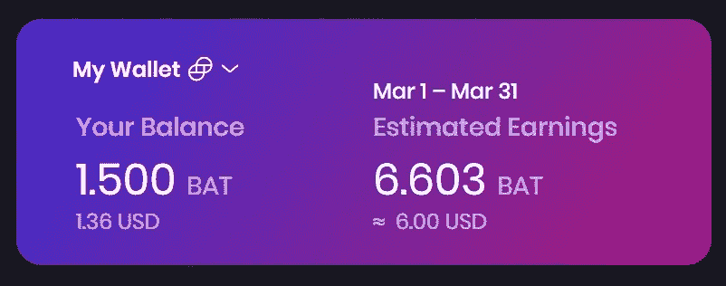

# 如何在使用智能手机的同时赚钱/加密？

> 原文：<https://medium.com/coinmonks/how-to-earn-money-crypto-while-using-your-smartphone-f74729ca9b1b?source=collection_archive---------34----------------------->

Photo by [Taras Shypka](https://unsplash.com/@bugsster?utm_source=unsplash&utm_medium=referral&utm_content=creditCopyText) on [Unsplash](https://unsplash.com/photos/iFSvn82XfGo)

浏览互联网，并在此过程中赚取一些 sh*t 硬币，没有请！如果我没有从事投资，这也会是我的答案。所以，在这篇文章开始之前，我的建议是，如果你还在使用 chrome 的话，就去看看这个[网站](https://www.komando.com/news/privacy-focused-browsers/815456/#:~:text=The%20browser%20claims%20it%20doesn,that%20could%20harm%20your%20computer.),然后读一读我写的这篇小文章，这篇文章中有一些经过过滤的信息，支持在平常的互联网浏览过程中赚取一些加密的好处。如果你是这整个密码诗的新手，这将肯定对你有用。

# 语境

1.  讨论有关勇敢浏览器的疑点。
2.  其实你选择用 BAT 浏览器(勇敢浏览器快速指南)浏览后变得多么简单
3.  如何安装应用并获得 BAT 奖励？
4.  持有任何密码的加分
5.  最后，勇敢者的成就
6.  重要链接

# 简介:

如果有人在 2005 年找到我，告诉我未来我可以用智能手机赚钱，我会感到震惊。现在听起来真的没什么大不了。我们开发了应用程序，成为这个大系统的一部分，帮助我们处理从智能手机到其他一切事物。人们可以做直运或 Instagram 广告，如果不是这样，他们也可以使用 Airbnb，出租他们的空余空间来赚一些钱，同时管理手机上的联系人，现在你也可以把你的智能手机浏览器变成一个加密矿工。

是的，我没开玩笑。我一直在 app store 上尝试这个叫做“勇敢浏览器”的小东西，听我说，这个东西会为你使用互联网浏览器支付“BAT 令牌”，这样你就可以阻止所有不必要的广告(阻止所有广告以享受无广告浏览器，否则这个浏览器将为你的单次广告查看支付 0.005 BAT)。

使用这个浏览器有一些不好的方面，我们将确保在最后一点讨论其中的大部分。

## 讨论有关勇敢浏览器的疑点

现在，开始我们必须去掉黑板上明显的负面信息，这样我们才能用正面信息清晰地思考。

我完全理解这听起来有多荒谬，就像如果他们付钱让我们看广告，那么他们不也在拿走我们的数据吗？我的意思是，到目前为止，chrome 在所有网站上都贴满了广告，即使在使用广告拦截器后，我们也无法摆脱所有的广告，那么 brave browser 有什么不同吗？

**选择这款浏览器**之前要看的一些基本点。

1.  少数功能仍处于测试模式
2.  有时网页会坏掉
3.  扩展和插件来自 chrome 网上商店
4.  最后，看看这个 reddit 页面上的批评者和支持者的整个社区。

**保管一个加密钱包有多难？**

不得不承认，做钱包，保证种子短语安全，真的很难(一点也不)。当它在任何人都可以接触到的地方时，这是有风险的，但管理一个钱包并不难。

## 实际上，当你选择用 BAT 浏览器浏览后，它变得多么简单

我无法用言语说服你，你得自己去尝试。你可以屏蔽所有广告，或者选择在盘子上赚取蝙蝠奖励，以换取你的关注。此外，Web3 还兼容分散式网站和 dApp 浏览器。勇敢浏览器也比 chrome 和其他浏览器更快，并且是一个开源软件。

**迁移到 brave 的快速指南**:如果你正在考虑切换到 Brave，那么你应该从网页下载浏览器开始。之后，您可以通过提供您的信息(电子邮件)和设置密码来制作钱包。Wallah，你真的必须这样做，在那之后，只要你想交易赚来的密码，你就可以把你的帐户连接到浏览器上。

# 中点:

这里有一些说明，将引导您如何直接进入 brave 网站并下载浏览器，按照接下来的步骤到达最后一点。

## 如何安装应用程序并获得 BAT 奖励

要启动指令，

**第一步**:从 apple store、app store 或者直接从[网站](https://brave.com/)下载 brave browser，如果你是在 PC 或者笔记本电脑上下载。

**第二步**:设置钱包。

**第三步**:连接[双子](https://exchange.gemini.com/signin)或[支撑](https://wallet.uphold.com/login)。

**第四步**:等待一个月或支付期结束。

第五步:在你的钱包里收到蝙蝠代币。

**第五步**:交易，发送，兑换成比特币或者以太坊。这完全是你的选择。

## 再加上现在持有任何密码，

1.  密码是不稳定的。图表每天、每周都在变化。
2.  你可以从一家公司的路线图和一致性看出它的潜力。选择正确的硬币或加密货币可以在经济上帮助你。
3.  几十年后，密码将是我们看到法定货币/现金的地方。
4.  有了加密技术，汇款时不需要银行介入变得很容易，因此使用加密技术可以使费用最小化，隐私最大化，这对汇款人和收款人都有好处。

**我为什么选择勇敢？**

这是一个阻止广告和奖励可交易加密的浏览器。Brave Browser 也在开发自己的钱包，目前正处于测试阶段。我不能做出假设，但我非常确定我们将来会控制我们的 BAT 代币，并且有可能我们将不必连接我们的外部交换帐户来接收我们的代币。

我个人选择它是因为内置的广告拦截器和 BAT 奖励。目前，我正在智能手机、笔记本电脑、平板电脑和个人电脑上使用 brave。

# 最后一点:

## **勇者成就**:

1.  2015 年 5 月，首席执行官布伦丹·艾希和首席技术官布莱恩·邦迪创立了勇敢软件公司
2.  他们在 2016 年 1 月发布了第一版浏览器
3.  2017 年[勇敢浏览器](https://brave.com/update-brave-browser-and-bat-achievements-in-2017-and-goals-for-2018/)取得了哪些成绩
4.  2018 年[勇者](https://brave.com/2018-highlights/)的成就
5.  勇敢的浏览器被评为 2019 年最佳隐私浏览器
6.  勇敢浏览器[在 2021 年 10 月放弃了](https://www.pcmag.com/news/brave-browser-drops-google-as-its-default-search-engine)谷歌搜索作为他们的默认搜索引擎
7.  查看支持该浏览器的 reddit 用户的评论[。](https://www.reddit.com/r/browsers/comments/jr6k6d/comment/gs8aieu/?utm_source=share&utm_medium=web2x&context=3)

在这里结束这篇文章，这是我第一个月的奖励(我使用浏览器就像一个普通的搜索浏览器)。

> 感谢您花时间阅读我的故事。我希望你能在这里找到有用的东西，下个月我会带着新的东西回来。

## 的重要链接

BAT 浏览器:[链接](https://brave.com/)

推特:[链接](https://twitter.com/brave)

Reddit: [链接](https://www.reddit.com/r/brave_browser/)

App store: [链接](https://play.google.com/store/apps/details?id=com.brave.browser&hl=en)

苹果商店:[链接](https://apps.apple.com/us/app/brave-private-web-browser/id1052879175?mt=8&ign-mpt=uo%3D4)

中:[链接](/@AttentionToken)

维基:[链接](https://en.wikipedia.org/wiki/Brave_(web_browser))

> 加入 Coinmonks [电报频道](https://t.me/coincodecap)和 [Youtube 频道](https://www.youtube.com/c/coinmonks/videos)了解加密交易和投资

# 另外，阅读

*   [本地比特币审核](/coinmonks/localbitcoins-review-6cc001c6ed56) | [加密货币储蓄账户](https://coincodecap.com/cryptocurrency-savings-accounts)
*   [什么是融资融券交易](https://coincodecap.com/margin-trading) | [成本平均法](https://coincodecap.com/dca)
*   [支持卡审核](https://coincodecap.com/uphold-card-review) | [信任钱包 vs 元掩码](https://coincodecap.com/trust-wallet-vs-metamask)
*   [Exness 回顾](https://coincodecap.com/exness-review)|[moon xbt Vs bit get Vs Bingbon](https://coincodecap.com/bingbon-vs-bitget-vs-moonxbt)
*   [如何开始用加密贷款赚取被动收入](https://coincodecap.com/passive-income-crypto-lending)