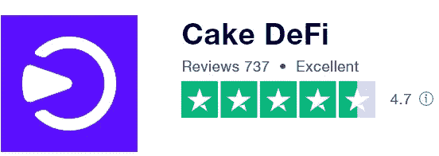
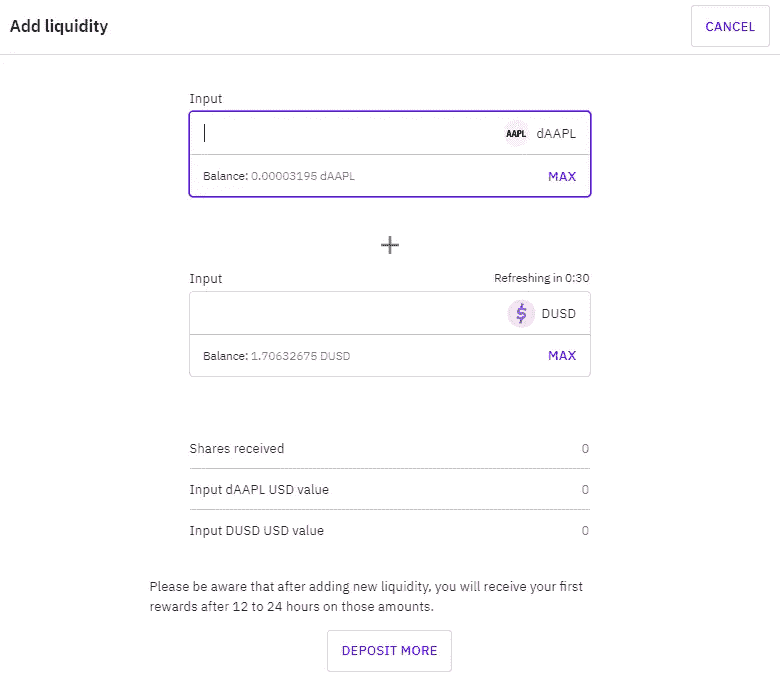

# 如何赚取蛋糕 DeFi 被动收入:教程

> 原文：<https://medium.com/coinmonks/how-to-earn-passive-income-with-cake-defi-a-tutorial-64abe4a01bec?source=collection_archive---------0----------------------->

> 沃伦·巴菲特曾经说过“如果你在睡觉的时候没有找到赚钱的方法，你会一直工作到死。”人们常说，百万富翁平均有七种收入来源。

I 推出 [Cake DeFi](https://cakedefi.com/?ref=677920) ，一个可靠的一体化投资平台，让您的加密货币产生高回报，产生被动现金流，让您高枕无忧。 [Cake DeFi](https://cakedefi.com/?ref=677920) 在包括 trustpilot 和许多其他评论网站上有着悠久的声誉和出色的评级，赢得了许多像我一样的快乐用户的信任。

Cake DeFi scores highly on trustpilot — read on to find out why!

为了最大限度地提高用户体验，请确保您已经完成了高级 KYC 验证，并启用了双因素认证，这可以通过谷歌认证器轻松完成。

# **仪表板概述**

登录 Cake DeFi，您将看到您当前持有的资产、获得的总奖励和每日现金流的概览。来自赌注、贷款、流动性挖掘、冻结和转介的收入；以及当前的资产分配都用图形格式很好地表示出来，以便于理解。向下滚动页面会显示您的加密货币资产在分配和总价值方面的详细信息。

Comprehensive summary of account holdings in Cake DeFi dashboard

# **如何进行首次存款？**

开始投资之旅的第一步是将硬币存入 Cake DeFi。在这个例子中，我将使用比特币来说明存款过程。只需点击存款并选择您想要的转账网络。

Ensure transfer network is correct.

请确保所选的转账网络是正确的，否则您的资产可能会在传输过程中丢失。存款地址以二维码或文本的形式显示，可以复制到您想要转移资产的钱包中。存款开始后，只需等待存款出现在您的 Cake DeFi 帐户中，这可能需要几分钟到几个小时，具体取决于区块链的流量和使用的转账网络。

您也可以考虑从类似 [Kucoin](https://www.kucoin.com/land/register/r/rJH29LZ) 的交易所存入 DFI (defichain)，因为 DFI 是 defichain 网络的本地货币，广泛用于 Cake DeFi 提供的许多服务；虽然 DFI 也可以很容易地从你选择存入 Cake DeFi 的其他加密货币中兑换出来。

DFI at a glance

或者，您可以通过 Transak 或 Banxa 以优惠的价格用 Visa 或 Master 卡购买 crypto。

现在您已经有了一些加密货币，是时候让它们发挥作用了，这样您就可以高枕无忧了！

Cake DeFi offers staking, lending & liquidity mining services to help you earn passive cashflow.

# **流动性挖掘**

Assets available for liquidity mining

流动性挖掘是分散化金融项目的一个关键要素，参与者将他们的加密货币资产贡献给流动性池，以促进交易，并为希望在分散化交易所进行加密货币互换的用户提供流动性。流动性开采提供高达 200%的年百分比率的高回报，这取决于 DFI 的价格。在 Cake DeFi 网站浏览流动性挖掘。顺着这个页面向下滚动，你会看到一张单子，上面是 Cake DeFi 目前持有的流动性资产以及这些资产的当前价值。流动性配对的完整列表还可以进一步查看，其中显示了相应的年度百分比利率、主要代币价格和总流动性。有许多可用的池，如比特币-DFI 池、USDT-DFI 池、以太坊-DFI 池等。

Liquidity mining pools available on Cake DeFi

除了这些流动性资金池之外，还有一项令人兴奋的新功能，那就是分散化资产。它将挖掘流动性的高收益与间接投资传统股票市场的能力完美结合在一起，比如苹果(Apple)、谷歌(Google)、特斯拉(TESLA)、ARK 创新 ETF(ARK Innovation ETF)、标准普尔 500 指数 ETF 信托基金(ETF Trust Fund)等。

Decentralized assets

报酬主要在 DFI 支付，每天两次。你可以选择自动入股的 DFI 回报，这样的利益可以复合。

Auto-staking liquidity mining rewards are a great way to quickly grow your staking returns!

流动性挖掘要求池中涉及的两种资产的金额相等；如果您没有任何感兴趣的资产，只需使用分散式交易所或 DEX 将硬币交换为所需的加密货币。点按“交换”调出 Defichain 交换页面，您可以在其中自由交换任何硬币。

DeFiChain Swap

交换通常在 1 小时内由疏解网络处理，但如果网络拥塞，这可能会延长。为了方便在网站上兑换钱币，Cake DeFi 还收取 0.5%的合理费用，这样就不必费力地将 DFI 的钱币取出来放到 Defichain 的钱包里进行兑换，然后再寄回给 Cake DeFi。

BTC-DFI pool

以比特币-DFI 流动性池为例，您将要求同等数量的比特币和 DFI 货币加入该池。假设你有 1 个比特币，你必须将 0.5 个比特币兑换成 7292 DFI。

Swapping 0.5 bitcoin to DFI for entry into liquidity mining

单击“审阅交换”，并通过输入 2 因素身份验证代码确认交易，然后等待交易处理。

既然你有相等数额的两种加密货币，你就可以加入流动性池。只需点击“添加流动性”，并指定您希望贡献的比特币或 DFI 金额，系统将自动计算出需要输入池中的另一枚比特币的相应等值。

Adding liquidity

比如 DEX——市场价格稳定指数，它可以作为衡量当前流动性池稳定性的指标——指数越高，你用同样数量的比特币就能获得越多的份额。我通常会等到 DEX 稳定指数达到高点或接近 100%时，再增加流动性。

或者，进入简单模式，该模式仅需要添加 1 种加密货币；在这种情况下，将先前示例中的原始 1 比特币添加到流动性挖掘将自动执行所需 DFI 量的掉期交易，以进入流动性池。其余步骤在其他方面是相同的。

Simple mode

一个令人兴奋的新的流动性挖掘池是分散资产！间接投资并利用传统股票市场的资产价格，如谷歌、苹果、特斯拉等。

A comparison between traditional and decentralized stocks. Image taken from the defichain blog.

要使用分散资产参与流动性挖掘，你将需要 dUSD，这是与美元价值挂钩的 defichain 网络中的稳定货币。如前所示，您可以从任何硬币转换到 dUSD 和您选择的分散资产，然后继续添加到相应的流动性池。

Swapping assets into dUSD

# **打桩**

Assets available for staking

赌注是一种赚取可观利息的方式，通过在赌注池中持有您的加密资产，与您的储蓄账户非常相似，但利率要高得多！在蛋糕 DeFi 的赌注可以用 DFI，DeFiChain 的本地硬币目前提供 38.2%的年百分比收益率；和 DASH，尽管年收益率较低，为 5.4%。常规赌注没有固定的条款。

Staking on Cake DeFi

要下注您的资产，只需点击“下注”,选择您选择的加密货币，并指出您想要下注的硬币数量。使用取消堆叠功能，可以随时移除已堆叠的资产，而不会造成损失。

Buying Staking shares

# **放贷**

Cake DeFi 还提供贷款服务，允许您通过比特币、以太币、美元系绳以及美元币获得被动收入。

Lending on Cake DeFi

你的资本和回报是完全有保障的，没有风险，如果资产的现货价格超过一定数额，还可能有奖金。每批贷款运行 28 天，在周五开始和结束。一旦你选择参与，你的 BTC /瑞士联邦理工学院/ USDT / USDC 将在接下来的 4 周内锁定期权合约。在这一批 4 周后，您可以选择自动进入下一批(生成自动复利)，只提取您的回报，或者将您的全部本金和回报提取回您的账户。

Lending batches on Cake DeFi

向下滚动页面会显示正在进行的批及其进度，以及批的详细信息摘要，如起始值、目标 apy 和实际 apy。要输入借出批，只需单击所需的借出批，并指明您希望为该特定批分配的资产金额。指定批次的开始和结束时间。当前批到期时，您可以选择自动将回报和资本或仅资本复合到下一批贷款中，也可以选择完全不自动进入下一批贷款。

Entering a lending batch

# **冰柜**

冰柜可以比作一个忠诚度计划，奖励用户在一段时间内向 Cake DeFi 投入资金，时间从 1 个月到 10 年不等。它可用于分配给赌注和流动性挖掘产品的基金。

普通冰箱给你高达 85%的蛋糕费回扣。另一方面，5 年和 10 年 DFI 赌注将资金锁定在 DeFiChain 区块链本身，根据任期给予用户高达 2 倍的定期赌注回报，转化为 10 年赌注期高达 100%的令人印象深刻的年百分比收益率！但是请注意，一旦被冻结，在任期结束之前，资产不能解冻或收回。

The Freezer on Cake DeFi

**最终想法**

At a glance

W 说起来，Cake DeFi 的三大核心服务迎合了不同的投资胃口和偏好。

-贷款提供低风险的担保资本，但有固定的期限。

-流动性挖掘提供了灵活性和高收益，尽管存在非永久性损失的风险，这将在未来的文章中讨论。

-赌注是一种低风险、高收益的解决方案，可以在 DeFiChain 网络的原生货币 DFI 上赚取高额利息。

无论你喜欢哪种服务，请放心，Cake DeFi 是一个值得信赖和可靠的一站式平台，可以产生被动现金流，这样你就可以把时间更多地放在生活中重要的事情上。[今天就报名](https://cakedefi.com/?ref=677920)，开始享受被动收入！锦上添花的是，注册、通过 KYC 验证并在蛋糕定义中分配资产的新用户将获得 40 美元的额外奖励。

*查看下面关于如何用蛋糕 DeFi 产生被动现金流的分步教程！*

Introduction to DeFi, taken from the youtube channel of Defi Chain.

*一如既往，这不是财务建议！而只是我投资过的，觉得值得分享的投资平台。在投资前做好自己的研究，不要存你输不起的钱。下面有什么问题可以随时问我。*

*如果你喜欢这篇文章，* [*关注&订阅*](/@cybery) *！*

查看以下值得信赖的平台！

*🎁*[*honey gain*](https://r.honeygain.me/CYBER577DD)*一款被动收入 app，从你未使用的互联网带宽中赚钱。* [*免费获得 5 美元*](https://r.honeygain.me/CYBER577DD) *，无需投资。*

*🎁* [*蛋糕 Defi*](https://cakedefi.com/?ref=677920) *一站式投资平台，以高达 200%的 APYs 烘焙被动现金流！* [*在 DFI 用 50 美元存款获得 30 美元*](https://cakedefi.com/?ref=677920) *。*

*🎁*[*Nexo*](https://nexo.io/ref/hce5cfdt5o?src=web-link)*全球最先进、受监管的数字资产机构，在 200 多个司法管辖区提供 40 多种法定货币的即时加密贷款、每日资产收益、交换和服务。* [*用 100 美元存款得到 25 美元*](https://nexo.io/ref/hce5cfdt5o?src=web-link) *。*

*🎁* [*摄氏度*](https://celsiusnetwork.app.link/174094633e) *一个金融科技平台，提供带息储蓄账户、借贷以及用数字和法定资产进行支付。* [*在 BTC 拿 50 美元*](https://celsiusnetwork.app.link/174094633e) *拿 400 美元存款。*

*🎁*[*Hodlnaut*](https://www.hodlnaut.com/join/RTbHxuJMX)*一个稳健的新加坡加密借贷平台，成立于 2019 年，从你闲置的加密货币中产生被动现金流。* [*拿 30 美元*](https://www.hodlnaut.com/join/RTbHxuJMX) *在 USDC 存 1000 美元。*

*🎁*[*BlockFi*](https://blockfi.com/?ref=a16e37fd)*一种加密货币交易所和钱包。* [*用 100 美元存款得到 10 美元*](https://blockfi.com/?ref=a16e37fd) *。*

*🎁* [*库币*](https://www.kucoin.com/land/register/r/rJH29LZ) *最大的加密货币交易所之一。*

*🎁***最大的加密货币交易所之一。**

**🎁* [*MEXC*](https://m.mexc.com/auth/signup?inviteCode=1NAJC) *最大的加密货币交易所之一。**

**🎁*[*Crypto.com*](https://read.cash/@TraderFX/10-tips-to-maximize-earnings-on-honeygain-an-effortless-free-passive-income-app-68535728#bad-link)*一款基于新加坡的加密货币兑换 app。* [*获得 25 美元*](https://crypto.com/app/fcbsjmf5pb) *在 CRO 赌赢一张红宝石牌。**

**针对马来西亚投资者**

**🎁*[*Stashaway*](https://www.stashaway.my/referrals/kenleel9jx)*免费投资 6 个月！**

**🎁Wahed code 'KENLIE1' RM10 注册奖金**

**🎁Capbay P2P 代码' 8879c6' RM100 注册奖金**

**接我* [*中*](https://cybery.medium.com/)*|*[*read . cash*](https://read.cash/r/TraderFX)*|*[*Youtube*](https://www.youtube.com/c/SmartInvestingChannel)|[*电报*](https://t.me/kkkk289)|*|*[*推特*](https://twitter.com/cybertraderfx)*|**

> **加入 Coinmonks [电报频道](https://t.me/coincodecap)和 [Youtube 频道](https://www.youtube.com/c/coinmonks/videos)了解加密交易和投资**

# **另外，阅读**

** [## CakeDeFi 评论:赚取每日加密回报 2022 年

### CakeDeFi 在加密货币领域越来越受欢迎。它使任何人都可以下注他们的加密货币，并开始…

coincodecap.com](https://coincodecap.com/cakedefi-review) 

*   [3 商业评论](/coinmonks/3commas-review-an-excellent-crypto-trading-bot-2020-1313a58bec92) | [Pionex 评论](https://coincodecap.com/pionex-review-exchange-with-crypto-trading-bot) | [Coinrule 评论](/coinmonks/coinrule-review-2021-a-beginner-friendly-crypto-trading-bot-daf0504848ba)
*   [莱杰 vs Ngrave](/coinmonks/ledger-vs-ngrave-zero-7e40f0c1d694) | [莱杰 nano s vs x](/coinmonks/ledger-nano-s-vs-x-battery-hardware-price-storage-59a6663fe3b0) | [币安评论](/coinmonks/binance-review-ee10d3bf3b6e)
*   [Bybit Exchange 评论](/coinmonks/bybit-exchange-review-dbd570019b71) | [Bityard 评论](https://coincodecap.com/bityard-reivew) | [Jet-Bot 评论](https://coincodecap.com/jet-bot-review)
*   [3 commas vs crypto hopper](/coinmonks/3commas-vs-pionex-vs-cryptohopper-best-crypto-bot-6a98d2baa203)|[赚取加密利息](/coinmonks/earn-crypto-interest-b10b810fdda3)
*   最好的比特币[硬件钱包](/coinmonks/hardware-wallets-dfa1211730c6) | [BitBox02 回顾](/coinmonks/bitbox02-review-your-swiss-bitcoin-hardware-wallet-c36c88fff29)**