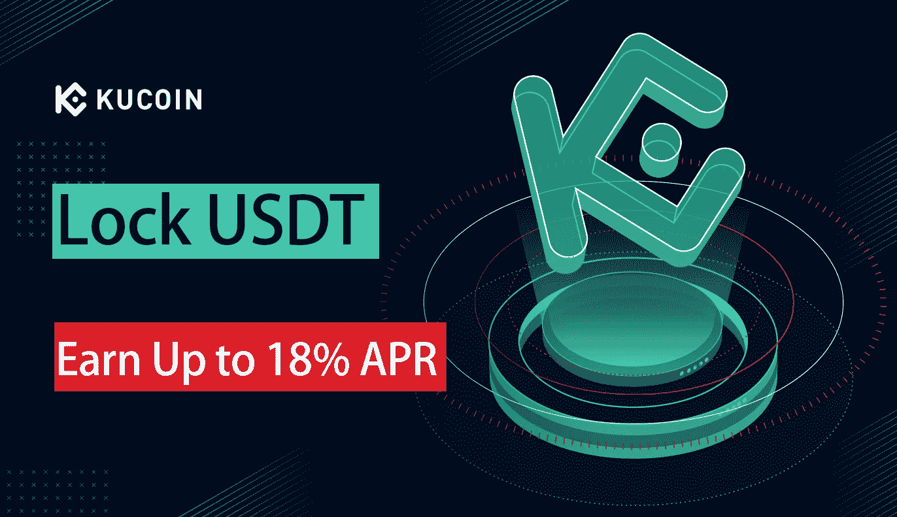

# 如何赚取被动收入与库币加密:一步一步的指南

> 原文：<https://medium.com/coinmonks/how-to-earn-passive-income-with-crypto-on-kucoin-a-step-by-step-guide-40adec500c5c?source=collection_archive---------3----------------------->

source: [https://www.kucoin.com/](https://www.kucoin.com/)

# 介绍

加密货币现在风靡一时。如果你和大多数人一样，你听说过比特币、以太坊、莱特币，可能还有其他一些。如果你像大多数人一样，你不知道他们是什么或者如何开始。

在过去的几年里，加密货币席卷全球，其价值飙升，然后以一种戏剧性的方式崩溃。尽管存在这种波动性，但仍有许多方法可以通过加密货币投资获得被动收入。在这篇博文中，我们将看看这样一种方式: [Kucoin](https://www.kucoin.com/ucenter/signup?rcode=rBZF6VE) 。

# 什么是被动收入？

被动收入是一种你不费吹灰之力就能获得的收入形式。它通常被称为“剩余收入”，因为它来自于在最初的努力投入后很久仍能持续产生收入的来源。

加密货币提供了一种产生被动收入的独特方式。当大多数人想到被动收入时，他们会想到股票股息、出租财产或知识产权使用费。然而，对于加密货币，有许多方法可以产生数字资产类别特有的被动收入。

例如，用加密货币创造被动收入的一种方式是通过借贷。当你把密码借给别人时，你可以获得贷款利息。另一种产生被动收入的方式是通过挖掘加密货币。采矿包括验证区块链网络上的交易，并向矿工奖励新的加密货币代币

# 什么是 Kucoin？

[Kucoin](https://www.kucoin.com/ucenter/signup?rcode=rBZF6VE) 是 2017 年推出的加密货币交易所。由于其令人印象深刻的硬币产品和低廉的交易费用，它很快获得了追随者。 [Kucoin](https://www.kucoin.com/ucenter/signup?rcode=rBZF6VE) 提供数字资产和代币。

数字资产是储存在区块链上的硬币。代币是代表其他东西的数字资产，如公司股份或投票权。Kucoin 拥有丰富的数字资产和代币，是加密货币爱好者的绝佳选择。

[Kucoin](https://www.kucoin.com/ucenter/signup?rcode=rBZF6VE) 为用户提供多种功能，包括:

1)用户友好的界面

2)多种可供交易的数字货币

3)交易费用低

4)一个奖励计划，给用户交易费折扣，并奖励他们持有 [Kucoin](https://www.kucoin.com/ucenter/signup?rcode=rBZF6VE) 股票的 KCS 代币

[Kucoin](https://www.kucoin.com/ucenter/signup?rcode=rBZF6VE) 正迅速成为最受欢迎的集中交易市场之一。

# 我如何在 Kucoin 上购买 crypto？

## 1.注册 KuCoin 帐户

首先，你需要有一个[库币](https://www.kucoin.com/ucenter/signup?rcode=rBZF6VE)账户。这可以通过导航到 [KuCoin 的网站](https://www.kucoin.com/ucenter/signup?rcode=rBZF6VE)然后按照下面的说明来完成。

1.  在 [KuCoin 的](https://www.kucoin.com/ucenter/signup?rcode=rBZF6VE)主页上，找到立即注册按钮并点击它。
2.  选择您希望通过电子邮件还是电话号码注册。

对于电话选项，您必须输入您的电话号码。 [KuCoin](https://www.kucoin.com/ucenter/signup?rcode=rBZF6VE) 会发一个码。在字段中输入代码并设置您的密码。

对于电子邮件选项，您必须经历相同的过程，只是您将通过电子邮件接收代码。

1.  选中使用条款框，然后单击绿色注册按钮。
2.  填写验证码，然后单击下一步。
3.  如果一切顺利， [KuCoin](https://www.kucoin.com/ucenter/signup?rcode=rBZF6VE) 会指导你检查你的电子邮件地址是否有确认信。
4.  登录你的邮箱。如果您在收件箱中找不到它，请再等几分钟或检查您的垃圾邮件文件夹。
5.  找到电子邮件后，打开它单击确认链接。
6.  这将带您回到登录页面。输入您的凭证并开立您的个人 [KuCoin](https://www.kucoin.com/ucenter/signup?rcode=rBZF6VE) 账户。

## 2.保护您的 KuCoin 帐户

[KuCoin](https://www.kucoin.com/ucenter/signup?rcode=rBZF6VE) 使用[双因素认证](https://searchsecurity.techtarget.com/definition/two-factor-authentication)(缩写为 2FA)来保护你在平台上的账户。

2FA 是一种多因素身份认证，为您的帐户提供额外的安全保护。为了启用它，您需要提供至少一条其他信息来补充您的登录信息，因此出现了“双因素”一词

默认情况下， [KuCoin](https://www.kucoin.com/ucenter/signup?rcode=rBZF6VE) 平台上不启用 2FA，但如果您想继续创建您的帐户，这是一项要求。

按照以下说明为您的 [KuCoin](https://www.kucoin.com/ucenter/signup?rcode=rBZF6VE) 账户启用双因素认证。

1.  第一次打开帐户时，您会看到一个弹出框，提醒您必须启用 2FA 设置。转到帐户并点击“绑定两步验证”
2.  按照屏幕上的说明保护您的备份密钥，然后单击下一步。
3.  在你的手机上下载谷歌认证应用程序。
4.  扫描屏幕上的条形码并输入验证码。点击“提交”
5.  [KuCoin](https://www.kucoin.com/ucenter/signup?rcode=rBZF6VE) 会警告你不要将你的 2FA 从你手机的谷歌认证器中解除绑定，以保护你的 [KuCoin](https://www.kucoin.com/ucenter/signup?rcode=rBZF6VE) 账户。
6.  恭喜您，您现在已经通过 2FA 获得了您的 [KuCoin](https://www.kucoin.com/ucenter/signup?rcode=rBZF6VE) 账户。您还可以添加安全问题以获得额外保护。

## 3.验证您的身份

“了解您的客户(KYC)”流程旨在通过将您的帐户与您的个人信息联系起来，进一步提高帐户的安全性。虽然从技术上来说，你甚至可以在不验证身份的情况下使用 KuCoin ,但在你通过验证之前，你将被限制提款。

这就是为什么，如果你想完全使用库币，你必须完成 KYC。为此，请遵循以下步骤。

1.  设置好您的 2FA 和安全问题后，您需要首先验证您的电子邮件地址。登录你的邮箱，寻找 [KuCoin 的](https://www.kucoin.com/ucenter/signup?rcode=rBZF6VE)消息。单击确认按钮或附加的链接。
2.  这将带你回到一个确认你的验证的页面。
3.  接下来，选择你的账户类型，点击蓝色的继续按钮。
4.  以下窗口将显示您的 KYC 验证所需的要求。若要继续，请单击“继续”。
5.  填写所有必需的信息。你还必须提交一份你的有效身份证件。
6.  要检查您是否正确填写了所有内容，请转到帐户安全并确保每一步都已完成。
7.  [KuCoin](https://www.kucoin.com/ucenter/signup?rcode=rBZF6VE) 将审核您的信息。如果一切正常，你会很快收到确认。
8.  要查看您的验证状态，请转到概述。一旦您获得批准，帐户状态将更改为“已验证”。

## 4.将您的帐户连接到基金基金您的帐户

现在您的帐户已经确认，您可以开始您的交易之旅。第一步是学习如何理财。

1.  在平台上，单击“资产”按钮。
2.  选择您希望存放的资产，或在搜索栏中键入。
3.  单击您选择的资产旁边的存款按钮。
4.  在下面的字段中，输入您的钱包地址。您也可以使用 QR 扫描仪扫描条形码。
5.  [KuCoin](https://www.kucoin.com/ucenter/signup?rcode=rBZF6VE) 会显示一个屏幕，提示您在确认存款之前要做的事情。确保先仔细检查你的钱包地址。
6.  完成您的交易。
7.  如果您想检查您的交易，一切都可以在存款历史选项卡下查看。

## 5.开始在 KuCoin 上交易

一旦你的账户收到你转移的资产，你就可以开始交易赚钱，这应该不会花很长时间。

1.  一旦你的资产存入你的账户，导航到市场标签。
2.  从列表中选择您的资产，然后单击旁边的交易按钮。
3.  若要购买，请在“购买”字段中填写您喜欢的金额，然后单击“购买”。卖出期权的过程是一样的。

您可以通过检查未结订单按钮或交易历史选项下的历史来查看您当前的所有订单。除此之外，你还可以在 [KuCoin](https://www.kucoin.com/ucenter/signup?rcode=rBZF6VE) 平台上进行其他形式的交易。

# 我如何用 Kucoin 获得被动收入？

## 库币借贷是最好的方式

在 KuCoin 平台上，借贷是最受欢迎的被动赚钱方式。KuCoin lending 现在提供大约 90 种用于贷款的数字资产，包括几种在其他加密货币贷款平台上没有广泛使用的资产。迄今为止，交易员一直青睐 USDT 放贷。更成熟的货币如 ETH 和 SOL，以及像 SHIB 这样的 meme 硬币都属于这些代币。

与传统金融机构不同，传统金融机构由于信用检查、法律、传统技术和其他因素而面临巨大的准入障碍，加密贷款市场使借贷变得更加简单快捷。

借款人必须拿出抵押品才有资格获得贷款，确保他们的资产得到保护。

在 [KuCoin](https://www.kucoin.com/ucenter/signup?rcode=rBZF6VE) 日，出借人有两种选择:手动出借或自动出借。你选择哪一个取决于你对它如何工作的理解和你自己的品味。

快速偿还贷款是贷款的一个问题。当某人借了一段时间，然后以更快的速度(比如几个小时)偿还债务时，就会发生这种情况。手动贷款选项在这些情况下并不好，因为获利时间很短

另一方面，自动借出功能确保您的首选加密资产随时可以借出。但是，用户必须指定每日利率，并定期检查以确保他们的利率已被批准，以便执行贷款。贷款期限从 7 天到 28 天不等。

# 把东西包起来

虽然被动收入选择可能会让那些不想一天 24 小时盯着自己投资组合的人获得持续的回报，但没有投资是没有风险的。因此，在投入深水区之前，请对每个选择进行自己的研究。另外，记住“熟能生巧”如果你有更多的实践经验，从长远来看，你更有可能获得持续的收入来源。

我希望你从这篇文章中学到了一些东西！如果你喜欢这篇文章，请在下面拍手回应！请继续关注我的博客，获取更多有益和有趣的信息。最美好的祝愿！

如果你想支持我，你可以[请我喝咖啡](https://www.buymeacoffee.com/omarbelghit)

> 加入 Coinmonks [电报频道](https://t.me/coincodecap)和 [Youtube 频道](https://www.youtube.com/c/coinmonks/videos)了解加密交易和投资

# 另外，阅读

*   购买 Dogecoin 的 7 种最佳方式
*   [最佳期货交易信号](https://coincodecap.com/futures-trading-signals) | [流动性交易所评论](https://coincodecap.com/liquid-exchange-review)
*   [火币加密交易信号](https://coincodecap.com/huobi-crypto-trading-signals) | [Swapzone 审查](/coinmonks/swapzone-review-crypto-exchange-data-aggregator-e0ad78e55ed7)
*   最佳[密码交易机器人](https://coincodecap.com/best-crypto-trading-bots) | [购买索拉纳](https://coincodecap.com/buy-solana) | [矩阵导出审查](https://coincodecap.com/matrixport-review)
*   [Coldcard 评论](https://coincodecap.com/coldcard-review) | [BOXtradEX 评论](https://coincodecap.com/boxtradex-review)|[uni swap 指南](https://coincodecap.com/uniswap)
*   [比特币基地评论](/coinmonks/coinbase-review-6ef4e0f56064) | [德里比特评论](/coinmonks/deribit-review-options-fees-apis-and-testnet-2ca16c4bbdb2) | [FTX 评论](/coinmonks/ftx-crypto-exchange-review-53664ac1198f)
*   [Coinmetro 评论](https://coincodecap.com/coinmetro-review) | [VirgoCX 评论](https://coincodecap.com/virgocx-review)