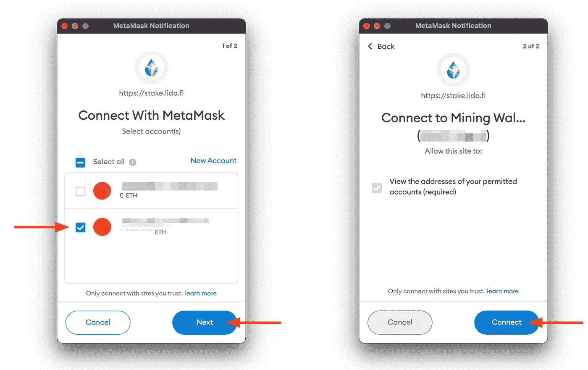

# 如何:立即在以太坊上赢取赌注奖励，而无需锁定它

> 原文：<https://medium.com/coinmonks/how-to-earn-staking-rewards-on-ethereum-now-without-locking-it-up-f97d5e773019?source=collection_archive---------2----------------------->

## 使用丽都道直接从钱包中下注以太坊的指南:以 4.8%的利率赢得下注奖励的安全、流动方式。


Image by [Rachael Putnam](/@robosquiggles) on [Canva](https://www.canva.com/)

```
**Table of Contents**
· [Introduction](#9b83)
· [How Lido Works](#d62e)
· [How to: Stake Ethereum with Lido](#1d6a)
 ∘ […via Metamask](#6570)
 ∘ […via Ledger Live](#4e78)
```

# 介绍

无论你是一直在购买和经营[以太坊](https://ethereum.org/en/)，还是大规模开采以太坊，押注你已经拥有的以太坊都是增加收入的绝佳方式。以目前的利率(4.8% APR)在利多下注，你的 Eth 将在不到 15 年内翻倍！


Double your ETH in 15 years at Lido’s current reward rates!

[以太坊 2.0 升级](https://ethereum.org/en/eth2/)——这将完成 Eth 从 PoW(采矿)到 PoS(打桩)的转变，尚未完成，很可能要到 2023 年才能完成。但是在 2021 年 8 月，[伦敦硬分叉](https://ethereum.org/en/history/#london)启用了赌注，试图平稳过渡。

staked ETH 目前的问题是，许多提供 staking lock 的交易所和服务将 ETH 封存起来，在 2023 年升级完成之前，没有办法取回它。这消除了流动性(使用或出售以太坊的选择)并大大增加了赌注者的风险。

幸运的是，利多的天才们已经实现了一种方法，任何人都可以在持有以太坊(或 Terra 或 Solana)股票的同时保持一定的流动性。最重要的是，您可以从您已经使用的硬件或软件钱包的安全性中获益！

***免责声明:*** *我不是会计，但是我用丽都押了 ETH。这篇文章包含了我在丽都的知识和想法。*

# 利多如何运作

当你用丽都入股以太坊的时候，你本质上是在用以太坊购买被入股以太坊的“代金券”。这种“代金券”是一种被称为“stETH”的 ERC20 代币，其价值与以太坊的价值大约 1:1 挂钩。向[丽都道](https://etherscan.io/token/0xae7ab96520de3a18e5e111b5eaab095312d7fe84)契约发送任意数量的以太，并获得等量的新铸造的以太代币。要清算或使用你的股票，只需在任何支持交易所用你的股票交换股票。

我目前持有的股票年利率为 4.8%。*赌注奖励每天发放！*

**快速笔记** [**与丽都**](https://blog.lido.fi/how-lido-works/) **:**

*   将你的 ETH 换成 stETH(反之亦然)需要支付汽油费，因为这是一个 ERC20 交易。
*   利多赌注交易将看起来像一个与以太坊地址的交换:[0x AE 7 ab 96520 de 3a 18 E5 e 111 b 5 ea ab 095312 D7 Fe 84](https://etherscan.io/address/0xae7ab96520de3a18e5e111b5eaab095312d7fe84)。务必确认你要发送代币的地址！
*   据说 stETH 的价值与 ETH 大约 1:1 挂钩，但是[这里是确切的汇率](https://coinmarketcap.com/currencies/steth/steth/eth/)。一旦以太坊 2.0 升级完成，丽都计划实现一种方法，直接和他们用你的 stETH 换 ETH。现在，你可以在交易所里“出售”你的 stETH。
*   丽都道在你的赌注*奖励*中收取 10%的费用。比如 ETH 跑马圈地奖励目前是 5.2%，利多留着 5.2% *奖励*的 10%，那么你的有效奖励就是 4.7%。丽都网站的[奖励率](https://stake.lido.fi/?ref=0xd0140D820D104365e09401BBAAf38F427B79b4f4)反映了你的*有效奖励*。

# 如何:与利多争夺以太坊

**第一步:**进入[利多赌注](https://stake.lido.fi/?ref=0xd0140D820D104365e09401BBAAf38F427B79b4f4)网页。

*(上面的链接是我推荐的。使用这种推荐，你不会有任何损失，但我会从你的初始股份中获得 1%的回扣。)*

**第二步:**选择`Connect wallet`


Step 2

**第 3 步:**阅读并接受服务条款，然后选择包含您想要下注的 ETH 的钱包。


Step 3

接下来的部分包括使用[元掩码](https://metamask.io/)和[分类账](https://shop.ledger.com?r=5810c335c642)钱包的说明，因为这些是我过去用过的。我敢肯定，其他钱包遵循一个非常相似的过程。

## …通过[元掩码](https://metamask.io/)

为了完成以下步骤，您必须具备以下条件:

*   带[元掩码扩展的谷歌浏览器](https://chrome.google.com/webstore/detail/metamask/nkbihfbeogaeaoehlefnkodbefgpgknn?hl=en)
*   正确设置以太坊 Mainnet [Metamask](https://metamask.io/) 钱包，其中包含 ETH to stake

**第 4 步:**您可能想要验证您的元掩码是否设置为以太坊主网——当我将我的设置为错误的网络时，Lido 网页抛出了一条错误消息。


Step 4 — Metamask

**步骤 5:** 选择`Connect Wallet`后，应会显示元掩码通知。选择您想要兑换的钱包，选择`Next`，然后选择`Connect`。



Step 5 — Metamask Wallet

**第六步:**如果你连接了多个钱包，你要从右上角的按钮验证你选择了正确的钱包(我这里只连接了一个。


Step 6 — Metamask Wallet

**第 7 步:**输入您希望下注的 ETH 金额，然后点击`Sumbit`。*注意“交易成本”——这是在以太坊主网上执行交易所需的汽油费。下一步你可以稍微调整一下煤气费。*


Step 7 — Metamask Wallet

**第八步:**会弹出一个 Metamask 通知窗口，要求你`Confirm`交易。如果您想编辑气体量，您可以使用弹出窗口中的`Edit`链接/按钮。对于这个视觉，我是假赌注 0.001 ETH，并收到 0.001 stETH。我无法确认交易，因为这个钱包缺少足够的资金支付油费。你的按钮应该是蓝色的。


Step 8 — Metamask Wallet

**第九步:**meta mask 发起交易后，Lido 网页会显示交易正在等待区块确认的通知。您可以选择`View on Etherscan`查看交易状态。确认交易可能需要一点时间。


Step 9 — Metamask Wallet

**步骤 10:** 一旦封锁被确认，你应该能够在你的 Metamask 钱包中看到你的 stETH 代币(你可能必须选择`Assets`然后`Refresh List`才能让它们出现)，或者在[https://etherscan.io/](https://etherscan.io/)看到。


Step 10 — Metamask Wallet

## …通过[总账](https://shop.ledger.com?r=5810c335c642)直播

**假设:**

*   [Ledger Nano S](https://shop.ledger.com?r=5810c335c642) 或 [Ledger Nano X](https://shop.ledger.com?r=5810c335c642) 硬件钱包(和 USB 线)
*   正确设置以太坊主网[总账](https://shop.ledger.com?r=5810c335c642)包含以太网的硬件钱包

**第四步:**通过 USB 线将你的 Ledger Nano S 或 X 连接到你的 PC，使用你的 pin 解锁。请确保在您的 Ledger 设备上打开以太坊应用程序。第一次设置时，您可能需要允许浏览器访问您的设备，否则，它会自动连接您的钱包。

**第五步:**如果你连接了多个钱包，你要验证你从右上角的按钮选择了正确的钱包(我这里只连接了一个。


Step 5— Ledger Hardware Wallet

**第 6 步:**输入您希望下注的 ETH 金额，然后点击`Sumbit`。*注意“交易成本”——这是在以太坊主网上执行交易所需的汽油费。下一步你可以稍微调整一下煤气费。*


Step 6— Ledger Hardware Wallet

**第 7 步:**Lido 网页将要求您通过按下按钮在您的分类帐设备上确认您的交易。


Step 7 — Ledger Hardware Wallet

**第 8 步:**交易发起后，丽都网页会显示交易正在等待冻结确认的通知。您可以选择`View on Etherscan`查看交易状态。确认交易可能需要一点时间。


Step 8— Ledger Hardware Wallet

**第九步:**你应该可以在 Ledger Live App 上或者在[https://etherscan.io/](https://etherscan.io/)看到你钱包里的存款。

*如果你发现教程有用，* [*关注&订阅我上媒*](/@robosquiggles) *！*

如果你想看到更多这样的内容，你可以使用下面的一个或多个我的会员链接来支持我

*   [通过利多下注以太坊](https://stake.lido.fi/?ref=0xd0140D820D104365e09401BBAAf38F427B79b4f4)
*   [购买任何分类账硬件钱包产品](https://shop.ledger.com?r=5810c335c642)

[](/about-me-stories/about-rachael-putnam-df6f8c5eb79b) [## 关于我——瑞秋·普特南

### 我为什么写(不到两分钟)。

medium.com](/about-me-stories/about-rachael-putnam-df6f8c5eb79b) 

> 加入 Coinmonks [电报频道](https://t.me/coincodecap)和 [Youtube 频道](https://www.youtube.com/c/coinmonks/videos)了解加密交易和投资

## 另外，阅读

*   [7 个最佳零费用加密交易平台](https://blog.coincodecap.com/zero-fee-crypto-exchanges)
*   [最好的卡达诺钱包](https://blog.coincodecap.com/best-cardano-wallets) | [Bingbon 副本交易](https://blog.coincodecap.com/bingbon-copy-trading)
*   [7 大顶级副本交易平台](https://blog.coincodecap.com/copy-trading-platforms) | [BuyCoins 审核](https://blog.coincodecap.com/buycoins-review)
*   [MyConstant Review](https://blog.coincodecap.com/myconstant-review) | [8 款最佳摇摆交易机器人](https://blog.coincodecap.com/best-swing-trading-bots)
*   [Godex.io 审核](/coinmonks/godex-io-review-7366086519fb) | [邀请审核](/coinmonks/invity-review-70f3030c0502) | [BitForex 审核](https://blog.coincodecap.com/bitforex-review)
*   [10 本关于加密的最佳书籍](https://blog.coincodecap.com/best-crypto-books) | [英国 5 个最佳加密机器人](https://blog.coincodecap.com/uk-trading-bots)
*   [ko only 回顾](https://blog.coincodecap.com/koinly-review) | [Binaryx 回顾](https://blog.coincodecap.com/binaryx-review)|[Hodlnaut vs CakeDefi](https://blog.coincodecap.com/hodlnaut-vs-cakedefi-vs-celsius)
*   [MoonXBT vs Bybit vs 币安](https://blog.coincodecap.com/bybit-binance-moonxbt) | [硬件钱包](/coinmonks/hardware-wallets-dfa1211730c6)
*   [火币交易机器人](https://blog.coincodecap.com/huobi-trading-bot) | [如何购买 ADA](https://blog.coincodecap.com/buy-ada-cardano) | [Geco？一次审查](https://blog.coincodecap.com/geco-one-review)
*   [币安 vs 比特邮票](https://blog.coincodecap.com/binance-vs-bitstamp) | [比特熊猫 vs 比特币基地 vs Coinsbit](https://blog.coincodecap.com/bitpanda-coinbase-coinsbit)