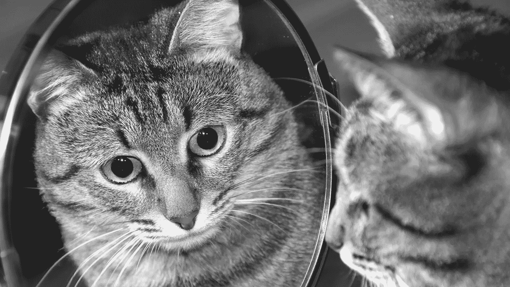

# 如何用反射令牌获得真正的被动收入

> 原文：<https://medium.com/coinmonks/how-to-earn-true-passive-income-with-reflection-tokens-b9f28ea67b87?source=collection_archive---------41----------------------->

反射令牌是 crypto 中真正被动收入的一些最佳来源。同时，很多都是骗局。所以，在投资它们之前，你需要仔细观察。

在这篇文章中，我将与你分享你需要知道的关于反射令牌的一切，以及如何投资它们并从中获利。

但是首先…

# 什么是反射令牌？

反射代币是一种加密货币，它对每一笔买卖交易征税，然后将税收收入重新分配给代币持有者。

这种税收再分配被称为反射或奖励，它可以是相同或不同的象征。

反射令牌通过奖励投资者的忠诚度来鼓励他们长期投资 HODL 资产。

因此，你 HODL 反射令牌的时间越长，你积累的奖励就越多。

# 反射令牌是如何工作的？

反射代币对所有买卖交易征税，并按比例重新分配给代币的当前持有者。

通常，一部分税收也会分配给团队，用于营销和流动性。整个过程是自动化的，并由智能合同管理。

一些反射令牌，如 [DMAX](https://www.degenmaxi.com/) 只对销售交易征税，其他的则对买卖交易都征税。反射令牌的交易量越大，持有者获得的奖励就越大，反之亦然。

那些较早购买代币或 HODL 时间较长的人往往会获得最多的奖励。

此外，反射令牌的一个美妙之处在于，您不需要做任何事情来获得奖励。

你所要做的就是购买代币，并把它放在你的钱包里，智能合约将自动把你的那份奖励存入你的账户。

# 如何像专业人士一样投资反射令牌

反射令牌为您提供了一个巨大的被动收入机会，但不幸的是，其中许多都是骗局。

因此，首先，你需要找到一个由合法团队支持的团队，他们致力于项目的成功，不会欺骗你。

一旦你通过了尽职调查测试，确定你想如何用代币赚钱。

以下是你可以用反射令牌赚钱的三种方法。

我将在下面简要地解释它们。

# 1.价格上涨

随着越来越多的投资者发现项目，聪明的老投资者继续 HODL 以赚取更多的回报，一个好的反射令牌的价格往往会随着时间的推移而增加。

但是，请注意，这不一定是事实，因为市场是非常不可预测的。所以，记住这一点。

现在尽可能早地购买代币，等到价格达到**你的获利目标**，然后卖出，继续你的下一步。

你可以卖掉你的全部或部分资产。有些人喜欢出售并拿出他们的原始资本，获得一点实得利润，然后把剩下的带到月球或地狱。

只要确保你有一个退出计划和战略，当你达到你的止盈目标，并坚持下去。

然而，如果无论你 HODL 多久，令牌都没有达到你的利润目标，那么你可能投资了错误的项目，或者你需要考虑下面讨论的其他策略。

# 2.反光

如果你想投资一个反射令牌，实际赚取反射是明智的，你不这样认为吗？

因此，你要尽你所能购买大量的代币，并尽可能长时间地 HODL，以积累奖励。

然后你可以卖出或持有奖励作为你的获利策略。

例如，使用 DegenMaxi (DMAX)，您可以通过将 DMAX 放在钱包中来获得 CST 反射。

现在你可以决定 HODL 或者把你的 CST 反射卖给稳定币作为你的获利策略。

如果你决定 HODL 的 CST 反思，你可以考虑想办法让你的 CST 也工作，以赚取更多。

然而，如果你选择将你的 CST 反射出售给稳定币，你可以进一步考虑将稳定币下注或借出以赚取利息。

这样，被动收入的循环继续，你可以更快地积累你的秘密财富。

# 3.农业

一些反射代币，如 [DMAX](https://www.marketcap.cash/token/DMAX) 允许您下注您的流动性提供者(LP)代币，以赚取更多相同或不同的代币。

例如，你可以将你的 DMAX-BCH LP 代币押在[上，赚取更多的 DMAX](https://benswap.cash/ranches?ranch=0x995859a4F8850068c002D12aff7E1FF9FE123535) ，CST 等。

目标是收获你的农场奖励，并将其转换成稳定的货币或 HODL，以此作为获利策略。

你可以用各种方式来获得奖励，我相信你会根据自己的目标找到最适合自己的方式。

**PS:** 我使用 [CST](https://www.marketcap.cash/token/CST) 和 [DMAX](https://www.marketcap.cash/token/DMAX) (两者都是我创建的)作为例子只是为了方便，因为它们完美地帮助传递了信息。

# 反射令牌项目需要什么才能成功？

使反射令牌具有吸引力的主要因素是反射令牌的大小(持有者的回报),它受**交易量的影响。**

交易量越大，反射就越大，就有越多的人想要购买和 HODL 代币来获得他们应得的回报。

另一方面，交易量随着新投资者和交易活动的增加而增加。

而投资者的获得依赖于强大的**营销力度**和**项目开发**。

然而，支撑他们所有人的一个无声的因素是一个强大的**承诺团队**愿意尽一切努力使项目成功，以及一个**支持社区**。

综上所述，您可以看到确保反射令牌持续增长和成功的主要因素包括:

*   交易额
*   用户增长
*   营销
*   忠诚的团队
*   支持性社区

所有这些都交织在一起，相互依存。有了这些，您可以快速评估反射令牌的潜力，看看是否值得冒这个风险。

# 投资反射令牌有什么风险？

与投资反射令牌相关的主要风险是团队拉你一把**地毯**或者**放弃项目**。

其他风险包括:

*   **象征性价格倾销不可挽回。**这通常是由团队秘密倾倒或不友好的鲸鱼活动造成的。
*   **项目失败。这个项目可能会像任何其他业务一样失败，原因有很多，比如管理不善、缺乏资金、运气不好以及许多其他潜在的原因。**
*   **黑客和臭虫。这个项目可能会被黑客攻击、利用，一个漏洞可能会使合同失效。这两种情况都有可能导致项目永久失败。**

甚至一场过度的熊市或一场重大的全球市场危机都可能摧毁任何项目，包括一个反思的象征。

# 最好的反射令牌

称之为偏见或偏袒，但现在最好的反映是[德根马西(DMAX)](https://www.degenmaxi.com/) 因为它完全由社区所有。

没有团队分配，全部 5 亿总供给将用于奖励流动性提供者，促进社区增长，或者烧掉。

DMAX 是 smartBCH 上的终极反射令牌，只要您的钱包中至少有 50，000 英镑的令牌，它就会奖励您 [CST](https://cryptosorted.info/cst) 。

所有出售交易都有 13%的税，合同自动将 7%重新分配给现有代币持有者，3%用于营销和团队，2%用于流动性，1%用于烧钱。

使 DMAX 成为投资的最佳反射令牌的另一个原因是，中国对通胀有严格的控制，以避免通胀集中在少数人手中。

此外，该项目仍然非常非常早期，并稳步增长。更不用说这个团队已经下定决心要取得成功。

# 其他值得注意的反射标记

如果你想在 DMAX 之外扩大对反射代币的投资，可以考虑的其他名字有 [EverGrowCoin (EGC)](https://www.coingecko.com/en/coins/evergrowcoin) 、 [SafeMoon (SFM)](https://www.coingecko.com/en/coins/safemoon) 等。

包括 EGC 和 SFM 在内，大多数反思型债券要么已经死了，要么比其历史最高(ATH)价格下跌了 90%以上。

但是，最重要的是，这些幸存下来的，还在建设，希望能重新夺回辉煌的日子。

此外，smartBCH 上的其他反射令牌还包括 [WOJAK](https://www.marketcap.cash/token/WOJAK) 和 RASTJN。

# 结论

反射代币是基于“持有以赚取”的概念，你只要在钱包中持有代币就可以获得奖励。

它们为加密投资者提供了真正的被动收入，但也存在拉地毯、抽水和倾倒、项目失败、黑客攻击等风险。那很容易使你的投资化为乌有。

因此，你需要[做自己的研究(DYOR)](https://cryptosorted.info/how-to-do-your-own-research-and-make-great-crypto-investment-decisions/) 并尝试识别和投资有巨大成功潜力并由一个忠诚团队支持的反思令牌。

此外，我还与您分享了投资反射令牌获利的 3 种方式，包括:

1.  尽早买入代币，在达到利润目标时卖出。
2.  购买和 HODL 大量的代币，并把反射作为你的中短期利润。
3.  下注您的 LP 代币以赚取更多相同或不同的代币作为奖励，然后收获并出售奖励代币以获利。

当然，有很多个性化的方法可以让你投资一个反射令牌获利，但是上面的 3 个策略非常实用。

你对反射令牌有什么看法？请在下面的评论区与我们分享。

*最初发布于 2022 年 5 月 10 日*[*https://cryptosered . info*](https://cryptosorted.info/reflection-tokens/)*。*