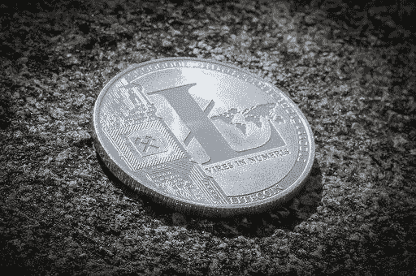

# 如何轻松地将莱特币转换为奈拉币

> 原文：<https://medium.com/coinmonks/how-to-easily-convert-litecoin-to-naira-2a684c3c7ba4?source=collection_archive---------41----------------------->

在目前的加密货币市场中，莱特币是最受欢迎的加密货币之一。然而，由于其易变的性质，直接使用莱特币进行交易可能是困难的。有一些人宁愿卖掉他们的莱特币来换取现金。一个原因是加密货币的价值可能会波动，将其出售以换取现金可以确保加密货币的价值保持不变。出售加密货币换取现金的另一个好处是，它允许买家立即购买加密货币，而不必等待交易确认。将莱特币兑换成现金的最好也是最简单的方法是在一个声誉良好的交易所出售。选择合适的平台来销售你的莱特币是一个挑战。你也可以选择在像 [Paxful](http://paxful.com) 或 Localbitcoins 这样的点对点平台上出售你的莱特币。但是，这可能有点技术性。

如果你想顺利兑换莱特币，你需要考虑几个因素。

*   平台的安全性
*   交易汇率
*   支付速度
*   交易费用或收费

在任何平台上注册出售莱特币之前，这四个因素都是重要的考虑因素。
[Dart Africa](http://dartafrica.io) 是西非领先的加密交换平台，目前在尼日利亚和加纳运营。这个平台允许用户用加密货币交易奈拉或加纳塞地，无需额外费用。支付迅速，没有延迟，莱特币与其他替代币一起在平台上得到完全支持。这个平台(网站和[移动应用](https://play.google.com/store/apps/details?id=com.dartafrica&gl=US))经过精心设计，可以让不同专业水平的客户轻松导航和出售他们的加密资产。这个令人敬畏的特性使它在加纳和尼日利亚的加密领域都赢得了很高的声誉。

## 如何在飞镖非洲兑换莱特币

1.  [从 play store](https://play.google.com/store/apps/details?id=com.dartafrica&gl=US) 或 App Store 下载 Dart Africa 并创建一个帐户，如果您已经有帐户，请登录。
2.  首次登录时，创建您的交易 PIN。这将用于验证从您的帐户提款。
3.  点击“出售硬币”，并选择莱特币作为您要出售的加密货币。
4.  系统会自动生成一个钱包地址，将你的莱特币发送到钱包地址。
5.  确认后，将根据您发送到提供的钱包中的加密货币金额向您的帐户存款。

或者，在[币安](https://accounts.binance.com/en/register?ref=37685987)的点对点版块上出售你的莱特币既无缝又快捷。由于信任问题，你必须注意一些细节，因为有风险。币安 P2P 上最常见的两种欺诈包括:身份欺诈和可逆支付。
这里有一些小贴士可以帮助你保持安全，

*   验证用户身份，并确保付款细节与配置文件信息相匹配。
*   在确认付款之前，不要发送硬币。
*   避免与平台上的任何人分享个人信息。
*   一定要跟上交易所的安全警报。
*   如果您在任何时候需要帮助，请联系客户服务部。

币安点对点最吸引人的一个特点就是不收任何费用，绝对免费！你不必担心在交易中丢失一些硬币，因为没有隐藏的交易费。此外，币安的托管服务有助于建立更高程度的信任，从而阻止骗子在没有完成交易的情况下拿走你的钱或硬币。在点对点交易所交易可能有点技术性。在点对点交易所交易的关键是理解系统的机制。然而，Dart Africa 是最方便用户的交易所之一，是新手和交易新手的理想选择。

> 加入 Coinmonks [电报频道](https://t.me/coincodecap)和 [Youtube 频道](https://www.youtube.com/c/coinmonks/videos)了解加密交易和投资

# 另外，阅读

*   [Pionex 双重投资](https://coincodecap.com/pionex-dual-investment) | [AdvCash 审查](https://coincodecap.com/advcash-review) | [支持审查](https://coincodecap.com/uphold-review)
*   [面向开发者的 8 个最佳加密货币 API](https://coincodecap.com/best-cryptocurrency-apis)
*   [7 个最佳零费用加密交易平台](https://coincodecap.com/zero-fee-crypto-exchanges)
*   [最佳网上赌场](https://coincodecap.com/best-online-casinos) | [期货交易机器人](/coinmonks/futures-trading-bots-5a282ccee3f5)
*   [分散交易所](https://coincodecap.com/what-are-decentralized-exchanges) | [比特 FIP](https://coincodecap.com/bitbns-fip)
*   [用信用卡购买密码的 10 个最佳地点](https://coincodecap.com/buy-crypto-with-credit-card)