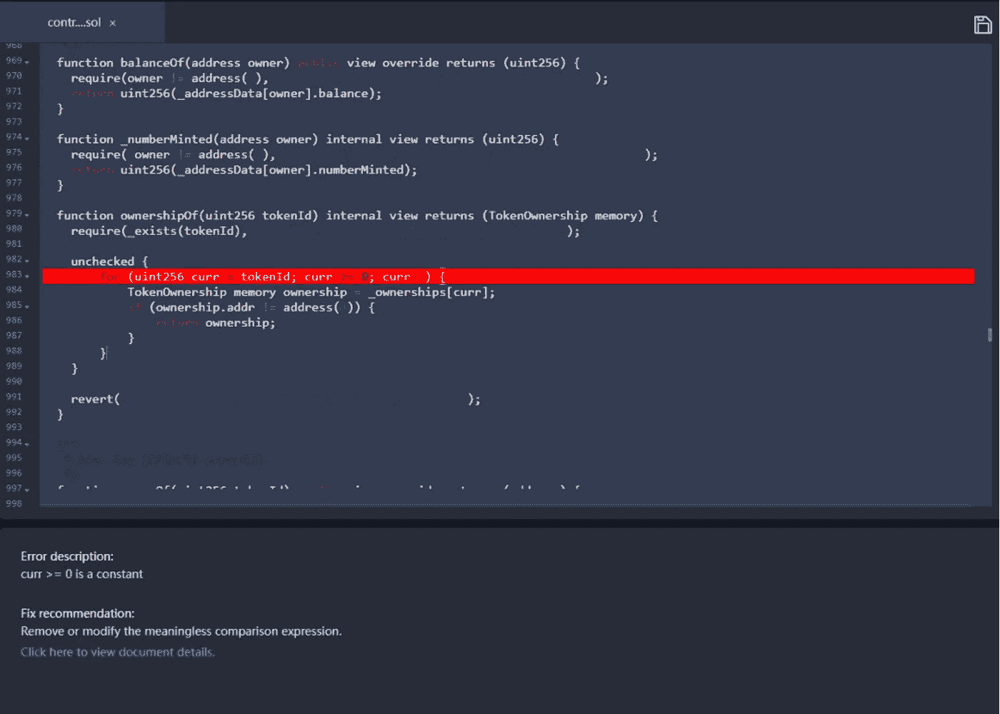

# 在 Web 3.0 热潮下，如何保证 NFT 的安全？Beosin VaaS 提供了一个解决方案

> 原文：<https://medium.com/coinmonks/how-to-ensure-the-security-of-nft-under-the-web-3-0-boom-beosin-vaas-has-provided-with-a-solution-50697ccd4f56?source=collection_archive---------17----------------------->

如今，NFT 的爆炸式增长正在推动 Web 3.0 的发展。过去的 Web 1.0 到 Web 2.0 实现了内容从消费者到生产者的转变，其本质是一次时空平行的从物理世界到网络世界的大迁徙。那么在 Web 3.0 的世界里，每个用户都掌控着自己的数据、身份和命运，新一代的互联网就此诞生。

Web 3.0 存在于区块链的基础上，承诺将隐私和数字身份归还给用户，同时借助 NFTs 等应用程序实现新水平的交互。但我们更需要关注的是 Web 3.0 热潮下 NFT 隐藏的安全问题，最近在 NFT 空间随处可见的“黑客事件”就是明证。

**ⅰ最近发生了哪些 NFT 契约漏洞？**

4 月 20 日，联盟 NFTs (NBA)因一个合同漏洞而被利用。在契约代码中，传入的函数中没有验证 vData 内存参数 info，导致签名可重用，用户可以使用别人的签名来伪造 NFT。

2022 年 4 月 23 日，由于智能合约本身存在漏洞，NTF 项目 Akutar 的 AkuAuction 合约已经永久锁定了 11,539 ETH(价值~ 3400 万美元)。经过 Beosin 安全团队的分析，我们在 Akutar 的合同中发现了两个漏洞。

第一个漏洞存在于 processRefunds 中，其中设计者基于 refundProgress 执行循环退款。但是，如果此时有攻击者在回退中进行还原，就会导致后续的人无法进行退款。此漏洞已在链上得到证明，但未被利用。

第二个漏洞在 claimProjectFunds 中，require 语句的 totalBids 变量(refundProgress > = totalBids)应该是 bidIndex，这个漏洞使得这个判断条件永远失效，导致无法进行后续的提现操作。最终，这导致 11，539 个 ETH(价值约 3，400 万美元)无法提取。

因此，关注 NFT 合同风险变得越来越迫切。

**ⅱ常见的 NFT 合同问题有哪些？**

根据 NFTSCAN 的数据，现在全球有近 70，000 个 NFT 合同地址，并且这个数字还在继续增长。

数据来源:NFTSCAN(更新时间:2022 年 4 月 24 日)

作为 Web3.0 的基础，NFT 的安全问题对区块链产业的发展同样重要。为了给 Web3.0 的安全生态保驾护航，Beosin VaaS 对数千个 NFT 项目进行了漏洞扫描，发现 NFT 常见的合同问题可以分为以下几类。

**商业逻辑相关问题**

这样的问题会直接导致合同的业务逻辑出现错误。

**漏洞描述:**chapterAuctionMinted 的值始终是初始值，但在这里该值用于条件检查。如果在开发阶段使用 Beosin VaaS 进行扫描，开发人员可以根据结果确定相关逻辑是否缺失(这可能会导致业务逻辑问题，如 NFT 过度铸造)或冗余代码。

漏洞描述:未检查的返回值。在 NFT 项目中经常可以看到付费铸币功能，调用者需要向 NFT 铸币合同发送 ERC20 代币作为铸币费，然后 NFT 铸币合同为其铸造相应数量的 NFT 代币。然而，一些 ERC20 契约具有假存款的问题，即，转移失败不抛出异常而是返回 false，这导致攻击者可以利用它来制造任意数量的 NFT 而无需支付费用的问题。开发人员应检查 transferFrom 操作的返回值，或者根据“Beosin VaaS”的建议使用 ERC20 令牌传输的 safeTransferFrom 函数。

**编码标准相关问题**

这样的问题可能不会直接导致业务逻辑中的错误，但是它们会影响代码的可读性，导致契约调用中的额外消耗等等。此外，非标准代码在编写时容易导致逻辑混乱，隐藏逻辑错误的可能性更高。

**漏洞描述:**这里循环的结束条件是 curr > =0，curr 是 uint 导致 curr > =0 不断满足。这将导致循环不能正常结束。“Beosin VaaS”将对结果的固定值发出警报，用户可以在此确认删除或修改条件的逻辑。

**漏洞描述:**此处字符串类型的数据在事件中被标记为 indexed，这将导致在事件结果中无法直接得到对应的字符串结果。建议用户参考“Beosin VaaS”中的建议，并仅使用索引来修改固定长度的变量。

我们的研究发现，大多数 NFT 合同都没有经过专业审计，这带来了很大的安全风险，很容易导致攻击和资产损失。NFT 智能合约开发人员在设计和实现合约时应该注意代码的正确性。我们强烈建议在开发完成后，开发人员可以使用‘beos in VaaS’对项目进行安全测试。项目上线前，合同业主可以选择专业的安全审计来规避安全风险。

安全是区块链技术的重要保障，守护 Web 3.0 的安全变得越来越重要。我们今天讨论的与业务逻辑相关的问题和与代码标准相关的问题也是智能合约中常见的问题类型，我们将继续发布与 NFT 相关的安全报告。敬请期待！

项目上线前，强烈建议选择专业的安全审计公司进行全面的安全审计，规避安全风险。

如果您需要任何区块链安全服务，请联系我们:

[**网站**](https://beosin.com/) [**邮箱**](http://contact@beosin.com/) [**官方推特**](https://twitter.com/Beosin_com) [**预警**](https://twitter.com/BeosinAlert) [**电报**](https://t.me/beosin)**[**LinkedIn**](https://www.linkedin.com/company/beosin)**

> **加入 Coinmonks [电报频道](https://t.me/coincodecap)和 [Youtube 频道](https://www.youtube.com/c/coinmonks/videos)了解加密交易和投资**

# **另外，阅读**

*   **[氹欞侊贸易评论](https://coincodecap.com/anny-trade-review) | [CoinSpot 评论](https://coincodecap.com/coinspot-review)**
*   **[新加坡十大最佳加密交易所](https://coincodecap.com/crypto-exchange-in-singapore) | [购买 AXS](https://coincodecap.com/buy-axs-token)**
*   **[投资印度的最佳加密软件](https://coincodecap.com/best-crypto-to-invest-in-india-in-2021) | [WazirX P2P](https://coincodecap.com/wazirx-p2p)**
*   **[7 个最佳零费用加密交易平台](https://coincodecap.com/zero-fee-crypto-exchanges)**
*   **[最佳网上赌场](https://coincodecap.com/best-online-casinos) | [期货交易机器人](/coinmonks/futures-trading-bots-5a282ccee3f5)**