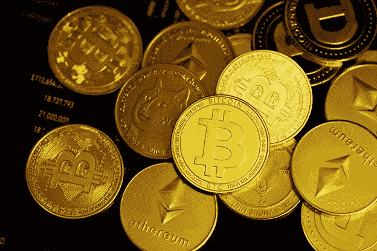
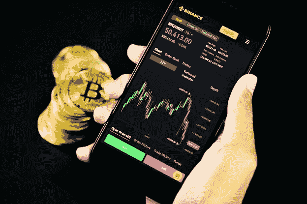
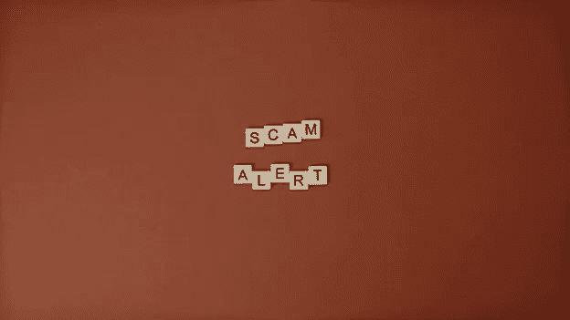

# 如何评价投资什么加密货币

> 原文：<https://medium.com/coinmonks/how-to-evaluate-what-cryptocurrency-to-invest-in-624be303a084?source=collection_archive---------18----------------------->

[*来源*](https://unsplash.com/photos/fsSGgTBoX9Y)

投资加密货币有几个好处，你可能听说过其中的许多好处，这就是为什么你决定尝试一下。然而，因为有这么多的机会买入，你可能不知道哪一个将是你的最佳选择。

最广为人知的加密货币可以说是比特币和以太坊，但随着你开始投资之旅，还有更多的好货币可以购买。然而，如何确定适合你投资的加密货币的问题仍然存在。

本文将通过提供评估最有益的加密货币项目的 7 步方法来回答这个问题。

请注意，这不是财务建议，而是帮助你做自己的研究的指南。

# 第一步:检查市场列表

[*来源*](https://unsplash.com/photos/y3FRkhP-UgY)

投资加密货币项目的第一步是检查它在加密市场中的地位。有各种各样的加密货币可以投资，但在选择投资之前，您必须仔细评估您的选项。有趣的标准是交易历史、加密项目排名和项目的主要目标。

你可以使用像**加密货币聚合器**这样的工具，这种系统可以让你将来自最大交易所的加密货币交易数据实时合并到一个单一的价格馈送中。聚合器为您提供了上面提到的关于您正在评估的加密项目的所有标准。两个最大的聚合器是 [CoinMarketCap](https://coinmarketcap.com/) 和 [CoinGecko](https://www.coingecko.com/) 。

查看交易历史(每日、每月、每年)将为您提供价格表现、趋势和加密项目潜在问题的概述。在这里，交易量是一个重要的因素，因为它显示了在一段时间内买卖的数量。低交易量可能表明项目没有强大的社区支持或没有实际使用案例，因此可能不是一个值得投资的好项目。这个项目的流动性衡量了当你决定买卖密码时，买卖的难易程度。

当你查看项目排名时，你是在比较该项目与其他加密货币相比的排名。根据你的投资偏好，你可能只想投资前 100 个项目，这些项目可能风险较小。然而，如果你不那么厌恶风险，并且正在寻找最具增长潜力的项目(那些 100 倍回报的故事)，你可能会想看看排名较低的项目，但要知道，在投资这些数字资产时，你也有更高的赔钱风险。

项目排名由市值(或市值)决定。在评估未来收益潜力时，这是一个比价格更好的指标。一般来说，市值越高(排名越高)，投资的波动性就越小。

市值通过以下公式计算:

***流通中的硬币/代币总数 X 在任何给定时间单个硬币/代币的价格=市值***

理解加密项目的流通供给和总供给之间的区别是非常重要的。流通供应量是已经铸造的硬币/代币的数量，而总供应量是可能存在的固定数量的硬币/代币。有的项目总供应量会有几十亿，有的项目只有几百万。如果一个项目的总供应量非常大，这意味着它不那么稀缺，大量硬币/代币流入流通供应可能会迅速降低价格。

您还需要检查项目是否交易活跃，硬币/代币在哪里交易，最好是在声誉良好的交易所交易，如比特币基地、币安、北海巨妖等。如果它只在分散式交易所(a DEX)交易，那么请注意，a DEX 没有任何上市标准。

# 第二步:审查项目网站

一旦你检查了你感兴趣的项目的市场列表，下一步是检查该项目的网站。扎实的加密货币项目，有发展完善、信息量大的网站。

如果你注意到网站的拼写错误和其他小错误，那么这应该是对你的一个警告。浏览网站时，密切关注项目背后的团队、当前和过去的投资者以及项目的路线图是至关重要的。

**团队**由创始人、顾问、首席执行官以及团队中的任何人组成。你应该谷歌一下他们，或者查看他们的 LinkedIn 个人资料，以防止诈骗。评估团队时，查看之前的经验，例如，他们是否有在该市场开发成功项目的历史？

此外，查看他们的访谈，以便更好地理解项目和使命/愿景。你的许多问题很有可能会在创始人或高层团队成员的采访中得到解答。

投资者是指那些已经为项目投入资金的人。你应该了解该项目是否有投资者，因为与知名投资公司相关的项目已经显示出巨大的潜力，这些投资者在投资前很可能已经做了仔细的尽职调查。

加密货币项目中的**路线图**是一种规划技术，可以洞察短期和长期目标。你想投资的项目的路线图和愿景必须在项目网站上明确定义和陈述。通常这个项目的**博客**也会为你提供关于这个项目如何运作以及已经建立的任何有趣的合作关系的进一步见解。

你可能希望在网站上搜索的关键词是:“令牌经济学”、“通货膨胀”、“ICO”、“共识机制”、“采矿”和“赌注”，以了解该项目的所有细节。如果你想知道这些术语的意思，我建议你研究一下，熟悉一下这些概念。

# 第三步:访问社交媒体资料

[*来源*](https://unsplash.com/photos/Tk9m_HP4rgQ)

评估加密项目的下一步是评估其社交媒体档案。Twitter、Telegram、Discord 和 Reddit 是主要的社交媒体网站，你可以查看这些网站进行评估。

上 Twitter 是一个很好的方式来感受这个项目在社会上有多活跃，有多受欢迎。项目页面上的推文、转发、评论和互动，以及项目的追随者数量，是衡量可信度和参与度的重要标准。

Reddit 有严格的规则，如投票系统，其功能吸引了对加密项目营销和底层区块链技术感兴趣的确切人口统计数据。在这里，你可以经常收集到网站不会提供给你的关于某个项目的知识。如果硬币/代币有潜力，Reddit 上几乎总会有关于它的讨论。

Telegram 和/或 Discord 应该有一个聊天组，让你获得关于项目、团队及其社区的新闻和讨论。通过浏览各种聊天和帖子，你会对参与项目的人的类型有更多的了解。如果他们不是你想与之交往的那种类型的人，那就试试不同的项目。也问一个问题，看看是否以及如何得到回答。

# 第四步:查看项目的社区

加密社区是由相信一个项目并愿意投资有前途的项目的人组成的。一个项目和它的社区一样强大。现在市场上最流行的加密货币，像比特币，以太坊，索拉纳，之所以成功，是因为有他们社区的后盾。

因此，建议选择拥有强大、活跃和参与度高的社区的加密货币。社区是区块链项目的核心和灵魂，为项目的成功提供了坚实的基础。社区成员帮助筹集资金，制作视频，并向其他人展示如何使用该技术的功能。

# 第五步:仔细阅读并理解白皮书

白皮书是指加密项目发布的文档，用于解释该项目的技术和目的。它包含了关于项目的各种数据，比如统计数据、图表、公式、概念以及计划如何发展的路线图。白皮书非常重要，因为它是加密初创公司被视为合法的必要步骤。

统计数字、事实、图表等。白皮书提供了一种说服感兴趣的投资者投资该项目的方法。此外，它有助于投资者了解企业与其竞争对手的不同之处。

就像项目网站一样，白皮书必须写得很好，没有拼写和语法错误。此外，没有项目白皮书也应该是你选择退出这样一个项目的信号。

# 第六步:理解效用和用例

在你投资任何项目之前，找出它能解决什么问题是至关重要的。如果它没有定义良好和清晰的用例，那么它可能不是你的最佳选择。这是因为解决一个主要问题的项目将有更多的需求激增，并提高加密的可交易价值。

要了解加密项目是如何工作的，看看梅萨里、币安研究公司和 ICO drops 等 ICO 追踪网站。一定要写下你可能有的任何问题，看看它们是否能在这些网站上得到回答。

在 Messari 上，查看 profile 部分，了解项目的历史和 tokenomics 的详细信息。币安研究公司采取了一种更技术性的方法来评估加密货币。ICO 跟踪网站在网上提供图片和文档，这有助于发现加密项目是否彻底改变了路线，以及迄今为止筹集了多少资金。

这些网站上的信息可能有点过时，因此比较来源是很重要的。你要寻找的是迄今为止资金是如何筹集的，以及代币是如何分配的，因为你要确保这笔钱的大部分掌握在社区手中，而不是项目的创始人手中，以防止你成为“抽水和倾倒”场景的受害者。

# 第七步:检查并防范诈骗

[*来源*](https://www.pexels.com/photo/close-up-shot-of-text-on-a-brown-surface-5912673/)

尽管加密货币对各种个人、企业和整个经济都非常有益，但在加密社区中仍有许多欺诈案例。在投资加密货币和区块链项目时，保护自己免受这些诈骗至关重要。

一些最常见的加密骗局是庞氏骗局，泵和转储，假交易所，假应用程序，以及许多其他的。避免这些骗局的一些方法是对每个项目做彻底的研究，保护你的加密钱包，使用多因素认证等。

你也可以使用诸如 Scamsniper 或 RugDoc(他们审核信息并评估项目的智能合同)等工具来帮助你识别潜在的骗局。

# 结论

总之，目前市场上有许多加密货币，决定投资哪一种可能具有挑战性。我希望这篇文章通过给你几个步骤来评估和确定最适合你的密码，帮助你轻松地选择。

请做自己的研究，并在投资前参与加密项目。这也将有助于你在价格变动或熊市或牛市发生时做出更明智的决定。

> 加入 Coinmonks [电报频道](https://t.me/coincodecap)和 [Youtube 频道](https://www.youtube.com/c/coinmonks/videos)了解加密交易和投资

# 另外，阅读

*   [SmithBot 评论](https://coincodecap.com/smithbot-review) | [4 款最佳免费开源交易机器人](https://coincodecap.com/free-open-source-trading-bots)
*   [比特币基地僵尸程序](/coinmonks/coinbase-bots-ac6359e897f3) | [AscendEX 审查](/coinmonks/ascendex-review-53e829cf75fa) | [OKEx 交易僵尸程序](/coinmonks/okex-trading-bots-234920f61e60)
*   [如何在印度购买比特币？](/coinmonks/buy-bitcoin-in-india-feb50ddfef94) | [瓦济克斯审查](/coinmonks/wazirx-review-5c811b074f5b)
*   [隐翅虫替代品](/coinmonks/cryptohopper-alternatives-d67287b16d27) | [HitBTC 审查](/coinmonks/hitbtc-review-c5143c5d53c2)
*   [CBET 评论](https://coincodecap.com/cbet-casino-review) | [库科恩 vs 比特币基地](https://coincodecap.com/kucoin-vs-coinbase)