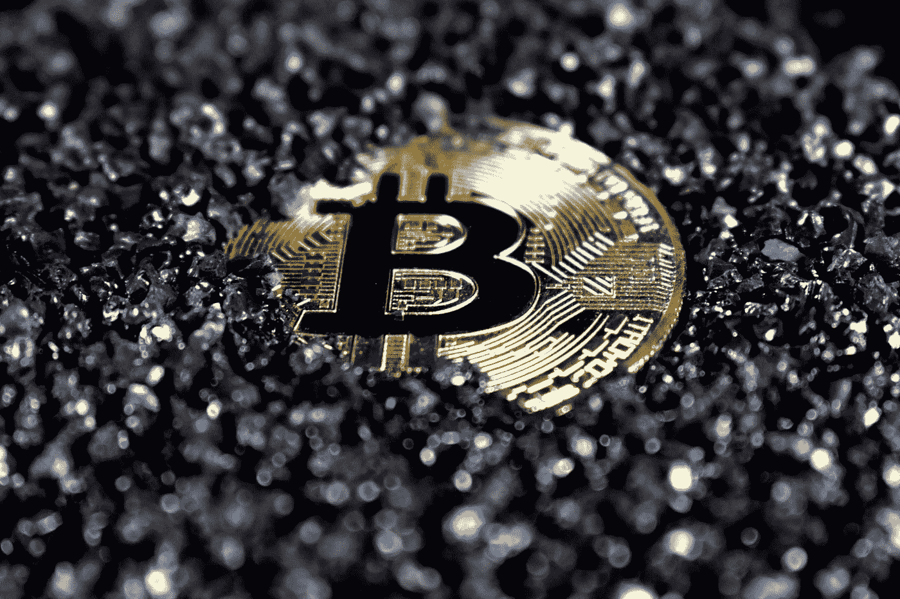

# 比特币和以太坊如何兑换时间

> 原文：<https://medium.com/coinmonks/how-to-exchange-time-for-bitcoin-and-ethereum-77b40ab9375e?source=collection_archive---------40----------------------->

## 货币和加密货币

## 开始投资没有钱的加密…

Photo by [Kanchanara](https://unsplash.com/@kanchanara?utm_source=medium&utm_medium=referral) on [Unsplash](https://unsplash.com?utm_source=medium&utm_medium=referral)

生活在当今世界，很难不承认比特币和数字货币在重塑新世界中的作用。学习如何用时间换取免费的比特币，并在没有钱的情况下开始投资 crypto 可以有所帮助。